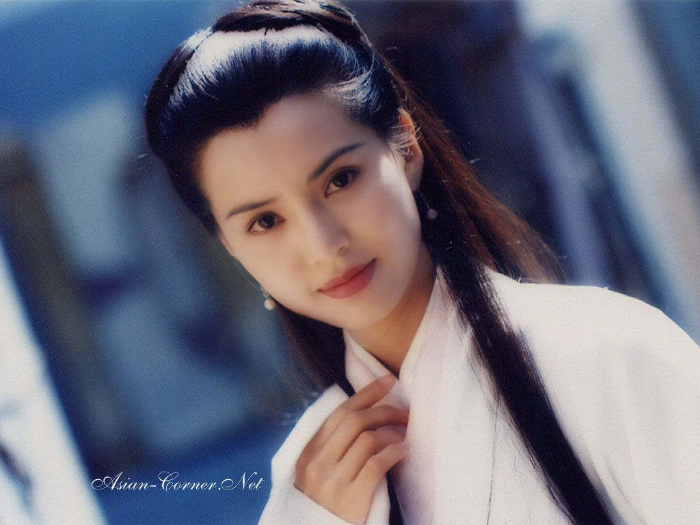
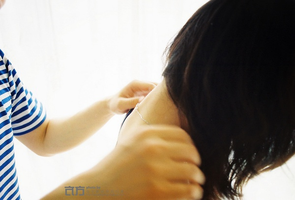

# ＜天璇＞天黑请闭眼

**正太的我认为爱情是秽物，以至于有人唱《伤心太平洋》我会显出羞涩，以至于歌词本上被人贴上尔康紫薇接吻的贴画后我咬牙切齿的把它们一页页撕掉，以至于我把萝莉给我的情书交给班主任领小红花。后来老爸听到这些事迹后忍不住摆手打断我：“你快别说了，怪我对你教育过度啦！”**

### 

# 天黑请闭眼

### 

## 文/张亦（东北师范大学）

### 

因为你是我朋友，所以你的遭遇我要说说。因为你是姑娘，所以我更要说说。既然爱情大师们收费贵门槛高，那么我只有硬着头皮顶着导师的名号吐槽了。 我说的是爱情。 

### 

 在小说里，我有见过杨过等了小龙女十六年，十六年里杨过的那只手愈发地黯然销魂，终是修成西狂，独步武林。这是爱情励志的上佳例子，少时当家父跟我讲述早恋的危害如何耽误学习的时候，我都愿意搬出杨过反驳，而他是个金庸迷，不愿执拗了自己的偶像和品味，就会说：“这是个特例”。而我，就只好接着搬出杨康跟穆念慈进一步佐证。 可是在少时的现实里，现实，我却又是不相信这般坚贞的爱情存在的。不因别的，只因我还真没见过。我总觉得爱情是理想主义的，丘比特的神性光芒万丈高，不能向操蛋的魔鬼投降。但事实却是，我没见过正儿八经的私奔，没见过灰姑娘嫁王子。关于爱情，大家普遍的态度就是：玩玩嘛，理想主义哪能用到与我不相干的人身上了？梁祝化蝶是笑话，庄周化蝶才深刻——乍一看，有道理。细一想，还真是。既然人天然是孤独的利己的，不存在完全的牺牲和奉献，那么无论做什么其本质都是自私。这世间的亲情、友情、战友情等一切看似真挚无私的感情或道德，莫不是用利益衡量后得出的最优选择，比如，你帮人其实是因为不帮他你就会难受，你殉国是因为国家对你有更大的价值意义。是阴暗了些，但我就是这么想的，爱情也莫能除外。 更小的小学时代，我躲着爱情。彼时的价值观概括起来就是，小孩子搞这些乌七八糟的东西真可耻。显然，这种观念才是真可耻，可惜我当时完全陷入矫情虚伪的生活状态而对此毫无反思。正太的我认为爱情是秽物，以至于有人唱《伤心太平洋》我会显出羞涩，以至于歌词本上被人贴上尔康紫薇接吻的贴画后我咬牙切齿的把它们一页页撕掉，以至于我把萝莉给我的情书交给班主任领小红花。后来老爸听到这些事迹后忍不住摆手打断我：“你快别说了，怪我对你教育过度啦！” 在年幼的矫情和年长的看破之间，夹着我的青春期。不得不说，那算是我杯具人生里的辉煌期。我活得很滋润，漂亮的成绩单，雨后春笋般的身高，我不仅鸟枪换炮看上了余秋雨的《文化苦旅》，甚至还学会了三步上篮。哪个少女不愿意跟这样清新又凛冽的少年倾吐秘密畅想人生了？然而，我依然没有遭遇爱情，也没有看到过爱情。从这个意义上说，这又是个极度失败的青春期。 所以，不用等姚晨离婚王力宏肛裂，我早就不相信爱情了。 

---------------------------------分割线-----------------------------------
### 

但是你不一样。你的经历不一样，给我的启发也不一样，我甚至差点因你相信了爱情。你在最该谈恋爱最青葱的时候，碰上这么一个男人，他衣服邋遢但眼神清澈，泯然众人但文采斐然，现实困顿但雅量冲怀。你们谈人生聊理想，喝酒吃肉做饭洗衣，看看书做做爱。你很快乐。 

### 

### 

但是，他给你的不仅仅只是快乐。多年前的这个人用男默女泪和文艺清新塑造了你的价值观，你来到现在，成为这样的人，不偏不倚非梦非花，从精神上讲这些都是你和他共同的创造。难道你以为你的孤傲是天然的么？难道你以为你的爱恨都是随机的么？难道你以为那些男人一直都是恶劣得不入你眼的么？嘿，别逗了。这些都是因为他和你共同树立了诸多的标杆，这些标杆，从某种意义上说就是他，是你，是你们，是你在那些年岁与他精神互动的果实。它们不仅指导着你的爱恨，也指导着你的生活，这种精神上的相濡以沫，在生活里的相濡以沫中塑造了你的灵魂。 我本来不信爱情，觉得爱情的理想主义不存在。但是你说你离了他会死，看到你们这么深切的融入彼此，我就开始信了。我就此信了爱情，你却以事情接下来的发展使我再次成为了小学时候的那个傻逼。 现在你们异地，仿佛心灵的交流中断只是靠着情感惯性维持，你不再想念他，以为自己爱上别人，而他却在等你。我自不会从道德上说这是什么背叛，感情的事通常没什么道理可讲，尤其对我这个爱情虚无主义者来说，自古就是分久必合合久必分的。但是，你的情况却又不一样。 倘若你是真的爱上另外一个人，没什么，就当是价值观突变口味突变。但是，你明明又没爱上新人，你只是发现心里没住着原来那个人以后空落落心慌慌，于是在遇到一个还不错的新人，相处几日后就觉得爱上了新人。你自己说，这不就是寂寞么？ 

### 

### 

如果你是不堪现实的压力，要结婚要生孩子养父母，那也就算了，投降的人嘛我没必要再打你一棒。可是你也不是迫于现实，你甚至藉此标榜理想。再进一步说，你心里也未必真没他了。仔细想想他若此刻站在你面前，穿着他的大裤衩，蓄着那衰发型，告诉你一声亲爱的，你会无动于衷么？ 有些特定的人在特定的时光给我们特定的经验，那么这就是一辈子的事，生命最操蛋也最动人的地方就是它不能重复，你摆脱不了他的印记。有可能不再轰轰烈烈，有可能不在一起，但是你再去找新的爱人的时候，你会发现其实你是在找那个人的影子。既然在你的标准中他就是最合适的那一位，既然你们仍有认同，既然你们的未来有计划，既然你追求理想爱情的心不变初衷，那你何苦又要比着他的模子去找下一个他了？ 什么？！你居然回答我说你忘记了跟他的那些衷肠！那么，此刻天已黑，请你闭上眼，想象下这些概念：你是他妻子。你是他妈妈的儿媳妇儿。你是他孩子的妈妈。你是他家庭的主妇。 现在我问你：“想起什么了没？” 

### 

### 

（责编：黄理罡）

### 

### 
