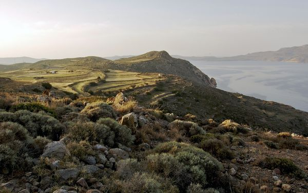

# ＜天璇＞太短的生命也不要仅仅用来喧哗和匆忙，停下来看一看风景

**这个时候总是想起那句：“天下熙熙，皆为利来；天下攘攘，皆为利往。”也许是社会不同了、时代不同了，不能将其归咎于逐利争名，只是大环境下无可奈何的推动。可是，没有人停下来，看一看自己疲于奔命的生活；没有人还知道自己当初出发时的目标何在。当追逐成了生活唯一的状态，拥挤和争抢成为每日常态。人们讨论的、在乎的、纠结都不外乎都是和利与欲相关的事情，包括用这两个指标衡量亲情与爱情。我们是不是在一个斜坡上坠落，而却不自知？**  

# 太短的生命也不要仅仅用来喧哗和匆忙，

# 停下来看一看风景

## 文/张畅（浙江大学）

 

好友阳仔从台湾回来，让我去接她。走了这么多地方，放假上学，我们都一样独来独往，很少有人去车站接，也从不奢望。可惜我一口气睡过头，只能在饭店和她见面。

她讲起在台湾旅行的经历，讲起每一天的生活。曾经为了未来担忧，站在岔路口不知道何去何从，纠结了两年之后，她决定去台湾，没什么理由、更不为了什么好处；当初我去英国，也一样的随心所欲。

我只是觉得生活太紧凑、缺少缺口释放，需要一个新的环境让自己安静下来。不需要坐在电脑前看电影、刷人人，也不需要面对堆积如山的论文不知道如何下手，更不需要在拥挤的食堂里挤来挤去，每天对着同样的一群人、说类似的话、寒暄或是聊天都不外乎几个话题。这种熟悉的环境让人安全、安逸和怠惰，我喜欢新鲜、冲击和挑战。

阳仔说，她从前以为思考和学习一定要坐在图书馆里，一定要在一个安静的场合一个人苦思冥想。可是当她游走在台湾山清水秀的途中，甚至有时只是在火车的一节车厢中，看窗外完全陌生的风景一掠而过。她的头脑中会迸发出千千万万个想法，这些想法是全新的、难以预料的、有的只是电光火石一样一闪而过，不再重现。

她说，人们总是觉得自己孤独，是因为人们将孤独定义为“一个人”。就如同卡尔维诺的《看不见的城市》，我们习惯于将土地看做一个城市的标识，即便是河流和公路平行，我们也倾向于记录公路而非河流。那么相似地，当我们坐在火车上、地铁中或是饭店的一个角落，从狭义上讲，我们是一个人，可是桌上的茶杯、刀叉、窗外的风景、甚至是空气都是自然的一部分，都是陪伴你、可与你对话、促进你思考的东西。从广义的角度，你不是一个人，只是你习惯了人与人之间的聒噪而已。

我时常感觉到孤独的存在。人类的文明危机不是所谓的信仰的危机或是精神世界的匮乏，而是随着科技的通融性和延展性的提升，人们的心开始同孤独这块顽石摩擦。我们如果问起我们的父辈或是祖父辈，他们的记忆中孤独的时间是不多的，生活是快乐而充实的。奇怪的是，若干年后，当我们催产了无数的发明创造，推动了GDP的飞速发展，却走入了无可言说、无法自拔的孤独当中。

孤独，成了一个城市、一个时代人的通病。

我们逃不了，就只能在其中任由自己痛苦以及往往是无效的自我安慰。

是不是大家都太忙于生计了？忙于赚钱、操心未来的事务、纠结种种尚未发生也许永不会发生的事情？

我喜欢在“晚高峰”的时候坐在咖啡店或是饭店二楼的一角，面对着整扇玻璃窗，看窗外拥挤的车流和人群。公交车上面罐头鱼一样塞满了人，摩托车自行车上的人大多眉头紧锁，孩子们背着沉重的书包赶回家、有的甚至在拥挤的途中铺开作业本做作业………拥挤、争抢、危机感……让路上的人变得恼怒不安甚至是恶语相加。

这个时候总是想起那句：“天下熙熙，皆为利来；天下攘攘，皆为利往。”也许是社会不同了、时代不同了，不能将其归咎于逐利争名，只是大环境下无可奈何的推动。可是，没有人停下来，看一看自己疲于奔命的生活；没有人还知道自己当初出发时的目标何在。

当追逐成了生活唯一的状态，拥挤和争抢成为每日常态。人们讨论的、在乎的、纠结都不外乎都是和利与欲相关的事情，包括用这两个指标衡量亲情与爱情。我们是不是在一个斜坡上坠落，而却不自知？

大学放假前，大家都彼此问候，去哪里实习、以后去哪里工作、毕业之后要不要继续读书。过年回了家，亲戚们就争相问，有没有男朋友、男朋友在哪个城市、做什么工作、什么时候结婚、什么时候有孩子。有了孩子的亲朋好友，就在互相咨询给孩子报什么课外班、怎么提高成绩、怎么进入重点中学、怎么考入名牌大学。

…………

没有人关心孩子们是不是快乐，他们过得好不好。也没有人在乎自己的健康状况，熬夜成了常态。大家都在奔跑，却少有人记得自己为什么而奔波。

通常我们会说，为了自己的幸福、为了下一代的幸福。可是幸福毕竟是一个虚无缥缈的指标，我们跑着跑着就忘记了初心，结果不但没有追到幸福，还失去了本该幸福的无数个瞬间。

都说生命太短，结果就疲于奔命加速了死亡。猝死的案例应接不暇，人们骂单位、骂制度、骂社会，结果积怨越深、情绪愈烈。

我愿意到一个完全陌生的城市、看一段曾经没有看见过的风景，到路边的小店里小憩、和白头发的店主谈天说地；或是来到一个公园，和另一个旅行者聊天，在短短的一个下午或是一个晚上了解到他几十年生命中最精彩最波折的部分；你和他聊你自己的世界。

你们的生活没有交集，不一样的工作、国家，不一样的成长环境、不一样的经历。可是你们就在一个美丽的地方，彼此聊过曾经的生活、那些平时你永远都没有时间回味的幸福感、转瞬即逝的片段、那些你因为身居高位不敢说的话、那些你因为底气不足永远发表不了的建议、畅谈过的梦想……

当你静下来，看一朵云，或是一棵树，像小时候那样，你会回忆起很多微小的瞬间，那些在你的记忆中似乎从来没有被唤醒的东西都会浮现。似乎你也会变成一朵云、或是一棵树，天地人自然都是相通，没人拿世俗意义上的成败品评一个人的生活，没人设置无形的障碍阻拦你追求的成功，没人谄媚或是鄙视你的一切性情。

你只是你，不为了什么而存在。

我想起我的好友说，当她躺在普吉岛的沙滩上，晒太阳的时候，她曾经担忧的那些事情、她纠结过的感情都如同被烈日蒸发了一样，瞬间烟云。而浮现在她脑海中的，是一片辽阔的海、一个可以游泳嬉戏的地方。

我想起那个在牛津偶遇的老人用沙哑的声音说，他最喜欢坐在寺庙的角落里冥想，他可以忘记自己正在从事怎样繁重的工作、有着怎样困窘的生活，他只和他自己交流。那种感觉如饮醇醪。

我想起我的父亲在事业低谷的时候坐在小河边钓鱼，他说他盯着鱼漂的时候，只有那个鱼漂的时候，他什么都不想，就终于将所有的烦忧都清空了。

我想起另一个挚交说，她坐在罗马的古建筑群的广场上，买一瓶酒，一边品酒一边看来往的路人。他们的脚步中都有不同的讯息，她从未如此热切地渴望解读不同人的生活。

生命太短了，我们用太多的时间追逐身外之物，用来喧哗和匆忙，从未停下来，看一看周遭的风景、享受真正属于自己的心情。

不是么？

 

（采编：何凌昊；责编：何凌昊）

 
