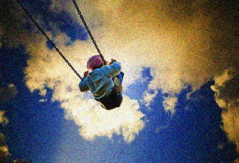

# ＜天璇＞失语记

**可见我在此事上着实下了苦功，成功地完成了变异，成为了话痨。那是我人生中短暂而光辉的年华，那时我还是个话痨，而更小和更大的时候都不是。我还当上了好人，我并不是说我现在就不是好人，虽然我现在很少说话，因为我宁愿多写，从我体贴宽容、不愿意麻烦别人来看，我已经变得有道德了。可这些光明的品质在我小时候一点也看不见。**

# 失语记

## 文/宋训青（上海电机学院）

 

语言学课上，周要我回去做一篇tag，就是写25句话的那种，我说：“不是已经写了一篇么？”原来在以前漫长的没有人点我名的日子里，我嫉恨地写了一篇描述自己的文章。“重要的话都写了，还要写什么”，“对哦”，她爽快地赞同了我的观点。我甚至没来得及说出我的真实原因，我指——我是一话痨，25句话根本连塞牙缝都不够，《西游记后传》里的孙悟空说的好：我还没用力，你倒先倒下了。意思是要人家爬起来继续被他打，好帮助妖怪练个好体格，这是很深的道理，我也常常反观自身，努力践行。有关于这点，必须要补充一件事，不是我玩文字游戏，把这件事说出来肯定也会让你恨得牙痒痒，因为我自己就常常在半夜撒尿时回忆起来，以至于激动得尿到冲水的把手上。

那年夏天时节，天气炎热，我被软禁在空调小书房里成天地看书。有一天，我正呆在屋子里干正经事。忽然听到楼下一个清脆的女声：“毛哎”，我热情的回应：“哎”，我想到我妈妈一定是让我下去看电视剧了，虽然这事从来没有发生过。她继续喊道：“你们老师打电话来了，把书丢一会，下来吧”。我只好放下了牙签和挖耳勺，留下一个硕大的还没有完全解剖的马蜂尸体在数学练习本上，跑下去接了电话。这里需要交代一下的是，我初一因为太顽劣，成绩从班上20多名滑到40多名，还学会了捣桌球，这使我父母很伤心。有一年夏天，那时候天气还没有现在这么热，县城里来了个卖药的，就住在我家对面，这个卖药的很有本事，他让我父母把我送到了一个离我的小书房大约200多公里的一个私立的封闭式学校里读书，多年以后，我才知道那个卖药的原来是总部派来招生的，自从我的例子成功以后，每年都会有人来招生。这个叫陈堏的家伙，也就是要和我通话的这个人也是，他是我初中的计算机课的老师，常年给我不及格，上课也不让玩红警，非常不像话。也不知道他怎么弄到了我家的号码，之前来过一次，我父母请他吃了饭，这次又打电话，把我家当成了招待所，还要我过去交流一下。

我把他的意图报告给我的父母，我妈说：当然要去，我自然不敢忤逆，因此准确地说，我要是怨恨，这事还要算到我母亲头上，和很多事的结论一样。不过这是后话了。当时我扒了几口饭，便夹着一本物理书跑出去，外面的太阳跟烤炉一样，使得我很快地摸到了他的住处。进了屋子我就后悔了，那个鸟人也不知道存了几辈子的话，一下午喋喋不休，还喜欢喷口水，像台旧式的洒水机，我只好和他拉开距离，到了距离近两米的时候，他就问：“怎么跑那么远了。”我说：“天气干燥，有火灾跑得快。”这当然是扯淡，他的口水一定能保证房屋安全，好在他也没料到他竟有如此效用，便没多问。于是他继续放屁，说的事情都很无趣，听得我脑袋直发昏，仿佛从耳洞往里塞了一大团酒精棉，便说，“陈老师，我们看电视吧”。可每次刚开口就被打断了，侃了老半天，这家伙倒是觉察到了异样，放道：“你怎么不说话。”我本想说：×你妈。又怕他跳起来打我，只好赞道：“你讲的好有趣。”整整半天，我的物理书一页都没打开过，它已经被我卷得像干海带一样了。

晚上要吃晚饭了，他便要我回去，看到这里，有人要问，听了这么些废话干嘛不饶他一顿饭，这是没长脑子的冬烘。彼时我得了自由，喜不自胜，哪里还敢冒这个险——要是他吃完了饭，来了精神，要再拉我说一晚上——岂不悔之无及？我回到家里，先去厨房，当着我妈的面把他骂了一通，我妈说：“净扯淡，还有人能像喷水机？”跟我妈聊天，要随时做好发羊癫疯的准备，因为她永远抓不住重点。我只好坐在客厅生闷气，坐一会便跑回了书房，饭是吃不下了，闻到就干呕，那声音团在脑子里不消散，像要把人搞怀孕，然而自古也没有声音导致生殖的先例，而且我又是个男的，所以我对这个问题毫不担心。我担心的是，要是明天他再叫我去怎么办，我不能说不去，这样我妈要教训我，我要是去了，肯定会忍不住撒癔症，一边流口水，一边翻白眼，然后换成斗鸡眼，总之不能聚焦。根据我的经验，面对一个眼神游离散乱的人，你显然是无法与他继续交流的，除非你也把眼睛蒙上，或者让他吃点苦头。比方说我舅舅，每次他老婆问他，你和单位里的那个笑笑怎么回事，他就要转眼珠子，直到脸颊上出现个手掌印。

我上学的时候，总是挨打，挨打的原因很多，成绩下降啦，不上课去抓龙虾啦，偷看电视啦，因此我练了一身抗打抗饿的好本领。后者指的是，我常赌气不吃晚饭，挨到后半夜再跑出来翻东西吃，每样剩菜偷一点，再偷点饭，就发觉不出来了，而我日益增加的体重说明，晚上吃的再少，也能顶白天两碗饭的能量，也就是说，闹饥荒的时节，要是改成白天睡觉晚上活动能少死一半人。这天夜里，我一边找东西吃，一边下了个影响颇大的决心，当一个话痨。这里有依据，以后要是有个话痨找我聊天，我又烦他，就拿出比他更能说的姿态来吓他，他见我也是话痨，定要干瞪眼，结果没讨到便宜就得走开。进化论里说环境变化影响生物变异，话痨就是我的变异。

我第一次见马贼的时候，他正在教室里修椅子，我走过去绕着他说了一个小时，和他讨论睾丸癌的问题，最后他拿锤子扑过来敲我，我怎么会怕他，就把他打了一顿。后来据他说，他宁愿我把他打一顿也不要听我讲睾丸癌的事。可见我在此事上着实下了苦功，成功地完成了变异，成为了话痨。那是我人生中短暂而光辉的年华，那时我还是个话痨，而更小和更大的时候都不是。我还当上了好人，我并不是说我现在就不是好人，虽然我现在很少说话，因为我宁愿多写，从我体贴宽容、不愿意麻烦别人来看，我已经变得有道德了。可这些光明的品质在我小时候一点也看不见。有关于这一点，我舅舅的解释是：话少的要比话多的时候坏。依据是：我小时候不爱说话，而我的德行用我舅舅的话来说，“从小坏秧花，长大没好瓜。”

对于我舅舅说过的话，我是深信不疑的，不仅对于他说我是“坏秧花”这点表示承认，对于他说我“成不了好瓜”也是极为相信的，唯独不承认这和我话多话少有什么关系。这点和我舅妈的观点很不一样，她认为杨学武的嘴里吐不出象牙，是个满嘴谎言的恶棍。不过我从没有和她为这个分歧争辩过，我舅舅也没有，他要是争辩就要打起来，不过我从没见他对女人动过手，这是我尊敬他的地方，如果要打，我觉得我舅舅不一定打得过舅妈——她是体校毕业的，身材壮硕，特长是扔铅球，这样的膂力往身上招呼几拳，没人吃的消。

我之所以如此信任我舅舅，还有个重要的原因，他是个言出必行的人，而根据我的经验，言出必行的人不会撒谎。举例言之，杨学武还在读初一时，因为打架而全校闻名，受到了校长的重视：你这种一向品行恶劣的学生，以后到社会上就是人渣。杨学武当年血气方刚，他抬头望望万里晴空，又望望校长，呐喊一声：你今天往我头上泼粪，总有一天我也在会你头上尿尿（sui）。“后来呢？”“后来，老子当然不负众望，揪住了那老家伙，我到现在还记得很清楚……”舅舅说这话时，半躺在藤椅上，满面红光，嘴角上扬，露出得意的神色，你若是不相信，看到这幅表情，也会怀疑自己，继而感到羞愧。那天突然下了一场大雨，杨学武呆在教学楼等家里人送伞，透过窗户往外看的时候，远远望见有个佝偻的影子一蹦一跳朝厕所后面奔去，那是校长，这老小子想借厕所后檐走过去，意识到这一点时杨学武已经身在雨中了，他飞奔进了男厕所，又用飞檐走壁的本事爬上了墙，扒在长条形通风口上看到了校长的位置，选好方位，扯下裤子，把阴茎掏出来，据他自己说，杨学武那时的玩意儿就已经颇成气候了，而从狭长的甬道迸出的那股水流，激烈强劲，像彩虹一样，迎着通风口轻松地跨了出去，正砸在校长头上。后来我舅舅继续打架，但再没有受到公开处分，校长很怕这件事被说开，最好提也不要提，倘若要是让他听到有人议论“你看，那个撒尿在校长头上的家伙又挨处分了”，定要两眼一翻瘫过去，也就是说，杨学武之所以能安稳地读完了中学，完全是那一泡尿的功劳。不管怎么样，我舅舅在初一时就注重言行合一、信诺重义。从另一个方面来说，敢尿并且能尿到校长头上的人是真好汉，这样的好汉自然不会满嘴谎言。

另外一点值得补充的是，我舅舅从小就知道在和老头吃喜宴的时候，趁他们不注意，撸鼻涕到汤碗里。所以被他叫坏秧子可不是件轻松的事，我之所以承认，是因为我在小时候做过比这还聪明的事。你知道，我生在农村，每天下午要放牛，有一回我们把牛各自拴好就聚到一块，我拿小刀在人家的香瓜上划了个正方形，掏出一个三角锥，让他们往里面拉屎，然后盖上。后来那家的女人提着洗衣的棒槌围着整个村子骂了一圈，原来我们掏过的那个三角锥又长好了，大便倒是在里面保了鲜，等到她家放到案板上提刀一切，就看到了秘密，气得直发晕。她气晕了不要紧，关键是这样就证明了我是从小就是个恶棍。“你看那不说话的，有不少就是憋着给你使坏，你发现不了，那爱说话的，不管他怎么严谨，总会说秃噜嘴，让人觉察到，这样一来使坏的兴致就没了。”“小孩？小孩最坏了，没什么词汇量，说话少，你见哪个孩子跟你长篇大论聊的，一会就得睡着，睡不着的时候就给你捣鬼，什么招都给你使出来。”关于后者，我是这样想的，我舅舅一定把所有小孩的小时候当成我和他的小时候了，我见过从小就尊敬师长孝顺父母诚实友爱的孩子，他们话也少，但是不像我们一样使坏。我们勃起的时候，他们可能是软塌塌的，我们软塌塌的时候，他们还是软塌塌的。

而对于前者所谈的问题，拿我自己打比方，我原本个性外向，因此成为了话痨，免去了被人逼疯的危险，也慢慢成为了一个好人，然而这些年又愈见淡漠，行为上也有往笨拙方向发展的趋势，不仅是对于恶作剧的事情没有了先前的兴趣，更大的问题乃是不能。话语变得集中，除了多话的时候，其余时间都是沉默。这一点，有点像当初的陈堏。然而我并打算这样索然无味下去，和遗精时一样，这种感觉叫复苏。另有个比方，我邻居家养了一条狗，它总是在半夜里狂吠，叫声凄厉，后来突然有一天，它不叫了，再也听不到它的声音，那天我回去的时候，看见它躺在地上，呼吸起伏，睡熟了。

想起来都教人伤感。

 

（采编：刘一舟；责编：麦静）

 
