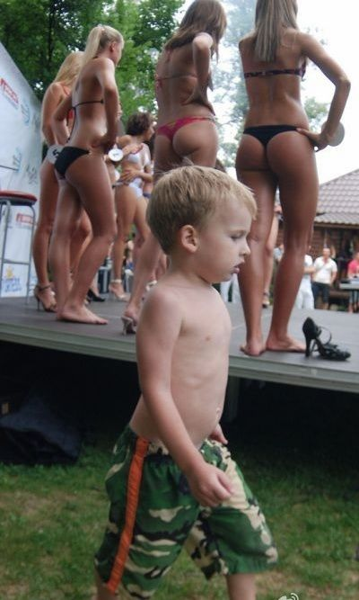
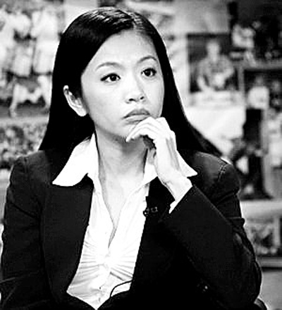
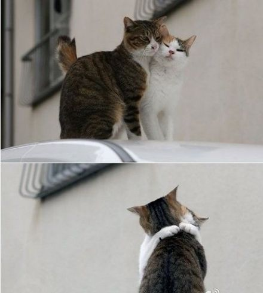
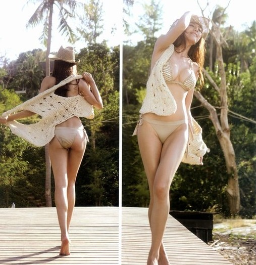
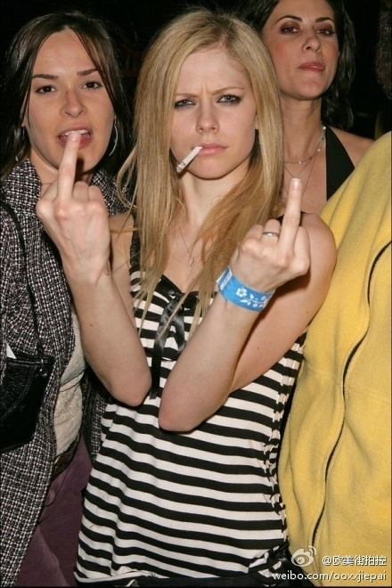

# ＜天璇＞如今的美女，以及这扯淡的世界

**既然有了这样的需求在不断增加，供给自然也会稳步跟上。很多女生也都朝着图片里的“美女”的方向努力，那样她们就也能变成“美女”，也就能找到愿意出现给她买房子车子的男人。把自己弄漂亮的投资，如果最后真能找到一小开的话，就是回报率相当可观的投资。于是那些女人们就更不愿意去辛苦学习工作了，这一切都比不上掉个金龟婿。越来越少的人相信爱情，越来越多的人相信老公只不过是长期饭票，外加买名牌包包和化妆品用的信用卡。**  

# 如今的美女，以及这扯淡的世界

## 文/ 王容（华中科技大学）

 

对一直期待看新日志的同学们，我深表歉意，离开IB之后，生活恢复平静，思考也就停滞了。可这几日产生了些新牢骚，决定发一下。

先加一句修改：有些同学误解我了，我这牢骚绝不是说爱美女不好，爱美之心人皆有之是万古不变的真理，男人追求美女更是天经地义之事。只是现在对“美女”的定义有点太狭隘了，甚至导致了最纯真的美的丢失。另一方面，这个社会也推动着女性更加赤裸地追求物质和向着这种“美”的标准靠拢，从而失去了更多的美。

在美国的这三年，我渐渐和国内的世界脱离了，渐渐忘记了那是怎样的一个社会。大一大二时候的我，日日夜夜在图书馆里奋斗，那是的我还是从前的我，总觉得个人努力才是唯一的出路，总认为追求各方面的完美才能最终获得成功。我举着这个信条过了很久，也许这是我从出生以来就一直信奉的信条，可在我终于在自己前进的路上因为劳累和失望决定停下和转向时，才发现这个世界一直都在告诉我之前那信条是多莫的天真。只是我太忙碌没有听到，如今的一转头，才看到这个世界运行的法则和我曾经想象的是多么的不同，而且正在变得更加得不同。

其实这个现象也不局限于国内，美国也一样，但可能社会性质和价值观还是有差异，具体情况上也有不同。可说来说去，毕竟还是那个意思。昨天不想好好看书，看了一集《30 ROCK》，一个讽刺美国社会种种无厘头现象的黑色幽默美剧，里面的老帅哥CEO得知自己的老婆怀孕以后，开始录制给未来孩子的DV（他当时已经六旬，担心自己活不到该好好指导孩子的时候）。之前他们以为肚子里的孩子是个儿子，于是他在DV里说了很多话，告诉儿子作为一个男人怎样在这个社会里成功；后来知道其实是个女儿，他便从新录了一段，说“我最亲爱的女儿，如果你像你妈妈一样美丽动人，我对你没有任何建议，你的人生会一路平顺”。（当然，在这里我也对如今身负压力要靠自己买房买车娶老婆的男同志深表同情）

看来女人的事业果然就是男人，所谓成功也只是对男人应用的得力而已。而更有意思的是，有些男人还特别期待被漂亮的女人利用。

记得以前看杨澜写的给女孩子的一些话，大部分都是废话，基本属于任何一个有点智商的普通人都会给出类似的忠告，可里面有一条很特别，她说“找一个能为你实现梦想的男人”。杨澜的优秀无可否认（同样不可否认的是她的美貌），但事实依旧是：如果没有那个男人，她不会有今天。在投行的日子里看了好几遍曾子墨写的《墨迹》，看第一遍的时候我刚开始实习，是以一种顶礼膜拜的心理读的，打算当做自己在IB混迹的教科书。当时看完以后就有一个感觉，那书里没写到什么实质，也没有太多可以借鉴的东西，大多都是以谦逊的笔法侧面夸奖自己。后来又看一遍，那时对IB已经有了点概念，结果发现那书真是离谱，瞎了我的狗眼。也就是说，曾子墨后来的崛起以及比其他在投行里干了两年以上的女性突出，多半还是因为长相（注意哟，我说的是“多半”），毕竟也是那长相才让她进入了传媒界。

所以这个世界，尤其是当下，对于女人来说拼的不过就是一个“脸”字。女人就负责把自己弄漂亮，男人就负责挣钱娶这些女人。

我从很小开始，就沿着一条很没劲的路狂奔着，当然，我也是最近才发现它没劲的。我曾经的愿望是把每件事情都做到极致（对的，我在GS面试里说的那句话不是假话），不管做什么事情都尽量不要出错，而且再出错之前就要有backup plan；要学习好，要会家务，要热爱生活，要扩展知识，要有自力更生的能力，要吃苦耐劳等等。可在我按着这些要求忙碌了近20年，才发现，如果真有一个女孩从不出错，样样精通，事事明白，她就嫁不出去了，她也得不到宠爱，自然也就走的不会很顺利。这些话其实小的时候听人说过，可听着就过去了，还总觉得是那些人为自己做不好事情的借口，可现在终于明白了。在如今的世界，和一个娇气水灵的千金比起来，奋发图强的三好生显得很卑微。

除了在我很小的时候，大概小学二年级之前，被夸过长得可爱，后来很长一段时间都没有人会评论我的长相，这段时间内也就没有因为长相得到什么关注。初中和高中的各种“花”评选，都不会见我名列其中。那时我也不懂温柔似水以弥补不美的外貌，自然没有太多人为我倾倒，送我回家什么的。高考以后人生进入另一个时期，外加gap year了一年，我在新东方意外的获得了新生。这次短暂的接触社会让我眼界大开。首先让我觉得很奇特的是，我突然变成了所谓“美女”，其实还是一个样子，可似乎离开了校园的审美，我会被别人当做“好看的”。有同事跟我说“你要小心点，女学生会讨厌长得好看的女老师”，一边又有同事说“你不用担心，长得好看打分就不会死得太惨”。真神奇。

还好，那半年平安度过，和比我大很多的同事每天疯玩，见识了各种人各种事，也从那些真正的大美女身上看到了长着一张美脸的好处。而我自己的际遇，让我深感错杂，很多时候花很长时间努力备课不如化个漂亮的妆来的有用。连从小教育我要自强的爸爸最后也跟我说“女孩子，自然属性比社会属性重要”。是啊，社会属性都是浮云，尼古拉斯也找了个waitress。

说到社会属性，继续往下讨论。新东方还有另一个特点，男老师永远比女老师混的好。这是为什么呢？因为学生会狂热追捧男老师，而一般不会狂热追捧女老师，新东方整个集团里被追捧的厉害的女老师多半都是有假小子性格的。在教室的场景中，老师是强势，学生是弱势，而处在强势的女人总是不会特别讨喜。不是说强势的女人就得不到欣赏，而是往往能欣赏这种女人的男人需要比这个女人更强大，但由于社会的金字塔结构，这样的人必定数量更小。到美国以后，也见了几个真正强势的“成功”女人，我每次和她们接触都好奇她们有没有嫁出去，或者老公是什么样的人，果然一般都是独着，就算结了婚的，老公也都性子很弱，在家里地位比较低。这样性别倒置的家庭对她们来说可能没什么，但对我这样依旧追求传统婚姻幸福的人来说，还是太过刺激了。（我再修正一下，也有强势女嫁得完美，找到了懂得欣赏自己独立的男人，可毕竟算少数）

见过她们之后，我对女人的“成功”有了新的定义：家庭幸福。

回到“脸”的问题上。来美国以后，呆在村子，我开始每天蓬头垢面外加神经紧张（相信我，你不会想看我那个样子）。心里担心着将来的生计问题，我再次回到最初的我，每日像赫敏一样学习。更糟糕的是，我还没有赫敏长得好看。生活很快就变了，没有了所谓“美女”的光环，在一个自己属于minority、被白人当做“长得都一样的asian”的环境里，各种优待尽失。于此同时，继续听到各种故事，说哪个白人女生长得漂亮，得到了教授（男女都爱美女）的重视。Meanwhile, 环视学校里的女教授，多半都没有留下太多“女”的气息。

以上描述的这段时间，我都没有看新闻，没有了解国内的情况，当时我对这些现象的想法就是最单纯的“爱美之心人皆有之”。在我2008年离开祖国的时候，“嫩模”还没有如今那么铺天盖地，China Joy 也没有因为批量提供妹子名声大噪。这个暑假是我上大学以来最闲的一段时光，每天除了复习考试，就是上网看各种图片。于是这个新世界让我震惊了。

网络世界里的美女都变成了一个样子，一种眼睛，一种鼻子，一种嘴巴，外加快挤到脖子根的乳沟；美空里各种巴不得把自己扒光了的妖怪也越来越多。纪敏佳和周笔畅进来的转型也让我很失望，为什么一定能够都要搞成那个样子呢？此外是各种美女拜金的消息，却个个有都显得那么理直气壮。车模说“等你有了一千万再来找我”，从前的我会想“你谁啊，就一车模，什么学历，什么本事，凭什么值一千万啊”。可现在我懂了，人家就是值，那大长腿，那带了假睫毛和美瞳的巨大眼睛和栗色的大波浪就注定了她值，更重要的是总有男人会觉得值，而且愿意出那个钱。就算知道这女人拜金，他也一样喜欢，因为这女的是个“美女”，也不管是不是人工的。前几天的china joy也是很有意思的事件，去看展会的人估计多半都忘了自己看的是个游戏展会。各种事业线丁字裤，御女萝莉样样齐全。要在前几年的中国，估计还会有很多“不好意思”，可现在开放了，供求关系也更明了了。

既然有了这样的需求在不断增加，供给自然也会稳步跟上。很多女生也都朝着图片里的“美女”的方向努力，那样她们就也能变成“美女”，也就能找到愿意出现给她买房子车子的男人。把自己弄漂亮的投资，如果最后真能找到一小开的话，就是回报率相当可观的投资。于是那些女人们就更不愿意去辛苦学习工作了，这一切都比不上掉个金龟婿。越来越少的人相信爱情，越来越多的人相信老公只不过是长期饭票，外加买名牌包包和化妆品用的信用卡。我好奇的是，有些被钓的金龟婿似乎也不介意自己只是张饭票和信用卡，是否也对这个时代的爱情失去的信心，老婆只不过是花钱买的手感逼真的漂亮充气娃娃而已。这样也挺好，各区所需，我难过只是因为我居然才刚刚懂。

我最难过的是这样的世界让人们忽视了很多美丽的人。我身边有很多可爱的女生，女人因可爱而美丽，她们是如此的美丽。我特别记得那次在图书馆里和很久没见的ZY聊天，她那时风趣的谈吐和恰到好处的自嘲幽默，让我觉得她无比美丽，那种从人的最深处散发出的最智慧的美丽。还有DY吊儿郎当不打扮，随便套件T恤，认真给予别人帮助时候的样子也特别美丽。还有其他很多人，我难过不单是因为她们的美丽没有别人发现，还是因为她们由于觉得自己不符合这个时代对“美女”的标准，也没有发现自己的美丽。

这个充斥着嫩模和钱色交易的社会让在村子呆久了的我有些慌张， 这世界对脸的痴迷有点扭曲了。如果人们都忘记了最简单的那种美丽，那我们自然会失去那样的美丽。

末了，姐也得在这世上混，先敷个面膜去。

P.S. 不要迷恋姐的美丽，姐也有PS。

 

（采编：陈锴；责编：陈锴）

 
