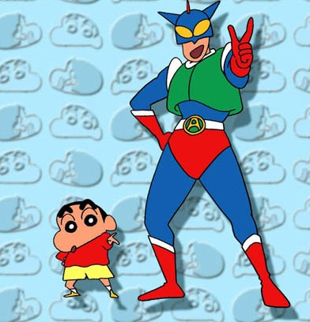

# ＜天璇＞始于18岁，终于18岁

**我们本来以为青春可以很独特，但是直到身临其境，你才发现，你也在做着和别人一模一样的事情。没有勇气去失败，没有勇气去拒绝，没有勇气去独立，没有勇气逆流而上。于是这一代人的梦想，始于18岁，终于18岁。这一代人的青春，始于18岁，终于18岁。中年人的生活，从高中毕业，就已经开始。**  

# 始于18岁，终于18岁

## 文/曹畅洲（上海交大）

 

前阵子看到一句话，说我国现在的年轻人大学一毕业就成为中年人，像中年人那样为了柴米油盐精打细算。

这句话使我吓了一跳，同时觉得实在太正确了。我想到高考结束的那个暑假，当我盘算着要去哪里旅游，看什么动画，玩什么游戏，干哪些坏事的时候，身边的同学告诉我，他们在读中口，学开车，看教材，背托福。我大吃一惊，恍如隔世。我惊异他们怎么能这么快就确定自己的人生轨迹，但是当我这么问他们的时候，他们往往又会回答，他们其实也没有方向，只是假期里找点事做。

我又想到大一结束的那个暑假，当我盘算着要去哪里旅游，看什么动画，玩什么游戏，干哪些坏事的时候，身边的同学又告诉我，他们在找实习，新东方，考证书，读高口，学开车，看教材，背GRE——后面四项给我的感觉是他们要把这四个属性的技能点加满为止——然而，在新学期开始时，他们回到寝室，总是会兴致勃勃的说，我暑假去黄山玩了，那里真美。

我曾经问过不同的学长，大学里什么最重要。综合一下他们的答案就是，大学里要好好读书，分数越高越好，同时好好读英语，并且最好再找点实习，然后多参加社团活动和学生组织，多参加志愿者活动，利用图书馆资源尽可能多看点书，多交朋友——谈到这一点时他们往往会有很多的事实论据以说明人脉的重要性——无一例外的是，他们每给出一个答案的最后都会加上一句：要发展自己的兴趣，做你喜欢做的事——以此来表明他们并不是被社会挤压掉人格和性格的橡皮人，他们还是有个性的。

我对这个答案的理解是，最好能在大学里做个超人。但仔细想想这很正常，因为不同的学长走了不同的路，有的学长考研了，他会告诉你，唉，当初找工作也蛮好的。有的学长出国了，他会告诉你，在国内也有好处。有的学长学霸了，他会告诉你，很后悔把时间献给了考试。有的学长贪玩了，他会告诉你，应该好好考试的。最后的结果是，在你的耳朵里，走在每条路上的人，都在幻想另一条路上的好。好比口袋妖怪里初期给你的三个精灵，你不能全拿，但你总想全拿，所以有的人会把一个版子玩3遍，或者索性使用修改器。很可惜，现实没有修改器。

并且无论你选择哪一个，你总会在现实中遇到你的小茂——他的选择永远克你。

奇怪的是，当你对人生感到迷茫，不知道前路漫漫该何去何从的时候，那些名人访谈往往会告诉你，他们在我们这个年级的时候，也是什么都不知道，尤其在演讲时，他们特别喜欢说一句：我当初也和你们一样，然后开始扯人生轨迹。而事实上，你只要稍微百度一下那些牛逼人物就会发现，他们在我们这个年纪的时候，人生的轨迹早就和我们脱轨了。这时我们会觉得，这个世界上充满了欺骗。

所以只能靠自己，因为未来的一切都那么摇摇欲坠，而生涯的导航都那么振振有词，振振有词的让你觉得像算命的。所以所有人都抱着“不要让自己输在起跑线上”的想法，在大学期间拼命增加自己的……东西。等到有一天突然醒悟，大学毕业之时早已不是起跑线，那只是一个检验你增加了多少东西的终点线，所有人都觉得，在这场旅程中，你背负的东西越多，你跑的就越快。然后一面背负，一面怀念高中，最终暑假里在去黄山的大巴上和旧友轮流唏嘘：当年，我们怎么怎么。

这是一个摧毁梦想的年代。这一代人的很多梦想，环游世界，经营巧克力店，西餐厨师，DJ，调酒师，当夜店驻唱歌手，刺客间谍，AV男优……然而他们对未来的理想，则无外乎房地产，精算师，私募，程序员，营销，工程师，公务员……纵观两列职业，这是一种何等的落差。你说不清谁本来高中一毕业幻想着未来有一天在金山嘴开一家海鲜烧烤，然后大一一看形势不对改为在陆家嘴当一个平凡白领，你说不清谁本来高中一毕业幻想着未来和自己心爱的人住在农家小院养猪种菜，然后大一一看形势不对改为住在皇家庭院拼命还贷。我们本来以为青春可以很独特，但是直到身临其境，你才发现，你也在做着和别人一模一样的事情。没有勇气去失败，没有勇气去拒绝，没有勇气去独立，没有勇气逆流而上。于是这一代人的梦想，始于18岁，终于18岁。这一代人的青春，始于18岁，终于18岁。中年人的生活，从高中毕业，就已经开始。

 

（采编：佛冉 责编：陈锴）

 
