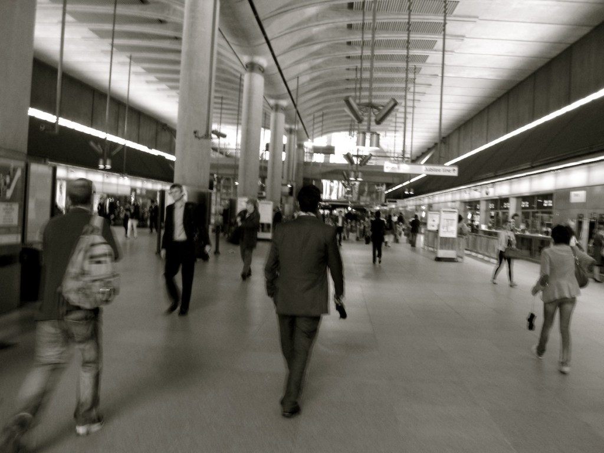

# ＜天璇＞孤儿的眼泪

**文化官员还在文明地用手扒开他们的大脑，定要窥视他们内部到底有什麽。我想告诉他们，真的什麽都没有了，中国要完了，你们继续看下去，中国就只剩下一片叫做东南亚大陆的土地，除此以外，别无祭奠。当文明灭亡的时候，我们徒有这些身躯，生活在被圈养的恶劣环境中，欢乐地庆祝自己的死亡。**  

# 孤儿的眼泪

## 文 / 平仰中（Boston University）

 

在波士顿的QUNCY MARKET看着迎面走来的人们，大肚皮的父亲牵着孩子，手中拿着大杯的可乐和爆米花，小孩戴着星条旗的帽子，开心地走着。那天风很大，但风干不了我脸上的泪水。在美国已经三年有余了，当初赴美的理由如今已经不复存在。这一切的变化就好比一个北韩的人跑到南韩，终于意识到这世界上还有另一种生活方式。但这永远不是自己的家。于我亦然。当在美国存在下去的唯一理由就是为了追寻中国改革的方法，很多苦水都吞了下去。之前还在上海的时候，参加一个大学介绍会，那时我对一个耶鲁的校友说，你应该录取我们，因为我们更了解中国。他笑了下说，在美国生活过的中国人，其实对中国的感情更真实。

在英国工党总部实习了近一个月了，每日十点上班五点下班，虽然如此，还是很辛苦。如果中国好了，我还需要去为英国的一个党做事麽？每天看着残疾人、退休警察、还有教师不断发来各种抱怨，退休金少了，希望议员能解决，小狗不吃饭了，希望议员能解决，下水道被叶子塞住了，希望议员解决。众议院很多余，希望议员解决。我很想笑着哭，因为我自己国家的那些无辜的国民因为国家的“维稳”而要被活活埋葬！因为我自己国家的很多房屋未经过同意就被拆掉，因为我自己国家的国民因为受了冤屈要去告状，却被送进精神病院。

在欧美三年，我到过芝加哥、洛杉矶、旧金山、华盛顿、波士顿、纽约、伊利诺伊、费城，现在到了伦敦。我感觉自己像个流浪儿，我比浮萍还糟糕。因为我连根都没有。今天我在波士顿，明年我就去别处了。在午饭的间隙，我有时会想在星巴克内找找上海的味道，但抬头看着阴霾的天空和伦敦每家每户都会种植的花草，维多利亚式建筑和光鲜亮丽的人们距罹我的故乡太遥远了，当英国推行民主政治一千年的时候，我们还在Limbo裡摧残自己的国民。

鲁迅写了一辈子，终于唤醒的人民又睡着。但中华民族没有劣根性，我坚决地要用现实证明这一点。中国人从来没有接受过良好的教育，民国除外。如今六十年过去，中国能成有点学人气息的只有“陈丹青”了，可文化官员还在文明地用手扒开他们的大脑，定要窥视他们内部到底有什麽。我想告诉他们，真的什麽都没有了，中国要完了，你们继续看下去，中国就只剩下一片叫做东南亚大陆的土地，除此以外，别无祭奠。当文明灭亡的时候，我们徒有这些身躯，生活在被圈养的恶劣环境中，欢乐地庆祝自己的死亡。

现在中国人除了手上握着一文不值的人民币还有美国人发的永远不会兑现的债券，一无所有地赤贫。很遗憾，胡锦涛和他的机械工程师们根本无法在中国需要巨大政治转型的过程中把握住什麽。他们只知道机械式地运作之前那些具有优秀政治素养和组织经验的共产党前辈们留下的遗产。但这一切已经过时了二十多年了。现在的中国社会虽然是之前一元社会主义社会中脱离出来的怪胎，但是他必然在向着独立前进。越来越多的非盈利非政府组织成型，越来越多的社会因子包括跨国公司和国内公司的互相作用，都让中国社会变得更加强大。官员不再极度地受原先的社会主义结构所束缚，中央政府更加难以管束。教育很差劲，人文尤甚。这让很多学生的思维单一化，无法提出改革的方法和有效地批判如今的制度。但是，也让共产党后继无人。试想那些既没有独立革命创业经验的公务员，又没有苦干和为国精神的官员子弟，还有秘书团晋升上去的“领导”，要“领导”这个国家走向光荣还是地狱？

既然无法管制了，就应该放弃这种垄断欲。国家政府必须对自己正本清源，声明彻底放弃某个单极主义的奋斗目标，为庄严华丽的中国而奋斗。不论是什麽主义，只要有用，就去用。设计出适合中国特质的制度。

民主有民主的好，他就好比是全自动的机械设备。民主施行，必须要提高民众的素质，这样才能产生优秀的劳动力和议员，而民众才能提出智慧的建议和要求。老子几千年前就说过，无为而治。而无为不是不为，是一种最大的为。因为他发动民众对自身利益的追求，而让他们自己运作自己的社区。

我认为民主最有效律的辖区是市级，尤其对中国人口众多的情况来说，只要上升到国家范围，就会必须成为集权。因为中国太大了，集权能调动每一个肢体的动力，但是却无法细化解决每个部位的矛盾。只有在每个细化部位施行全自动的民主制度，才能解决如今到处产生的问题。

而国家需要一个决绝的、公正的、为了国家利益可以牺牲一切的一群人去坚决执行这样的改革。在制度、文教等各个方面推行恢复中国华夏文明本质的改革，并在地方坚决有效地推行民主进程，在他们逝去的之前，要完成整个国家后继人能自动延续这种改革上百年的准备。民主在任何国家都不是一日之功，而是几代人的努力。中国的强盛在我们有生之年能够看到，但是芳华不能绝代，我们要做到万代芳华，昭华胜极。

我最后想对诸位说，三千年的中国封建制度结束了，但追寻现代中国的步伐从未停止，就像史景迁所说。共产主义的风暴过去了，一个声称社会主义的国家去推行资本主义和自由市场，就是他最响亮的丧钟。中国自鸦片战争以来产生无数改革，革掉了传统，革掉了民国，革掉了中国人的记忆。如果之前的所有改革都失败了，是因为战争、内斗、迷失、贫穷，从今天开始，我们要完成追寻现代中国之路。中国近两百年的从封建帝制向共和制度的终极轮替就要开始了。在这结束之后，这裡成为中国人的麦加。

要让历史铭记真的很容易，但要对得起自己的作为，却很难。谁能够牺牲自己的一切去换回庄严华丽的中国，谁就是中国的明天。

今天我们漂泊在欧美的街头，纵使衣着庄重，但依旧同是天涯沦落人。我们回头看看远处的故土，甚至看不到那天际线呢。我们知道在体制内的所有同胞身处困局，毫无改变的力量。但是请相信我，这一切会到来。孤儿们的眼泪，透着决绝的希望。

 与君共勉。 [http://fancci.com/archives/2647](http://fancci.com/archives/2647) 歡迎訪問：Fancci.com，為了莊嚴華麗的中國。  

（责编：黄理罡；采编：安镜轩）

