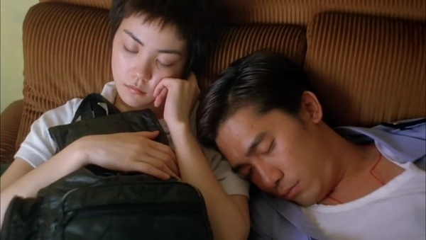
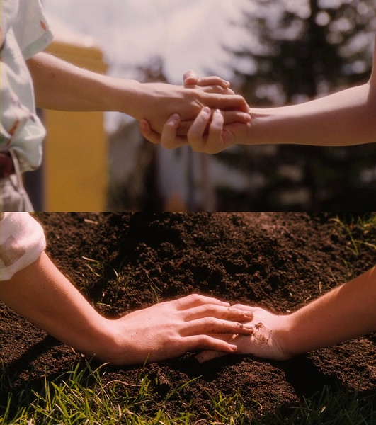
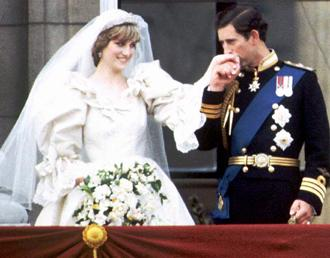

# ＜天璇＞少年一段风流事，只许佳人独自知

**你要知道太多的晒恩爱总是会在你们感情脆弱的时候带来太多不必要的干扰，比如哪个礼拜你们忘记发恩爱照就有好心朋友轮番“关照”你们。每一次可以大事化小的时候，总是有那种化简为繁的力量让你们的感情和生活的路上充满荆棘。当你们的一次小小的吵嘴人尽皆知的时候，也常常一个问题的出现同时还带有其他节外生枝的问题。所以，刘天王不是对感情不负责，微博女王当年的感情也不一定是最好。**

### 

### 

### 

# 少年一段风流事，只许佳人独自知

### 

## 文/林静（华侨大学）

### 

内心总是觉得，最害怕爱的不稳的人才喜欢在个人网页上高调晒幸福。 天王刘德华被揭发已秘密结婚后可畏满城风雨，刘德华在舆论压力下三度道歉。而朱丽倩被描述成可以为爱人接受隐婚的那种牺牲自我的好女子。可是直面隐婚和直面狗仔队追踪让你二者取一的话，选择前者的恐怕也大有人在。 蔡卓妍隐婚曝光后大方告别了大饼脸，接着垂下的刘海衬托着她轻熟女的小脸。在这一场公关危机中，我看见的是他们和平分手不争财产。阿sa离婚但是没有误工，如此好合好散可惜没有太多祝福。 2011年，听说姚晨离婚了，所以那么多人再也不相信爱情了。是的，曾经微博女王姚晨与西北王子凌潇肃我们心目中的真爱的代言人。任凭这个世界如何乱，他们就是情比金坚，一毕业就结婚，结婚后还恩爱无比。不介意杂志拍照，不介意情路分享，不介意微博调情，真爱就是高调。这种高调能给勇敢者以智慧，能给懦弱者以坚强。他们的高调离婚也让许多不明真相的群众发出“我再也不相信爱情再也不相信人生。”的痛哭。可是，这么容易就不再相信爱情不相相信人生，你也太脆弱了。 很不幸，这个微博女王的爱情在围观中褪色，而刘天王却没有传出离婚的新闻。我不是支持隐婚，只是不大相信那些高调的爱。 爱情上,我笃定，真的勇士，敢于直面平凡的人生那些琐事的一地鸡毛，敢于面对高调的轰轰烈烈缠绵悱恻的爱情后的一切分手的可能。这是怎样的哀痛者和幸福者?然而造化又常常为庸人设计，以头版头条和大肆围观来洗涤他们心中对爱情的原始信仰。仅留下收视率点击率一路飘升和围观者“再也不相信爱情”的悲哀。在这喜欢高调爱情的人群里，刘德华的隐婚遭受舆论大众的不理解，又给高调秀爱的人们暂得偷生，维持那些惨淡的爱情。 

### 

### 

惨淡的爱情，而且在你对爱情不自信的时候却大肆宣扬你们的幸福情节。接着围观来得迅疾来得巨大也来得无奈。太多爱在轰轰烈烈里发芽，只有最坚强的爱可以走过平凡和人生。轰轰烈烈结束了，平凡的人生开始了，那就好好过日子，无需高调晒恩爱。 就把姚晨凌潇肃当成一堂课吧。因为曾经你没有修好恋爱这堂课，你经验不足，所以命运让你再补补课。你要知道太多的晒恩爱总是会在你们感情脆弱的时候带来太多不必要的干扰，比如哪个礼拜你们忘记发恩爱照就有好心朋友轮番“关照”你们。每一次可以大事化小的时候，总是有那种化简为繁的力量让你们的感情和生活的路上充满荆棘。当你们的一次小小的吵嘴人尽皆知的时候，也常常一个问题的出现同时还带有其他节外生枝的问题。所以，刘天王不是对感情不负责，微博女王当年的感情也不一定是最好。 女性朋友总是为负面新闻而担忧，看到克林顿的拉链门时心情总是不由得变坏，变得比希拉里还自暴自弃。如果听到戴安娜的世纪婚礼就感到分外“相信爱情”，听到“拉链门”就一下子唉声叹气，那是还没有习惯这个风云变幻的世界。看多了人间哭哭笑笑的各种“门”，必然会有一种平常心。 这些话是看了大S汪小菲三亚婚礼后那些女性的激动情绪才要感叹的。近年明星结婚是多，总觉得媒体一次比一次亢奋，人们一次比一次激动。 英国王妃的世纪婚礼没有什么好结局。她车祸死时没有下半旗，因为女王认为这是家事：我悲，或者我喜，与举国百姓无关。希拉里选举的时候克林顿一路当着绿叶衬着老婆这朵红花，也算是好伴侣。 

### 

### 

“少年一段风流事，只许佳人独自知” 人一生当中很多爱情就只是在特定的那个时候感天动地，无论你们后来有没有在一起，其实都没太多必要去公之于众——无需毁了对方和自己的生活。 

### 

### 

# 

（采编自北斗投稿邮箱 责编：陈锴）

### 

### 
