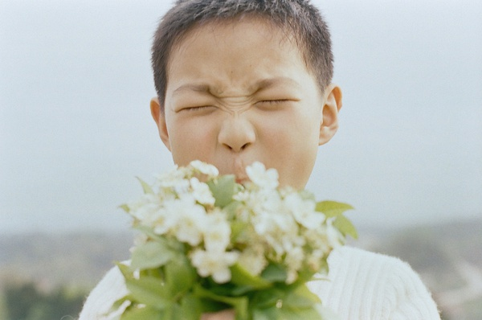
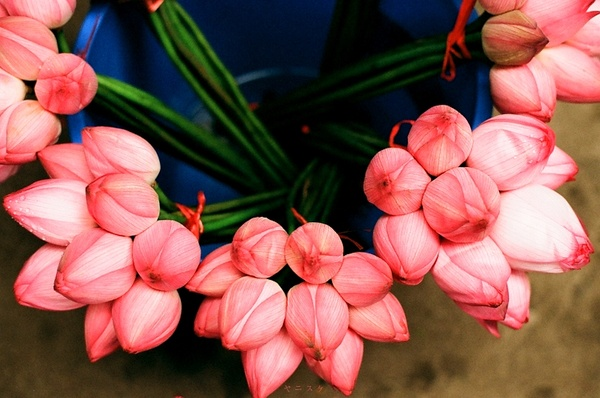
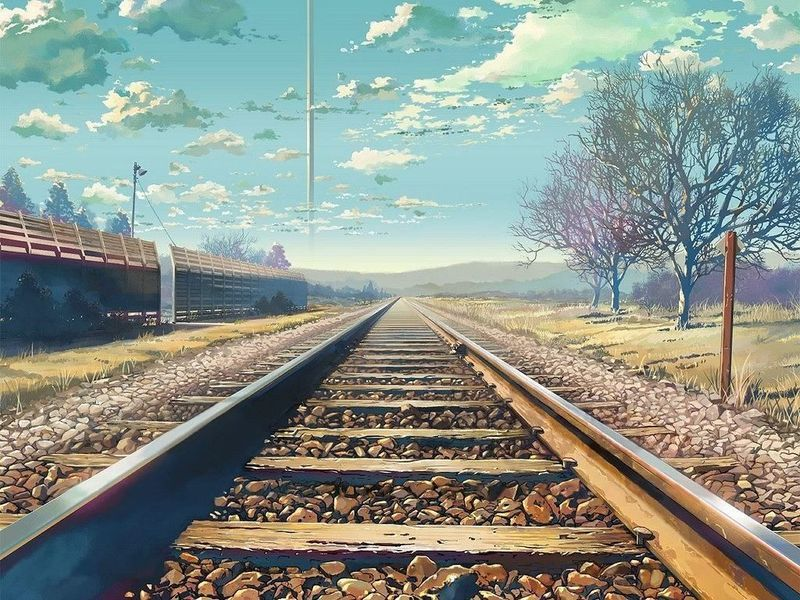
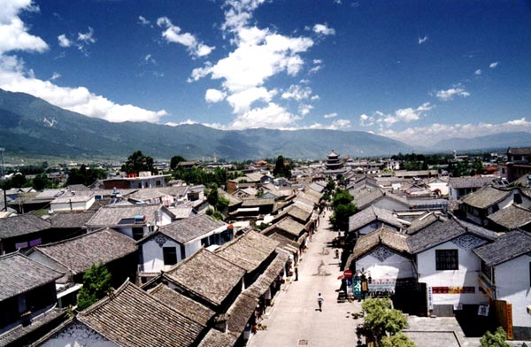
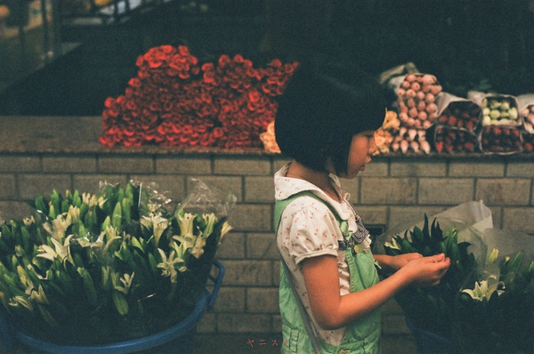
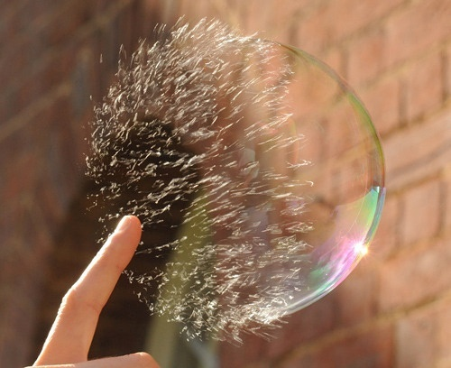

# ＜天璇＞属于童年的东西，也许只有梦里才好看

**我们现今不断讨论自由主义、民族主义、社会主义，不断在“宏大叙事”的框架里纠结着独裁与民主，发展与牺牲，却又有几个人转过身去，看一眼历史深处，哪怕是,刚刚过去的那些在政治宣传下已渐渐模糊的灾难呢，有几个人去正视那些人们绝望的眼睛？**

** **

** **

** **

# 属于童年的东西，也许只有梦里才好看

## 文/高和（浙江传媒）

我的好朋友——猫，成都人。 当我拿着票走进满是人流的成都站，面对着一条无法挤身退后的路，向她告别，也就是向着我长达一个多月的旅途作了一个了结。这么长的时间里，我从凉爽宜人的东南小岛屿走到风沙烈日的西北大戈壁，走过了云贵高原，又走向成都江汉平原，就像是铁轨上的枕木一般，一格一格地朝向前，横竖都没有主意，直到看见前面被折了一个弯，才心满意足地跳上回家的列车。 我们在未去到某地之前，总会因了对陌生土地的盲目幻想而让自己的思绪有了一层薄雾。比如说绵密得就像是静水的平原，或者是高亢地飘着信天游的高原，但只有你看过之后，才会了解这样有担当的天地，是不是硬朗得就像是喝高粱酒的汉子一样直得起腰板。 不得不说，我们国家广阔的地域性仍然赋予了它政治单一环境或者商业脚步也夺不去的巨大的丰富性。我忆起陈丹青记吴冠中的字句：“我又无端想象他1949年怎样在巴黎咖啡馆与两位同学争论到底回不回来——当初赵熊二位毅然留下，其实很对，吴先生毅然回来，我以为也很对。”（大意）当时看到这篇文章时，不明陈丹青为何说“也很对”，后来，看到吴冠中的画，似乎也就明白了。 

我从小就常坐火车，随父亲往返于南京、上海，然而于我印象深刻的，却只是那渐被更替的列车以及不断被刷新的速度。老的铜陵站远没有现在的这么气派，但当初因为是周边几个市惟一的一个火车站而人拥落挤，它以一条长线贴在城中，仿佛是为了应一个叫做“贯穿”的词似的，后来去的地方多了，才发现，每个城市的火车站都是面北朝南的。在这条渐渐被冷落的铁路线上，曾经每天只在8点去一趟车，14点来一趟，来去不动声色，像《千与千寻》里那辆泅水的火车，鸦雀无声。泅水的火车我也坐过，从兰州与西宁的时候，暴雨滂沱，火车在甘肃的一个小站停了四个小时，直到雨过天晴，方又枕着铁轨声往下一站驶去。而现在回去看，老的侯车室已经被改成了夜总会，周边小红楼里坐街的妇人依然花枝招展。 坐火车，尤其是通宵火车的滋味并不好受，但又让人安心，我对这个交通工具十分偏爱，想想，大概是因为这是有轨道的东西。我的生活常常不上轨道，于是偏爱以一种有轨道的方式来逃离，想想也真是不算有出息。 

通宵的火车从桂林到贵阳，夜行的车厢充斥着闷热、汗湿、倦怠与喧哗。在夏天还选择坐绿皮火车的大多都是为了省钱，于是你不得不隐忍着回忆起小时候在座位下面铺两张报纸拉撑了然后放心大睡。彼时旁座的阿姨便将她的两个孩子置于座位下面，时不时去为他们拍拍胸脯。而今，我蜷在座位上，却再也没有了小时候那股酣睡的劲儿了，这就是我们的长大吗？我把窗子抬高起来，风猛烈，像是要把我卷入了黑暗中一样，手旁的书页哗哗作响。书真是一件好东西，临行前带了一本沈从文的散文，到了柳州，换了一本《月亮与六便士》，再到桂林，已经变成了《古都》，可以很合时宜的附庸风雅一番，感于朱天心这样有着一副绝妙的眉目的女子，一眼便将老灵魂看得玲珑剔透，真是那个婉转啊！ 这风倒吹得心很静，像克里希那穆提描述的：面对太阳在山头投下大片阴影时，心里那种不带强迫的安静。这种安静，使得你可以不带批判的面对周遭。只是之前的那些路走得太辛苦，而之后的路又那样未知，免不了还有些想家，再加之之前读到的沈从文的书简，他说，倘若两个人在这小船上，就一切全不怕恕？ 黄碧云说，世界很大，但我不懂其路途之近或远。 这个才叫气魄，但我又总是陷入回忆，下一次又将陷入这一次里。去年这个时候，我正窝在六安的那个小山坳坳里，什么也不用算计，和黄老师喝着小酒吃着炉食，月色洒然，而今我一个人搭辆火车去瞧古城，骑两只轮子在群山环绕的洱海。 一个人往往是被迫的，但每每想起，却都是深刻的必须的，或者称之为唯一的，也是再好不过的。明年的这个时候，我估计又要记起，今年的这个时候，我跟上官大哥坐在白族民居里喝着加可乐的大理啤酒，聊着他那未尽的理想，以及人民路上抽大麻的老外和他那被卷入传销组织的朋友。 下午两点钟到达了成都，尔后在一个月内前前后后来了三次。从昆明北上达成都，后加入一个往南的自驾，再折回成都，最后一次是从西宁回成都转车回家。 八月份的成都，有些湿热，让人不得不时时怀念在大理的日子。在青旅，有几个同行的德国人同住，只有我一个中国人。我们每天不同时间出门，但几乎每天都会在路上遇见，然而每次都是简单的”hallo””Auf Wiedersehen”，我们会微笑，会点头，偶尔谈论的，也是新概念课本上的内容，还通常是第一册，虽然我并不在乎，然而我有时候会思量之前与他们的对话是否得体，是否有损国貌，因为对政府这样的外交名媛来说，一个人的无心之语可能就影响了一个民族的面子。而之后，突然有一天夜里，一个叫Jacques的高大的男人走到我面前来，说：“hey，we’ll be leaving tomorrow, I want to invite you to have a drink if you have time.”然后我从他们手中，换得《The Songs of Leonard Cohen》，这张版于1968年的唱片，无疑是这次旅行中最珍贵的礼物。这个叫做Leonard Cohen的老男人，从先锋诗人到民谣歌手再到摇滚拜伦，与列侬一样迷于佛教，他曾写信给中国的读者说他深爱中国的古诗，喜欢那些在爱情、友谊、饮酒、分别中饱含的挚情，他说：“浅薄如我，竟有缘栖息、受惠于你们传统沃土的边隅，哪怕只是短暂的瞬间。”这个边隅，指的是柬埔寨，他将在那里结束2010世界巡演。 

成都让我印象深刻的，是长顺上街。猫曾经住在这里。她说这里属于少城，是清朝的划分，而今，“少城”成了成都的代名词。猫给我看老照片，那时的长顺街，看上去很是热闹，现在的长顺街，早已抛离了过去瓦屋仄仄夹道，成了车水马龙的交通要道，也很是热闹,却是一种机械的热闹。 宽巷子那时候还算不得特色，也并不特殊，最出名的莫不就是巷子口的包子以及张卖面的刀削面。我和猫坐在张七家喝盖碗茶，看大地的日落在尘世蔓延出大段大段的黑钯，在城市里漫卷成一种铺天盖地的绝望。我又想起了那位诗人——即使是仅凭一双黑暗赋予的眼睛，也要用它来寻找光明。不过最后那位诗人用一把斧头去寻找了别的什么东西，留我在这越长越像的城市中，不知所措。 城市建设者们用马克思主义去指导着街道规划，又用毛泽东思想去指导马克思主义，在一种偏狭中找寻出路是困难的，所以，成都所显现出来的浓重的文化气息十分之难能可贵。 春熙路上的天主教堂因为满大街的美女而差点错过，傍晚时分，这座躲在喧嚣之中的圣堂里传来了呜咽一般的祷告声，我突然想起了《Hotel Calinfornia》，十分诡异的样子，但就像这首歌一样，眼前的建筑看上去便有一种宗教感。所谓宗教感，就是在一个人的内心，要有他认为神圣的、重要的、值得坚持和追寻的东西。我多么的羡慕他们，羡慕他们心有所托，羡慕他们全盘相信，就像羡慕他们有望得救一样。但我又无时不刻不提醒着自己：若需存活，必先自救的道理。那日王老师给我发短信，竟是劝我入教，说我的性格适合。我看着，突然不知如何是好，我虽年轻，然一路碰见许多人不断对生活修饰，浓妆淡抹，没有本真。自己又有许多不相信的事情，又如何能坚持以一种特定的方式解赎生命之咒呢？ 

将要离开的时候，猫送了我一本《蒋介石传》，读来很有趣，尤其想到宋庆龄去世前终于加入中国共产党，成为一名光荣的共产党员，便想要笑出声来。有些人因为背景能瞬间入党，有些人却需要花大精力去抹去自己的背景，这种对比后面所体现的和谐胜景，正不断在被消解。吴仁宝说：“全中国的人民幸福，是社会主义；全世界人民幸福，才是共产主义。” 然而我们现今不断讨论自由主义、民族主义、社会主义，不断在“宏大叙事”的框架里纠结着独裁与民主，发展与牺牲，却又有几个人转过身去，看一眼历史深处，哪怕是刚刚过去的那些在政治宣传下已渐渐模糊的灾难呢，有几个人去正视那些人们绝望的眼睛？他们的名姓是不是都要被刻上“共产政权受害者纪念碑”呢？在兰州遇到的那位失去孩子的妇女，说起她那可爱的孩子的时候，一声一泣，一步一泪，而面对镜头，却必须说出相信这个，相信那个，会给她一个新的家园——真正的苦楚，还是在她心里。她给我们看照片，上面的母子俩笑的跟阳光一样，在场所有人，无不动容。我突然想起那日成都大雨，一个送外卖的阿姨后面跟着的披着雨衣的小朋友。这人间真正的情谊，恐怕只在眼前！ 小的时候我们总被教育着要有一种旷达的心态，而今我们却需要时刻与一群小人为伍，我们所经历的战争是远离生活的，是精神上的，无论我们怎么想要挽回旧时的影像，都是不可能。难怪史铁生要说：“属于童年的东西，也许只有梦里才好看。”黄永玉也在文昌阁小学的碑上写：“童年不再。” 

而我庆幸，我在旅途中所见的许多旧东西，都标着“童年”这样的标签，比如纯真，比如自由，比如相信，比如……它们在梦里，也真的很是好看。
