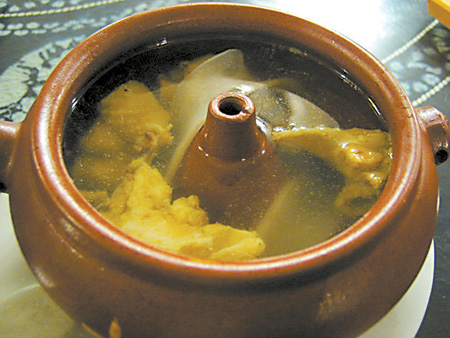
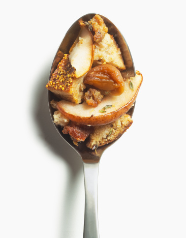

# ＜天璇＞左手缪斯，右手饮食

**直到走的很远了，偶尔被这些记忆里的味道敲打灵魂，才渐渐懂得四季变迁与人事更迭。后桌男生不再递来一只洗好的苹果，同桌也不会在快下课时戳醒你，问要不要给你带便当和零食。吵闹，脸庞和欢笑统统留档，昔日飲食却不能重新加工返桌。从中得到过满足又逝去，这是一种难以抗拒的轻快和颓唐。**  

# 左手缪斯，右手饮食

## 文／刀洛西（北京大学）

 

前一阵和朋友去吃汽锅鸡。作为一只在京城活了十九年的滇西少年，自然被问及吃汽锅鸡有些什么讲求。不得不説，常年以食客自居却一时语塞的感觉很可耻。回家后看了汪老先生文章，好好做了番功课，才知道拿建水产的汽锅蒸出来的更有味。而鸡“瘦则肉柴，肥则无味”，独独武定鸡口感恰到好处，醇肥有味。揭盖以后即是汤清如水，鸡香扑鼻，中国人就是这么会吃。云南菜比不得川菜的浓墨重彩，但几道纯淡的庶民小食便可被我奉为精华，年年买张飞机票吵着返乡吃饵块米线。

人們爱谈男欢女爱，也离不了勾魂摄魄的一蔬一飯。以美好肉身取悦于人，是为了谋生而结婚的女人最古老的职业。若再烧得一手好肉，就像是增添了高尚的情操，男人想不爱都不行，否则赔了夫人又挨饿。要么你就做大爆炸里的霍华德，或者去吃地沟油。

说起来，飲食这货委实妙不可言，可使游子心宁，婆媳安好。让政客消解意识形态，商人赚的盆钵体满。男人大呼过瘾，女人又恨又爱——生得大胃吃货，暴食江湖。味蕾敏锐，肉身沉重。但心宽体胖的姑娘往往都有一颗善良而不倦的心，那就是不论冬夏吃着冷石头和马卡龙时总幻想这二两肥肉能栖息在正确的地方。

身在汴大，还算是有些口福。你让我站起来談东北亚局势，批火车票限价，我心里却念着一会儿的松林生煎学五鸡丁，康中肥牛农园香锅。比起谁谁拿了奖学金，倒是更关心校园十佳菜肴。于是便出现了“每当宿舍学霸以超高频抓耳挠腮时，我总在想晚上吃些什么”的单曲循环。（=学术屌丝的逆袭？）

夏天在怀柔军训时闲得发闷，捧着小依的台湾味道一阵猛刷。书里写某法国厨神曾自述，飲食艺术在表达风土人情的景致， 是一场完美的发现之旅，包含了穿越时空的邂逅和对抗遗忘的故事。鲁迅也说，那些儿时在故乡吃过的蔬果味道长留在记忆里。他们也许要欺骗我一生，使我时时反顾。这算是一种通俗易解的思乡蛊惑，是舌尖上绵远不足的乡愁。

就好像昨天的你刚下晚自习，出国或高考的疲惫驱散着浓浓夏夜。推门进家丢下书包，第一件事就是跑进厨房看晚飯有没有肉。会因糖醋排骨欢腾，也会因海参豆腐苦恼，而这些稀疏平常的料理就这么静默永恒地站成我十七岁记忆里的一颗大树。直到走的很远了，偶尔被这些记忆里的味道敲打灵魂，才渐渐懂得四季变迁与人事更迭。后桌男生不再递来一只洗好的苹果，同桌也不会在快下课时戳醒你，问要不要给你带便当和零食。吵闹，脸庞和欢笑统统留档，昔日飲食却不能重新加工返桌。从中得到过满足又逝去，这是一种难以抗拒的轻快和颓唐。

飲食是凝固在时间里的诗。咀嚼吞咽，我们因此收获最难以言喻的成长。透过味道留下来的不是程序或技巧，而是故事，细节，烹调人的心情，和品尝者的感悟。把耳朵贴在上面，你听到过去的自己匆匆跑过。

通过飲食可以张望窗外的世界。最喜欢的葡萄牙诗人费尔南多佩索阿曾说过，我们走入街道，便遭遇整个地球，银河，太阳系，还有古老的不确定性。我们想尝遍人生不同时节的瓜果烟火，于是心安理得地把自己交付给下一道未知的菜肴，用舌尖去亲吻那无限精彩的丰富多样性——这是飲食与爱情的本质不同，至少对我而言。一路走来一路吃，食材和作料的激情交融映射出了生鲜活泛的各路民生，那不是简单用添加剂调味剂来机械堆砌。同样一碗炒飯，也有菠萝肉松与青豆火腿之别。懂得飲食艺术是一种奢华的幸福，它赋予饕餮者一种“万物皆备于我”的情怀。但这也是一种无上的苦难，让多少誓言灰飞烟灭，多少腰围毁于一旦（某人看过来）。若是单说诱惑，飲食文学多有这样一种暴虐的快感：一股子油烟气从纸页中升腾而起，逼得深夜里的胃敏感且脆弱。再则，对于料理的追忆是作为一种习惯烙印在每个人盘绕的年轮之上。有的人从郫县豆瓣沾腐乳馒头起步，过上了橘酱鸭胸配荔枝味马提尼的日子。也有人终究是食不惯西式的奶油蔗糖蛋，拍大腿叫绝永远是对着中国菜的酱油葱米姜。其实都无关紧要，只要一手缪斯，一手飲食，你便可以从碗筷刀叉的铿锵交磨中，体味沐浴在阳光下的文化音乐，面对生命中无常的悲喜交加。

看过一份点名问卷，请写下你自认为最猥琐贪婪，和最温柔可人的时候。我想这可以用一个答案回答。不是套Ivy老头的磁，不是蜀黍泡萝莉阿姨勾正太，也不是面对着永远活在硬盘里的姑娘們。

那曾是和初中同桌一起用课本盖住泡面，倒数计时的三分钟。

那也是在异国他乡的眼泪砸进小肥羊里，凝视着肉片翻滚变白的三十秒。

 

（荐稿：王也；责编：麦静）

 
