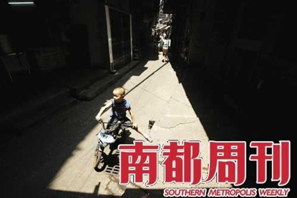
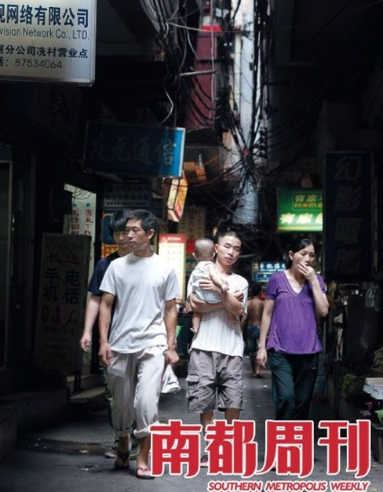
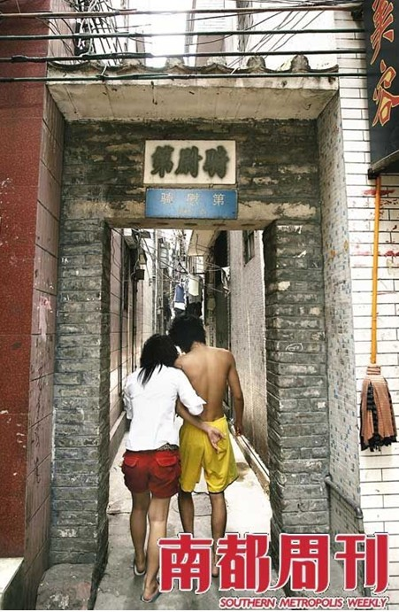

# ＜天璇＞广州杨箕，下一个消失的城中村？

**摘要：从杨箕村的每一条羊肠小道，没有的是汽车，故而时时看到泥鳅一样的单车来回在你身边纠缠，左右摇摆扑哧而过，但也不至于撞在你身上。走在小道上，抬头望去，透过密密麻麻的电线就能看到被撕破了的天空。因为太窄的缘故，一次同学来看我时就把这些楼房统统称为握手楼，因为只要双方乐意，伸出手来都可以握手言欢。**

# 广州杨箕，下一个消失的城中村？

## 文/ 林春挺（内蒙古大学）

“杨箕村很乱的。”得知我住杨箕村时，知道其相关掌故的人都这么对我说，并不忘了嘱多加我小心，其时我颇是感到有些险。事实的确如此，杨箕村有点乱，而到底乱在哪里，我至今说不清。

就像每一个自称为“人”的人一样，任何一个村落都有着自己的个性，杨箕村也不例外。午夜，似乎就是它本性展现的最好时刻——当然，这不等于说杨箕村怕光——这种本性又有着它深厚的背景缘故。

说起杨箕村，首先让人想起的是北京的胡同。杨箕村就像一棵百年的老树，或者是像一位白须老人，从它的心脏分出无数条弯弯曲曲的根须——羊肠小道——每一条根须就像是它心脏的血管与是神经，向着四方无穷无尽的蔓延出去，破破漏漏地迎接着各种各样来自投罗网的人们。杨箕村不排外，只要你肯来。

从杨箕村的每一条羊肠小道，没有的是汽车，故而时时看到泥鳅一样的单车来回在你身边纠缠，左右摇摆扑哧而过，但也不至于撞在你身上。走在小道上，抬头望去，透过密密麻麻的电线就能看到被撕破了的天空。因为太窄的缘故，一次同学来看我时就把这些楼房统统称为握手楼，因为只要双方乐意，伸出手来都可以握手言欢。

但很少看到“握手言欢”的景象。一次，大约的夜里12点的样子，一群喝了酒的说着听不懂的方音的农民工忽然斯打了起来，楼上楼下，互相呼应。等到我从窗外望下去时，一个光着肩膀的汉子血红斑驳，在群人的推搡中醉醺醺地东倒西歪。可怜。但这仅是我看到的一次，杨箕村的人们大都处在既不“握手言欢”也不“厮打起来”的状态之中。

一落午夜，杨箕村就开始展现它生机勃勃的生命力来。到南周实习后，再也没有午觉之说，早出晚归，典型的夜猫子，因此我从没有见过我的邻居长什么样，只有我在睡觉的时候听到他们砰砰的踏着楼梯的声音。由于睡的太晚的缘故，加上墙壁、玻璃的单薄，因此常常遭受楼上楼下四处飞来的杂音的轰炸。要说什么东西最有攻击性，那么唯声音摘取此桂冠莫属。任凭你如何的不欢喜，声音还是不请自来。在杨箕的午夜，挑逗引发的嬉笑声，宣泄撞出的打骂声，关店拉下铁门的哗啦声，莫名其妙的催促声，卡拉OK的歌声，声声入耳，竭斯底里。等到我打开手机的时候已是凌晨2点了，可杨箕村心窝里的人们还在继续着他们的生活。

生活？生活在别处。午夜也许是一种最好的宣泄的时机。生活强大的压力，需要缓解，除非有好的社会保障。

在我所住的无数条根须的一条，摆满的是开餐点，小吃点，烟酒店……窗外挂满了飘着的衣物。每次路过，不忘瞧一眼那家在烟火缭绕中双手合十的怀着各式各样信念的人们的庙宇。再走一根烟的光景的路，就是满街跑着车量的广州大道中了。这就是我所能描述的杨箕村的牛之一毛。

据说，南方报业集团的一家媒体在做《正在消失中的城中村》这样的一个选题，做出来不知其效果如何——毕竟大陆媒体时时都在承受着如鱼饮水冷暖自知的自身无力感的苦楚——单单这样一个选题就深深地吸引了我。可惜的是，迟钝的新闻嗅觉使得我想不到这样的选题，即使想到，我能做出来吗？即使能做出来，是否也会遭遇“未出生就死亡”的厄运呢？拆迁是一块一天就能让急功近利、鼠目寸光者油光满面的肥肉，强大的没有监督的政治权利，使得拆迁在中国左右逢源，势不可挡，导致无数的城中村在消失。简单地依照这一逻辑，那么杨箕村在拆迁的日程设计之中而难免乎此劫自是意料之事。事实上，据说，前不久就有推土机磨刀霍霍向杨箕的势头，但在杨箕人的广州“三元里”式的“抗击”下才得以的偃旗息鼓。但推土机是否“以退为进”，杨箕人还得“听其言而观其行”。此事不知确否？但想到此时，我不禁的感到杨箕村的可爱来，并为它以及它心窝里的人们深深的感到担忧。如果说西方人爱找中国政府的茬，那么在中国城市中就没有贫民窟一事就很深得他们的赞赏，而中国大城市中之所以不存在贫民窟这一令人头疼的毒瘤就是因为有城中村的吸纳。我在心中默默地为杨箕祈祷，我默默地祈祷着推土机永远也不要到这儿来，尽管杨箕村有多么的破旧，多么的不“与时俱进”，但它毕竟是一个城中村。城中村是城市发展的缩影，是城市发展的根基，没了缩影的回光返照，没了根基盘根错节的支撑，再好的城市也只是没有灵魂附体的行尸走肉。到那时，我们就会在歧途中寻找着自己了。

**附：截至发稿之日，杨箕村已完全消失**

（采编：陈锴；责编：陈锴）
