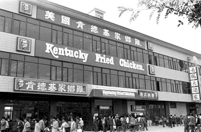
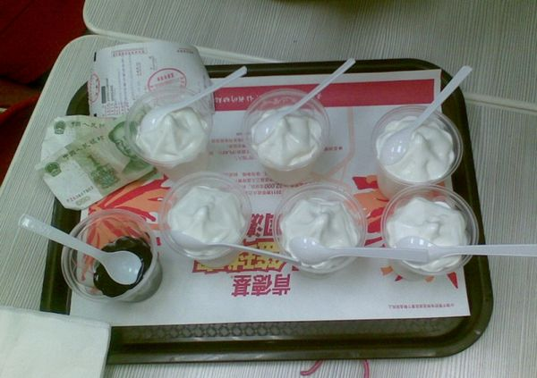
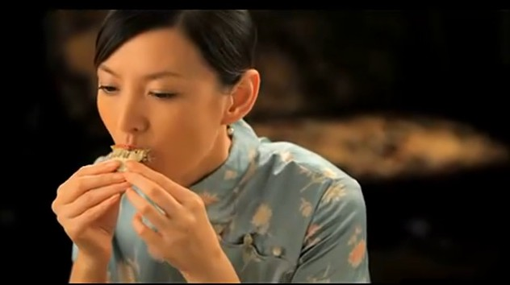

# ＜天璇＞当我不在吃的时候我在干什么

**这个世界的规则也不是由所谓更美的人来制定的。色令智昏者大有人在，可是为了一个色令智昏者舍弃自己的乐趣值得吗。真正爱你的人，永远不会在乎你脸上有几颗痘，胸前有几两肉。**  

# 当我不在吃的时候我在干什么

## 文 / 汤若依（University of Glasgow）

 

我要很郑重地写这篇日志告慰我22年来不能被理解的心情。

五年级的时候，南昌的KFC刚开第一家。我在我爸震惊的眼神中吃了两个香辣鸡腿堡一包薯条几对鸡翅一个冰淇林一杯可乐。然后，艰难地走了一小段路，从马路这边走到马路那边，在地下道口，吐了。我爸当时就疯了，多丢人啊。以至于很多年后每次我妈说起这件事都会在末尾加一句，你要是不听话就告诉你以后的男朋友。我被我妈威胁了很多年威胁得我很烦，所以我主动告诉了我男朋友。他很不出意料地笑昏在地上，继而抛出一个更猛的料，他小时候也这样硬生生吃吐过，吐了一桌。那一瞬间我觉得他整个人都被金光环绕了特别闪耀特别帅特别有种。

高中的时候，每天下课间操我都要到附中食堂去买一个2块钱的春卷，里面有土豆丝包菜火腿肠青椒豆芽，春卷皮介于酥脆和绵软之间，咬一口下去就是各种爽。高中三年的每个上午我都是指着那个春卷活的。从食堂窗口到5楼的教室走到第3层时我可以吃完那个春卷，塑料袋儿丢在第四层楼梯口的垃圾箱里，餐巾纸丢在我们教室后门儿的垃圾桶里。并且每次春卷卖完的时候我都超级超级失落，心情极其不好加烦躁，觉得有一件必须要做的事儿没做，心里犯堵，一直到第二天吃到为止。

高三一整年都没怎么哭过，月考没考好，小说被撕了，之类的。直到有一天中午放学回来，我妈说，没时间买菜，今天中午吃随便一点。然后端了两盘蔬菜和一碗紫菜汤上桌。那一瞬间无比委屈，你懂那种感觉吗，一瞬间心里无数感叹句弹出来：我这么辛苦地读书！每天睡不到6个小时！骑自行车骑得腿都变粗这么多！谈个恋爱连话都说不上几句！我靠什么撑到现在啊！我不就靠每天能吃好喝好吗！太委屈了啊，肉都没有一点，花荤都行啊！于是开始大哭，劝不住，一直哭到下午去上课。出门前我妈边摔锅铲子边骂道，我看你是疯了。我大喊，我就是疯了，我就是要吃肉！ 然后继续擦眼泪去上课。

大学时认识了现在的男友，带他纵横了南昌所有的据点，高档至五星级酒店自助低档至无店面路边摊，我们都是自诩低俗的人，从不做什么看画展逛植物园这种附庸风雅的事儿，在一起的娱乐核心词就是吃。今天去哪儿吃，吃什么。男友有个前女友是篮球运动员180身高，还不甚熟稔的时候，我给他埋伏笔：“我很会吃。”他不屑地提起那位女友，说，我们一起能吃一个全家桶！我当时没说话，笑了笑，心想，日后你会明白的，这真的是小CASE。直到某日我们一顿KFC吃了一百几十块，他终于Hold不住了，委婉地说，我们真的还挺能吃的哈。后来的日子里，我们逐渐养成一种默契，就是吃东西的时候不跟彼此说话，各自专注地吃各自的，直到酒足饭饱，才开始交流意见。某次我饿了一天，和一好友约去一个两室一厅，哗哗哗点了四菜一汤，吃兴正浓，好友不停地跟我说她的神奇见闻，边说还边推我一下说，你见过这种极品波你见过波？！我哪儿有心思听啊，我被她推了两次以后终于忍不了了，喊道，你等我吃完再跟我说！好友脸上顿时露出伤心欲绝的表情。后来我跟男友说，她们都不懂那种吃饭吃得好HIGH的时候被打扰的心情，好伤的。男友说，我懂。我说，所以才跟你在一起。男友笑翻。

来UK以后每天各种空虚寂寞冷，读书的压力逼到人难忍的地步之时，最排解郁闷的事是做饭。每次我室友进来匆匆炒一个黄瓜炒蛋就着饭要端走的时候，看到餐桌上摆在我面前的三菜一汤甚至四菜一汤都会问，你要来朋友？我说没有自己吃。室友表情讶异到要死，又不好直接说尼玛吃这么多你是人吗。只好悻悻地走掉，留我不以为然地坐在餐桌前饕餮。

我珍惜每一次有好心情和耐心认真做饭的机会，如同珍惜愿意花心思耗时间来认真爱一个人。对我来说，爱一个人也不过如此了，我愿意给他最好的爱，也不过是每天为他面浸油烟发沾葱花，用心思做好一餐饱含爱意的饭，看他幸福地吃完。

我记不住走过十几次的路，但会记住只去过一次的餐厅。我一辈子都忘不了越秀路的土耳其餐厅，忘不了金碧大世界的早茶和聚湘阁里的干锅肥肠，忘不了三里屯的中8楼工体的乌巢和菜园南路的烧饼摊儿，忘不了解放西路的风波庄韭菜园路的熊猫阿姨和平和堂巷子里的罗蒂公主，忘不了布莱顿的上海上海，忘不了武侯祠边上的三只耳火锅窄巷子的成都映象，忘不了书林街的桥春园过桥米线翠湖南路的石屏会馆，忘不了江岸路的胡锦酒楼卢沟桥路的汉口人家，忘不了思明路的张三疯奶茶店中山路的鸭肉粥鼓浪屿的海岸餐厅。忘不了建康路的小南国和夫子庙的咸亨酒家。忘不了下城区的永乐坊湖滨路的外婆家，忘不了道口路的云中漫步和延安3路的云峰菜馆。我对这所有的餐厅如数家珍记忆深刻，我回味它们多过回味年少无知时喜欢过的青涩少年，我对城市们的印象最后停留在每一丝舌尖的味觉。我就是这么尴尬而执念的一个人。

没错吃货的追求就是如此低level。可是那些嘲笑他人口腹之欲的人啊，吃不能作为兴趣爱好吗？吃就比收集字画欣赏古玩要浅薄，比登高望远诗词歌赋要庸俗吗？我曾经在大四为了减肥在一个月之内只吃早餐和水果蔬菜，每天头晕脑转地裹着保鲜膜长跑仰卧起坐，那个月瘦了18斤，可是男友见到我并没有很大反应，他觉得没什么区别。

我曾经很感激在我最丑的时候仍然爱我、陪在我身边的人。时常想起郑秀文在瘦身男女里看着镜子里自己的那个眼神，那个眼神以前无数次灼伤我卑微的自傲，可是人不爱美天诛地灭不是吗。那么又为了什么我拼了命地减肥，却仍然得到这么多差强人意的结果。那只能说明，这个世界的规则也不是由所谓更美的人来制定的。色令智昏者大有人在，可是为了一个色令智昏者舍弃自己的乐趣值得吗。真正爱你的人，永远不会在乎你脸上有几颗痘，胸前有几两肉。

给我一副好皮囊，给我一对34D，给我一个小蛮腰，给我一双大长腿，给我一副玲珑心魄，给我一个永远爱我的人，几者之间有联系吗。我无法阻止爱我的人爱上更美丽的女孩儿，也无法阻止更美丽的女孩儿拥有活脱的思维和上乘的伎俩，更无法阻止一颗流动的心遵从它一贯流动的规则。而所有我真正想要的，是一颗鲜活到老的心。是看到美食就会雀跃，看到美好就会被唤醒，会感受真切，会品尝隽永，会浸渍幸福，会香气四溢。

是兰陵美酒郁金香，玉碗盛来瑚珀光；是早晨起来打两碗，饱得自家君莫管；是春江水暖鸭先知，蒌蒿满地芦芽短。

好了不写了，没Hold住写成高考作文了。

总之，呼儿将出换美酒，该张口时就张口。

 

（采编：尹桑；责编：黄理罡）

 
