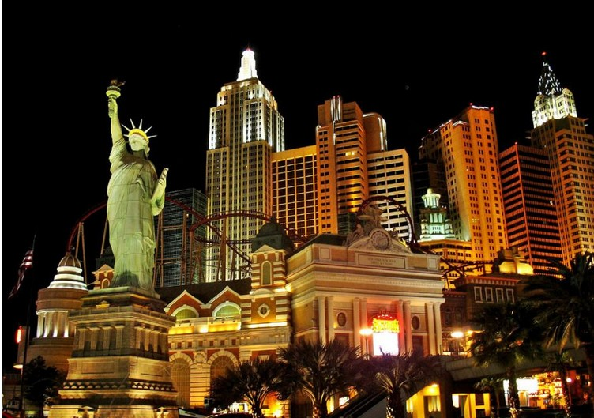
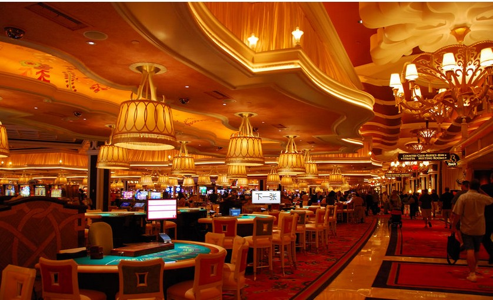
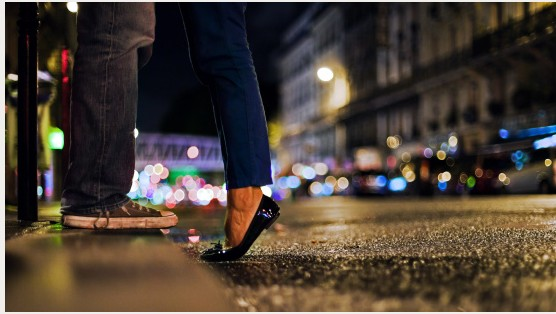

# ＜天璇＞当我谈论爱情时，我谈的是

**王小波说：过去发生的事是最有魅力的。当他说这句话的时候，黄金时代早已过去，他唯一能做的只能是回忆着曾经落魄的鞋都没的穿，白天被人批斗却可以晚上在山林的露珠里发着高烧和姑娘xxoo。冯唐说文字能够打败时间，我不清楚我是否理解这句话，我只知道码字的过程中我发现原来在岁月里还埋藏着属于我自己的欣喜和失落，我不敢言打败时间，我只求能和岁月握手言和，和悲喜相濡以沫。**  

# 当我谈论爱情时，我谈的是

## 文/徐文昊（Purdue University ）

 

2010年夏天，我在拉斯维加斯买了一大杯长岛冰茶，买了那杯酒后，我身上剩了20刀。

我带了150刀，其中100刀还是我洛杉矶朋友给我的，第一晚上我输了100刀，身上还有50刀，我花了30刀买了一大杯长岛冰茶，我还剩20刀。

我一边喝酒一边走路，我没钱看脱衣舞，没钱去酒吧勾搭姑娘，没钱再买一杯长岛冰茶。我只能靠上帝赐予我的两条腿，步行赌城夜景。

赌城吵闹，万物欢喜，姑娘裙子齐x，脸蛋鲜艳，大腿浴喧嚣，滋润的光泽照人。不时有激烈的欢呼，仿佛一群受压迫之人瞬间翻身做了主人，场面异常欢庆祥和。我不清楚大家为什么这么高兴，我猜测大家都赢钱了，赢钱了当然是高兴的，但我只是猜测，我不知道大家为什么高兴。其实很多时候，我都不清楚大家为什么高兴，高兴到要叫要哭要搂脖子要掀裙子，高兴的我都快跟着一块儿高兴了。

怎么人突然一下就这么高兴了呢？

喝完了冰茶，我就绝望了。我这是走到哪儿了，怎么连人行道都没了，来回只有车没有人，都上高速公路了。我想打个车吧，又一摸20块钱，觉得估计都不够打车的，一下子阵脚全乱，只能硬头皮，走。

拉斯维加斯的夏天是我无法忍受的，白天热的空气吸你皮肤里的水份，晚上又把这些水份粘回到你身上。我酒劲上来，周身湿热，下体尤甚，汗从大腿上流下来，灌进袜子里，感觉小便在失禁。

我此时唯一能联系到的人是那个给我100刀的朋友，他在几百英里外去圣地亚哥party的路上，这个点儿绝对关机，开机也会说你自己找找路吧good luck，绝不会做出调转车头杀到维加斯的事儿。

我的这位朋友和我10岁就认识，加州理工读本科，智商灭掉地球人绝大多数，灭我三四个。11年前我们一起坑美国小孩儿手里的宠物小精灵卡对着同一个亚裔小萝丽流哈喇子，11年后他不知道谁是周杰伦谁是韩寒，中国名人只认识毛先皇和姚明，中文只会简单句型。我们用英语聊天，发现唯一欣慰的交集是我们俩还都爱姑娘，但就这一点交集也不交的彻底，我爱各种人种的姑娘，偏爱亚裔，他只爱白人姑娘。

2010年夏天，我的朋友的白人姑娘不爱他了，他心情沮丧食欲不振，于是他妈要我去开导他一下，我背着包走出机场，坐着他花奖学金买的新款雅阁开进加州理工校园。我当时想，要是我12岁时留在美国，他回中国，那我或许就是加州理工开雅阁的学生，他就是来自中国百无一用混文凭的留学生，我心里很难过，我摸着雅阁，如同摸自己的东西。

那晚我唯一开心的是他给我看他的白人姑娘照片的时候，因为我发现他的白人姑娘逊色于我交过的一切女朋友，身材脸蛋都差到不行，3分不能再多。我说哥们儿这姑娘实在不好看啊，你用的着这么悲伤的坐在我身旁吗。他也不看我，盯着照片发呆，过了良久，说仔细看还是很美的，你不懂。

我确实不懂，等到第二天我参观了加州理工的实验室教室学生宿舍外加娱乐场所，见到了几十个那里的女学生后，我全懂了。我觉得那白妞儿绝对有校花的实力，任何一个学校的女生和加州理工的比起来，都是北影中戏的水平，世界上其他大学平均5分，加州理工绝对是负数。

我后来只能安慰他，说你女朋友确实拥有贵校校花级容貌，这点你今天已经带我证明了，但终归好景不长，佳人易逝，这是自然的法则，达尔文也不能否认两个相爱的动物即使能配出更高级的后代，也不能保持长久的伴侣关系，你们既然相爱过，那就彼此谁也不欠谁的，大家都被爱情腐蚀过，你去你的未来，我去我的未来，睡个自然醒，什么就都过去了。

我还说兄弟我不是埋汰你，但我很小就意识到了一个问题，那就是人智商越高泡妞越难，爱因斯坦牛顿牛逼吧，该泡不上妞还是泡不上，不是离异就是未婚。篮球运动员智商平均83，每个城市都有超过三个情妇，张伯伦从15岁开始到NBA生涯结束，一共和两万个女的上了床，这家伙两位数加减法都不会，英语单词量不过中国大学的四级，但人家就是单枪匹马的上了全美人口的0.01％，这比后宫佳丽三千的中国皇帝强了不知道多少。这么多年来，我一直刻意保持智商低于正常人的水准，辛辛苦苦任劳任怨，每当智商呈上升趋势，就无情的手起刀落，像太监割鸡鸡一般砍去我多于的智力，你知道我为此付出了多少汗水吗，你知道我有多努力吗，你知道吗你？

那晚彻夜长谈，本来打算第二天一起去圣地亚哥，凌晨4点我突然说想去趟维加斯，我刚满21，刚能上赌桌。他说好，就是别告诉我妈，也别告诉你妈。我说那肯定的，你放心，地球人里就你知道我去赌场了。他说好，你什么时候走，我看了看大巴的日程，说现在就走，你送我去车站。

他把我送到车站，我突然想起来我兜里没几个钱了，来洛城都花差不多了，我说我要现金，他翻钱包只翻到100，说可以去银行再取，时间来得及，我说事不宜迟，100就100，抓起来就上了车，上了车才觉得自己傻逼，妈的丫一学期奖学金几万，我就是要个1000刀对他也不是个事儿啊，我着个屁急，100块钱够个屁用。

回到拉斯维加斯那晚，我迷路了三个个小时，几近崩溃，比我跑5个小时的山路马拉松还崩溃，我觉得自己太傻逼了，来了赌城竟然不带钱，不带钱你老老实实呆者就好，还走迷路了，真是比傻逼还傻逼，要是此时有毛线，我真想给傻逼织个毛衣。

那一晚我感觉是被谁骗到了这么一个地方，这个人掏空了我的钱包，留了20刀，他把我灌醉，他让我心碎，把天烧的闷热，把我内裤浇的湿透，把我的路拉的长到要走几个小时，把我的脚弄疼。我至今想起来那天，我讨厌那个布下陷阱的人。

我想一定是我的那个朋友，是这个家伙在某一个我们交流的细节里勾起了我对拉斯维加斯的欲望，他早就算好了我会是这样一个情景，他在送我去车站的路上是不怀好意的，他兜里肯定有超过100美金的现金，他知道我会没钱，他就是不要多给我。

操。

回想我们聊天的细节，我发现很多细节是犹豫不定的，我忘记了我是如何产生了来赌城走一遭的想法，为什么说没钱就没钱了，为什么说走丢就走丢了，我他妈全忘了，我甚至忘了我怎么突然就出现在美利坚西海岸了，我怎么他妈突然就在美国了，我前两天还在济南地摊儿上吃麻辣小龙虾就羊腰子呢，我怎么突然就喝醉了搁这么一破地方走起了，这是什么事儿啊都是。

我回忆那天他递给我100元美金，我接过来揣进口袋，上车找到座位向他挥手告别，那个情形如同2000年我回国的时候我们俩道别，又如同几年后他在林俊杰出《江南》的那一年回中国和我吃了顿饭接着坐火车离开，我记得把我的手放在他车窗的玻璃上，他伸出手隔着车窗和我十指相对，那场面如今想来基情无限，可那时他智商还是我的一半儿，我用九年义务教育的奥数可以完爆他好几条街，可等到林俊杰出了《西界》，他怎么就拒了哈佛和斯坦福的offer上了caltech拿着比我爸妈工资还高的奖学金泡白妞儿了呢？

我又困又累，脑子像内裤一般潮湿绝望，我想起老罗语录里说拉斯维加斯随便挖个坑就有一具尸体，我怕哪个强盗突然冲出来劫我的钱，我摸出来20块钱，他一看这么少然后一枪打死我，挖个坑一埋，我可真就活不见人死不见尸了。我最难过的是我临死的时候竟然只给了一个饥热交迫的人20美金，还麻烦人家费体力挖坑，这20块钱随便找个人家帮人割下草坪也就有了，那比挖坑轻松的多。

我现在回想那天晚上，我竟然记不得有任何恐惧的感觉，我觉得处在那样一个情况下，我是应该恐惧的，但我记不清了，我只记得在那个无助的夜晚，我昂首阔步，走在世界上最腐朽的城市的边缘，走在脱离生活的无主之地，未知的路异常豁达，我感觉到了自由。

或许生活本身的恐惧大于了迷失在赌城沙漠里的恐惧，或许真正的恐惧是不会具体到能让你清晰的感受脚下的石子砖块，腿部的肌肉抽搐。博尔赫斯说沙漠里“干渴和对干渴的恐惧使日子长的难以忍受”，米兰昆德拉说“最伟大的冒险在于冒险的不存在”。失去身份有时比失去身份症更令人恐惧，过去发生的事有时比未来更加不切实际。

我的记忆里，三个小时后，我看到了一个加油站，我花了20块钱里的6块买了一包烟，4块买了三瓶水，问清楚了路，走回旅馆。

在旅馆的酒吧里，我买了一瓶啤酒。凌晨4点，酒吧里连闲散的个体户妓女都下班了，只剩我、调酒师和一个喝的神智不清的美国人。我给了他一根烟，他告诉我他失业和失恋了，我们聊了很久，后来他在我面前放声痛哭，哭的我挺难过的，我没安慰他，只是拍了拍他肩膀，就回房间睡觉了。

第二天我被收拾房间的墨西哥大妈叫醒，然后去了一个赌场，我还剩四五块钱，我投进老虎机里，出来20块，我拿二十块上了21点的桌子，第一下全押，变40，再全押，变80。我花了20块吃了顿牛排，剩下60块上了最小金额的德州扑克桌。60变200，200变400。我当时感觉像是《活着》里福贵告诉苦根的话：鸡养大了变成鹅，鹅养大了变成羊，羊大了又变成牛。

8月的赌城，我坐在椭圆形的赌桌上，和来自世界各地的游客赌徒坐在一起，我确定我是桌子上年龄最小的，因为赌场21岁能进，我刚21。我想21岁的时候，王小波在山东牟平当知青，王朔在海军部队的仓库里当卫生员，余华正在镇上当牙医，李志在努力成为工程师。我觉得这些人如果21岁的时候认识21岁的我，他们可能会羡慕我，我比他们有学历有能力有前途，甚至有姑娘喜欢。但我没有他们的落魄，没有他们的堕落，没有他们的生活，没有他们的理想。我家境够我来国外读书，够我买烟买酒但不够我买车买单反给姑娘买包包。我不够懒惰也不够勤奋不够好学也不够贪玩不够愤青也不够五毛不够理想不够苦逼不够文艺不够世俗，我看到镜子里的自己恰到好处的成为了一个看起来还很不错的普通青年，甚至有时我心血来潮量自己的鸡鸡然后悲伤的发现长度都是平均水准，即不短小也毫不雄壮。我上投资课学保险，看到各式各样的保险从出生一直保到你死，无论是你上学就业结婚退休养老，每一步都把你照顾的面面俱到，我看到ppt上一个婴儿到少年到穿博士服到穿西服到带着老婆孩子到老了坐在轮椅上到最后一个坟墓，自始至终脸上都挂着笑容，我觉得很可能我就是ppt上那个人，一生恰到好处，像雷阿伦的三分，精确无误。用基督徒的话说：had a good life。

21岁时我已经不再和父母争吵，我不是妥协，我是觉得有一天我要是做了父亲，我当然不会要求自己的儿子出人头地，但也不想看他过的悽惨落魄没有女孩儿喜欢。我会像一个优秀的父亲那样对他说：儿子，你要好好努力，过上充实简单快乐的生活，过上好的生活，爸爸永远支持你。我想我和我父亲唯一不同的一点，就是我还会用学到的知识给我的下一代，买上一份完美无缺的人寿保险。

英剧《黑镜子》第二集里面，妄图挣脱社会准则的主人公历尽艰辛终于换来了对着所有人发出呼喊的机会，却又无奈的沦为了现实的奴隶。资本主义就是这么牛逼。2011年占领华尔街运动中，齐泽克说中国在2011年4月开始禁止电视、电影和小说里一切含有“另类现实”或描写时间旅行的故事情节，但这对中国来说是个好的征兆：因为人们仍然梦想着另有出路，政府才要出手禁制。但在这里（资本主义世界）我们连禁制都不必要，因为统治体制连我们梦想的能力都压制了下去。

后来在《幻想锁链的彼岸》里，弗罗姆说真正的马克思主义，不靠武力不靠物质发达更不是靠变革，马克思认为只有知觉才是医治社会和个人关键，只有把人唤醒，才能使他像一个自由人那样行动。

我恍然大悟。

我回想21岁时，我惊奇的发现我是一个相当自由的人，我坐在拉斯维加斯的扑克桌上，血洗了桌上的黑人白人亚洲人，80、70、60、50后。那天我的筹码最多到了1000多，我身后站满了围观的游客，我带着耳机，依旧能听到他们在我赢钱时发出的赞叹声，那天我所向披靡，滴水不漏，让众赌徒胆寒。

罗永浩说一个人在赌场长期盈利的几率和一辈子被雷劈中两次的几率相同，我不知道这家伙是从哪里得到的这个数据，我所知道的是在美国，有人就是成年累月的住在赌场，靠有计划有策略有胆识的扑克技术，成了百万富翁，成为了世界赌徒们的偶像。一年一度的World Series Of Poker，也是造就扑克高手的摇篮，每年都会有数以万计的参赛者报名，他们支付几万美金的入场费，只为在赌桌上赢得名声。电影《Rounders》就是描述的这样一群人的生活。

我不仅看过了《Rounders》，还看过了大量的poker教学实战视频，我在大学期间唯一一件牛逼的事，就是作为Purdue会计协会Vice President在自己的学院里组织了“和教授一起赌博”活动，我们几乎邀请到了商学院所有的老师，把他们和学生放在一张赌桌上，大家一起赌钱，看谁是赢家。我没有赌，我是组织这次活动的人，我告诉校组织我们此次活动不涉及金钱，然后活动结束后我偷偷记下了获胜前五名的人的email和电话，这里面有教授有学生，几天之后，我让手下把购物卡和礼品卡送到了这几个人手里。那时我还不满21岁。

世界上有些东西是人越老越牛逼，比如跑马拉松我就跑不过三四十岁的人。有些东西呢，是越年轻越牛逼，比如篮球足球，马拉多纳乔丹过了三十五水平也都不行了。但有些东西，和年龄无关，比如搞文学的有韩寒也有余秋雨，比如搞摇滚的有邵夷贝也有鲍勃迪伦，比如台球有丁俊晖也有戴维斯，赌博也是这样，Tom Dwan十七岁就横扫赌博届，Doyle Brunson八十岁照样打的滴水不漏。我喜欢这些和年龄无关的东西，我不喜欢时间感很强你必须在时间面前低头的东西，后来我读弗罗姆的《爱的艺术》，最开心也是最欣慰的就是那句：人的成熟度和对爱情的理解能力，跟人的年龄、阅历，没有任何关系。

21岁时，我在赌桌上让一个来自纽约的老头情绪失控，他骂骂咧咧的站起，转身离开，筹码留在我手里。我下大注bluff一个四五十岁的光头黑人，心提到嗓子眼儿上，但依旧保持蒙娜丽莎的笑容，他摘下墨镜盯着蒙娜丽莎看了2分钟，弃了手中的牌。我pre-flop99和一个AA all in，所有人都站起身来，只有我坐在那里纹丝不动，前四张什么都没有，第五张牌是张9，全桌惊呼，输了的白人中年人愤然离席，我依旧纹丝不动，只是收他的筹码。那天我还赢了一个貌似中国官员的人，丫和随行的几个人说中文，英语却一句不会，连规则都不会，只是上来送了几百块钱，然后若无其事的走了，我拿着他的筹码，感觉里面有我爸给国家交的税。那天我听到了很多陌生人给我的欢呼，我听到了他们议论我手中的牌，好几个中年人在我面前狼狈不堪最后只能走过来握手说nice hand，好几个人走过来，拍我的后背，说That was sick man，so sick。

那一天，我不多描述，我只是告诉你，我2012年才知道，我那天是赌场的Jeremy Lin。

晚上我输回去了一些，依旧拿了500块钱回旅馆，早上我有4块，8小时过后，我有了500。

我的鸡变成了牛，巨牛一枚。

那晚我没花那500块钱，我躺在酒店里反复数那些个20元清点着战利品，心里即欣慰也难过。我想在我人生中这么牛逼的一天里，为什么欢呼的只是陌生人，为什么没有一个我想要一起分享快乐的人在我身边，为什么我所向披靡却孤身一人，我觉得真TM孤独。

王小波说：过去发生的事是最有魅力的。当他说这句话的时候，黄金时代早已过去，他唯一能做的只能是回忆着曾经落魄的鞋都没的穿，白天被人批斗却可以晚上在山林的露珠里发着高烧和姑娘xxoo。冯唐说文字能够打败时间，我不清楚我是否理解这句话，我只知道码字的过程中我发现原来在岁月里还埋藏着属于我自己的欣喜和失落，我不敢言打败时间，我只求能和岁月握手言和，和悲喜相濡以沫。

2011年夏天，我又一次回到拉斯维加斯，那个夏天我和一个姑娘面对面吃冻酸奶，她告诉我：耳洞这个东西不可以随便扎的，因为在你的耳朵被刺投透一刹那，陪在你身边的人（应该不包括扎耳洞的师傅）会在你的下辈子，再一次和你在一起当恋人。她接着说：你现在知道我为什么没扎耳洞了吧。

2011年拉斯维加斯的烈日下，只为前一天晚上看《蓝莓之夜》里的一个几秒种的镜头，我和我的姑娘花了4个多小时，用尽一切定位工具，走好几公里路。在被路标和建筑误导多次之后，我们猜想这个四年前的电影场景大概早就物是人非了，单为着一时的冲动也不必那么执着。然而，最终找到《蓝莓之夜》拍摄地的一刻，我的姑娘激动到哭也不得笑也不得，绕着砂砖垒成的长廊拍拍这儿，摸摸那儿。她说那是世界上最普通的地方，但也是天堂都无可替代的，属于我们的地方。

我对她说，我一直觉得，我们之间是应该经历过爱恨情仇才应该最终走到一起，而现在却还没有经历过恨和仇。我说你就没恨过我吗？你没觉得和我有仇吗？

她说，亲爱的，那些我们早就经历过了。

2010年在拉斯维加斯的最后一天，我怀揣500元去了mirage，挑战了更高水平的赌徒，输到还剩100刀。我提钱走人，吃了顿大餐，打车到长途车站，回了洛杉矶。

到洛杉矶是凌晨3点，我被放到了一个莫名其妙的地方，那是我2010年夏天的第二次迷路，当时兜里还剩30元。

我在长途车站里找到了一个下夜班回家的墨西哥司机，我问他去巴萨迪纳要多少钱，他说60，我说我只剩了30多，你帮我个忙吧。

那天凌晨我神一般的说服了墨西哥人，他答应送我去加州理工，然后上了车我们俩的对话和郭德纲的《西征梦》如出一辙：他说你认路吗？我说不认，他说我也不认路。

我没有iphone，我们只能去加油站问路，发现竟然没人知道，我没办法拿了30块钱里的2块买了一张洛杉矶地图，然后顺着地图摸回了我朋友的公寓。

下车时我拥抱了墨西哥人，把钱包里的所有现金外加那张地图都给了这个好心的墨西哥人，我说谢谢你，如果没有遇见你，我将会是在哪里。太谢谢你了。

清晨6点的巴萨迪纳异常安静，朝阳雾气拥吻，味道咸湿，光阴四溅。

我朋友的门没锁，我进了他房间看到他在睡觉，我进了厕所刷牙，看镜子里的自己安然无恙，仿佛没有曾经，亦无未来。

我没有告诉我的朋友拉斯维加斯发生了什么，我只是累，我疲倦的时候可以说话，但我不想说英语。

2011年秋天我在波士顿见到了我的朋友，他此时已经拒了地球上最牛逼公司的高昂年薪，在MIT读博士。我给他看我女朋友的照片，说我已经不爱赌钱了。他说他也不爱白妞儿了，我看到他娇小的台湾女友轻轻的挽着他的胳膊，我说我知道了。

我们始终没有提过我曾借过他100美金这件事，我想时间还是改变了，人生还是唐突了，美元一如既往，还是贬值了。

 

（采编：何凌昊；责编：尹桑）

 
