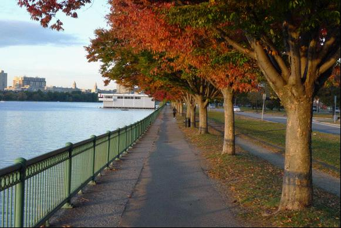
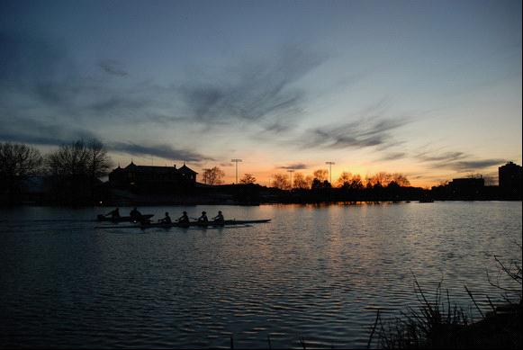
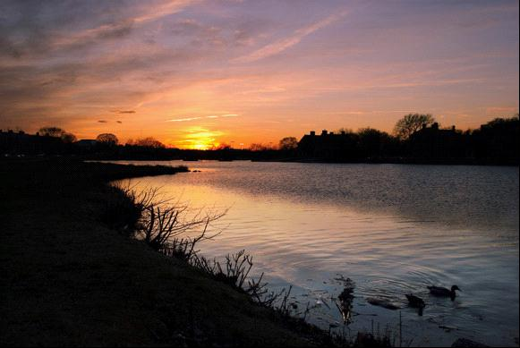
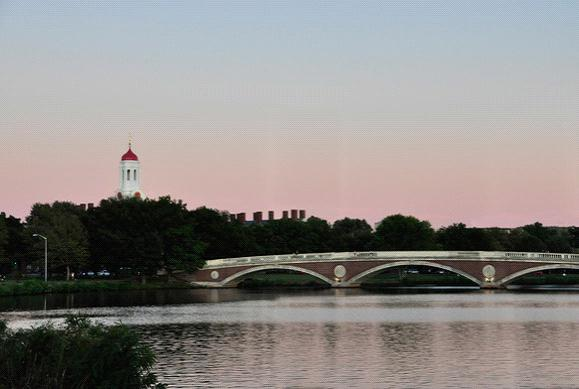

# ＜天璇＞当我跑步时我在想什么

**不知从何时起——或许是死亡的阴霾渐渐褪去的时候，我似乎进入了一种村上君所说的“蓝调”，不是跑步，而是生活。它并不悲苦，但也不热烈，不至于对自己心灰意懒，却找不到那种不顾一切的狂热。送走了五颜六色的自在的年月，经历了诸多浮浮沉沉，生活好像一头撞进了迷雾里，什么都抓不住，又逃不掉。真理、幸福、快乐……这些原本神圣而美好的东西都变得不再单纯，不再无懈可击，支持着生活的根基开始摇晃起来，我找不到可以为之竭尽全力的东西了。**  

# 当我跑步时我在想什么

## 文/吴争（Harvard university)

 

朋友推荐了村上春树的《当我谈跑步时，我谈些什么》，趁着实验的间隙，忙里偷闲把它看完了。因为我们都跑步，所以阅读时常常心有戚戚，有时不觉莞尔，甚至捧腹大笑，直觉得读到心坎儿上去了。我总倾向于认为写出不朽著作的人应该是已然朽去的，因而除了课程、研究和朋友的文章，在世的人的作品读得很少。不计跑步教程，我以前未曾读到过任何关于跑步的书，料想以后大概也不会了。哲学、文学、艺术、科学——这世上留传下来的文字里，除了马拉松这一象征性的符号，似乎再也没有什么是关于跑步的，邂逅这么一本书，就变得有近乎绝响的意味了。大概是因为跑步这个共同的爱好，又因为村上君写得极朴素、极真实，心中有些异样的触动——这于我不是件常常发生的事情，便想写点什么。村上君所写皆是感想，而一个人的感想其实是不好多作评价的。自然而然我写的也只能是关于我自己，既不适用于他人，也无可检验，于是这便不是书评，而仅仅只是另一个跑者的共鸣。

查尔斯河沿岸，有一条延绵不断的慢跑道。除去村上君列举出的众多缺点，它的确是一条愉快的路线。除了身穿印有哈佛标志的深红色T恤、晃着马尾辫、跑得英姿飒爽的本科女生们，我在这条跑道上也见过许许多多的人。有的只是跑步，另一些则骑车，轮滑，或者观赏岸边的风景。这些人里，白人居多，亚裔极少，而同我相熟的就几乎从未遇见过了。有疾驰如风，几个跨步就绝尘而去的高大男子。也有不紧不慢跑着碎步，脸上泛着红晕的小姑娘。还有来来回回打过无数次照面，但每次只是点头示意就擦肩而过的专业跑者。有几次，也碰到过被我从背后赶上，又将我反超，几度你追我赶，跟我暗暗较劲的倔强的中年人。天气好的时候，偶尔会有一个穿着比基尼似的运动装，身材惹火但却也不慢的金发女郎，跑得春光毕露的，在一路的注目中翩然而去。还有一次，在钟楼下的街角，见过一位穿着红色风衣、一头栗色长发，抱着一袋法国长面包的美丽女子，惊鸿一瞥之后便从未再见。在这条路上跑得久了，内心便生出了一种“亲密”的情愫，隔日不见便会想念。于是不管春夏秋冬，还是阴晴雨雪，跑步变得像约会似的。见过如泣如诉的沥沥春雨，也见过仲夏夜里倾城的月光，或者是萧萧落木里铺天盖地的压境乌云，又或是冰封河面上肆无忌惮的风雪，日复一日，年复一年，几乎未曾怠慢过。

有人也这样问过我，“当我跑步时，我在想什么？”村上君说，“提这种问题的人，大体都没有长期跑步的经历。”其实我开始跑步，只是为了不想什么。假若这一天打算去跑步，下午忙完实验，从学校出来，内心就开始有一种“微弱的胎动”。回到家，换上运动装，穿好慢跑鞋，人就渐渐兴奋起来。出了门，便把身子舒展开来，很轻松的出发。这时我总是从容不迫的，带着几分忐忑和欣喜：我不知道今天究竟可以跑多远，跑多快，也不知道会见到什么样的人，遇到什么样的风景。绕过校园，来到河边，身子暖了起来，渐渐的也不那么轻松了。做过拉伸之后，慢慢开始提速，身体开始吃力，之后便有些难受，最后，就进入了一种并不十分舒适却能自持的状态。尽管脑子里会飞快的闪过一些思绪，但大多数时候是空白的，什么也不想。麻木——我如此形容。这种麻木显然毫无任何乐趣可言，但重要的是，以乐趣的丧失为代价，痛苦也同时被驱走了。对于刚刚开始跑步的那时的我来说，这却是件不错的买卖。总觉得跑步带来的麻木，要比另一种流行的麻醉剂——酒精好了许多，至少我自始自终都可以保持清醒。麻木却又不丧失意识，这就是跑步的好处，也是我当初的愿望。

就像村上君，“当受到某人无缘无故（至少我看来是如此）的非难时，抑或觉得能得到某人的接受却未必如此时，我总是比平日跑得更远一些。”苦闷的时候，也常常逼迫自己跑得更快一点，跑得更远一点，有时甚至有些过了头。当我气喘吁吁，精疲力竭，身体几乎在哀求着停下的时候，我会近乎仇恨的对自己说，总有一天你将不属于我，但是现在你得听我的，跑到下一颗树就好。跑到了下一棵树，还有下一颗。就这样咬牙切齿、近乎卑鄙的剥削自己，心中的苦闷便好像也一点点被挤出。潜意识里，我大概以为这样近乎残忍的消耗肉体，至少可以让精神不至于被痛苦腐蚀。不管是对是错、是好是坏，就怀着这样的初衷，跑了三年。从物理的度量上，这不过是村上君的十分之一。可时间又是极柔软的，往回看看，有时觉得这三年一晃而过，不知怎的便把这人生的黄金年代随意抛洒在了这条狭窄的小路上。有时却又觉得这三年无边的漫长，之前那些如烟的往事都被这些时光分离得极遥远，仿佛是上辈子的事情了。

对于许多人，那些我所谓的孤独、痛苦一定是小题大做了。好比我在山里走了两天，饿坏了，可出了山头照样有吃的，而我的父辈们却真有吃了上顿没下顿的时候，跟我们这些后辈比，那才是真饿。可话又说回来，我总觉得这世上的感觉，不管欢乐还是痛苦，落到每个人身上免不了都要经过一番归一化（normalization），实际感知到的大约也差不了多少。偶尔的小病小疾对于得了绝症的人来说，根本都算不了什么，可到了另一些人身上就成了了不得的事，他们的折磨和苦痛看来却也是确切而真诚的。活跃在舞台中心的公众人物们，听到的赞美声从来不绝于耳，相比之普通人受到关注时的欣喜，他们只有不以为然的神气，但这又绝非存心轻蔑。人在一个状态里待得久了，或多或少便适应了，便不再意识到这本来的状态。这几万年来，人类的生活发生了无法想象的变化，可是每一个人的生存状态又真的变化了多少呢？那些喜怒哀乐、爱恨情仇不是一点不多，一点不少吗？我们并不比过去痛苦，可是也未曾比过去幸福。这样的困境，与满足无关，亦与珍惜无关，这大概只是人类无疑逃避的生存方式吧。从好的方面看，一点一滴的感情，只要它是真挚便是可贵的，因为到头来感情无所谓高低贵贱。可是又因为我过着庸常的生活，便只好任凭点滴苦乐挑拨我的神经，以此意淫那些真正意义的大悲大喜。这究竟是幸运，还是不幸？

跑步是不需要对手的，这着实是它的好处，可这种一个人的运动，又似乎让人无法忍受。就连不太以独处为苦的村上君，也觉得耗时长久的长跑训练十分孤独。热身、拉伸、慢跑、提速、放松，每个人都有自己的步调，要想找到一个一致的人原本就很难。更何况，要碰到草丛里窜出的野兔，或者健步如飞的比基尼女郎，我总免不了驻足去瞅两眼，就更难有同伴一起了。我算不得一个耐得住寂寞的人，虽不至于像尼采那样，想去街道上随便拥抱每一个人，却总希望有个合适的人陪着说说话。可奇妙的是，跑步时我却从未感到过孤独。还记得无数个这样的傍晚，我奔跑在查尔斯河的岸边。西沉的红日映照在对岸房屋的每一扇窗上，微微有些晃眼。几缕云彩高高的飘着，丝绸般轻盈，天空便显得越发辽阔了。远处的钟楼镶上了金黄色的边角，在淡淡的粉色的天光里，神秘而又肃穆。经过了整日的喧嚣，流水也变得安详起来。伴着规律的击水声，三两艘赛艇顶着灯火从河心滑过，激起阵阵水波。涟漪里一对鸳鸯荡了又荡，却依旧自顾自的梳理着羽毛，并不搭理它们之外的世界。暮色温柔，我平静的跑着，可以感觉到胸口砰砰的心跳，听到空气流过嘴巴和鼻腔时的声音，一步步的蹬地、跃起、落下、撞击着地面，膝盖和脚踝在微微颤动。天空被一点点漆出墨色，四周的一切也变得浓墨重彩，真切得几乎要闯进我的身体，就在那时，我的内心忽然变得无限充盈起来。

不知从何时起——或许是死亡的阴霾渐渐褪去的时候，我似乎进入了一种村上君所说的“蓝调”，不是跑步，而是生活。它并不悲苦，但也不热烈，不至于对自己心灰意懒，却找不到那种不顾一切的狂热。送走了五颜六色的自在的年月，经历了诸多浮浮沉沉，生活好像一头撞进了迷雾里，什么都抓不住，又逃不掉。真理、幸福、快乐……这些原本神圣而美好的东西都变得不再单纯，不再无懈可击，支持着生活的根基开始摇晃起来，我找不到可以为之竭尽全力的东西了。在脑中挥之不去的，始终是那些锐利而悲观的论调，“生活无非就在两种状态间摇摆，欲望得不到满足时便痛苦，满足了以后便是无聊。快乐只存在于欲望满足的一刹那，因而是永远都无法把握的…幸福、愉悦和欢快是转瞬即逝的、虚幻的”。可是不管受到了怎样的攻击，那些捍卫者着古老价值观念的心思却又并未放弃，于是，我就像极一个打了结的毛线团，自己跟自己纠缠。一个声音说，“你要懂得知足常乐，随遇而安，懂得为梦想而努力，却不要在意结果，须从过程中求得圆满。”另一个却反驳道：“你把欲望说成是梦想，在渺茫的可能性里幻想出希望。如果过程即是完满，那你的目标又缘何而来？人既不可能满足自己的欲望，也不会懂得知足，你却不断用心理暗示来自我安慰，这不是自欺欺人吗？”

大概有些想法对人的影响是不可逆转的吧，这不是简单的忘记、或者不去想它就能挽回的，童真的丧失是可怕的，因为生活再也回不到原来的模样。我开始变得愤世嫉俗，却又不愿意相信生活真的不过如此。我不会像昆德拉那样，波澜不惊的消解掉人类对一切美好的执着，但是对于美好和崇高，确实没有了百分之百的信心。尽管事实并非如此，可内心好像落入了一种其实并不让我得意的自满里，很难有所触动：该明白的道理似乎都明白了，该看透的事情似乎都看透了，世界究竟还剩下什么呢？在那个由愿望和幻想构成的世界里，生活是一个泥娃娃，我想怎么捏就怎么捏，想怎么看就怎么看。那个诗意的世界里，我可以体谅，也可以尖锐，可以温情，也可以冷酷，生活可以这样，也可以那样。可是，此生此世呢？

想来想去，此生此世有哲学意味的生活不外乎三种，我姑且将它们称作游戏、修行和朝圣。游戏者如伏尔泰，他七十三岁的时候这样写道，"As for myself, weak as I am, I carry on the war to the last moment, I get a hundred pike-thrusts, I return two hundred, and I laugh. I see near my door Geneva on fire with quarrels over nothing, and I laugh again; and thank God, I can look upon the world as a farce even when it becomes as tragic as it sometimes does. All comes out even at the end of the day, and all comes out still more even when all days are over."

翻译成当下的语言，就成了“对于我自己，这样一个小弱弱，我也要斗到最后一刻，被捅了一百枪，我还他两百枪，然后我就笑了。我看到隔壁微博上人们不为什么就斗得不可开交，然后我就又笑了。感谢上帝，当这个世界悲摧到真的很悲摧的时候，我还是可以觉得它很搞笑。一天结束的时候，这天就过去了，一切都结束的时候，一切就都过去了。”“既然老天不把我们当回事儿”游戏者们说，“我们还真把自己当根葱了，谁在乎呢？”

关于修行，古罗马最伟大的修行者是这样说的，"'All that comes to pass comes to pass with justice'...The sovereign power within, in its natural state, so confronts what comes to pass as always to adapt itself readily to what is feasible and is presented to it...Men look for retreats for themselves, the country, the seashore, the hills; and you yourself, too, are peculiarly accustomed to feel the same want. Yet all this is very unlike a philosopher, when you may at any hour you please retreat into yourself. For nowhere does a man retreat into more quite or more privacy than into his own mind, especially one who has within such things that he has only to look into, and become at once in perfect ease. The Universe is change, life is opinion." 根据梁实秋先生的版本，略作改动后译为：“‘一切遭遇都是公正的’…吾人内心之主宰，在与自然之道相吻合的时候，均能顺应一切发生之事…常人隐居在乡间、在海边、在山上，你自己也曾最向往这样的生活；但这乃是最为庸俗的事，因为你随时可以隐退到你自己心里去。一个人找不到这样的去处，会比他自己的灵魂更为清静，尤其是如果他心中自有丘壑，只消凝神一顾，便立刻获得安宁。宇宙无常，境由心生。”严肃隐忍的修行者身上，总有一种无法言说的忧郁的气质。可这种忧郁细细品来，却又蕴藏着包容万事万物的豪迈："The Universe is change, life is opinion"，不是像极了"Pain is inevitable, suffering is optional"？ 而此时，在另一片土地上，朝圣者们则高颂着赞歌，热泪盈眶：

Hasten, O God, to save me;

come quickly, LORD, to help me.

May those who want to take my life

be put to shame and confusion;

may all who desire my ruin

be turned back in disgrace.

May those who say to me,“Aha! Aha!”

turn back because of their shame.

But may all who seek you

rejoice and be glad in you;

may those who long for your saving help always say,

"The LORD is great!" 

Psalm 70:1-4

与游戏不同，修行和朝圣都是严肃的，可是朝圣者的严肃却又不同于修行者。因为一个完美无缺的上帝的存在，朝圣者的内心始终是温暖而充盈的，一种原始的、无可阻挡的生命热忱便被唤醒了。于是，对于世间的一切苦难和安排，修行者们可以接受，而朝圣者们却可以认同。

三种人生中，游戏者无所求亦无所得，朝圣者有所求亦有所得，而修行者的生活只怕是最为奇特、却又最为艰险的那种了。他们有所求，尽管他们知道最后会一无所获。他们用带着悲剧气质的空性孜孜追求着实在的东西，生活是一场无声的战争，为了原则、节制和秩序的毕生的战争。他们始终保持着平静安然的风度，温情、公正的看待这个世界，却对自己的磨难三缄其口。这场战争里，他们不可能蒙混过关，因为对手就是他们自己，而他们也没有援军。

村上春树是一个修行者。在文章的末尾，他说，“这样的人生可能无常而无益，或者效率极低。那也无可如何。就算这是往底上漏了个小孔的旧锅子倒水般的虚妄行径，起码曾经努力过的事实会留存下来。不管有无效能，是否好看，对我们至关重要的东西，几乎都是肉眼无法看见，然而用心灵可以感受到的。而且，真正有价值的东西，往往通过效率甚低的营生方才获得。即便这是虚妄的行为，也绝不是愚蠢的行为。我如此认为，作为实在感受，作为经验法则。

“这样低效率的营生是否可以维持下去？我自己也不知道，不过我不厌其烦、锲而不舍地坚持到了今日，也很愿意尽力坚持下去。正是长距离赛跑培养与塑造了现在的我，或多或少，或好或坏。只要可能，我今后也会跟类似的东西一起逐渐老去、送走人生吧。这恐怕也是一种——虽然不敢说是合情合理的——人生。不如说，事到如今，大概也没有别的选择了。”

总有一天，他会抵达道路的尽头。当他回望一路热血、汗水和风尘，迈出最后一步的时候，终于可以慷慨的说，“应当尽的力我都尽了，应当忍耐的我都忍耐了。至少，我是跑到了最后。”

至于我，或许有那么一天可以说出这样的话，或许不能。在未来的某个时候，蓝调可能变成嘻哈、摇滚，或者歌剧、交响，甚至是弥撒、圣歌，又或者是某种跨界的风格，这些我都不得而知。至少现在看来，在遇到某个特别的人，或者发生某些特别的事之前，这样的蓝调还会暂时继续下去。这样的生活往往是不够健康的，夹藏着村上君所说的毒素一般的东西，容易使人憔悴而消沉。幸而我还能跑步，并以此解毒。这不是让我欢欣鼓舞的事情，但也不算糟糕。人生是无法强求的，只能一点点去生活。以后的事情，留给以后的自己。至于生活究竟是什么样子，只有它自己知道。

向村上春树 致敬。

向所有的跑者 致敬。

  

（采编：何凌昊 责编：尹桑）

