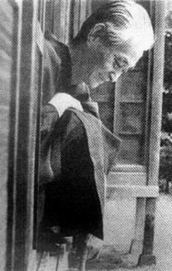
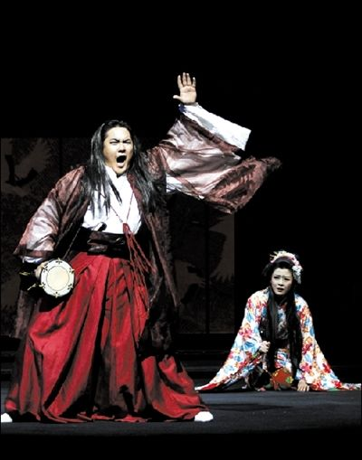
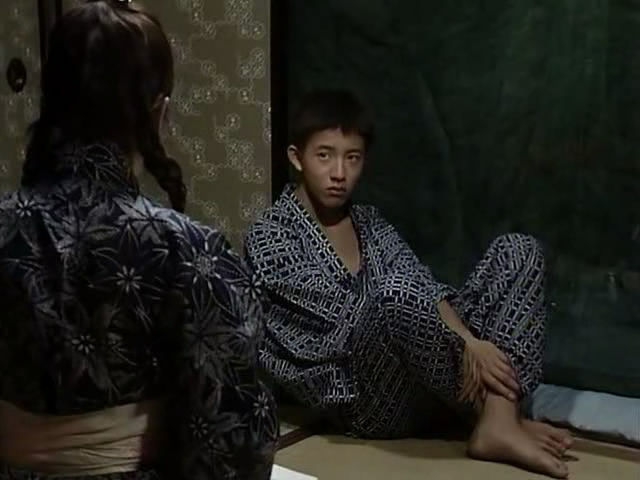
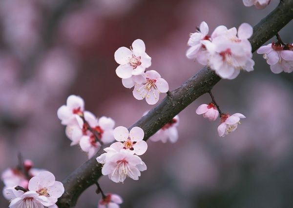

# ＜天璇＞恰似樱花飘零的感伤

**“物哀”的文学精神从日本平安朝时期的《源氏物语》便生发滥觞，到川端康成之时便生成其文学形态之内核。川端在《日本美之展现》中提及：“平安朝的风雅、物哀成为日本美的传统”，而在《不灭之美》中又说：“悲哀这个词在日语中和美是相通的。”这种特殊的“哀”，主要体现为对美好淳朴而弱势的事物的同情与爱怜之情，在川端文学中则明显地显现为对女性的爱悯之情。**  

# 恰似樱花飘零的感伤

# ——谈谈川端康成文学与日本“物哀”情结

## 文/黄帅（山东师范大学）

 

当海棠花未眠时的温柔拂过子夜的暖风，当幽谷秋色攀爬上茫茫苍岭的险巇，当伊豆茂密松林的斑驳清影从时光深处缓缓流出，当雪国上空的银河将满天星斗在我的心头倾倒……每至此刻，一个明媚而又感伤的身影便从我视域的边缘闪入，一个平静且又温婉的眼神随之飘入我的眼帘——这就是川端康成，这就是令我魂牵梦绕的川端康成的文学世界。

川端康成的文学作品中有着对西方文学技巧与思想的思考与探索，但最引人注意的还是他对日本传统文学风格的继承与创新。在日本传统文学精神中，有着幽玄的亘古之风，有着风雅的飘零思绪。但在川端文学中最为昭显的却是“物哀”的心理情结与文学传统。而这种别具一格的“物哀之美”恰如春末樱花凋零时节的感伤，仿佛一种根深蒂固的情结，深深地固结在每个热爱川端文学的读者心底。

“物哀”的文学精神从日本平安朝时期的《源氏物语》便生发滥觞，到川端康成之时便生成其文学形态之内核。川端在《日本美之展现》中提及：“平安朝的风雅、物哀成为日本美的传统”，而在《不灭之美》中又说：“悲哀这个词在日语中和美是相通的。”这种特殊的“哀”，主要体现为对美好淳朴而弱势的事物的同情与爱怜之情，在川端文学中则明显地显现为对女性的爱悯之情。从《伊豆的舞女》中清纯可爱的熏子，到《雪国》中驹子的美丽与哀愁，这种蕴含着对女性悲惨遭遇的同情、哀怜是贯穿其作品的主要风格。进一步说，这种“物哀”之美与日本民族心理是分不开的。因之，读川端的文字与思绪，总是离不开对孕诞这种特殊文学形态的日本民族的思考。

对于日本这个国家的历史与文化，我们的感情与思绪往往是复杂的。抛去恩怨情仇的纠葛，单是日本人对“残缺”“零落”之美的酷爱也足以令我们感到困惑不解了。

 **一、“物哀”情结的文化心理背景**

世界上不会有第二个民族会像日本人那样重视残缺之美。众所周知，大和民族对日本樱花的痴情不过是这种心理的浅层表现。传统日樱最清美之处在于其花蕊蕊心之雪白纯净，甚至它们雪白到了凄惨冷峻的情况。然而，当樱花在残风中翩然而落，当一地破碎的花瓣在镜水上斑驳而荡漾，绽放着、闪烁着日本人心底最为澄澈而真实的怜惜与哀愁。

这个多灾多难的岛国，像在大平洋的汹涌澎湃中随风飘荡的一叶孤舟，令人时常深感朝不保夕，生命无常。正是这种忽而便会有瞬息万变的独特生命体验，造就了日本民族中悲情而又坚韧的一面。面对生命的脆弱与无常，人们只能去讴歌此刻生活的欢愉，去赞美短暂生命的繁华与憔悴。这种天生的敏感思维与极度诗性的感性体验，使日本人借助文学与艺术获得了精神上的慰藉与释然。

一面是山崩地裂的自然威胁，一面是复杂冗长的献城礼与剖腹自尽的仪式；一面是海啸的怒号在天风的助长下发泄着淫威，一面是淡然宁和的插花小生活——日本人就在这样剧烈而纠结的矛盾间顺着生命的缝隙艰难存续着文化的火种，而在川端康成的文学世界中，这种有着丰富生命感悟基础的“物哀”之情则被发挥得淋漓尽致，尽显其文风里荡漾着的独到才情。

 **二、川端康成笔下的“物哀”之美。**

其一，清峻之美。在《伊豆的舞女》中，我们嗅不到浓墨重彩的香艳，我们听不到绚烂奔放的遥响，甚至触不到些许可以令我们感到刻骨铭心的亮丽字眼。在这幅清雅的小作中，涓涓流水映衬着川端那无法释怀的闲绪与清愁。当感情真挚深入到一种境界，渲染他的，往往不是纵情泼墨的畅快与绝美，却是一抹无法言说清楚的淡淡的风雅情思。

《伊豆的舞女》中的男主人公是一位20岁的社会地位高、受世人尊敬的东京一高的学生，女主人公则是社会地位低下、受到社会歧视、被认为是出卖肉体的—江湖舞女。这样反差极大的人物对比塑造，对表达作者的“物哀”情绪的效果是明显的。在小说俊秀的文字中，主人公当然也知道舞女的社会地位，知道和舞女同行可能会遭受人们的歧视与侮辱，但是他却无视这些，依然与她们一起旅行。在情窦初开的青涩时光中，每一点小小的感动或许都会拨动人最敏感的心弦。当男主人公渐渐对舞女熏子产生浅浅的爱意之时，恰恰也是两人分别的一刻。纯心爱一个人是幸福的，但是，又明知这种爱是不现实的，不可能的，这是何其痛苦，何其凄美!而在川端的笔下，这种痛苦并没有以一种剧烈的情绪而表达出来，而是借助意志力对思绪的压抑与克制，将这种不可名状的哀愁化作对一切简单而又转瞬即逝的美好事物的爱怜和惋惜。借助这种悲惋与清峻的笔调，“物哀”的美与意象从抽象的玄思化作形象的事物——显然，在社会偏见的巨大裂隙里，美丽年轻的女子，则是川端最为钟情的“物哀”对象了。

其二，冷艳之美。如果说以但丁、莎翁、歌德一脉贯成的传统西方文学昭显了一种浓烈雄阔的阳力之美的话，川端笔下的日本文学则是一种散发着清浅幽雅的阴性冷艳之美。这种“可远观而不可亵玩”的独特美学形态，时常令读者感到一种“只可意会不可言传”的美感体验。而这种冷艳的情感表现，在川端借助自然景象的推波助澜下愈发明显。

清冷俊秀的自然景象，温柔地飘逸在川端的文学图景里。在《伊豆的舞女》中，川端把这个美好的故事展现在如画的背景上：重叠的山峦、茂密的森林、深邃的幽谷、浓郁的秋色、纯净的碧空……而所有这些清新、美丽的景色又是同美好的人情交织在一起。川端还特别选择了“雨”这一大自然中最有传情因素的景物来渲染气氛，烘托人物情感。“雨”在小说中多次出现，这一东方文学的传统意象，被赋予了丰富的含义：主人公与舞女纯洁的情感正如雨滴般晶莹剔透；主人公对舞女的思念爱慕的朦胧正象雨雾的清寂缥缈；主人公对舞女的依依不舍又如细雨的连绵不绝……在这粘稠的笔触里，雨、人、情达到了水乳交融的状态。川端描写自然不单纯是用笔来描写，而是用心灵去描写，用真情去描写，用自己的全部精神去理解自然和领会自然，把写自然美同写人物美、人情美融合在一起，人与自然和谐地交织为一体。而这冷艳而不虚假的自然景象里的丰富感情，更是造就了川端无尽感伤而哀愁的风韵。

在东方文学的斑斓世界里，最浓情的思绪常常借助最清浅的文字来抒发。日本作家钤木彦次郎曾这样评价川端康成的文学风味：“是山间流出的清泉水，这是在清冽和新鲜中奔流向前的泉水，它也极大限度地包容了伴随着泉水流淌的浮想联翩的感觉。”这种川端康成独特的的文字表现方式，这种无法用刻板单调的语言来述说的“物哀”之美，恰似朵朵浴风飘零的残樱，在这个春末的遐想与梦幻中零落出令人痴狂的美丽与哀愁。我愿用最澄澈的心灵去捧一杯酝酿着无限爱怜的清泉，在“物哀”这深情的泉眼中诉说文学中最初的美学真谛……

（采编自投稿邮箱；责编：麦静）

 
