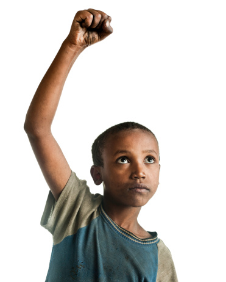

# ＜天璇＞想想因为是你，所以也就不计较了

**你从来不关灯，用完牙膏后不拧回盖子，睡觉踢被子。而那个握着你的手的人，会跟在你身后关灯，拧回牙膏盖子，温柔地替你在半夜盖好被子。因为那个人是你，所以就不计较了。你要去追逐梦想，提着两箱行李离开了那个人，而那个人却也不留你，愿意为你默默等候，愿意尝尽远距离恋爱的苦。因为那个人是你，所以就不计较了。又或许，是你分手的那个恋人，在经历了几年的恋爱之后，还能够道一声“谢谢你”。满满的回忆，最终是一场遗憾的未完成，有谁能够忍受这样撕心裂肺的痛。我不介意在你身上用尽的青春年华，我不介意那些年错过的其他人。不是真的不介意，而是因为那个人是你，所以就不计较了。**  

# 想想因为是你，所以也就不计较了

## 文/陈嘉倩（荷兰海牙大学）

 

这句话，多熟悉。

有时候，这句话是从口里直接说出来的，对着撒娇让你多花时间陪伴的女朋友，对着爱偷懒乱丢袜子的男朋友，对着交情好到可以穿一条裤子的好兄弟好姐妹。

有时候，这句话是从心底里默默念出来的，分明是件吃亏事，那些苦却还是吞回了肚子里。可以是为了穿进一条漂亮的裙子不惜饿肚子三天减肥；可以是为了请一个心仪已久的女孩出去吃一顿饭，却不得不在宿舍里吃一个月的泡面。

有时候，这句话是从未想过，只是一直去做，去做，再去做，从来不问为何，从来不去计较。那就是工薪阶层的父母拼命赚钱，以供家中唯一的孩子出国留学；那就是一个平凡人，为了家国的大梦在一片嘲笑和不好看中奋勇向前。

发出这个感慨，是从一次和个朋友搭巴士回家时想到的。

十月的巴塞罗那，是一年四季里下雨最多的月份。这座城市的阳光能有多灿烂，那么到了雨季，那雨就能有多滂沱。整座城市就像是被雨刷洗一遍似的，坐在巴士里面的我和那个女孩看着窗外倾盆大雨，庆幸能够以一种局外人身份看美景，而路上的行人却步履匆匆，有些索性躲到沿街的小酒吧里，喝着小酒等雨停。

巴士到了一个站台，车门打开了，大雨的尾巴就好似被“甩”进来似的，这时候人们才注意到其实巴士内部的地板也早已潮湿到打滑。一个女人，看起来挺年轻的，一头棕色的长发，典型的西班牙瘦小身材，浓眉大眼。吸引我们的，是她一旁一个看起来四五岁左右的胖男孩，身高大概到了女人的腰部。

女人一把就把男孩抱了起来，一只手拖住男孩，另一只手把早已撑开的伞举起。她和司机说了一声“再见”，就低着头看路小心翼翼地下车了。

在我一旁的十四岁女孩感慨道，这个妈妈看起来真年轻真时尚啊！

而我却惊叹着，那么胖的小男孩，即便是一个男人来抱，抱久了谁都会吃力，而且伞那么小一把，女人把大半的面积都给了男孩，她的头发在大雨中早已经湿透。

其实，这个女人看起来应该不比我大多少，也都二十出头。在这里的早婚现象和爱尔兰差不多，也比较普遍。但是，果真是为母则强，在这个还能够和自己父母撒娇的年纪，这个女孩却如此“悍然”。

不由的，我又想到了自己的母亲，小时候，母亲陪我去学英语学画画，上海的梅雨季像是自来水忘记了关龙头，倾盆的大雨导致路面积水，甚至到了我的膝盖上，母亲一直抱着我过了一条条的马路；长大了一点，倔强地不喜欢穿毛衣，和母亲争吵闹翻，第二天她还是在寒冷冬天的一清早起床，像没事一样给我做热腾腾的早饭；青少年时期，母亲用辛勤工作赚来的钱陪我去买衣服，自己却永远那么一两件衣服穿了十多年。

有时候，我甚至会想，当我面对自己孩子的时候，能同样拥有那么强有力的臂膀吗？为母则强，那么一向倔强任性的我，面对自己的孩子，可以像母亲那么宽容大度吗？

这样的宽容大度，不仅限于亲人之间，恋人之间也同样令人动容。

你从来不关灯，用完牙膏后不拧回盖子，睡觉踢被子。而那个握着你的手的人，会跟在你身后关灯，拧回牙膏盖子，温柔地替你在半夜盖好被子。因为那个人是你，所以就不计较了。

你要去追逐梦想，提着两箱行李离开了那个人，而那个人却也不留你，愿意为你默默等候，愿意尝尽远距离恋爱的苦。因为那个人是你，所以就不计较了。

又或许，是你分手的那个恋人，在经历了几年的恋爱之后，还能够道一声“谢谢你”。满满的回忆，最终是一场遗憾的未完成，有谁能够忍受这样撕心裂肺的痛。我不介意在你身上用尽的青春年华，我不介意那些年错过的其他人。不是真的不介意，而是因为那个人是你，所以就不计较了。

看着最近很红火的《那些年，我们一起追的女孩》。女孩说，你很幼稚！男孩回答，我就是因为幼稚，才追你追了那么多年。 其实他的心底话是，即使你说我幼稚，我也甘愿，我更甘愿让你成为我青春的见证人，甘愿你成为我最美丽岁月里的主角，甘愿为了你疯疯傻傻。换做别人，其实我才没有那么幼稚。因为是你，就不计较了。

现实的经济学家一语中的，在人的消费观念里，始终有两个帐本。一个是实际金额的账本，而另一本就是心理账本。对于大多数人而言，当弄丢了一千元的演唱会票子，往往不会再甘愿去补买另一张演唱会票；而弄丢的如果是一千元电话卡的时候，却还是会甘愿去补买演唱会的票。

正因为有这样的一个感情账本，人类啊，再聪明都愿意做出赔本的生意来，机关算尽，面对那个在乎的人，有时候是得失心全无的。

父母对子女付出的时候，得到的可能是一句冷冰冰的“烦死了”，却还是义无反顾地付出下去；恋人对另一半的付出，得到的可能是一句叫人失望的“你根本不关心我，看看别人多好”，却还是坚持做到自己的最好；朋友对朋友的付出，得到的可能是一句不耐烦的“别瞎掺和了”，却还是在一旁默默地关注对方。

最近有句话令人深思，父母供你出国留学的那些钱，足够他们两个人过上好的生活，周游整个世界了。

真有道理，用在其他事情上面，也令人感慨：父母供你现在买名牌包的钱，足够他们三个月不用挤公交地铁天天打车上班；女友照顾你生活起居的精力，足够她再多学一门语言或者打扮得漂漂亮亮和闺蜜出游；男友带你去高档餐厅约会一次，足够他一个月的生活费；朋友陪你疯陪你大哭大笑的时间，足够他解决自己手头的困难。

又到了一年的尾声，今年的你，过得好吗？

大自然的灾难，还是不断地在发生。

人为的灾祸，不得解释的无奈，又似乎早已不算无奈，被大家习以为常接受了。

人与人之间的热血或冷漠，随着新闻播报的角度，牵引着我们看待世界的方式。

公正，金钱，权利，这一系列词语背后，是一千声一万声的叹息。

是啊，我们为了那些城管小贩的猫鼠游戏哀叹，为了那些见死不救的路人哀叹，为了被抓走的艺术家哀叹，为了上访无门的老妇哀叹，为了大火烧死的无辜居民哀叹，为了挤在一辆小巴上几十双明亮的大眼睛哀叹，为了微博上那些流浪的小猫小狗哀叹。

哀叹过后，我们能做的，不过是继续过自己的小日子。无论这一年的你，是如何失望过，痛苦过，甚至绝望过，在这样的季节，去想一想，那些会对你说“想想因为是你，所以也就不计较了”的平凡人们，他们也和你一样，在这个令人哀叹的世界，度过了又一个这样的一年，过着他们温暖的小日子。

而你心里的那张“不计较”单子，也渐渐变得长了。甘愿付出，有时候并不因为什么“人间美好”或是“人类心底里的善”，只不过是发自你心底最温暖的两个字而已: 愿意。不计较后果，不在乎别人怎么想，不过是单纯的一颗心去做好一件事。

说到底，爱与被爱，是人最基本的幸福。

我常常想，其实有时候最硬的后台，恰恰不是拥有官商的背景，而是心底里这些不计较后果甘愿牺牲的小情感。正是这些小情感，最终成为了一股敢于挑战世界的力量，让一个平凡如你我的人走进那无边无际的大世界，用行动去让国家的哀叹转变成为一个巨大的微笑。

祝你，在新的一年拥有知足的快乐，也更拥有不计后果付出的那股勇气。

 

如有想法，可与作者交流。

微博： [http://weibo.com/mejiaqian](http://weibo.com/mejiaqian)

博客：[http://blog.sina.com.cn/mejiaqian](http://blog.sina.com.cn/mejiaqian)

 

（采编：何凌昊；责编：尹桑）

 
