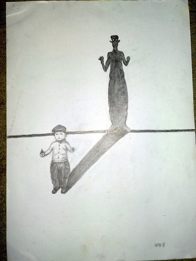

# ＜天璇＞感谢死亡

**我常常在黝黑的夜晚，从机舱里俯瞰下界的城市，文明的星光好似漂浮在虚无之上；在大海之滨，望着冉冉升起的朝阳，灼热的红光驾着浪花奔卷而来；在金秋十月，立于新英格兰众山之巅极目远眺，看万千的枝叶遮掩、衬托，幻化出千万种色彩。我感叹人类的璀璨文明、自然的美轮美奂、造化的鬼斧神工，却又忍不住唏嘘生命的朝生暮死、宇宙的变幻莫测、命运的反复无常。这几十亿年的宏伟历史里，我只不过是一个刹那间的存在，在属于自己的位置上，一凿一錾默默雕刻着时光。在这里，出现过而且还将出现许多需要我仰望的正直而优秀的灵魂，他们成就了而且还将成就许多我永远无法企及的事业。能够存在着，见证这样的伟大，我心满意足。**

# 

# 感谢死亡

## 文/吴争（Harvard University)

 

两点钟不到，太阳却已经斜的厉害，照得我疲惫不堪。我走在河边的小径上，有一只松鼠躺在路边。它侧着身体，前爪叠放在胸前，阳光下棕色的毛皮泛着光泽，尾巴上柔软的细毛随风簌簌的摆动。它的姿态很平静，很安详，如果不是它睁着的眼睛已然黯淡无光，我一定会以为它只是睡着了。生怕把它惊醒一样，我小心翼翼的碰了一下它的后爪，整个身体动了一下，已经僵硬了。我在路边也曾见过许许多多死去的松鼠，很多都丧命于飞驰的车轮之下，可是这一次，没有鲜血淋漓的身体，没有扭曲狰狞的面孔，它毫发无伤、干干净净。我想他大概只是累了，便听着潺潺的流水，沐浴着深秋午后的阳光，在路边沉沉睡去。这难道不是最好的归宿吗？活着便觅食繁衍，到了需要离开的时候，便从容躺下，与这个世界告别。总有那么一天，我也会像它一样长眠。我是多么的希望能够像它一样，离开得如此美好、平静而有尊严。

（一）

我终于不再年轻。整整二十四年，我一直生活在永恒的时间里，生命就像一口永不枯竭的泉水，从来都未曾明白泉水终会有流尽的那一天。就像周国平说的那样，当人终于意识到自己必将死去的时候，童年也就结束了。同大多数人一样，我对艺术或者娱乐里的死亡已经司空见惯，在现实的世界里也曾亲眼目睹过死亡，可是我从来都不会想象死亡发生在自己身上。就如同不停洗手的强迫症患者，明明看到手是干净的，可潜意识里却觉得不是，我总说生命是有限的，可是潜意识里我或许真的未曾相信过。记得孩提时代曾读过许许多多的童话故事，当王子和公主历尽艰险，终于过上了幸福生活的时候，故事一定会嘎然而止。安徒生和格林从来都没有告诉我，再英俊的王子，再美丽的公主，过着再幸福的生活，最终都会衰老、死去。可转念一想，这样的童话对于孩子们未免也太残酷了。好人是不能死、不会死的。

这一切都起因于两本书。那是两年前的冬天，无缘无故的借了本英文版的Meditations。文字很晦涩，我读得十分吃力，有的段落得来回看好多遍。Markus的议论上至信仰，下至美德，宇宙苍生无所不包，但是有一个主题从未离开过他的视线——死亡。培根后来评价说，“斯多葛学派那些哲学家为死亡的开价太高，而由于他们对死亡筹备过甚，遂使其显得更为可怕。”斯多葛学者们本来只是想告诉我们，万物变化无常，死亡乃是变化的一部分，人要做的只是欣然接受。可是培根也没有说错，我一开始还抱着七分阅读、三分把玩的态度，死亡只是一个事不关己的命题。但在Markus不厌其烦甚至絮絮叨叨的敲击之下，头脑中阻隔着死亡意识的屏障终于裂开了一道缝隙。

那一年的圣诞节，我拖着行李箱，怀里揣着这本书，跳上了一架回家的航班。长夜漫漫，客机孤零零的飞行在无边无际的黑夜里，脚下是浩瀚的太平洋，头顶是更加浩瀚的星空。客舱里坐得满满的，一盏盏昏黄的阅读灯下，映照出一张张陌生的面孔。我同这个世界彻底的隔绝开来。随手打开书，是这样一句话，“you should realize, that you are a creature that must die.”文字映入眼帘的那一刻，我忽然清清楚楚的看到了生命的终点。心顿时就凉透了，恐惧像血液一样在全身流淌，每一个毛孔都渗透着恐惧，前所未有的、让人绝望的恐惧。空气好像有了千斤的重量，压得我喘不过气来，我大汗淋漓。终于等到飞机降落，回家的喜悦总算暂时把恐惧掩盖起来。见到父母，聊了些以前从来都不会提起的话题，讲了些以前从来都不会说的肺腑之言。潜意识里，我或许已经醒悟，人生并没有多少“未来”和“以后”了。

从中国回来，生活返回原先的轨迹：简单朴素，波澜不惊。可是，当面对死亡的防线有了缺口，崩溃就再也无法避免了。常常在一个人独处的时候，脑海中冷不防又会跳出死亡的影子。渐渐的，恐惧不像第一次那么剧烈、突如其来，可是却变得愈加让人绝望。我就像一个癫痫病人，一次又一次的发病，越来越频繁，终于病入膏肓。又像踩入了泥潭，每走一步都陷在泥里，越陷越深，到底无法回头。

那个时候，正读到约翰 克里斯多夫最后的岁月，这个坚强刚毅的人，一辈子都在不屈不挠的斗争。他躺在病榻上，没有亲人和朋友的陪伴，只能一个人孤独的面对死亡。弥留之际，“圣者克里斯朵夫渡过了河，他在逆流中走了整整一夜，左肩上扛着一个娇弱而沉重的孩子……那些看着他出发的人都说他渡不过的……可是快要倒下来的克里斯朵夫终于到了彼岸。” 在经历了数不尽的悲欢离合，跟随了他跌宕起伏的一生之后，我好像也无法抗拒的融入了他的灵魂，几乎要同他一起死去。我深陷泥沼，没有从这最后一次发作中恢复，在死亡的阴影里彻底崩溃了。

那时正是春暖花开的日子。熬过了漫长的冬日，万物都贪婪的吮吸着阳光和雨露，争先恐后的盛放着每一寸活力。化学系外的那颗木兰又一次开满了洁白的花朵，人行道边盛放着金灿灿的花枝，自然历史博物馆前的那株高大的樱花树也一夜之前被粉色的花儿装扮。我躺在落英缤纷的草地里，望着这些生命年复一年的枯萎与绽放，沐浴着春天里最温暖和煦的阳光，心中却是刺骨的冰凉。每天从醒来到沉沉睡去，死亡总在脑海里挥之不去。我漫无目的的走在大街上，注视着一张张苍老或者稚嫩的脸庞，一个个严肃或是轻松的表情，看着人们乐此不疲的收集着生活中的点滴快乐，欣欣然规划着未来的每一个细节。那种自在的生活似曾相识，却又无比遥远了。读《世说新语》，纠缠着我的不是道德伦理人情世故，却是每个人物的注释中，圆括号里限定生死的两个数字。午夜时分，习惯性的拿起一本书的时候，脑海中浮现的却总是那个幽暗而深邃的夜晚，Charlotte正颤抖着对Werther说，“每当我在月光下漫步，我总会想起那些已故的亲友们。这时一股对死和未来的恐惧就会笼罩着我，它不停地向我袭来，仿佛在告诉我，我们一定都会死的。”

（二）

好在我只是忧郁，还没有消沉。幸运的是，尽管死亡是消除恐惧的最好方式，可是唯独对于死亡的恐惧，却无法用死来求得解脱。逃避无法给我任何出路，在死亡的胁迫下，我只好从先哲们那里寻找答案。

那时正读到苏格拉底临死之前的几篇著作：苏格拉底以“教唆青年”的罪名被起诉，他的申辩没有能够说服大多数的雅典公民，最后被判处死刑。Crito劝他逃离雅典，苏格拉底却说虽然审判的结果是不公正的，但是他作为雅典的公民，必须要遵守这个城邦的社会契约，服从判决才是正确的选择。于是，他与他的朋友们有了一次关于死亡的长谈。

在刚刚获知判决的时候，苏格拉底坦然的说，死其实不是一件坏事，它要么是场一夜无梦的睡眠，要么是灵魂去往另一个世界的旅行。但到行刑之前，他却抛弃了第一个可能，不再提起这场“甜美的睡眠”。他说死亡是灵魂对肉体的脱离，而人类是通过灵魂来认识真理的，死终于使人能够毫无羁绊的认识真理。这对于追求真理的哲学家来说，实在是一件让人欢喜的好事。真正的哲学家，始终都在试图脱离肉体的束缚，实际上一直都在练习死亡。接下来，苏格拉底便开始了那段极为著名的对概念和认识本质的阐释，他必须要证明，灵魂确实存在而且不随肉体毁灭。

我很羡慕苏格拉底对待死亡可以如此坦然。他回避了人的直觉和感触，把死亡看成了一件极其美好的事情。虽然我一直心怀对真理的渴望，但我终究无法像他那样，抱着欢欢喜喜的态度去面对死亡。内心深处，我总觉得苏格拉底对于死亡是无可奈何的。需要坦然面对的几乎都是不幸的事情，而真正美好的事情是不需要美化的。他在申辩时依然抱着对生的渴望，希望法庭只是处以罚款。而在喝下毒酒之前，他那洋洋洒洒对死亡的剖析几近诡辩。为了解释他为什么从未自杀，苏格拉底说这是天神的旨意，而现在上天给了他启示。他的时候到了，就得虔敬而欢喜的服从天神的安排。作为一个哲学家，他终于可以完全摆脱物质的欲念和肉体的制约，开开心心到天神那里去了。而对于其他人，他说，勇士之所以无畏死亡是因为惧怕更坏的事儿，节制欲望的人是为了得到更大的享乐，贪恋生命的人，放纵的死后会变成骡子，专横的变成鹰鸢，温顺的则变成蜜蜂。苏格拉底的死是如此美好，而他人的死却是如此不堪。他用他所认识的真理把自己送进了天堂，却把他人送进了地狱。这让我觉得特别遗憾。

或许苏格拉底也逃不出人类的宿命，也像所有人一样善于自我安慰吧。我们幻想可以在“有死”和“不死”间选择，我们告诉自己仅有一次的生命才弥足珍贵，刹那间的美丽即是永恒。而那些不朽的神灵们，其实都在嫉妒我们，因为永恒的时间毫无意义。于是，我们用值得骄傲的自由意志，义无反顾的选择了有死的生命，决然的放弃永恒。可是我们却忘记了，死亡终究不是我们可以选择的啊！

只有在读到了伊壁鸠鲁给美诺寇的信时，我才终于感觉到些许解脱。伊壁鸠鲁说，“你要习惯于相信死亡是一件和我们毫不相干的事，因为一切善恶吉凶都在感觉之中，而死亡不过是感觉的丧失，因为这个缘故，正确地认识到死亡与我们无干，便使我们对于人生有死这件事愉快起来，这种认识并不是给人生增加上无尽的时间，而是把我们从对于不死的渴望中解放了出来……所以一切恶中最可怕的——死亡——对于我们是无足轻重的，因为当我们存在时，死亡对于我们还没有来，而当我们死亡时，我们已经不在了。”伊壁鸠鲁醍醐灌顶般的讲明了这样一个原本很简单的道理，这样的论述或许永远都不可能被超越了。可是，他却依然无法打消我心中深藏的恐惧。

我想，我害怕的其实不是死亡，而是有终点的生命。

（三）

从两千年前遣出五百童男女寻找仙药的始皇帝，到服食“五石散”成风的魏晋南北朝士大夫，再到如今各种科学的或者“伪科学”的保健医药、生活指南，延长生命的渴望从出生之日起，就流淌在了人类的血液里。而这几百年来，依赖于现代医学对疾病的预防和治疗，人的平均寿命几乎增加了一倍。在攻克了一个又一个疾病之后，人类却依然在疲于应付接踵而来的新对手。在另一个更基本的战场——对衰老的认识上，人类的收获更少得无地自容。几十年来，我们发现的延缓衰老的最好办法是限制能量摄入。换句话说，人类所能代谢的能量似乎是一定的。这就像一个沙漏，要想沙漏走得长，就得让沙流得慢。且不说这流速可以调节的范围实际上微乎其微，这隔靴搔痒似的结论只是在失望的证明，人类对于时间，几乎一点儿办法都没有。

神经科学为延长生命甚至“永生”提供了一个可能的捷径。如果身体的衰老不可避免，只要能够把作为全部思想和意识源泉的脑保留下来，也不失为一种退而求其次的方法。可是就像其他任何器官一样，脑也逃不出衰老的命运。如果活得足够长，几乎所有的人最终都会罹患老年痴呆。而神经科学家对脑的认识又是如此幼稚，把人脑的信息转移到机器里，还只是天方夜谭。而更大的问题是，即使我们的全部思想获得了一个信息拷贝，获得永生的是我们自己，还是我们的拷贝？

我找不到答案，只好求助于他人，于是便听到了形形色色的应对死亡的方案。一位朋友在他的孩提时代，童话就已经幻灭，早早品尝到了死亡的威胁。他冥思苦想，最后决定在他死后，把自己放在液氮里，冷冻起来，等到有朝一日科技发展到了可以使人长生不死的时候，再把自己从“冬眠”里唤醒。

一个高二的学生，因为看到死亡而陷入了可怕的忧郁症，很长一段时间，他不得不依靠药物和心理医生。他把那时的生活都记录下来，写成了一本“死亡日记”。之后他终于康复，立志要从事生命科学，寻找永生的法宝。最后他会做成两颗长生不死之药，一颗给他自己，另一颗给他的爱人。

一个朋友是无神论者，对各种宗教和神秘主义都不屑一顾。谈及死亡，她会回忆起她的祖父即将离世时的情境。老人得了绝症，已经知道自己时日无多。他常常站在窗前，看着窗外的景色，嘴中喃喃的说，“你看这蓝天，多好啊，你看这树，多好啊……”当祖父离开人世的那一刻，她并不在他的身边，可是她总觉得，她察觉到了祖父的故世。这使她相信人死之时一定会发生些奇妙的事情，让她依然抱有希望。

另一个朋友是基督徒，在她跌入人生的谷底的时候，是上帝拯救了她，从此她成为了耶稣基督的追随者。尽管她对于天堂的存在深信不疑，可是死亡对于她，也依然是一个黑色的令人诅咒的话题。她说一想到死，依然觉得可怕。我追问原因，她却开始回避，只是劝我，不要再纠缠于这些生生死死的问题。

可是当一个人清醒的意识到死亡的时候，他就无法再回过头去了。就像那时的王二一样，死亡也成了我思考的主题。王小波说，“有一天我们都会死去，追求智慧的道路还会有人在走着。死掉以后的事我看不到，但在我活着的时候，想到这件事，心里就很高兴。”他后来又说，“当一切都‘开始了’以后，这世界上再没有什么可怕的事。我现在只是有点怕死。等死了以后就不怕了。”我大抵是没有他乐观。因为他已经死了，我还没有。

我还活着，所以我依然怕死。我渴望像其他人一样用希望来对抗恐惧，可是这些希望却又如此不堪一击，让我感到的只是无奈——理性在不可一世的死神面前是如此渺小无力，它支撑不起我们这些脆弱的灵魂。我开始相信，死亡的痛苦是无法治愈的了。

能有的大概就只是安慰了。翻看了无数衰老研究的文章之后，在一片综述的末尾，半页空白处的中央，我发现从来都一丝不苟的生命科学家们居然引用了学者S. I. Hayakawa的一句话，“It is not true that we have only one life to live; if we can read, we can live as many more lives and as many kinds of lives as we wish.”其实，这些睿智的言辞并不能改变什么，不论我们阅读多少，经历多少，都无法改变结局。面对自然的铁律，科学家们只能发现和接受。可是，当从来都以冰冷的逻辑示人的科学家袒露出柔软的心灵时，我在同样冰冷的死亡前面，感到了些许温暖。

（四）

那时出现了一个女孩，命运的机缘巧合让我们相识。她来自于一个遥远的、难于捉摸的世界，却是一个可以同我相互倾听、相互理解的人。我们经常通信，怀着欣喜和感激阅读对方的思想，沉醉在一个交织在真实和想象的空间里。我依然陷在死亡的阴影里不可自拔，可那时的爱情是如此的让人心醉神迷，想到我们中有一个必定要先离开，我便会感到一种更加不堪忍受的痛苦。我只好安慰自己：如果我先走，便可以幸福的死在她的怀里，如果我后离开，死亡便可以了无牵挂。反过来对她也是一样。我又幻想出一些极端的情景，需要面对生死的抉择——同她一起困在即将倒塌的危房，或者是掉进了湍急的漩涡，只有一个人可以活下来：要么是我，要么是她。我可以很真切的进入那种濒临死亡的时刻，然后问自己，“你愿意为她而死吗？”死亡给我的恐惧并没有少去分毫，可是爱的热情却给了我莫大的勇气。这不是对她和我人生价值的比较，而是我自己对爱和生命的衡量。爱取得了胜利。

一部电影中海明威这样说，“I believe that love that is true and real creates a respite from death. All cowardice comes from not loving, or not loving well, which is the same thing.”我开始意识到，要克服死亡的恐惧，就必须寻找比生命更加重要的东西。我已经找到过一件这样的东西，虽然又失去了，可是我知道它就在那儿。这让我很高兴。

死亡变成了最好的试金石——值得用生命去交换的，便值得争取，便是生命的目的。想明白了这一点之后，这个世界忽然变得清澈了，世间的一切开始分层。我已经在游戏、娱乐和寻找特价商品中耽搁了太久，从这一刻起，我必须要开始寻找生活最本质的东西。

对于金钱我一直过于吝啬了，过去曾有无数次用它来换取幸福的机会，都一一错过了，我追悔莫及。的确，金钱是人生在世最重要的手段。多少人包括我自己，都曾因为它而一筹莫展。但我知道，如果离开了一个确切的目的，财富没有任何价值。名在利先。每个人都扎根于这个社会，对承认和尊重的渴求深入骨髓。甚至“淡泊名利”也可以是一种名，更大更好的名。名变成了让人更加难以自拔的东西。可惜的是，在死亡面前，我看不到“名望”和“地位”有任何胜算。它们是一个无比鲜亮的衣壳，却又沉重而让人惴惴不安，它只是结果，不是目的。而总有一天，财富、地位、成就、功业，对它们的期待、占有和回忆，乃至承担这些的身体与灵魂，所有所有的一切，都将不复存在。既然一切都会归零，我既无所得，亦无所失。

我常常在黝黑的夜晚，从机舱里俯瞰下界的城市，文明的星光好似漂浮在虚无之上；在大海之滨，望着冉冉升起的朝阳，灼热的红光驾着浪花奔卷而来；在金秋十月，立于新英格兰众山之巅极目远眺，看万千的枝叶遮掩、衬托，幻化出千万种色彩。我感叹人类的璀璨文明、自然的美轮美奂、造化的鬼斧神工，却又忍不住唏嘘生命的朝生暮死、宇宙的变幻莫测、命运的反复无常。这几十亿年的宏伟历史里，我只不过是一个刹那间的存在，在属于自己的位置上，一凿一錾默默雕刻着时光。在这里，出现过而且还将出现许多需要我仰望的正直而优秀的灵魂，他们成就了而且还将成就许多我永远无法企及的事业。能够存在着，见证这样的伟大，我心满意足。

知识对我有了完全不同的意义，我热切的渴望了解永恒。日常的生活、琐事和各种新闻耗去了我太多的精力，我一直都把注意力放在了那些转瞬即逝的东西上，从未有机会认真检视过人类文明沉淀下来的精华。经过无数世代的生存繁衍，存在过的绝大多数人和发生过的绝大多数事，已经被时间洗刷的一干二净。而流传下来的最后果实，只是知识和洞见。这些不合时宜的东西，就像一条条古老的河流，从遥远的过去走来，静静穿过喧闹的当下，继续向未来流淌。当一个个肉体凡胎百年之时，它们却保有着旺盛的生命力，在存在了几百年、上千年之后，他们还会继续存在下去。于是，我更加努力的读书和求知。有一个发自肺腑的声音告诉我，这些依然生活着的遗产有多么珍贵，而作出哪怕是一点点经得起考验的发现又是多么的艰难！

我更加坦然的面对生活，不再费尽心思揣摩每一件事的后果，也不想再掩饰自己的无知和懦弱，不会再因为害羞而不敢开口，也不会再计较自己的言辞是肤浅还是深刻。生活中常常遇到的各种痛苦和挫折，却因为死亡这个更大的痛苦而变得微不足道。我忽然发现，原来我还可以这样贪婪的生活，可以这样开怀的笑、撕心裂肺的哭，这样旁若无人的歌唱、忘乎所以的旅行。而死亡这个永远挥之不去的阴影，反而成了一个取之不尽的宝藏，赋予着我无尽的勇气和热情，让我毫无保留的生活。

我开始对这个令人憎恶的死亡心存感激。我在想，对于今生今世孔夫子有着无穷无尽的智慧，可是对于死亡他或许真的弄错了。未知死，焉知生。

（五）

或许是因为从小在水边长大，水成了我生命的一部分。出家门往南，经过一个破败的市场，穿过一个喧乱的小巷，翻过荆江大堤，眼前便是一望无际的江水。我曾千百回来到这条河流身边，爬上传送带垒出来的几十米高的沙山石山，跃过河岸和船舶间一排排瘦瘦长长的跳板，细数江面上的一艘艘若隐若现的轮船，又或者只是呆呆的看着江水卷着泥沙潮起潮落、奔流不息。记忆中，时常会浮现出那个稚气未脱的小男孩，不知疲倦的蹲在岸边捡石头。因为贪玩儿蹲得太久，脖子酸了，腿也麻了。好不容易直起身，抬头使劲眺望通往天际的长江，总是很好奇江的那一边究竟是什么。后来长大了，才慢慢知道，长江流到了这里，中间冲出了个沙洲，灰黄的沙洲和浑黄的江水混在一起，分不清哪里是水，哪里是岸。直到现在，我都不曾清楚的知道江的对岸是什么样子。我对长江是如此的熟悉，甚至能数出她的每一个漩涡、每一朵浪花，可是那若明若晦的对岸让我永远都无法窥视她的全貌。亲切而又神秘的，就是故乡吧。

之后我便顺流而下，一路东行。先到武汉，再到上海，来到大洋彼岸的剑桥小镇。查尔斯河静静穿过这个城市，在汇入大西洋之前，被一个小小的水闸挡住，蓄出一个偌大的人工湖。湖上散落着三三两两的帆船和赛艇，仙鹤和野鸭旁若无人的戏水觅食。如镜的水面上，倒映着白云、飞鸟，还有这整座城市。远处一架航班优雅地划过天空，留下一条细细的尾迹。对于我们这些浪迹天涯的人，飞行和回家这两个概念，已经千丝万缕的缠绕在一起了。

可是回家，也就意味着再一次离开。“到达”和“出发”时的浦东机场，同样的建筑，对我来说却是两个绝然不同的存在。它同时意味着相逢和别离、期待与失落、欢笑和泪水。过去我总以为航站楼修得过于巨大空旷了，后来我才明白，只有这样，它才能包容如此复杂而厚重的感情。我还记得第一次去美国，父母不远千里把我一直送到机场，出租车司机对这种“溺爱”嗤之以鼻。可是我的父母喜欢送我，从家里送到武汉，从武汉送到上海。如果可以，他们会把我一直送到美国。但是机场“亲友止步”的标志让他们终有一别。送得再远，也只能到这儿。从此之后，他们必须停步，而我必须离开。告别的时候，父亲永远沉默，母亲跟我都强装笑脸，漫不经心的说些无关痛痒的事情，虽然嘴上不说，但是感觉得到，母亲总希望我能再多呆一会儿。到了最后不得不走了，我都要深吸一口气，下定决心转身就走，从来都不敢回头。我感觉得到身后父亲落寞的眼神，母亲泛红的眼圈，我无法回头。

从来都不敢想像，没有我在身边，他们会怎样孤独。

我开始越发感到时间的重量，父母不会永远在那里等着。不知道经过多少次聚散之后，会有那最后一别。又想起十四岁那年，第一次离开家与父母告别的情景。那是高一之前的暑假，都还没有开学，但我们班提前开课。爸妈把我送到学校，一切安顿好了，吃了午饭，送我回寝室，一行人走过空荡荡的校园，都不敢大声讲话。到了房间，母亲给我打湿了一条毛巾，让我擦了擦脸，说“要不你休息一会吧”。等我躺下，她环顾了一下房间，还拿着那条毛巾，有点手足无措说，“那我们就走了？”我说好。母亲便把毛巾搭在床头的细绳上，悠过身，又四下里打量了一遍，引着一直坐在对面床头一言不发的父亲，慢慢的出去了。我听到门轻轻的咯噔一下关上，眼泪就落在了枕头上。

可是，那个稚气而又倔强的孩童，终于是要长大。即便有再多不舍，我还是走了，父母让我走了。而这一走，就是一个轮回。这十二年间，一次次东行，渐行渐远，一次次离别，别易见难，终于天各一方。他们知道我可能不会归去，他们知道可能等不到我归去。我的生命是他们赐予的，可是，在我出生之日，他们或许就已经明白，我已经与他们分离。一个人呱呱落地之时，他获得了生命，也获得了自由。而呵护着这份生命和自由的，是爱。

（六）

我又像往常一样，来到河边。查尔斯河悄然流淌，默默注视着在她身边觅食的一对鸳鸯。褐色的灰不溜秋的雌鸟正扎在草丛里，全神贯注的寻找食物，长着蓝绿色羽毛，鲜艳夺目的雄鸟守候一旁。他静静的站在那里，望着雌鸟，骄傲而又安详，仿佛把这整个世界都据为己有。

记忆顿时像河水一样流淌。我不禁回忆起太湖边大雨滂沱的骑行，深冬的居庸关上干涩而冷峻的寒风，回忆起厦大南门白沙滩上那个纯净得不可思议的天空，黄金海岸去往布里斯本路上灼得我隐隐作痛的炙热阳光，回忆起佛罗里达海角上那片朦胧而纷飞的彩霞，洛克菲勒中心前那场水泄不通的狂欢，还有最无法忘怀的那个初秋，在Larz Anderson桥上清洌的晚风里两颗颤动的心灵。

快三年了，我匆匆走在校园和街巷，穿行于熙熙攘攘的人群里，偶尔还是会撞见过去的影子。一次次驻足于时间的驿站里，黯然神伤，一次次在梦里哭泣，凄恻断肠。我在这里待得太久了，一草一木，一花一树都沾上了记忆的油墨。过去和现在，梦境和现实，都混淆起来。失去的变成了最珍贵的，而幻想又把记忆涂抹成了我希望的样子，我需要的只是遗忘。可是，刻意搜寻的记忆或许才是需要忘记的，需要努力忘却的却难于抹去。记忆之于心灵，就如同铭文之于石碑，失去了记忆的心灵便一无所有。只有等待时间的尘土，把石碑轻轻覆盖、掩埋，一秒一分，一日一年——而后，死亡自会不露声色的将一切湮灭、不留尘埃。

就像生命无法挽回一样，离别也是无法挽留的，这一切的因缘皆已在事情发生之时种下，承受的只能是自己。既然要走，那就走吧。一厢情愿的感情，永远都不可能成为爱情，只是它太容易受到邪恶的希望女神的蛊惑，不愿放弃对一种理论上的可能性的贪婪期许。可是，当这种期许也终于成为了另一个人负担的时候，这意味着我必须放弃希望，同样决绝的离开。这荒谬的意味着，如果我还爱她，或者不爱她，我都必须像这一切从未发生过一样，重新开始生活。于是，这个看似自相矛盾的结论却从逻辑上再一次证明了，爱情的终点，其实是自由，与其相濡以沫，不如相忘于江湖。

（七）

我离开河边，从Cambridgeport Baptist Church高大的红色尖塔下慢慢经过。教堂的一块告示牌提醒着尘世的人们，“Life is uncertain, Death is sure, Sin is the cause, Christ is the cure”。因为那个人，我对基督教有一种极其复杂的感情。

耶稣基督和他的门徒给过我许多启示。一部厚厚的圣经，装载着十几个世纪的宗教和道德基石，同它所蕴含的无数情感和戒律一样，它传授给我无穷无尽的智慧。在过去的几千年里，圣经甚至是许多人们曾经阅读过的唯一书籍。虽然它依然充斥着仇恨、嫉妒、报复和狭隘，可是这不妨碍它唤醒着每个人心中最高尚的情感，让我们直面内心的罪恶和卑微，努力让生活充满理解、宽容和爱。

Thomas à Kempis，这位在修道院里平静的生活了七十年的老修士，没有见过世面，没有像我们这样一天一个城市的满世界旅行。他在Mount St. Agnes修道院只是阅读、写作、抄撰文稿，可是他却著成了一部如此酣畅充满宗教热忱的The Imitation of Christ，全篇充满着对内心世界的深切关照和对人性的细致入微的反省。他说，“Rest from inordinate desire of knowledge, for therein is found much distraction and deceit. Those who have knowledge desire to appear learned, and to be called wise.”那时的教徒对知识抱着保留的态度，认为它会伤害对神的虔敬。但他对于动机的拷问，却并不妨碍他激励着我，反思对于求知乃至其他一切欲望的态度——物质的、精神的、世俗的、崇高的。我问自己，我对知识的渴望，究竟是为了寻找真理，快乐，还是名利？为什么“深刻”、“博爱”、“正直”和“高尚”这些词语对我有着难以抗拒的吸引力？

我渐渐明白，浅薄、狭隘、卑微和虚伪其实从来都不曾离开过我。我一直与它们苦苦周旋，通过嘲笑自己的浅薄来换得深刻，袒露狭隘来求得宽容，撕破卑微来赢得高尚，承认虚伪来获得真诚。我不知道对知识的追求，究竟是出于内心纯粹的渴望，还是出于对他人认可的贪婪。我不知道我追求的究竟是真善美本身，还是它们所带来的荣耀。而让我更加困惑和忧虑的是，无论我如何努力反思、“一日三省吾身”，可是一层批判却常常带来更深一层的自我安慰和肯定，我开始怀疑，人究竟能否彻底的怀疑自己。

无论是旧约里那个咆哮而易怒的白胡子爷爷，还是新约里那个被折磨得“死去活来”的慈爱的年轻人，都让我感到异常亲切。可是，我即使竭尽所能，也无法接受他的存在。我没有办法否定他的真实性，只能坚持他是可以被质疑的，而就这一点，就完全颠覆了对神的信仰。我常常会想，如果世间的一切都是神的创造，为什么还会有善恶美丑的划分；如果全能的神深爱着世人，为什么又会用惨绝人寰的灾难把他们埋葬；这理应纯洁的信仰，为何会屡屡被人类的罪恶和贪婪附体，动辄尸横遍野血流漂杵。我会想如果没有永生的允诺，善男信女们是否还会如此虔敬；如果没有了教友们的温暖和暗示，如果这个世界上只剩下最后一个基督徒，他会不会同我一样孤独。

我恐怕永远都不能体会基督徒的情感了吧！他们选择了相信，于是便得救，而我却在去往怀疑的地狱上一意孤行。可是，即使怀疑我却也无法彻底。就像笛卡尔所说，与怀疑相比，认识是一种更大的完满，怀疑本应只是通往未知世界的道路。我会问自己，找到一个确切的真理是否可能；一种认识的价值是不是也应当取决于它带来的关怀和慰籍；在对永恒家园的期盼中飘泊，是否一定好过在临时的避难所安身。又想起迷失在确定性里，备受百般煎熬的托克维尔，在他那里，怀疑是比死亡和疾病更糟糕的恶。面对深不可测的黑色的死亡，同他一样，我也多么需要一个坚实的地面。我一直困惑，在挥舞着怀疑的大棒，毁灭了所有道路之后，我们究竟在哪里安身。我一直困惑，我们追求的究竟是永恒，还是当下。我一直困惑，我们所追求的到底是真理，还是幸福。

（八）

夕阳西下，高悬的校旗在晚风中轻轻飘扬。一缕金色的阳光洒在John Harvard的坐像上，那只光滑的左脚越发显出青铜的光泽。哈佛的老校园里静悄悄的，几个背着书包的学生行色匆匆，只有那些歌唱的鸟儿和不知疲倦的松鼠是这里的主人。默默安坐的John Harvard塑像，不知道了目睹了多少莘莘学子的来来往往。经历了无数次喧嚣和寂静、尊崇和羞辱的铜像，就这样安然坐着。一场场风霜雨雪，一季季春夏秋冬，转眼就过去了几百年。

顺着铜像的目光，穿过Johnston Gate，我来到一片小小的墓地。包括第一任校长Henry Dunster在内，八位哈佛校长安息于此。追溯历史，这片墓地甚至比它身边的著名学府更为久远，以至于人们不得不用古老来为这墓地命名。在剑桥建市之初，人们就已经为死亡留出了位置。而几百年来，哈佛敞开大门面对的，竟然是一片埋骨之所。我总觉得这样的安排，冥冥之中预示着什么。

我推开园门，踏入墓地。这里是城市的终点，尘世的界线。看着这些同我们曾经一模一样的人们如今在地底长眠，斑驳而冰凉的大理石碑见证着他们的存在。而他们中的绝大多数，经过时间的无情冲刷，只剩下了名字和生卒年月，有些人甚至连名字都已经无从辨认。墓地的围栏外，穿流的路人对里面的世界置若罔闻。一侧是生命，一侧是死亡；一侧是当下，一侧是过往；一侧是存在，一侧是遗忘。我忽然意识到，我闯入了一个还并不招纳我的地方，顿时头晕目眩。

我慢慢的在墓碑之间的草地上走着，时不时俯下身，细细辨认着穿越了几百年的碑文，读到这样的诗句：

“Behold and See! As you pass by

As you are now, so once was I

As I am now so ye shall be

Prepare for Death and follow me”

总有一天，我们都会尾随他们而去，被安葬、被纪念、随后就被遗忘。经过了一个短暂的存在，我们从虚无复归虚无，就像什么都没有发生过一样。望着这些无名无姓的生命，我的内心忽然涌起一股难以言表的悲痛，为亡者，也为生者，为他人，也为自己。我们这些如同蝼蚁一般的生命啊！人生对于我们，究竟意味着什么？

史铁生走了，那个坐着轮椅在地坛里转悠了十五年，无数次期待着死亡、思索着死亡，“职业”生病的“业余”作家，在2010年的最后一天，终于应约而去了。我并没有读过他的太多著作，可是我好像失去了一个可以并肩面对死亡的挚友，生活又多了一分孤单。我尊敬他，不只是因为他的真诚，因为他面对死亡的坦然，更是因为他始终为大多数人思考，因为他能够理解一个人的生命简直轻的无法承担。

我始终记得他对于智慧和悟性的拷问，对于一切不幸命运的救赎之路的追寻。我始终记得他那句震聋发聩的“我常以为是丑女造就了美人。我常以为是愚氓举出了智者。我常以为是懦夫衬照了英雄。我常以为是众生度化了佛祖。”

命运是不公正的，它赋予每个人的智慧、容貌、财富和地位有着天壤之别。一些人缔造了他们的时代，另一些装点了他们的时代，而其他大多数人，只是他们的时代的路人。他们既无大智大勇，也非大奸大恶，碰不到大是大非的抉择，终其一生都只能默默无闻，每日为衣食住行、柴米油盐奔波，他们的目的是什么？他们的人生究竟有何种意义？我想，人生最后大抵都是公平的吧。命运赋予了每一个人真挚和深切的情感，赋予了他们感知人类原始情感的全部能力。他们不能拓展知识的疆域，无法成就伟大的事业，也无力改变他们的时代。但是，他们可以幸福。这种幸福，可以从最普通的物质欲望、最寻常的儿女私情中达成。这是最普通、可又是最珍贵的幸福。

于是，我终于意识到，当“崇高”的理想落到尘世，也只不过是为了让爸妈看得起病，给村里修一个能冲水的厕所，或者为了让工资能够再涨一百块，为了让他可以公开的多发几句牢骚。无数的理想主义者们历经千辛万苦，甚至付出鲜血和生命，也不过是为了让更多的人能够满足他们的点滴乐趣，让更多的人能够专注于他们手头的事情。当崇高的理想被世俗拉回地面，当伟大的事业被琐碎拖入尘世，我忽然觉得有一些失落，可是仔细想想，又觉得理所当然。如果“高贵”和“博爱”并不认同和尊重普通人的欲望和情感，那么这种爱就不可能实现。平庸衬照了伟大，更孕育了伟大。当个体生命不再只属于他自己，而与其他千千万万个生命连通时，生命便有了重量。当亿万个最寻常的快乐汇聚起来，卑微就成长为崇高，尘芥就化成了天下。

可是，不论我愿不愿意，我看到了接连的矿难、追尾的动车、垮塌的学校、失事的校车，我一次又一次看到这些最普通最珍贵的幸福也在被蚕食，我看到他们一点一点丧失追求幸福的权利。面对他们，我再也无法背过身去，心安理得的生活了。我是他们中的一员，帮助他们，正如帮助自己。因为他们懦弱，而我也不够坚强。因为他们卑微，而我也并不高尚。因为他们没有尊严，而我也倍受屈辱。

我哀其不幸，可是却不能怒其不争。如果有人宁愿放弃自由和权利而去追求生活的温饱，愿意放弃明天的期许和可能而选择当下的稳妥和安宁，我尊重这样的选择，因为我相信温饱、稳妥和安宁也是他们的权利，我尊重他们选择的权利。而我也无法保证，在饥寒交迫、居无定所，或者受到各种特别对待，蜷在一个只有六块瓷砖的房间里的时候，我还可以顽强的坚持自己的理想。我只是希望，每一个人能够意识到这种选择，而这种选择也决定了我们应得一个怎样的社会。我只是希望，当一个人意识到需要改变的时候，他能够少一点沉默，少一点袖手旁观。在我看来，并不存在知与行的确切划分，每一个人的行为都完完全全取决于思想，“身不由己”其实只是不欲作为。我总以为，一个能够望尽天涯路的人，绝不会是犬儒主义者。我总以为知识不仅能带来智慧，更带来勇气。我总以为，知者无畏。

站在查尔斯河北岸，我望着脚下不知疲倦的流水，心想自己有一天，也将同这条河流一起，汇入大海。只是在这之前，我还有一些不得不做的事情。现实在此岸，理想在彼岸。一些先驱者们，已经举着火炬早早的渡过河去，责怪我们“为什么还不过来”。可是更多的人，自觉或者不自觉，依然却步于这琢磨不定的河水，没有做好渡河的准备。我只能掉过头来，或搀或扶，牵着他们的手，引着他们自己过河。我并不着急，因为我相信这是一件不朽的事业。我会一直忍受踏上坚实的岸边的诱惑，一直向雾霭中的彼岸挥手。即使我必须忍受先驱们的责备，但我依然心存感激，因为他们确定了我前进的方向。

暮色西沉，夜色把最后一抹晚霞掳走，将世间的一切都笼罩起来。三年来，我一直会沿着河岸奔跑。在推开死亡黑色的大门之后，我是再也无法回到那个光明的世界里去了。可是，我终于可以放下自己那无法承受的生命，怀着对死亡的惴惴不安的恐惧和感激，在黑夜里继续奔跑。

谨以此文献给陪伴过我生命的亲人、朋友和爱人。

（采编：何凌昊 责编：尹桑）

 
