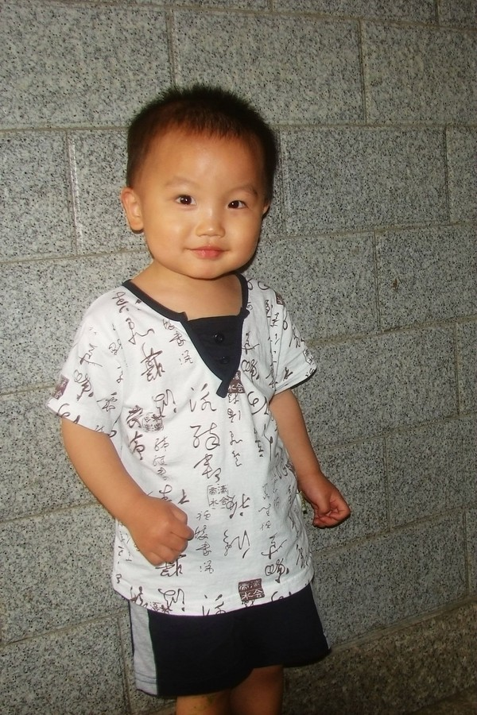

# ＜天璇＞我们到底还应该相信童话么？

**在应该相信童话的年龄里，坚定不移的认定世界上有圣诞老人，过了这个年龄，就得接受所谓生命的礼物都是需要我们自己踏实奋斗过来的。在恰当的年龄做着最恰当的事，就像在最恰当的年龄，爱上一个正当龄的人，多好，不过如此。我们曾经相信过童话，这就够了，即使后来发现那些是谎言，但是枕边故事的魔力也没有因为谎言而消退一分啊。**  

# 我们到底还应该相信童话么？

## 文/ 朱一一（华中科技大学）

 

那天看完哈七，和朋友坐在电影院门前的台阶上就剧情谈了许多，自然而然的延伸到各自开始阅读哈利的时光，很惊奇的发现，貌似这本书的开端总是关联着一个年少时的形影不离的玩伴，或者某个偷偷暗恋很久的愣头小子。我们追忆了许多，比如最先看的哪一部，或者当年晚上躲在被窝里看书后来被父母发现，上课时偷偷的把书放在课桌底下搁在腿上，同桌就是最好的作案伙伴，诸如此类。就是一部电影，一套小说，让两个并不是十分亲密的女生聊了很久很久。我们都很庆幸，在少年时代遇上了哈利和他的朋友们，当我们在岁月中悄然拔节的时候，他们也和我们一样同时生长，像一直陪在身边的伙伴，彼此的生活貌似可以出现神奇的代入。当然，过了相信童话的年龄，我们都知道，那些只发生在奇妙的想象之中，我们安慰自己，也许在我们11岁的那年，都收到了来自霍格沃茨的通知书，只是属于我们的猫头鹰迷失了方向。

是的，长到这么大，自然也就过了相信童话的年龄，看着那些小孩成天喊着不存在的英雄偶像，我们也会不甘心的回想曾经天真浪漫的时光，在很久很久以前，白雪公主啊，睡美人之类的是真的，说了谎话会长长鼻子是真的，掉下来的牙齿放在枕头底下就会见到牙仙也是真的，那些在童话世界中出现的全部是真的。那个时候的我们纯真的一塌糊涂，大人随便编个谎话就可以把我们足足吓上十天半个月的，因为相信，我们都成为谎言的受益者，至少在那个时候我们坚信在这个世界上，邪不压正，再可怜的公主都会等到白马王子，恶毒的后妈皇后一定会得到报应。而现在，我们离“相信”越来越远，口头禅变成了，我再也不相信爱情了，甚至，连小时候觉得不可能出错的新闻联播，到现在都不能相信了。即使是在看让我心驰神往的哈利波特的时候，我都明白再也不会出现小时候那种坚信一定是自己家的扫帚不好，不然一定骑上去就可以飞的情形了。

我记得那天和朋友畅谈哈利波特的时候，她拿了皮皮鲁和鲁西西来对比，在她的观点里，这些故事在JK罗琳的故事架构面前显得太过幼稚，听她将这些的时候，我突然就想起来了，也就是郑渊洁让我有了对童话最死心塌地的一次信任。那还是很小的时候，院子里的一个姐姐有一天神秘兮兮的跟我说，你知道么，只要你盯着一个东西看，然后一分钟什么都不想，你就可以到另外一个世界去。那个世界在那个姐姐的描述中有着少年儿童最瑰丽的梦想，类似于吃不完的美食，不用上学，有超能力之类的各种当时的我们最可望而不可及的东西。为此，我上百次的做了同样一件事情——盯着我手中的铅笔强制性的什么都不想，屡败屡试，那个时候最懊悔的就是出现，好不容易十几秒脑海里真的一片空白，结果马上就会问自己一句，我是不是什么都没想？于是实验就这样功亏一篑，对不争气的自己充满了怨恨。很多年过去之后，虽然我不再相信另外一个世界这种童话，但的确从那么多失败的经验提升到一个有关很有哲理的道理，正如那种空虚的安慰人的道理一样，不要强迫自己一定要忘掉，因为你强调的时候，就是在不断记起，有些事情，就在念念不忘的过程中，被遗忘了，但有些事情，却总是忘不掉。

比如，有关儿时枕边童话的回忆。躺在爸爸的肩窝里，床边洒满暖暖的黄色灯光，爸爸捧着三只小猪的绘本，缓缓的讲，很久很久以前，猪妈妈有三个孩子，老大，老二，老三。后来，绘本变成了365夜童话，格林童话，一千零一夜的故事，渐渐地，在我学会识文断字之后，爸爸只会在我睡着之后，放好散在床头的故事书，替我紧紧被子，关掉床头灯然后离去，爸爸臂弯里的故事，伴我成长，后来的那些故事，也见证着我的成长。我想，不管时代怎么改变，科技怎么进步，枕边童话这种维系两代人情感和传承的东西，永远都不会过时吧。小孩子的要求虽然繁琐，但是枕边童话是他们绝对不能被剥夺的权利。

长大后我们总是抱怨生活的艰难，觉得现实不如小时候听得故事那么美好，有首歌里唱，你哭着对我说，童话里都是骗人的。有什么值得哭泣的呢？在应该相信童话的年龄里，坚定不移的认定世界上有圣诞老人，过了这个年龄，就得接受所谓生命的礼物都是需要我们自己踏实奋斗过来的。在恰当的年龄做着最恰当的事，就像在最恰当的年龄，爱上一个正当龄的人，多好，不过如此。我们曾经相信过童话，这就够了，即使后来发现那些是谎言，但是枕边故事的魔力也没有因为谎言而消退一分啊。

够了，童话是留给小孩子，把现实以最直接最残忍的方式丢到我们面前，总好过成年人活在新闻联播这样的童话世界里吧，生命有什么值的抱怨的呢，活下去就好。

 

（采编：陈锴；责编：陈锴）

 
