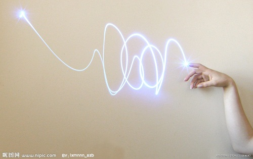

# ＜天璇＞我们去哪儿

**我想，我就是一个打前期的人，等时机到了，我就辞职，找个小地方开始我说的路，我不知道每个人的路，也不愿意去干涉评价，但请不要让我，闭着眼睛都知道你要走哪条路，因为那看起来唯一的路，浩浩汤汤，像是一个时代慷慨赴死的死士族群，我怕再次相遇，我认不出你的脸。**  

# 我们去哪儿

## 文/杨笛（华中科技大学）

 

前天和同事一起去和一个老总谈合作的项目，完事闲聊间老总谈起了他的经历，同济医学院医科专业出身，22岁创业，如今32了，在业界也是数一数二的大老板。随后晚上和同事去打dota，他一根接一根的抽烟，整个晚上不在状态，我问他怎么了，他把烟狠狠一掐：“我27了，还在打dota.”我一时沉默，不知道说什么好。

是的，我不知道说什么好，我一直隐隐觉得有什么不对，但是我找不到缺口，这回，他的话让我找到了。

大概半年前，我在大学，每个月的生活费是1000元，400吃饭，600买书和玩，生活一点不拘谨，有吃有喝自得其乐。

半年后，我在长沙，每个月交了房贷以后手头活钱有3000,400吃饭，2600买书买电脑买爱疯陪朋友看电影逛街，钱总是不够用了，我觉得冰火两重天，下面有还在读研考研为梦想奋战的同学上有工资高的吓死人的同事朋友，有朋友当了公务员，工作还算清闲，年薪十万，可是他很憋屈，很不服，因为有的人已经买了房买了车，所以一点都不快乐。

而我的聊天也越来越直接，有朋友去了广州谋职，我的第一个问题便是待遇如何，3年后如何，或者有个同学进入了大型企业，收入不高，但是人脉很广，我也听得两眼放光，仿佛这都是自己派出去的多重影分身，他们试验了各种可能性，最后把资料和情报在我这里汇总，而汇总用来干嘛？答案是未知，可能也就是自我安慰吧。

正如同人人博客上天天散步的各种职场治愈帖，有的拿自己的成功案例举例只要努力三年五年内自己能达到多少收入多少房车，我们摩拳擦掌跃跃欲试，有的则反向举例说只要活得开心做自己就好，然后贴自己各地各国旅游图，举例多少努力精英艰苦奋斗猝死案头，乔布斯多么耀眼却得了癌症驾鹤西去，我们默默可惜同时也窃窃自喜，自己虽然没钱但是有命，看完觉得怎么活都是有道理啊，然后回到几十平米的小黑屋发呆，第二天又有做不完的工作等着伺候，闭上眼仿佛有无数黑浪，迎面打来。

那么，我们去哪儿。

这是丁哥问我的一个问题，他说：“你每天忙工作，也不练Dota也不看书，就这么瞎忙，忙到30了，有房有车了，结婚生子了，又为子女忙，一辈子活成一个大傻逼，你去哪？你要干嘛？”

是啊，我要干嘛，我觉得我就像一个打着AI图的Dota后期，告诉自己要打钱打钱，但是我不知道我打钱要干嘛，我是要赢吗？是赢队友，还是赢过虚幻的敌人？还是要录视频给谁看呢？

那么我就认真回忆我最开始是要干嘛的，在我被卷入这操蛋的乱流之前。

我的理想是像带着一个姑娘，找一个四季如风的小镇，定居在向阳的一边街头，开一个小书店，放着孩子们喜欢的漫画和稍微能看懂的武侠小说，平日倚靠竹椅写写自己的小说，周末和朋友一起到河边去喝酒聊天，然后尽兴而归。

你看，我想要的和我最后要去的就是这么一回事，我都能写一部书来描述这样的生活，但是呢，我却完全把它抛到脑后，是什么给了我勇气在完全不知道我要干嘛的情况下走了这么远。

答案自然是那操蛋的社会公共价值观，它不断地洗脑，洗脑你的父母，洗脑你的朋友，洗脑你的老婆，当然你可以稍微抵抗一下，不要紧，大家都是这么一步步过来的，顽固分子哪里都有，等你碰几次壁，饿几顿，受几次羞辱，自然就乖了。仿佛一个偌大的传销组织，不断蚕食着更多的生灵。人多的地方，僵尸就是怪物，僵尸多的地方，人就是怪物。

我们的父母不会接受你这犯傻一般的理想，宽容的父母会告诉你这个时代就是如此，他们会默默支持你，奉献自己几十年的积蓄为你买房子首付摆结婚酒席因为他们知道自己改变不了什么只能尽其所能让你在这个规则里不被人欺负。自私点的父母会希望你能光宗耀祖，泽披后世，一辈子白发苍苍含辛茹苦操劳一生就为了让家族在你这一代能有个转折点，有出息，至少是在小区里最牛逼的一个儿子女儿，让他们谈起你时眉舞飞扬，面对这样恩重如山的父母，你伤不起，你只能说，爸，妈，就为了让你们后半生好好过，我必须丢下那傻逼的理想，为了让你们享福，有面子而去努力赚钱。

我们的朋友不会接受你这eat too much的理想，他们会觉得你还太年轻，大学生后遗症，等过几年，你就会西装别领人模人样地出现在他们面前，偶尔带点小幽默，偶尔带点小温情，一起玩个游戏或者唱个歌。让他们感受到你逐渐成熟的同时还保留对他们开放的独立权限和内心禁区，这样就够了，而不是冒那么大风险去干一件他们一眼就能下结论死翘翘的路。

我们的恋人不会接受你这不负责任的理想，她们是危机感最强的一群人，你甚至不仅不能提，连表现出来都不行，因为她们如果发现你有这种想法，马上就会嗖的一下跑掉，然后和自己的闺蜜谈论自己的前男友只知道玩没有上进心跟着他是没有未来的，难道他不知道现在这个社会多么弱肉强食如果稍微放松就会被干掉吗？

这看起来多么合理，可是你如果认真观察，就会看到完美天空上洞开的裂影，仿佛地震时开裂的摄影棚背景一样，顷刻间向你倾倒下来。

他们在这个教育你的过程中，从来没有问一句，哪怕一句：“你是谁？你要什么？你要去哪儿？”

奇怪吗？不奇怪，因为他们根本不关心你要什么，你要去哪儿，他们学会了一个词组叫“大家都”，“大家都要买房买车”“大家都要努力赚钱成功”“大家都要让自己变得被人看得起，而被人看得起的因素大家都知道，努力，上进，成功”。“大家都”所以你也都，不需要问，你不是就是你非主流，你不成熟你还没悟到那一步，等你明白就会知道爹的用心良苦。

这些和你亲密无比占据你生命无比重要要素的人，他们大部分一辈子都看不到50本书，他们老的拥有一肚子的社会经验和羊群心理，年轻的天天比你还迷茫最后没办法豁出去被这个社会完全洗脑，做自己活不下去，模仿别人又学不像，就是这么可悲的凑合活着。随便编写几句人生哲理段子就能让他们当人生真理生活信条去遵守，如果把他们丢入传销组织，他们坚持不到10个小时就会崩盘。

如果你没有勇气，当然也可以随他们去，赚钱真的是一门很大的学问，够你学一生，所以你完全不用担心你会闲下来想这些乱七八糟的事情，一个欲望满足了，又会有更大的欲望，何况金字塔结构的经济，大部分人一个有房有车四字愿望能管他七八年的活动目标，有了孩子，让他们富足安康又得十几年，父母爱人要是不幸得个什么病，你就跟个涅槃的火鸟一样24小时工作，一闭一睁，一辈子很容易过去的。

事实就是如此，并不是没有理想，也不是没有愿望，只是因为我们的生活很难，同时又没有遭遇前几代人那样的濒死苦难。这样一种半死不活状态。我们本来理应创造更多有趣的东西，写下更多好玩的篇章。但却被琐事缠身，目光收了回来，思想和精神纠结了，画地为牢，自己把自己框死在一个金钱至上的限定里，未来的人们翻开历史的这一页会觉得非常容易背诵，老师会说1980年后出生的人们这一段没有什么重点要记的，因为都在忙着买房买车，政府老掉链子，老百姓苦中作乐。不用划重点，考试容易拿分，他们会感谢我们。

回到文章开头，我当时沉默一路，到下车时，我拍了拍他的肩，要过一支烟，他有点诧异，因为知道我从来不抽烟，我点燃，呛了两口，我说：“你要干嘛，你要去哪儿？给你换，让你天天骑着自行车跑市场，从18岁跑到27，然后给你个老板当，你换吗？”

他摇头，其实我想，每个人都不是不知道自己要什么，而是太容易被这个氛围所影响，我们的人生里总是有无数个摄影家诗人教师商人上班族神父僧人，而不是商人商人商人商人社会精英社会精英社会精英的刷屏，每个人技能不一样，有的打前期有的打后期，有的人这盘发挥好有的人就是一辈子两袖清风，你用工资赚钱来衡量你可能早就秒杀了你大学白发苍苍的恩师，但是在他的领域你还不如他新带的90后学生，这个社会是有一个主流的标准，但是那是给你看的，给你参考的，不是让你照抄到你自己的人生，不是让你每个人都打后期每个人都当老板，我想，我就是一个打前期的人，等时机到了，我就辞职，找个小地方开始我说的路，我不知道每个人的路，也不愿意去干涉评价，但请不要让我，闭着眼睛都知道你要走哪条路，因为那看起来唯一的路，浩浩汤汤，像是一个时代慷慨赴死的死士族群，我怕再次相遇，我认不出你的脸。

哪怕工作再忙，哪怕学习再累，哪怕事情多的喘不过气，哪怕下午不赶完资料就拿不到奖学金，哪怕晚上不联系导师就出不了国，哪怕明天不交稿上司就炒你鱿鱼，哪怕三年不买房女朋友就分手，哪怕五年不成功爸妈就对你失望，请等等，请等等，停下来，好好想想，你那么急匆匆的，是要去哪儿？

是你午夜梦回，心里最深处，要去的那个地方吗？

 

（采编：佛冉 责编：尹桑）

 
