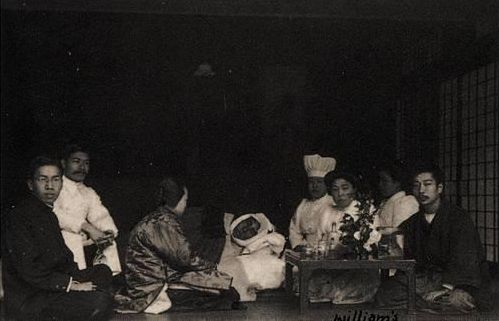
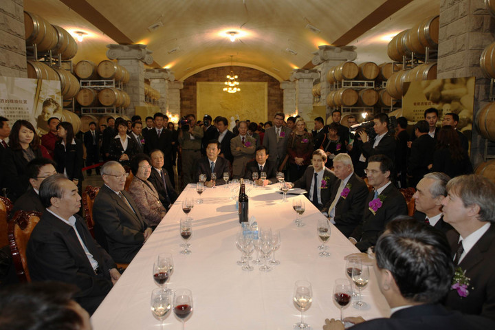
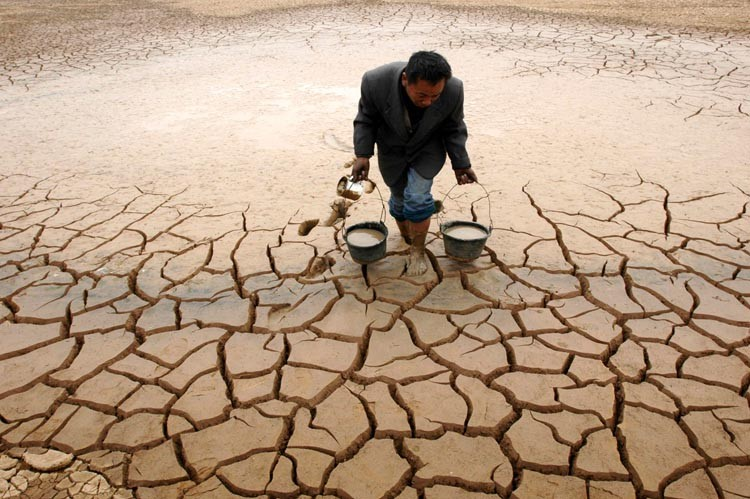

# ＜天璇＞我们所看到的世界很狭隘

**组成这个社会的，绝对不是我们身边那些富裕家庭的小孩，也不是我们为了买房子而烦恼的同学们。更多更多的人们，买商品房根本与他们无关。他们没有好的教育机会，也没有任何的权力和可以利用的人脉。我们所说的所关心的大部分事情，他们都不甚了解，也不会去了解。他们只是活着，过着自己的生活。**  

# 我们所看到的世界很狭隘

## 文/ 猫菲（东京大学）

 

#### 一，

前些日子和朋友聊天，说到国内种种。表达了在国内的各种不习惯和看不惯。朋友说，其实我觉得我那些同学在国内过的挺滋润的啊，买房换车，每天聚在一起下馆子打麻将，多爽啊。我想了一想，这样的日子，和日本苦逼着的留学生们一比，的确是挺爽的。

不过我当时和朋友说，买房换车的，能有几个啊，肯定是家里还挺富裕的。全国那么多年轻人，大学生的硕士的，不是为了一个房子就身心俱疲么，你说那个木有代表性啊。

朋友表示同意。

#### 二，

今天去做研究的调研，跑到家附近的早市。东北人心里没什么防备，看到我做笔记拍照就经常过来搭话聊天。有一对在市场中间做早餐的夫妇，买了他们半斤大饼子，便跟我聊起他们的生活。家在通化，来长春有七八年了。在市内租的房子，早上两点钟起来到早市占位开工，做饼卖饼到10点多，收工回家。早市要向管理者（多是社会上的人）交管理费。据说一天能卖200多块钱，不知道成本多少，他们能挣多少。男的当过兵，参加过80年代的学潮，是党员，该有的都有了。只是没人没钱，不得已只好出来做小生意，挣辛苦钱。

我们那批人还有三百多兵，认识人的有钱的都找单位了，像我们这样的就是下岗，大多都去出大力挣钱了。”

他们并不是抱怨，而是怀着接受的心情叙述这些事实，给我这样一个从未认识过社会吃过这样的。

苦的温室花朵。虽然我并不是学新闻的，而是学建筑的，我考虑的只是早市如何带动了社区交流。但是那一刻我还是把自己装扮成一个做社会调查的大学生，听他们讲这社会，他们看到的社会。

“社会就这样。你能有什么办法。”

这是我从中国人口里听到的最多的一句话。甚至超过了“你好”。父母这么说，朋友这么说，劳动者们这么说。网络上，现实中，无数的人在说。他们这句话并不是说给别人听的，而是说给自己听的。

社会就这样，你能有什么办法，本来就是不公平的，除了接受，除了默默吃苦，又能怎么样呢。

#### 三，

坦白的说，谁不喜欢优越感呢。我喜欢，而且比其他人更加喜欢。精心打扮一番，出门打辆车奔到一个环境不错的咖啡厅，不看价钱点杯咖啡，攥着小手机上网，和朋友聊聊欧洲美国日本的事情，畅想一下周游世界。谁又想换个白色iphone了，谁买了最新款的mac电脑，谁拿了多少万的奖学金。上校内，大家的话题除了当今火热的时事和搞笑话题，无外乎小美女们买了新的名牌衣服，帅哥们又去了新的国家旅行，某某在party又认识了什么妹子。我喜欢这样的生活，也喜欢我身边这群牛人。

有时候，这样的日子多了，你就不大愿意把视线转到身后。

但是，如果你追求真正完善的理性和真正完整的内心，就要走出这个舒适区域，不是吗？

#### 四，

现在人分很多种。单就对社会的不满这个问题来说，就包括这么几种：

对身边牵涉到自己的问题感觉不爽的。比如最近的事故，觉得自己很多时候都要坐车出行，很危险，于是表示不满。

对他人的问题感到不满的。看到各种不公的事情和新闻，会分享做出评论，表示这个社会已经全无希望的。

反对不满的。认为国家之大并不好统治，应该满足而不该满口抱怨。一句最常用的话就是“从以前到现在我们的生活已经进步很多了，经济这么发达，你还有什么不满，有能耐你当领导”之类的。我一直没想出来怎么反驳。最近韩寒那篇文章帮我把心里话说出来了。

至于五毛咱就先不提了。

除了对第三种人有点不太苟同以外，头两种是非常常见的类型。我自己也经常是在这两种之间摇晃。这是人的正常反应，并没有对错。

但是往往，我们所看到的世界是很狭隘的。我们在固定的圈子里活动，而圈子里的人大多是和我们水平相当的人。我们不曾，也不会去对其他的层面真正了解。

如果想看到更多，我们就要去思考这个社会，大部分人是怎样生活的，我们处在哪个位置，现状如何，将来又如何发展，是什么决定着这个社会的价值观，什么人可以得到权力和金钱。

组成这个社会的，绝对不是我们身边那些富裕家庭的小孩，也不是我们为了买房子而烦恼的同学们。更多更多的人们，买商品房根本与他们无关。他们没有好的教育机会，也没有任何的权力和可以利用的人脉。我们所说的所关心的大部分事情，他们都不甚了解，也不会去了解。他们只是活着，过着自己的生活。

他们也许善良，也许愚蠢，也许诚实，也许贪小便宜，也许心术不正。他们的局限，都因为他们的环境。但是从他们那里，总是能感受到带着真诚的温暖。他们也许小毛病不少，但是从骨子里，是甘于忍耐，吃苦耐劳，勤勤恳恳的善良的中国人。我不知道其他地方如何，至少我所知道的东北人，大多是这样的。除了少数以外，大多数人不会去想要加害别人，坑骗别人，生活再苦，也不断在充满荆棘和拦路强盗的黑夜中一点一点摸索着前进。

无论对这个国家再怎么失望，放不下的就是这样的人。

#### 五，

你要改变，是要改变自己呢，还是要改变其他的什么?

如果你觉得自己过的好，就很满足了的话，那另当别论。这篇文章与你无关。

为数不少的人跟我说过，在中国当个掌权阶级，多好啊。在任何国家，都不可能像这里一样，拥有如此大的超越法律的权力，实现如此令人满足的优越感，得到人们的嫉妒和崇拜。国内比较好的城市，生活也都和外国差不多了，房子还大，多舒服啊。

我觉得他们只是没有想到另一些状况而已。

就算开车出行，路上满是背着小孩要饭的老人。你真的会完全视而不见，满心舒坦的开过去吗？

食品污染，你可以到高级超市买进口的食材。但是每天呼吸的空气和喝的水，也都可以从外国运过来吗？

举个更威胁你的，铁道出事了，你在国内做再大的官，再有钱，可以人人都坐私人直升机出行吗？

不能。即使成了有权有钱的人，你还是得呼吸污染的空气，喝着质量不好的水，吃着日积月累向你身体输入毒素的食物，坐着有危险的电梯和列车。你可以把家人送出国，但是一旦在这里扎根，就不得不在这里长久的生活。

光改变自己的世界，光关心自己的世界，是不够的。我们需要更多的关注社会整体，更理性的全面的去看待。不把目光避开任一个角落。这个国家要变得幸福，就必然是全体性的，而不是单独满足某一部分人的需要而抛弃另一部分。

我并不是要说你必须去做什么事情去马上做出什么改变。

我所思考的，希望的，是无论我们处于什么阶层，过着怎样的生活，只要还有那颗温柔而善良的心，就多去看看社会底层的大部分人，去和他们说说话，去了解一下他们的生活。

这样不是为了让我们看到“有人比我过的还惨”而满足于现在的生活，也不是为了让我们立刻拍案而起大声呼唤这个社会再也没法稳定下去。我只是觉得，如果我们看到更多，去想更多。我们的观点和看法也许会从这里开始有所改变。

我在大学里看到发达国家的研究者们对于非洲和许多发展中国家的人们的生存状态所持的关心。我想如果我们也拥有想要帮助别人，进行自我实现的欲望的话，为什么不从我们自己的土地开始呢。

他们拥有很多我们早已隐藏或者遗忘了的东西。那些东西甚至有时候会让你感叹自己很渺小很自私。

这样可爱的人们，没有理由不幸福。

我不关心主权，无所谓什么国家，也无心无聊的政治。所有我所期冀的，就是善良平凡的百姓们能过上他们希望的平安的日子。至少比现在再有希望一点。

在这样的社会中生活，我想你对于优越感的渴求也不再会那样迫切。

想说的还有许多。不过今天就到此为止好了。

要问我对中国的将来到底有没有希望，

我只能说，这取决于你怎么想，我的朋友。

我爱的并不是这个国家。我爱的只是人而已。

 

（采编：陈锴；责编：陈锴）

 
