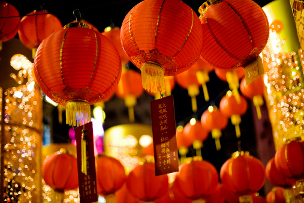
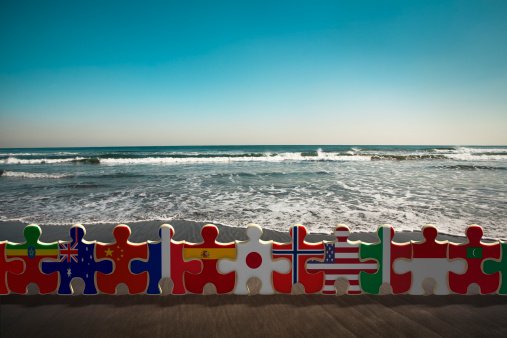

# ＜天璇＞我们这儿，只讲生活

**我们思考自己的生活，向自己的未来抛出一个温热的绣球，邀请远方的未来，希冀其可以毫无阻碍地到来。如果有那么一天，我们的温暖的请柬可以帮助我们办成一次与未来的盛大婚宴，关于这个国家的未来，我们便不必再去问。在那时，国家可以走多远，或许会变成一个温暖的假设，我们不再焦急，不再忧虑。正如在民主国家里，很多时候，政党间的政见到最后会在民意的推动下不断趋中化，以吸引更多的选民。而这个时候，对于很多选民而言，到底选择哪个政党变得没有那么重要。因为他们知道，无论选择哪个政党，只要这些政见实现了，最后都是他们赢了。**  

# 我们这儿，只讲生活

## 文/董芳君（厦门大学）

 

回家已逾七日，这么几天，迅速地逼迫自己脱掉了学生与浪荡者的盔甲，闯入生活逻辑的框架。

在漫天的红灯笼，红歌，红地毯，红对联，醉后红脸的世界里，不想别的，只想生活：跟表姐讨论她到底该不该答应那个羞涩的男孩儿的默默追求，跟老妈聊聊土豆烧牛肉加多少糖牛肉吃起来才润滑；和外婆围着暖炉争论到底哪里下雪了，又笑话那些还在穿短袖的怪人；跟着爸妈一起去走亲串友，看看他们家今年又增添了什么；我也学着给舅舅舅妈敬酒，端详他们酒后爬上脸的一抹抹小丑般的红。在生活的水深火热里，我变成了一颗鹅卵石，随着生活的河流迂回又前进。昨天我和正在读高三的妹儿走了好久，只为寻得我们小时候吃的那家“奶油加蛋”。还是那个阿姨，还是那两个小锅，还是那几种味道，甚至于在物价疯涨的今天，它连价格都不变。我们好激动，甚至于差一点冲上去和阿姨抱在一起，要了两份最贵的“奶油加蛋”，偷偷拍了好几张阿姨手脚利索制作时候的照片，又不停地毫不顾忌周围人诧异的眼光重复说“阿姨我们好想你哦”“阿姨看到你只有那么神奇了，我们要两份最贵的”“阿姨我们吃了你十多年了，每次回来必吃”“阿姨我毕业了就来给你帮忙，顺便拜师学艺”……那时候才发现，自己最近和生活竟然混得这么熟络。

这么几天，我们这儿，只讲生活。

在“上层建筑”里活得太累，会想要在物质基础里获得一番慰藉。而在物质基础里混得久了，却发现所谓的上层建筑不过是一个空壳，不堪生活之一击。所有的东西都躲在我们以为只有“物质”的生活里，时时跑出来，与我们混得个亲昵。曾经听人讲过一个故事，在古罗马军队在到达高卢的博讷时，种下了他们随身携带的葡萄种子。而时日一久，发现这块土地十分适合葡萄的生长，于是，在几年后即将离开的时候，竟有许多士兵选择留下来。因了此地充沛的阳光，他们宁愿不再去为了一个伟大的假设南征北战，而选择了生活。在阳光下生活久了，味道便出来了，阳光不再只是阳光，而葡萄也不再只是葡萄了。生活本身便成为了一种“反抗的姿态”，它赤裸裸地控诉着大命题与大框架的虚伪与残酷。没有这样的大框架，地球依然运转，而世界却因少了战争而变得更好。

布迪厄的“异化”从来都有在我们身上的烙印，我们习惯于将“生活”本身异化于思考，异化于变革，异化于讨论。当我们思考的时候，理论的魔杖爆发出神奇的魔力，一句咒语，我们便逃离生活去纠缠那些纷乱无解的学理藤蔓。当我们谈到变革的时候，我们面红耳赤，情绪激昂，三句不离“制度”，五句不离“主义”，可句句都离了“生活”二字。我们的身体仿佛只有从生活中抽离出来，才可能去讨论那些所谓的伟大的命题。

可那些命题是否是真正地伟大着呢？

在台湾的时候，小吃部的电视里播放着小英的那段竞选广告：站在你家的顶楼，这里是你的国家。国家伟大吗？国家，正在你脚下，需要你来爱她，改变她。坐在电视下吃着那家遍地开花的7-11的关东煮，冬日里升腾的热气模糊了眼镜，当然，也模糊了我的双眼。心里反复嚼着这两句话，骤然发现，我们是不是在底楼待得太久，对于国家，我们竟然唯一的姿势只有仰望。而在这个温暖的国度里，国家这样一个大的命题，在瞬间化为了脚下的土地。迷离于马路上的各色车灯，是这个国家的颜色；欢唱于厨房里的锅碗瓢盆，是这个国家的声音；摇晃于广场上的身体，是这个国家的姿态；静坐于咖啡馆的青春，是这个国家的思考……站在你家的顶楼，国家，就在你脚下。化作每一个生活的细节，你看得到，摸得到，你听得到，它就是你，不再是一个遥远的宏大的存在，它伴随着血液流淌在你身体和生活的每个缝隙，它不再伟大，你有权去阻止他，也可以呼应他，可以坚持，也可以放弃。

大的命题，年轻人们总逃不了焦急与迷茫。在台北参加马世芳的沙龙的时候，在最后冷落的提问环节结束后，马先生深深感叹了一句：“在大陆，年轻人总是问我，马老师，你觉得要怎样做才能改变中国。看来，台湾已经不需要了。”其实，我当时好想问他好多问题，比如收集CD的经验，比如盗版到底买多少好，比如摇滚乐听到什么程度可以变得癫狂而听到什么程度可以变得孤独……没有开口，因为来自对岸的我也的确如此焦急与迷茫着。我们总是着急地向前走，但，速度不过是行军过程中的那一颗“梅”，而我们只是一群望梅止渴的士兵。而真正的水源却如远处阁楼渺茫的歌声。“人为什么总是在仰望”，这个问号的又一层含义是，年轻人，我们为什么不低头看看我们的生活，我们是否放肆地爱着又放肆地放肆着？

曾经我问张铁志，我说“年轻人的文化或者说次文化相对于民主或者变革到底意味着什么？”，他的回答里提到了一个词，同时也是我最钟情的一个思考元素——空间。他的大意是说，在一个民主社会里，每个人都拥有它生活与表达的空间。这样的空间或大或小，或明或暗，但是，我们允许这样的空间存在。或许可以这样说，一个民主自由的社会里，那些飘扬的“稳定”或是“民主”的口号不再是如孔庆东所言般万岁，不再去试图占领每一个人的灵魂场域，而相反的是，自由已然变成了一种生活状态，生活的空间足够大，而在这个空间里，主流文化亦可进，亦可不进，全由你自己选择。那句“风能进，雨能进，国王不能进”说的也是相似的道理。而你的房门不必洞开。

“讃哥，为什么您在台湾从搞社会运动要变成搞农业？”头发已花白的讃哥笑笑说：“我搞的是公民农业，社会运动是事件，而农业是生活。”

有那么几个周末，我跟着讃哥去当地的农村社区，在菜地旁，在交流会上，听东乡里的媳妇炫耀她家将盖一个大的日式庭院，作为整个社区的厨房，听海山里的茶农讲述他是怎样在茶树种植班里和朋友安排冬季里茶花开的日子，听进士农场的主人和鸵鸟的碎碎念，听讃哥跟农民说他好希望每一个居民都有块小小的地，时时勤耕耘，每年只有一点小小的收成。端着相机和录音笔的我，瞬间掐断了录影与录音，“有毛好拍的啊，这不就是他们正常的生活吗？”可骂着骂着，却又想哭起来，到底我们是不愿意谈生活，还是，我们谈不了生活？丹丹老师的期末报告，我扭出了一篇关于“中国身体”的文章，其实，也许只是我们的身体懒惰得宁愿陷于“身体政治”的今天而不愿意去走向“行为艺术”的明天而已。昨天蹲在地摊上淘了好几本书。都是文化大革命时期的民间戏曲、歌曲以及文物记录这一类不伦不类的书，实在是对这一类书有种说不出的喜爱。在精神迷狂的年代里，他们又怎样活着？可我看到的，那些红色幕布下舞动的身体，竟真如神像前的老人般双手合十，虔诚地祈祷着。而当我们的身体真正敢于去随了生活“搏出位”的时候，也许曾经眼前的神像也会碎裂。

“只讲生活”的逻辑在实际行动上又具有另一番意义——因为我们“讲生活”，所以当我们的生活被占领，被侵吞，被腐蚀的时候，我们也有必要去捍卫它。我们捧着笑脸去热爱生活，同时也携着理想主义的影子向往着自我独特的生活风格，但是事情总不是如此顺风顺水。我们必然会遇到阻碍，对抗生活的力量占领着时间与空间的优势。而此时，你要做的，就是捍卫。不为别的，就为了咱心中想要的生活。过年这几天家里的水压突然变小，洗澡的时候水忽冷忽热，问了好几家都是这样，于是我怂恿他们给自来水公司和物业打电话质询。当然，由于过年期间行政效率低，所以现在情况没有什么改变。但是他们说，要在以前，从来都是自己想办法忍忍算了，几乎不会想到去质问，去追究责任，而这一次竟然主动地集合了大家的情况去反应，可谓一次突破。我又想到，王老师当时说了一句“我们是不是有时候对我们的政府太好了？”我们是不是太溺爱我们的资源掌控者了？世世代代，中国人之精明之所以为世人称道，或许我们养成的“不依赖”而习惯不了了之的习惯有关。我们也想要好的生活，但是却不愿意为了好生活去控诉不好的生活，而是倾向于自己把问题解决了，而其悲哀也正于此。路上遇到一个地下井的井盖儿没了，一个一般的传统社会的人会谨慎地绕过它，一个好的传统社会的人也许会在夜里偷偷地去盖上盖子，去补好，然后匆匆离去；而一个好的公民社会的公民，却会去找相关责任人，去发声，去讨论，去控诉，去逼迫他们把井盖给盖上。结果虽然相同，可对待生活的态度，却是前者怯懦，后者坦荡；前者矜持，后者大方；前者短暂，后者持久。

最后，张绍刚的那个段子发生的时候我还在准备着离开台湾的各种乱七八糟的事情，因而并不太清楚到底是怎么回事。可是我毫不掩饰地喜欢“我们这儿”这个词，用四川话去嚼，嚼着嚼着味儿便出来了。我们不自觉地把“我”这个字给读得特别重，而那个扭扭捏捏的味儿就自然留给了“这儿”。和在一起，那般自信但又谦逊，风骚却又羞怯的韵致瞬间铺满整个嘴唇。想想，如果每个人真能用上这样生活味儿的语气语调去表达“国家”这个词，这又何尝不是一件令人欢喜的事情呢？为什么一说起“国家”就必须配上一副严肃地写着“国”字的面具呢？我甚至质疑我们平常所说的“国字脸”的说法是不是也是一种国家主义的侵蚀。会不会有这么一天，我们说“国家”的时候，真的能够像说到故土般轻动双唇，吐露芬芳，说出那句“我们这儿”，就像说我们的家乡一样，不卑不亢，不泣不诉，宛若故土，沉静温暖？

王怡曾经有过一句：国家可以走多远，是一个可怕的假设；我们可以走多远，是一个温暖的邀请。我们思考自己的生活，向自己的未来抛出一个温热的绣球，邀请远方的未来，希冀其可以毫无阻碍地到来。如果有那么一天，我们的温暖的请柬可以帮助我们办成一次与未来的盛大婚宴，关于这个国家的未来，我们便不必再去问。在那时，国家可以走多远，或许会变成一个温暖的假设，我们不再焦急，不再忧虑。正如在民主国家里，很多时候，政党间的政见到最后会在民意的推动下不断趋中化，以吸引更多的选民。而这个时候，对于很多选民而言，到底选择哪个政党变得没有那么重要。因为他们知道，无论选择哪个政党，只要这些政见实现了，最后都是他们赢了。而国家可以走多远，虽值得问，但自不必去问，因为未来都是属于他们的。而他们要做的，就是找个周末的午后，和社区里其他的人坐下来 ，不聊别的，只聊生活，邀请属于他们自己的生活。

我之所以热爱那个“谈谈”的姿态也是如此，我们愤怒，我们悲伤，我们渴望，我们飙泪，可我们可以和这个世界坐下来促膝长谈，眼神相遇的那一刻，我们这儿，不谈别的，今天，我们只讲生活，一份“我从山中来，带着兰花草”的生活。

 

（采编：佛冉 责编：陈锴）

 
