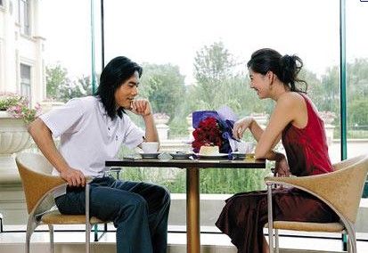

# ＜天璇＞我们都在准备结婚 再也没时间谈恋爱

**好像是吧，我们都直奔着婚姻的目的去了，可我们的爱情呢？我们懂得了城南的楼盘最贵，科鲁兹的车开起来有些肉，西安饭庄的婚宴现在开到了1888一桌还得提前大半年预订……我们懂得了好多结婚必须准备的东西，我们时时刻刻准备着即将牵着一个人的手走进婚姻殿堂。但我们惟独忘了，婚姻，我们最需要的是爱情，而不是条件合适，彼此不反感。**  

# 我们都在准备结婚 再也没时间谈恋爱

## 文/ 裴磊（黑龙江大学）

 

最近同龄的很多人在跟很多人相亲，我也未能幸免，虽然排斥，虽然觉得极其不靠谱。可似乎除此，我们再也没有更好的方式来结识适婚的异性了。一个午后，钻出暖和的被窝，洗罢脸再整理一下衣服，为了去赴一场尴尬无比，被逼无奈的相亲时，看到窗外的黄叶翻飞，突然觉得后脊梁骨一阵发凉。我不断地问自己，我这是要去干什么？相亲？好滑稽的词汇。

是的，我要去相亲了，去见一个我从未谋面的女子，直奔是否合适结婚的主题而去，想必她也是。

套路我懂，甚至曾为一样悲催到被家里逼去相亲的哥们参谋过。太极般的介绍着自己，打探着对方，用堪比菜市场挑菜般的思维速度判断此人是否合适本着结婚的目的继续交往。

我说我讨厌这样，朋友说那你要咋样？你还以为你现在大学呢，谈人生、谈理想？男的有房、有工作、最好有车，女的不难看、工作说得过，不同的工资收入、不同的家庭背景不同的择偶档次，基本就如明码标价一样，彼此付得出对方想要的价码，彼此不讨厌就先接触着呗，就这样了。哪有你想的那么矫情？大家都直奔主题来的，谁的青春尾巴浪费的起？

好像是吧，我们都直奔着婚姻的目的去了，可我们的爱情呢？我们懂得了城南的楼盘最贵，科鲁兹的车开起来有些肉，西安饭庄的婚宴现在开到了1888一桌还得提前大半年预订……我们懂得了好多结婚必须准备的东西，我们时时刻刻准备着即将牵着一个人的手走进婚姻殿堂。但我们惟独忘了，婚姻，我们最需要的是爱情，而不是条件合适，彼此不反感。

是的，我这么说显得矫情，好空啊，好无趣啊，能走进婚姻怎么可能彼此没有感情呢？但是这种感情是爱情吗？我一再的问自己，并在心里一再想问我已经走进婚姻的朋友们？如果匆匆忙忙结识大半年就彼此牵着手走进婚姻的感情是最真挚的爱情，那你和那位让你曾经辗转反侧、寤寐思服了数年的姑娘，那位为你曾泪眼婆絡的姑娘之间的感情又是什么？

“那时太幼稚。”是的我们那时都太幼稚，那时的我们都不懂得如何去爱？可我们勇敢地去爱了，我们考虑是否接受对方唯一的维度就是我是否喜欢对方？那时我们浓烈的爱过对方，一朵玫瑰、一件小礼物、哪怕一起去学校食堂里吃过的一顿饭…无不承载着彼此的深爱，那时我们还不懂得什么是结婚的必需品，但我们单纯的爱过了。也许是因为那时我们还不懂得爱，我们有过欢喜自然也有过伤感，为了也许现在都想不起来的什么原因，我们歇斯底里的吵架了，落泪了，分手了，受伤了。但哪怕吵架都吵得那么浓烈，其实心底最深沉想表达的无非是：你知道我爱你有多深吗？

可是都这么过去了，是那时纯真的姑娘教会了我如何去爱一个人，如何去被别人爱，如何去像一个男人一样担起应该担负的责任。是那时纯真的少年教会了你如何去学会保护自己。

于是，我们彼此却分开了，甚至已经了无联系。也许我们的心里甚至还有着暗恋了数年的她或他，也都已了无音讯，彼此陌路。于是，姑娘们说谁当年没爱过一两个混蛋，哥们们说谁当年没当过一两回混蛋。于是，我们都成熟了，不再那么浓烈的去爱了，因为怕自己再受到伤害，因为最好的岁月都给了混蛋。于是，我们都变得不再去轻易让别人看穿，哪怕夜深的时候翻遍电话本也不知道把寂寞打给谁。于是，我们只能用残存的青春尾巴去相亲，在未见面之前，对方的个子、位子、票子、老子是否和自己的要求成了最基本的考虑。不只是女人变得现实，男人也一样。

不是我们放弃了爱情，而是在回答是否接受甚至见对方之时，在是否喜欢对方的必选项之前，添加了个子、位子、票子、老子等等很多的选项，甚至这些选项所占分数远高于是否喜欢对方。因为也许这时的我们豁达了，只要不反感就先接触着吧。因为我们不想再浪费青春，不想再受伤，不想再像摸奖一样的去等待一个人成长，一切现成的最好。

是的，我们绝大多数人肯定是需要婚姻的，但我们就这样准备着结婚，谁也都再没有时间去谈恋爱了。“说你喜欢怎样的姑娘，我给你介绍。”但你初恋那时你知道对方是怎样的吗？“那个男生不错，介绍给你认识啊”“有房有车有款有型吗？”但你初恋时你是这么考虑的吗？

我们只是调整了思考的顺序，那时我们先结识了彼此，有了感情，会去考虑接不接受对方。而现在我们都把客观摆在了第一位，和自己对硬件的要求相符的才会给对方也给自己一个见面的机会。这就是相亲。而且，相亲时再如菜市场挑菜一样迅速的再次核对一下对于这些硬件的描述。然后……然后的然后，走进婚姻的殿堂。

我们都在准备着结婚，却谁也没有时间去谈一场恋爱了。我们都在速食。我们曾用数年的时间去爱过一个人，再用数年的时间去忘记，浓烈的爱过，然后匆匆牵着别人的手去结婚。这怎么不让人后脊梁骨发凉。

当年朋友为了挽回一段感情，得到对方的确切消息后，急急的飞了过去。却在KTV里被她送了一首歌，“这首歌我是送给在座的一个人的，此后这首歌将不会在我这里响起。”“后来，我总算学会了如何去爱。可惜你早已远去，消失在人海。…这些年来有没有人能让你不寂寞…”

那时，我是不懂这首歌的，可此刻却懂到了脊梁发凉。但刘若英也匆匆宣布了婚讯，新郎不是陈升。

 

（采编：陈锴；责编：陈锴）

 
