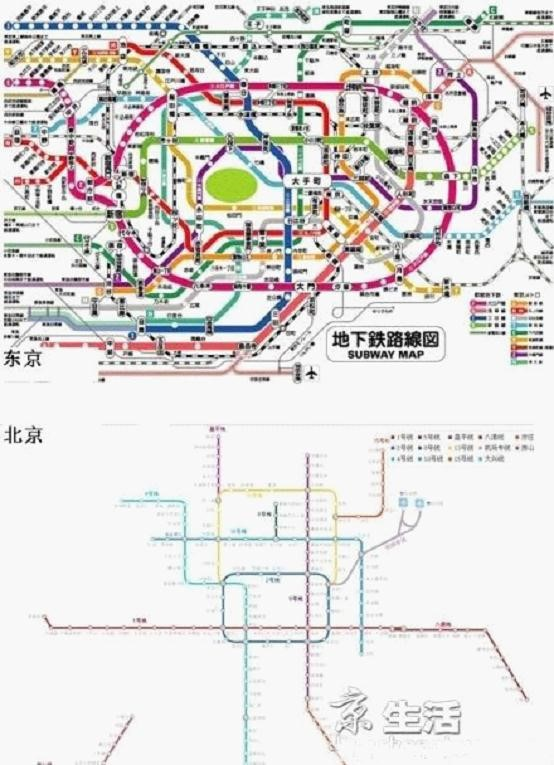
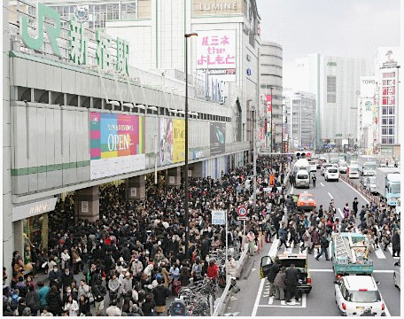
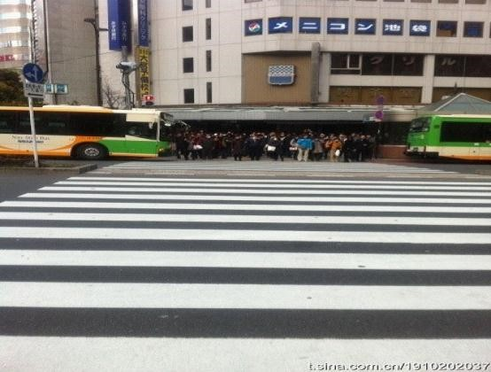
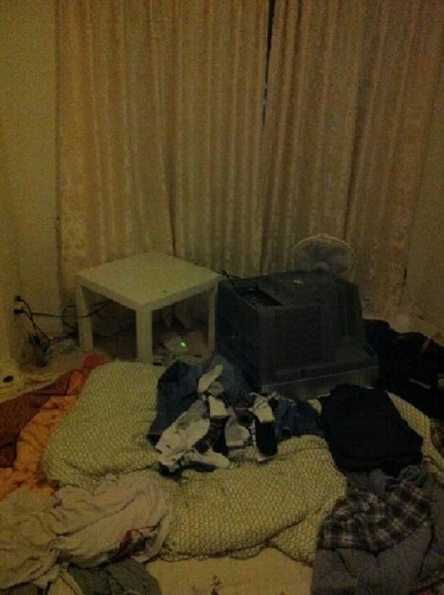
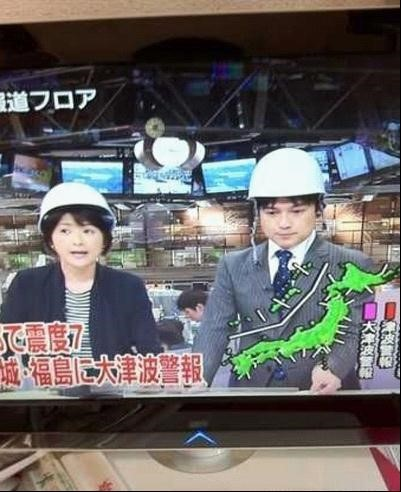

# ＜天璇＞我和地震的节奏

**今天早上，NHK出现的都是单一的画面，一律都是：某某某某，我在某处，我很安全，你们不必担心。他们不跟家人在一起，通讯中断的情况下，他们知道他们的家人会都会看电视。电视的左下方，标注着电话号码。不知道我们的CCTV会不会让我的名字出现在电视上，让我爸妈看见后可以安心呢**？ 

### 

#  我和地震的节奏

### 

## 文/刘佩佩 （早稻田大学）

### 

（编者注：本文写作于2011年3月12日，地震第二天的东京）

#### 昨天下午三点左右我的逃生经历

昨天放了学跟平时一样，到了家三点左右，刚把电脑打开，外套脱了，就感觉房子电脑一直再晃。平时习惯了3级的小地震，也没在意，接着去冰箱里拿吃的，两米的冰箱剧烈的晃动起来，我意识到这次不是跟平时一样不痛不痒的小三级了。五岁的小表妹在另外一个房间玩着电脑游戏，我大声地喊“lisa，jisinn（丽萨，地震）”这个孩子茫然不知道怎么回事，我抱起她，冲向玄关。我们家住四楼，当时就我们俩在家，电梯是绝对不可以的。在冲到三楼拐角处的时候，我抱着丽萨直接被摔倒了三楼二楼衔接处，晃得厉害，头晕起来。然后还是坚持跑到了一楼的停车场。晃动持续大概20分钟左右，后来知道最起码有6级以上。我们俩穿着半袖，半个小时后，我重上四楼，拿了钱，衣服，手机。一直到晚上十点，也没回家。但是整个街区，毫发无损，甚至街边的自动贩卖机都是黯然的站在那里，地震的时候，我还故意去那买了一杯热热的绿茶。离家不远的警察局（在每个车站附近都有警察局，一天主要工作就是为周围的居民服务，最多的是为车站行人提供路线图），警察们都站在外边，指导过往的行人。 

### 

#### 中断的电话通讯和万恩的网络

昨天跑出去之后，电话就处在瘫痪状态了。我的电话是softbank（在日中国留学生使用率基本是百分百），直到今天早上才能偶尔拨出电话。昨天一共发出去一个mail，接到三个电话，两个来自国内。估计是急坏了一些人，尤其是我爸妈。日本的电信主要为AU,DOCOMO，SOFTBANK。事后，我得知，AU（日本人用户最多）通信一直可以保持。 这里不得不谢谢网络，尤其是人人。昨天下午六点多的时候，电话一直未通，我知道现代通讯的厉害，心想国内的父母朋友们一定很担心。我带着安全帽找了个电脑，QQ不能，那我就打开了校内，几十个上百个留言，我一一回复，然后好几个同学帮我给我爸妈打了电话，帮我报平安。谢谢你们。到现在，给国内打电话还是不行，所以我一直在线，即使有时候被余震吓得跑出去避难，校内和QQ一直在线。这是我目前找到的证明我很安全让大家放心的最好的方式了。 这时候，平时用不到的公用电话瞬时间成了救命稻草。这是我同学亲自拍的等候在电话亭旁的行人照片。不知道在我的祖国，是不是人们也会自觉地做到这样井然有序呢？我相信，在某个时间，一定可以。 

### 

### 

在这里，我真的让大家担心了，对不起大家。才发现，虽然很远，但是从昨天到现在，我收到了几百上千个留言。地震我不害怕，我也没哭，但是你们的关心，让我眼睛总是湿润。 

### 

#### 公共交通

日本的公共交通就是电车，电车承载了日本每天日常出行的绝大部分的重责。JR（ JAPAN RAILWAY ）当时停止运行。下图是东京和北京两个城市的对比图。可以想象停运一次，造成多少人出行不便。 

### 

### 

很多人被截在了上班上学的地方，加上手机通讯的中断，每个车站都有大量的滞行旅客和行人。但是，人们都在平静的等待，没有骚乱和哄抢。这里有一个词是国民素质，不用我说，大家都懂得。下面是人满为患的JR新宿车站南口，我每天上学的必经之地。 

### 

### 

下面这个图片是东京华人最聚集的地方，也是东京华人商铺，报纸最密集地区。此图转自同学：地震后池袋车辆堵塞在池袋站东口 没有车辆经过的情况下 惊慌的人们依然在耐心等待红灯。 

### 

### 

具体说说我几个同学的亲身经历吧。 邓鹏宇，没有电车和交通工具，走路三个小时回到家里。他就住在距离东京湾和成田机场附近的一个居民楼的九层。一直到现在未断的余震，让他不知道是自己还是地震再晃了。 下图是邓鹏宇的电视机被震下来的样子 

### 

### 

我的韩国朋友姜世允，12点钟才从新宿打工的24小时便利店回到家。 我的学校老师，据说有一位老师徒步7个小时，才从学校走回家。 我的中国朋友张文，在24小时麦当劳里借宿一宿，早上才从东京回到家中。 我的中国同学姗姗，在避难所呆了一夜，工作人员因为她是中国人，而更加对她关心。水，食物，御寒被子，姗姗今天早上安全回到家中。 贝蒂姐，三十分钟的车程，大概十个小时才到家。途中惊吓于日本人遇到大恐慌时的泰然和镇定的井然有序。 

### 

#### 日本电视台和广播

这是日本播音员带着安全帽报道地震的最新进展的情景 

### 

### 

地震之后，我们都在空地上静静的等着一波一波的余震。有点冷，天也阴了下来。预报六点钟东京有雨。旁边洗衣店的60岁左右的日本老太，非叫我去她的店里暖和一下。收音机一直开着，NHK（日本的CCTV）一直滚动播放着最新的地震和海啸情况。里边没有出现民主党，自民党，更没有出现菅直人，更没有感谢国家的关怀和群众无需恐慌的字样。老太的店里没有电视剧，她说，咱们都安静，都听收音机吧，这样就知道情况怎么样了。 晚上十点回到家，首先是打开电视，最新的报道，预测和交通，天气情况，没有菅直人到某处慰问或者慰问伤员的镜头。同时，NHK用，日文，英文，法文，中文等16国的语言直播地震。 今天早上，NHK出现的都是单一的画面，一律都是：某某某某，我在某处，我很安全，你们不必担心。他们不跟家人在一起，通讯中断的情况下，他们知道他们的家人会都会看电视。电视的左下方，标注着电话号码。不知道我们的CCTV会不会让我的名字出现在电视上，让我爸妈看见后可以安心呢？在别的电台都是直播那些震后和震中遇难照片的时候，NHK一上午都在播着这样单调的画面。但是我周围的日本人，就都是在看NHK。 

### 

#### 与中国驻日使馆留学生部的人员的对话

网上一直出现中国驻日大使馆的联系方式，我同时也公布在了我的校内里。我从昨天一直试着拨通。今早上十一点钟左右（东京时间，此时北京为10点左右）终于拨通了。当电话那头出现了一个甜甜的声音，中文“喂”的时候，心里还是很震动了一下子的。我自报家门之后，告诉她，我们都没事儿，我和我的同学们都很安全。必备的东西也都准备了。那头还是嘱咐了很多，一直叮嘱注意保持跟家人的联系。 

#### 爱祖国，感谢祖国，想念祖国。

### 

#### 关于想家问题

其实说实话，这个时候，我并不是很想家，但是很担心在担心着我的你们。也许是因为一直在外边自己上学的原因吧，谁知道。我也知道家人一直在为我担心，但是也没悲伤也没恐慌，在大灾难面前，人还是需要保持冷静的吧，或许我有点冷静过头。我一天都在线，就是想让大家知道，刘佩佩很安全，还在能网上混着呢。O(∩_∩)O~很多同学也帮我给我家里保平安。谢谢你们。大家不用担心，还是那句话，没事儿。只不过一直持续的余震，时不时的会让我断网，我下午甚至还重温了一遍狄仁杰之通天帝国，在看到结尾处，余震来了，网断。O(∩_∩)O~ 

#### 对于网络舆论我的看法

昨天我在英国念书的同学给我发来一个帖子，是他收集的那些愤青的声音。我的回复是，人要做一个有心的人，没心，可以不用被称为人。同时，国内云南也有地震，说实话，我更担心云南的同胞们。因为那里经济不如日本，加上某些环节的夹击，在物资方面，很让人担忧，地震经常伴随天气不好，他们是否有足够的御寒的衣物和必需的食物和补给水？ 最后就是想问，人的爱，有时间限制，有空间限制吗？同样，人的同情心有时间限制，有空间限制吗？那些可有可无的声音，只是无聊在哗众取宠罢了，不值一提。 最后，真的很想问一句，如果同样的灾难发生在我的祖国？我现在能坐在电脑前敲完这个日志吗？ 

### 

### 

（责编：项栋梁）

### 

### 

 原文地址：http://blog.renren.com/blog/235720633/716144340
