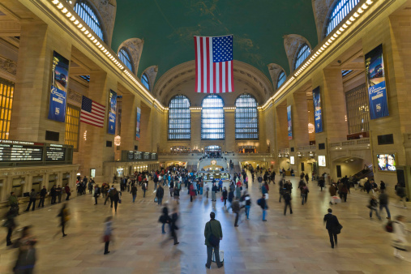
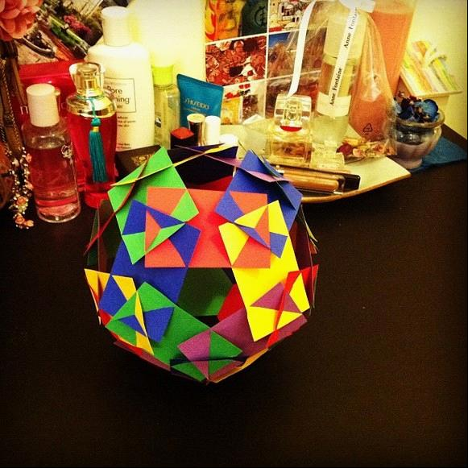
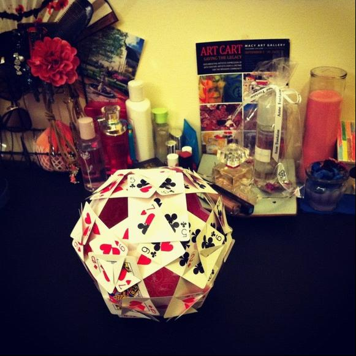

# ＜天璇＞我在纽约学到了什么

**如果要庆幸什么，我庆幸纽约给了我这么丰富的经历和疼痛的历练，以及自己能一直保持一颗自省的心，不让自己在这样繁华的都市里被淹没或者变得更加浮躁。如果说有什么忠告，只是一句话：去经历，你就会明白一切。**  

# 我在纽约学到了什么

## 文/李东（Columbia University）

 

来纽约九个月，每一天都获得新知和新体悟。比起初来的时候，心智上已有一个飞跃。这两天进行一个大反思，把所有悟到的东西总结出来，作为心路历程和自我提醒。

Less is more.

这句话所指示的对象包含很多：信息、机会、经历、表达、人际关系等等。在纽约这样集合一切“美好和新鲜事物”的城市，我经常感觉到被过分刺激（over-stimulated）了。每一个场景都充满信息（informative），会议和演讲总是那么激动人心（inspiring），各种机会和资源让你眼花缭乱无从选择，到处都是才华横溢背景不凡的人……贪念重如我之人，就掉入这个“more”的陷阱之中，后果有三：迷失与碎片化信息的大海之中，茫然无方向，觉得什么都想要；无法忍受寂寞专注地把事情一件一件地做好，每天都感觉很忙，人浮于事，成效不大；大脑被过分刺激而丧失正常思维力（paralyzed），抑制深度思考，抵制挑战性工作，产生惰性情绪，工作拖沓，应付了事。当出现这些症状的时候，我应该警觉，我的人生被信息超负荷所控制了。我需要尝试做出改变——审视外物和我自身互动的方式。这虽然是一座充满机会的城市，但许多机会，仅仅只是看起来是有价值；虽然大量的信息能够赋予我力量，但很多信息我并不真的需要，或者很多信息蕴含着相同的道理，或者我需要花比我想象的更长的时间来消化他们。虽然我想做很多事情，想去很多地方，但一天只有24小时，我必须做出选择而且专注于我的选择；承担过多以及选择超出我能力范围的事会让我很累甚至很沮丧，而这样的状态并不利于高效的工作和生活。所以我告诉自己，必须学会甄别信息，做出明智的选择，做重要的事情而且一次只做一件事，抵挡诱惑，专注淡定，不奢求全面，不企图完美。enough is enough.

Everyone’s gonna start from somewhere.

这是一位好友告诉我的，对于一个新人来说，这句话的力量很大。在这座汇集精英的城市里，自惭形秽几乎是我的常态，论教学比不上有经验的老师，论语言表达无法跟英语是母语的人相比，学术论文写得一塌糊涂，生活经历和兴趣专长也没有什么拿得出手或说得出口的。每隔几个星期我就有一次identity crisis：过去二十几年我都在干什么了？作为一个“金融界里最懂教育和教育界里最懂金融的人”，我尴尬得很。经常陷入这样的情绪的结果是，自卑自贬，自我效能降低，觉得前路无望，受到打击后一蹶不振。其实我一直在做没有意义的比较——基础不同的比较是无效的——我的背景，经历，专攻方向，母语，接受教育的环境和我比较的对象并不相同。术业有专攻，闻道有先后，如是而已。当然，我也抱怨过自己成长太慢，学习效率不高。从另外一个角度来想，我本来就能力平平，而消化信息和学习新知识是需要花时间的。或许我应该接受自己能力的局限并尊重自己的学习方式和速率。我只是一个很普通的平凡的新人，在一点一点地积累和进步，做着那些看起来不那么平凡的人坚持做了很多年的事。 Everyone’s gonna start from somewhere. Be patient and faithful.

Now or Never.

拖延症是许多现代人的病症。我的拖延症来自于被过分刺激和揽事太多而产生的疲惫、惰性和精力分散。我的书架上永远有一堆等待整理的课堂笔记和会议心得、等待的阅读的学术文章和各类书籍，名片盒里永远有一堆等待跟进和梳理的联系人，欲望清单上永远有一堆要去的地方要看的歌剧要看的电影。有些事情，如果现在不做，就永远也不会做了。假如赶在deadline之前才去做，那么基本上就是草草了事，原本设想的所有细节和精致都没有足够的时间来打磨。如果清单上的一些事情并不那么重要因此被一推再推，那么大可把他们从清单上删去，轻装上阵，在重要的时间做重要的事，不被琐事淹没；如果清单上的事情很重要但工程宏大让人畏惧以至迟迟不肯开始，则可以切分为小块，制定符合实际情况的时间进程（我往往高估自己完成事情的速度）并强迫自己严格执行。

Face the reality.

我在哥大教育学院和实习的学校里学到最有用的东西之一就是面对现实，解决实际问题。所有完美的假设条件都可以被现实无情地反驳。一个针对白人中产阶级的教育设计放在一个多族裔能力严重不均的教室里根本无法实施。一个有效的教育设计，必须在尊重学生能力分布、家庭背景、文化环境和学校资源条件的基础上完成。同样，承认自己实力的局限，不好高骛远，做力所能及的事情，人生才不会有那么多失望和挫败感。

Nothing could be perfect.

我的完美主义的一面常常让我身心俱疲或者前进很慢。一方面，我企图面面俱到，雕琢所有细节，不完美让我愤怒——像我的一个学生画画时候画错了一笔就愤怒地撕碎画纸。一方面，我选择等待完美时机，等待所有完美条件都具备才开始一件事情，假如真有那个完美时刻，动机和热情也已经消耗殆尽，更何况，如果要说真的准备好了，我永远都不会完全准备好去接受任何挑战。人生从来就不可能完美，也不应该完美。享受不完美的状态，才可以从容的把事情一件一件地做起来。不是选择完美的条件，而是拿到一手烂牌，也要把它打到最好。不完美才是真人生。

Down to the earth.

在中国教育体系里呆着么多年，我养成一种用大词来忽悠，用含糊词来逃避的习惯。这种语言习惯体现到行动上就是光说不练，不屑于做小事情。很多事情看起来简单，其实做起来并不容易，甚至很多时候，我们会被细节打败。很多事情，不去做永远不知道是怎么回事，不会知道时间线可能会拉得多长，永远不知道会面临怎样的挑战，应该用什么方法来解决。能撑起大事情的人，肯定是把很多很多小事情做好的人。我接触的许多美国同学和美国同事，都在做很具体的事情，而且能把那些具体的事情做得很精致——我的mentor有一个博士学位两个硕士学位，但一直在一线教幼儿园小朋友。虽然很多人都很能说，但所有的说法都很具体并且来自于切身的经历。大家并不爱听满嘴的空话，而是尊重那些踏实的人，认可能够接地气的项目。所以在纽约呆这么久，我渐渐地不再以常青藤名校精英自居，觉得光环和背景都是浮云，养成了一种少说话多做事的习惯，并且努力把小事情做好。

Learning is everywhere.

身在在教育领域，自然对“学习”有很多体会。国内的教育让我对“学习”产生很局限的认识，对知识有很深的偏见。我在哥大所接受的研究生教育以及在纽约的生活经历让我对学习有了新的认识：世界，就是课堂；每一个人，都是我的老师。我养成一种随时随地随人随事学习的习惯：用心观察生活，在旅行中考察风土人情，思考“为什么”并且找寻答案，询问各种职业的人关于他们的工作。世界就是一本开放的书，学习也不应该局限在课堂之内。

Don’t do lousy jobs.

在美国，无论是教授还是管理者，他们期待我拿出来的是高质量的工作成果。认真经营还是草草了事，他们一眼就可以看出来。这让我在工作和学业上都不敢怠慢。假如留下不良印象和lousy jobs的历史，我很难被原谅而得到下一次机会的。随着年龄的增长，我们犯错误的成本越来越高，年轻的时候要多犯错误，因为错误让我们成长，但是如果是因为怠慢而犯错——比如lousy jobs这种完全是人为可控的错误——以至丧失机会，那这样的错误代价太大了。

Be professional.

“专业性”是美国学术和工作环境下的基本要求。所有的职业或学术活动都有设定好的标准和期望——对于做学问的严谨态度，领域知识的把握程度，实践操作的熟悉程度，行业术语和惯行。我是一个在任何领域都不够专业的人——钢琴、表演、剧本写作、体育运动项目、甚至是教学，经常感觉到以一个业余者的身份出现在专业者的场合所受到的“排挤”和“鄙视”。没有实力，是没有用的，两句话讲完，专业的人就知道你有几斤几两了。不过我也知道，一切都需要时间来积淀，只是美国社会对专业性的高要求逼迫着我以更快的方式让自己成为专业人士。一个人很难在很多领域都很专业，所以我现在只选择专注于幼儿教育领域的课程和教学。每个行业也有特定的职业规范，比如虽然小孩子很可爱总让我想狠狠地亲一口但是作为教师的绝对不能这样做。在什么场合说什么话做出什么行动也是专业性的要求，说话做事前一定要经过大脑思考，专业的人没有一句多余的话，而且是用逻辑和理性而不是情绪来指导自己的行动。

Everything comes with a price.

“一切都有代价”，这是老生常谈了。用金钱换时间，用时间换金钱，牺牲原则取得利益，牺牲健康获得成就……只是有时候，我们容易忽略隐性成本，拿人手短还觉得自己捡了便宜，其实现在没付出的，都变成了人情债。混迹纽约社交场合，学到重要的道理是无功不受禄，受禄必问“Is there anything I can do for you?”虽然人性当中总有那种一有机会就占人便宜的倾向，但是公平交易永远是最安全的。反过来说，No pains no gains.一份付出一份回报。美国社会是公平的，用心备课，认真教书，学生有进步，校长和其他老师都会看在眼里。过程合理，结果也会合理。

Be cool with praise.

外表美丽的人，容易浮躁，被这个世界夸奖一下，就飘飘然不知今夕几何年，更可恨的是，还会不停地期待更多的夸奖，渴望更多的关注，忘记自己的内在还是多么虚空。对能力和成就上的赞扬也需要小心。美国人喜欢赞扬别人，因为他们提倡以鼓励带动积极的进步，我的Mentor对我“纰漏百出”的教学满口表扬，我的教授给我的并不十分出彩的论文给很高的评价。人容易被这样的夸赞冲昏头脑，忘记自己到底是有几斤几两，忘记自己前路有多艰险，任务有多艰巨，所以我总是很小心，扪心自问自己的付出和实力，自己踏实，才是真的踏实。

Stay true to yourself.

在纽约这样文化多元价值多元的城市，人有时候会迷失自我，尤其是像我这样迫切地想融入这个社会的人。我的意思是，虽然纽约很包容，但这里有无数的小圈子，每个圈子都有规则和壁垒，而我只能选择进入不多的几个。有时候我会为了融入这些圈子，让更多的人喜欢我而放弃自己真实的一面。当然，这样并不舒服，很快我也原形毕露。我知道，有些东西如果我放弃了我不会快乐，如果我假作我也不会快乐。我必须知道我自己是谁，我真正想要的是什么，什么环境或者圈子才适合我。真正适合我的环境和圈子，应该是能够让我展现真是的自我的地方，不仅是它在选择我，也是我在选择它。我必须有自己的偏好和标准，有自己不喜欢的东西和绝不妥协的原则，因为改变别人是不可能的事，而改变自己是痛苦的事情。

You can be original and empowered at the same time.

这是我个人长期以来的困惑。说得不严谨一点是，如何处理创造力和知识的关系。我对原创性向来非常重视。一旦我发现别人有跟我同样的我却以为很独特的想法时我就会变得很沮丧；或者，我会潜意识地排斥接触现有的模型和知识，害怕他们影响我的原创性。这样的结果是，我为了创新而封闭自己，结果创造出来的东西是市面上已经存在的甚至并不如已有的模式。我为了创新而创新，而忘记了创新所指向的真正目的——更好地解决问题或者适应新情况。人类社会发展了这么多年，领域知识和模型日趋完善，我还有创新的空间吗？当然，因为人的思维是衍生的，而对现存模型所有创造性的改良都属于创新。比如课程创新，可以是借一个适用于高年级学生的课程创意来调整成一个适合五岁儿童的课程——所谓innovational adaptation。于是我发现原创和被empowered, 被informed并不矛盾。已有的知识、模型、书籍、别人的观点可以使自己更强大。抛开这个“纯原创”的思想包袱，学会借力使力，能事半功倍并且使创新更具实际意义。

Don’t judge too soon.

在快节奏的社会里生存，人们倾向于用自己很局限的思维框架快速下判断——评价一个人、一个课程、一所学校、一件事。这样的快速判断可能可以节省时间和精力，但先入为主很容易误判，相信交往尚浅的人话容易受伤害。对人对事，在收集到足够证据之前，不好轻易下定论，言辞上留有余地，心理上抱有一定程度的观望，爱恨不在一瞬间，真伪良莠需要时间来证明。

Self-reliance.

自食其力，是美国社会的时代精神。虽然家庭背景和先天资源很重要，但自力更生是唯一长久繁荣的唯一办法。我认为自己是独立的女性，我知道我不能依靠别人的资源来让自己繁荣，只有积累自己的资源才不会受制于人，我知道我要坚强，很多困难我只能自己挺过去。我知道要在财务、精神和情感上都独立，自己才能在被全世界抛弃的时候，也能活得很好。

Seek for optimal solutions.

虽然人生没有完美，但我相信任何问题都有较优的解决方案，所有的事情都有技巧可循。在开始解决问题之前，一定要舍得花时间来理清问题的根本，寻找最有效最切合最直接的资源来解决问题，向对的人提问寻找答案，如果一条路子走不通，要毫不犹豫地换一条路，不要为沉没成本而继续做无用功过。

Respect others’ time.

纽约人的日程排得很满，每个人都有自己的安排，需要抽出时间来做一项事情之前人们总是要考虑三分——做做成本收益分析。己所不欲勿施于人，我们不希望别人很突然地打扰到我们的生活，那么也不要很突然地打扰到他人的安排。美国人对工作时间的界定很明确，工作时间之外不希望被工作上的问题所打扰。学会预约，给别人时间和空间来回应，因此短信和邮件是较安全的联络方式，如果别人不接电话，必然有充足的理由。这世界不是围绕着我们转的，没人应该随叫随到，我们需要互相尊重彼此的时间和安排。语言表达要言简意赅，表意明确，不要废话连篇含含糊糊地浪费他人的时间。

simplicity is a virtue.

Treat yourself well.

你怎么对待自己，别人就怎么对待你。不需要名牌来装点，但要吃得健康，睡眠充足，穿着得体，精神饱满，自信自尊。不注重养生之道，必会战败；精力充沛，才能有productive life。别把自己搞得那么悲惨，以一副受气包的形象出现。什么样的气场吸引什么样的人。尊重自己，才能赢得别人的尊重。

Be flexible.

人生根本无法计划，很多事先想象出来的问题，可能根本不存在，很多没有考虑到的问题，可以很给你突然的打击。任何一种输入，都会对输出造成影响，很多时候你无法决定输入——比如一场突如其来的灾难。experience will come to you，而你会改变对这个世界的看法。唯一能做的是，保持自己的弹性，适应改变，不至于大悲大喜，不至于因为突发事件而打乱阵脚。

Empathy.

我在纽约呆的这九个月，跟各行各业、不同年龄的人打交道，在教室里跟儿童进行各种各样的对话，学到的最重要的东西之一就是共情力。真真切切地理解别人的感受，站在别人的角度考虑问题。人都有以己度人的倾向，每个人的自身经历都是有限的，看世界的角度和看到的世界也并不一样。“共情”需要开放的心态（欲望）和足够的想象力（能力），是一件很有挑战性的事情。但一旦达到那个境界，你可以更好地了解教育对象，设计出更有效的教学方案，更好地了解交流对象，跨越交流障碍，为冲突和矛盾找到更好的解决方案。

Hold on to your bottom line.

这是一个“坏人”当道的世界，每一场相遇都是一场博弈，博弈的过程是不断试探对方的底线，你永远不能完全掌握你对手的全部，因此也不要开诚布公地让对手知道你的全部。坚守底线也许并不能让我立刻快乐起来，但却可以让我们获得尊严，而尊严才是最终的快乐。

Keep going, don’t settle.

每天都充满挑战，所以不能停止战斗。休息久了，后面的人会追上来。在没完成一件事情之前，不要去想鲜花、掌声和回报。淡化成就和光环，最好的作品是下一个。不断思考自己能给这个世界带来什么，目标不能不止于“表现良好”，而应该是“我真正被需要”。

Don’t repeat your mistakes.

错误是最好的老师的之一，但犯错误是有成本的。其实我们能犯的错误是有限的，大部分时候，我们只不过在犯同样的错误。不要说去做多少正确的事情，能不重复犯错已经很不容易。所以，总结很重要——在我们每天大量遗忘的过程中，不能遗忘的是那些不可以再犯的错误。

如果要庆幸什么，我庆幸纽约给了我这么丰富的经历和疼痛的历练，以及自己能一直保持一颗自省的心，不让自己在这样繁华的都市里被淹没或者变得更加浮躁。

如果说有什么忠告，只是一句话：去经历，你就会明白一切。

附上新做的模型——人生就是trial-and-error。我无法在第一次尝试就顺利无误地使所有五边形各边颜色不同，或者所有五边形各边和相等，但trial-and-error可以让我完成最终作品。 you don't try, you can't fail.

 

（采编：张金晶；责编：黄理罡）

 
