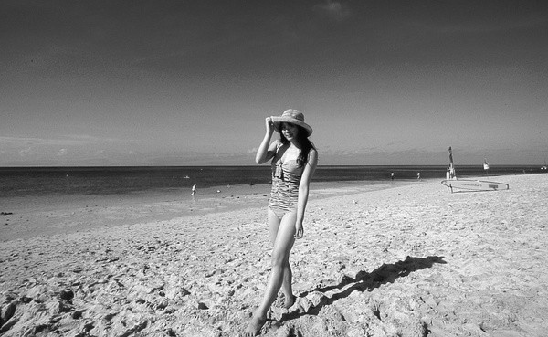
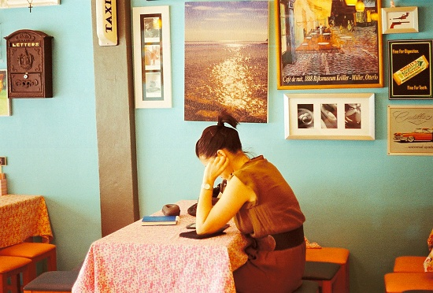
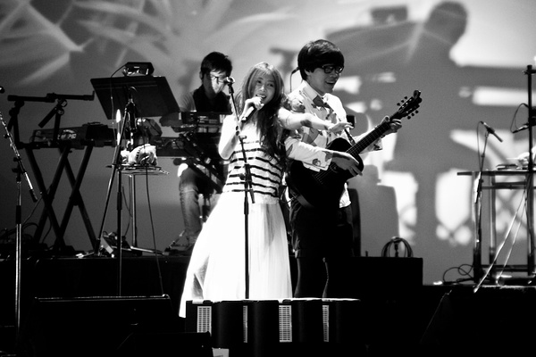

# ＜天璇＞我妈只是个上了岁数的女青年，老姑娘也是姑娘

**有时候我翻见我妈的照片，我说这尼玛美，我妈说这还不是你老娘最美得时候，说着这姑娘就掏出一张黑白的，碎花裙子，依在湖边亭子里，我知道她在装逼，但她装的很好，没有45度俯拍，没有小清新，没有液化，阳光撒在半边儿脸上，那时候我妈还是瓜子脸，长头发，细长腿，不近视，当时风就从湖面徐徐扑过来，我妈笑起来就把牙齿一排排的都露出来，不嘟嘴，不握拳，这不是陈绮贞，因为陈绮贞没她真。**

** **

# 我妈只是个上了岁数的女青年，老姑娘也是姑娘

## 文/TYLER（悉尼麦考瑞大学）

 又到了一年一度的母亲节，所以要向我妈感恩，虽然我不会把我写的东西读给她听，因为在这个女青年儿的脑子里，我写的东西不会比八点档的电视剧更有内涵。 我妈是个脑子不太聪明的女青年，是个上了岁数的小姑娘，她这辈子最大的心愿大概是多买房，买了房就买商铺，买了商铺如果还有余钱儿，就整衣服，整股票，整各种旅游。 她会说最近有个讲股票的，讲的很好，你老娘准备跟进，大赚一笔。 她会说最近听说东郊有个地段不错，你老娘准备为你盘个商铺，大赚一笔。 她会说最近听说杭州很好玩，你老娘准备凑个年假，大赚一笔，不，大玩一笔。 她会说吃盐吃多了致癌。 她会说睡觉睡晚了致癌。 她会说喝酒致癌。 她会说抽烟致癌。 她以后可能会在夫妻生活方面告诫我，那个多了，也致癌。 我妈是个希望健康和富有同时拥有的，贪婪的女人。 但是我很愿意用我大半辈子的时间来满足这个不知足的，谨慎的，大圆脸儿姑娘。 年轻的时候我妈也和你们一样，二十来岁，懂个鸟，就知道天天听流行歌曲，仗着自个儿嗓子好，痴心妄想的想进文工团，曾经她毫不脸红的谎称自己英文水平高，但初中默单词儿我喊她报给我，她一付年纪大了老娘已经不复当年勇的表情。 那时候我妈是在瞻园工作，头顶一个南京文物牛人的爹，一个比她还老实的娘，她爹喜欢没事儿在家摆谱，画个鱼啊，虾啊，写个诗词啊，都狂草，看不懂有没有，她娘除了买小笼包吃酱油毛豆，就没有别的太大的爱好了。 在这样一个知识氛围浓厚的环境里，我妈对瞻园的历史一无所知，整天就想穿什么花裙子，配哪个颜色，整个80年代的时尚，傻乎乎的跑过去上两天班，没事儿啃个指甲，喝瓶装小汽水儿，得瑟，满脑子想的是下班跟好姐妹去电影院看姜文。 她说朱时茂年轻的时候也帅，姜文就不要提多爷们了，这就是为什么虽然你爹本质是一个流氓，但他当时的爷们气质让她为之倾倒。 我爹自以为他是用深厚的文化功底征服了我妈，但很可能我妈愿意跟他拉小手儿，仅仅因为他当时留了个山木一样的恶心大胡子。 虽然几年以后他们没有在一起，但人世匆匆，美好的回忆我妈也不介怀。 我妈后来就通过她爹在文物界的黑手，调进了文物公司，实际上我妈这一支都是搞文化产业，她的哥哥从老爹那儿学了个鉴定的皮毛，已然说的清楚宋瓷和青瓷的优劣，没事儿也摆谱，摊个画，评个理儿，我妈呢，我妈就知道啃指甲了。 她上班看报纸，要找娱乐版，听说费翔帅到屎，就想看看他有多屎，她去玄武湖上划船，照相了，要学邓丽君摆个小城之春的POSE，她得瑟，她讲笑话，她哈哈笑，她下班去夫子庙吃小吃，她屁事不管，大学没考上，没事，老娘已经有工作了是不是，老娘是白领了，有木有！ 有时候我翻见我妈的照片，我说这尼玛美，我妈说这还不是你老娘最美得时候，说着这姑娘就掏出一张黑白的，碎花裙子，依在湖边亭子里，我知道她在装逼，但她装的很好，没有45度俯拍，没有小清新，没有液化，阳光撒在半边儿脸上，那时候我妈还是瓜子脸，长头发，细长腿，不近视，当时风就从湖面徐徐扑过来，我妈笑起来就把牙齿一排排的都露出来，不嘟嘴，不握拳，这不是陈绮贞，因为陈绮贞没她真。 这位女青年在二十多岁的时候，真是纯美得一望无际。 碎花裙子小湖边，阳光微笑好青年。 美好的姑娘都会有美好的结局。 

 当然，渐渐的我妈还是胖了，虽然她试过超过五种减肥药，之后她近视了，头发也得定期漂染一下，没事换个发型，怎么换看着都像闲人马大姐，老姑娘没法再穿碎花儿裙子了，因为会露出她俩大粗腿，没事整个清凉点儿的，后背的拉链死活拉不上，水桶腰也锋芒毕露了，常常也欲盖弥彰，这时候老姑娘就会不经意间露出郁闷的表情，但我想实际上她已经不在乎了，她想的都是吃好，玩好，赚大钱，有时候这个女青年也会在家唱歌，唱那些我听来老土的红歌，有时候她会顺手摸走我的电影杂志，说外国妞就是好看。 好像这个女青年只是间歇性的长大了那么一会儿，在他的儿子面前，私底下大概还是情愿一边儿啃指甲一边儿逛街一边儿看印度老电影，然后做一个无路用的怪咖。 我相信每个母亲都是从美好的姑娘来的，美好的女青年永远都是女青年。 虽然有时候我妈也会把一件事连续说五遍以上，也会在我晚归以后露出一副你必致癌的恐惧表情，也会在气急的时候哗啦啦的掉眼泪，也会疯狂的摆脸，用她以为比较恐怖的语气来骂我。 但这个心软的姑娘还是会告诉我，不行了就回家，缺钱了妈汇给你。 心软的老姑娘总是在遇到要饭的掏腰包给钱。 她积德，心善，人好。 我晚上大概会给我妈打个电话，但我肯定不会煽情，我妈也会问我一些有没有早睡的废话，我也会用我每天10点睡觉这种废话来回答。 这个女青年完全不需要我担心，她一定可以快快乐乐的活下去，没有什么能打到一个阅历丰富，战斗力十足的陈绮贞。 

 （完）  

（采编：陈轩 责编：陈轩）
