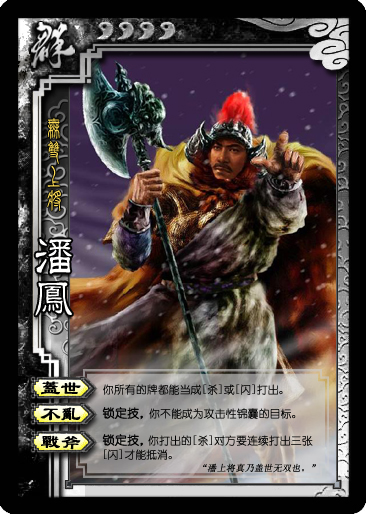
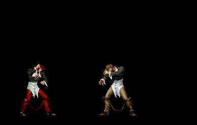
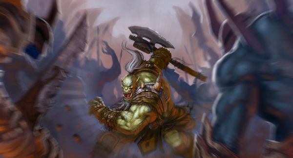

# ＜天璇＞我始终不信努力奋斗的意义

**人生中，如果你不是车马炮，而只是一个卒子，最明智的做法就是“思不出其位”，而不是恃一己之强，逞一时之能，图一着之快。不要以为被大车罩着是理所当然，君不见“弃卒保车”乎。否则的话，侥幸不成为炮灰的可能性恐怕只有五百分之一、五千分之一。**  

# 我始终不信努力奋斗的意义

## 文/王路（中国国际广播电台）

 

高中时有个同学，在全年级一千多人中屡次考第二名。有一天我看到他的笔记本，勒口上竖着写着一句话：学习最好的不一定是最聪明的。我眼睛一亮，对他颇为刮目。这时发现勒口里面还有一行字：但一定是最勤奋的。我立马就扫兴了。那位同学后来突然生了一场病，然后就神经衰弱了，复读两年后考了一个二本学校。

《春秋》里记载了很多猛人，简直是神一样的存在。突然某一天，咔嚓，头被人砍了，闲花落地听无声。生的伟大，死的悄悄，就像把一个小石块投进深水池里，连个泡都没砸出来就沉下去了。

《三国演义》里面华雄出场，斩大将鲍忠、斩大将祖茂、斩大将俞涉、斩大将潘凤，所有这一切，都是为一个地位卑下的马弓手关羽的出场做铺垫的，在撒泡尿还没来得及晾干的功夫内，关羽就把华雄的头颅砍了下来。而威震华夏不可一世的关云长最后败走麦城，输在了无名小辈吕蒙手里。“天下英雄使君与操”的刘玄德，栽在了白面书生陆逊手上。其生也威武，其死也憋屈。欧阳修《伶官传序》说：故方其盛也，举天下豪杰，莫能与之争；及其衰也，数十伶人困之，而身死国灭，为天下笑。

《射雕英雄传》开卷出场郭啸天、杨铁心二位大侠，看上去很猛，后来发现是给丘处机的出场垫脚的；江南七怪和丘处机比武时何等潇洒俊逸，后来发现是给梅超风的出场垫脚的；梅超风似乎足够无敌了，后来才晓得不过是给黄药师的出场垫脚的。黑风双煞在漠北苦练十年的意义比不上黄药师动一根手指头，而黄药师的兴趣并不是练武功，而是天文地理医学占卜。《倚天屠龙记》中某人躲在山洞里苦练了二十年，他存在的意义就是为了后来被张无忌随随便便打败。

学过高级宏观经济学的人几乎都被Ramsey虐过，没有人不叹服这位27岁就挂掉的少年天才，如果说他随手写成的那三篇经济学论文是准一流的，那么再也没有谁敢自称自己的论文可以把前面的“准”字去掉。但是，翻一下Ramsey童鞋的档案，才发现人家的兴趣所在是逻辑哲学，经济学只是随便玩玩。

我经常在网上看到《你不知道永远有人比你更拼命》、《你必须非常努力，才能看起来毫不费力》之类的帖子，以及传说中的哈佛图书馆凌晨四点的照片。对此，我总会想起当年我和韬帅纪总等人玩三国杀3v3时，轻松选好武将组合，轻松打得对方落花流水，然后韬帅就会洋洋自得在聊天框中嘲笑对方：抵抗没有出路。我们当年在电脑前虐人时说这话时是何等轻松自在，然而当生活幽我们一默，让我们看到那些薄瓜瓜们洋洋自得地对我们说“抵抗没有出路”的时候，又该作如何感受呢？

这个时代最不缺少的一种声音就是：“我拼了命也要把某件事情做成。”要不要拼命，你来决定；能不能做成，天来决定。最常见的一种结果是：命确实拼了，就像三国杀里的典韦，就算没有挂，至少也残了。同时，事情也黄了。这太正常了——你能做成的事情哪用得上拼命？如果非要以“拼命”作为代价不可，估计做成够呛。问题是，即便你能做成，世界上又有多少事情比生命更可贵呢？考个试要“拼命”，写个论文要“拼命”，找个工作要“拼命”，谈个项目要“拼命”，难道“拼命”真的是很廉价的代价吗？也许很多人真的把“拼命”看得很容易。“拼命”就像游戏里的“大招”，当没有其他招可用的时候，好，我要放大招了——“拼命”。

微博上看到个段子，说人生应该如象棋里的卒子——百折不挠，勇往直前，直到逼近九宫、生擒主帅，有多么威武！

问题是，十盘棋中有九盘是靠车马炮将死的。剩下的一盘，五个卒子中有四个挂掉了，留下来的那个卒子就是吊丝蜕变为毅丝的典型，1/50的概率。普通的卒子有什么作用呢？最勇敢的卒子是当头卒，它的最大作用就是被当头炮打掉，成为炮灰。其次勇敢的卒子是马前卒，它最大的作用是和对方的马前卒碰掉，为马的腾挪让出空间。也就是说，这两类卒子的最大最常见作用是——要么做自己的炮架子，要么做自己的绊脚石，所以这两类卒子也死得最快。最有可能建功立业的是边卒。边卒的明智之处就是懂得一开始无所作为的道理——在有车马炮存在的时候，冲锋陷阵根本就不是你一个小卒子的事情，也轮不到你一个小卒子。周易《艮》卦讲“止”的学问，说君子应该“思不出其位”。边卒的智慧就是“思不出其位”。等到那些车马炮差不多都歇菜时，OK，这时候才真正轮到卒子上场，这时候卒子才有建功立业的机会。一开始和车马炮相争的卒子，绝对是枪林弹雨九死一生，即使能躲过去，也必然有自己的车马炮在罩着。

人生中，如果你不是车马炮，而只是一个卒子，最明智的做法就是“思不出其位”，而不是恃一己之强，逞一时之能，图一着之快。不要以为被大车罩着是理所当然，君不见“弃卒保车”乎。否则的话，侥幸不成为炮灰的可能性恐怕只有五百分之一、五千分之一。

欧阳修《秋声赋》中说：而况思其力之所不及，忧其智之所不能。宜其渥然丹者为槁木，黟然黑者为星星！奈何以非金石之质，欲与草木而争荣！

“奋斗”这个词的英文表示更能彰显其本来面目，叫做“struggle for”，奋力斗争。Struggle的含义是，你之所以奋力斗争，正是为摆脱你目前所处的状态——你不是想着追求，而是想着逃离。你之所以现在做你讨厌的事情，为的是以后再也不做这种事情。那么，为什么不在此刻停下来呢？

子曰：富而可求也，虽执鞭之士，吾亦为之。如不可求，从吾所好。

对的，如不可求，从吾所好。

 

（采编：马特，责编：麦静）

 
