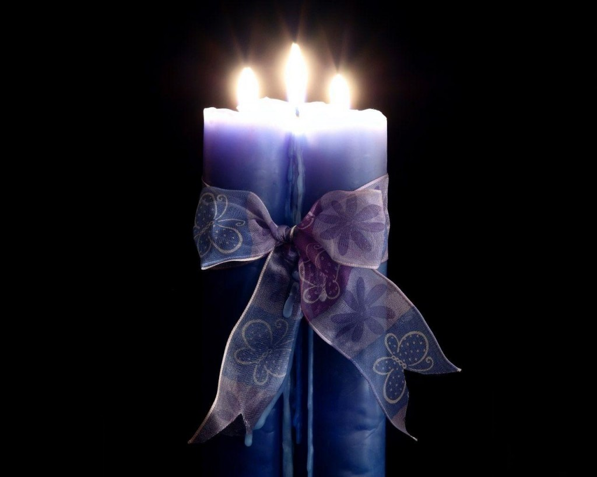

# ＜天璇＞我宁愿他死了

**忠于爱情，忠于那心动的瞬间，忠于那一会儿冷一会儿热的心悸，忠于那千山万水的跋涉只为见你一面……那么，就也需要忠于爱情的小性子，忠于它的反反复复，忠于它随时会变的特性，忠于它不许诺“永远”；** **忠于婚姻，就忠于志同道合的目标，忠于好与坏的患难与共，接受对方最坏的一面，忠于共同的认知——爱情最终会流失，但它已不再重要。**  

#  我宁愿他死了

## 文/ 向怡霏（The City University of New York）

 

微博上，曾有一个很热议的投票：“如果在你四十五岁的时候，你是愿意你老公死了呢，还是愿意他出轨了？只能二选一。”

朋友转发给我的时候，我说：“我宁愿他死了。”

而我们的爱情还活着。

但是，我也知道，这是不可能的。

但凡催人泪下的言情剧，总会在男女主角面对柴米油盐，两两生厌之前，安排个天灾人祸：不是女主角得了白血病，就是男主角老爸得了白血病。总之，用“死亡”来治愈爱情的一切隐伤，是编剧们屡试不爽的高招。

可惜生活不是言情剧。**现实中，很多普通四十五岁中年女人，面对的选择更加残酷：你老公是已经出轨了呢，还是在出轨的路上？你是离呢，还是忍着？要是忍着，你是拆穿了做个泼妇呢，还是不拆穿做个怨妇？**

看吧，这就是现实的腌臜。言情剧里，穷得没钱吃饭的小白领能住复式公寓，灯光亮堂，一尘不染，烦恼的也是些“红酒还是威士忌”的问题；现实中，小白领合租的公寓，换个裙子都转不开身，老鼠从大衣柜上跑过，哪有灯光师和道具师存在的空间呢？

在不那么唯美的中年，最有可能的，是被高血压和痛风等腌臜病缠住，他跑的气喘吁吁，肚腩颤动；而死神，还在几百米开外的地方，冷笑着等着呢。

现实的死寂，比死本身，要可怕一百倍。

很多的中年男人，他们战胜得了钱，权，却战胜不了欲望。就像爆出的前加州州长，前动作巨星的中年秘闻：阿诺，战胜过外星人，却战胜不了自己的下半身；他有了一切，名声，金钱，甚至政治权力，可他还想要13个婚内情人加一个私生女。

女人的心被一拨一拨的淋上汽油，国内某位青年意见领袖还要来点火：“人又不是车，哪有轨道可言，又谈何出轨。”

很多夫妻，“去年今日”还在秀恩爱，今时此刻，就已“人面不知何处去”。

诸多群众，基于对爱情的崇高敬意，以及对“小三上位”人人自危的恐惧，在微博上，论坛里，掀起了一波又一波的对爱情小偷的讨伐大战。

评论总结说：“中年男人，和野心女，是最大的爱情杀手！”

**其实呢，公平一点的说，就像那首歌里唱的，“****有时爱情徒有虚名”****，茫茫人海中，掀开一个个家庭的石块，爱情，大多数奄奄一息，甚至从未存活。**

**仔细掰着手指数一个个例子，在四十五岁之前，死掉的不太可能是他，反而大多是爱情本身；更有甚者，是亲手掐死了爱情，才走入婚姻的。**

某著名的婚姻与情感咨询专家说：“爱情，与婚姻，本来就是两码事。你要结婚，就要有把牢底坐穿的决心。”

**爱情，很娇贵，一点气温骤降就能让它伤风感冒，动作大点儿就夭折；**

**婚姻，应该很皮实，摔摔打打也没事，反正是要把牢底坐穿，蹦着跑着跳着也是一样——****天长地久的在一起，形式很多样，结果都一样。**

如此说来，罪恶的不是中年男人，或者那颗不安分的心；罪恶的是，拜了两个不一样的神。

有说：“你忠于什么信仰，它就会引领你去正确的地方。”

忠于爱情，忠于那心动的瞬间，忠于那一会儿冷一会儿热的心悸，忠于那千山万水的跋涉只为见你一面……那么，就也需要忠于爱情的小性子，忠于它的反反复复，忠于它随时会变的特性，忠于它不许诺“永远”；

忠于婚姻，就忠于志同道合的目标，忠于好与坏的患难与共，接受对方最坏的一面，忠于共同的认知——爱情最终会流失，但它已不再重要。

又拜佛祖又拜基督，又要脾气娇憨的爱情又要忠厚温顺的婚姻，是没有好结果的：神会发怒的。

回到最初的问题：你是愿意他死了呢，还是愿意他出轨？

我还是答：我觉得，他会死了。

因为拜了两个神的人，是没有好结果的。

 

（采编：陈锴；责编：陈锴）

