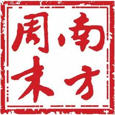
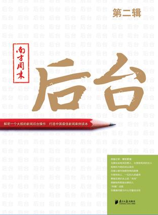

# ＜天璇＞我是南周实习生

**有人说，天下乌鸦一般黑，这是傲慢与偏见，但也是常识。不过，可以确定的是，南周的翅膀却是出奇的雪白。基于此，她有足够的底气在字里行间迸发出真相的助推剂和威慑力——让无力者前行，让恶意者屈服。**

# 我是南周实习生

## 文/ 林春挺（内蒙古大学）

 

我是南周实习生。

如此自称，在他人看来，这是虚荣，是卖弄，是借南周之光来抬高自我的恶习。其实，这种直觉的判断是准确无误的，社会上虚荣、卖弄的人本来就如此之多。不过在我看来，它出自我的真实和自由，就像呼吸一样自然而然，以至于我不需要多想而脱口而出。

短短5个多月的实习，我不敢说自己对南周有了了解——“了解”是一个理想的名词，世界上不存在这么一种东西——但我能把一些已拥有了的碎片组合在一起，用于替代不存在的了解。 就像许多人所说的一样，南周是社会的良心。因此，我不想借助展江的话说，中国有许多媒体，但真正的媒体只有两家：南周和《财经》。这话说得太过于夸张，夸张得接近乎事实，因为再也没有更精准、更全面的句子能够概括的了。 我也不想以陈丹青的话说，假如有一天南周不存在了的时候，中国就不知道是什么样子了或者“我从来不看中央电视台的”来凸显南周存在的意义和影响力，因为读者的来信和来电就是最好的佐证。 我也不想以周孝正因司马南对南周的无理笔伐而决意与其划清界限的例子来赞美南周，因为，任何对南周的赞美都是多余的。

我也不想以自己在msn上对南周说感激的时候，一位曾经在这儿战斗过的老师代表她接受我的感激来说明每一个离去的人都视南周为家来展现她的魅力和精神。 南周和《财经》均是悬崖边的舞者，不可忽略的是，南周在悬崖边可没有一张人工的保护网，正如《财经》的罗昌平所言：“为何大部队撤离时我留守《财经》？”因为“《财经》是反复考察后能发此稿（《再问央视失火》）的唯一渠道。”所以南周舞得行云流水的同时，还尽显勇者本质所应有的风范和气概。 就像许多人所说的一样，南周真是一块罕见的圣地——唯有神圣方可搪塞自己的疑惑——在如此的国度竟然依旧偏偏起舞，尽管她的每一个舞步都带着难以形容的艰辛。 罕见就是美，是魔力，是迷。为此，每一个有新闻理想的人，都想来到南周实现自己的职业理想，以南周之名来证实自己的实力。不是记者的奥巴马也不例外，唯有借以南周的独家采访方可以向国人交代。 有人说，天下乌鸦一般黑，这是傲慢与偏见，但也是常识。不过，可以确定的是，南周的翅膀却是出奇的雪白。基于此，她有足够的底气在字里行间迸发出真相的助推剂和威慑力——让无力者前行，让恶意者屈服。

就像许多她的实习生所感受的一样，在这里，你不需要像一个“懂事”的孩子一样不断地琢磨着如何来讨好哪一位老师。只要你愿意，每一个老师都是你的真心朋友，彼此亦师亦友。在这里，任何时候你都可以抽烟，喝茶，翘起二郎腿来侃侃而谈也无妨；在办公桌上，好吃的东西每个人都有份；在选题会和评报会上，你可以提出自己的不同见解，因为你也是其中一员；在协助老师们做稿子或者单独采写时，若你有闪亮的点子或者小小的突破，老师们不会错过每一次把你捧上天的机会——Good job!你太厉害了！我想表扬你！…… 南周不仅是现实的中国最好的新闻媒体，还是一所最好的大学。作为实习生，南周有足够的舞台任你展现。若你真“想干事情”，她保证让你空手而来，满载而去——仅就几个月的时间，你会讶异于自己在变化。就像唐姐所说，某某，我发现你和刚来的时候变了很多……你真没有白来这里。无人知晓南周这些魔力来自何处。 铁打的营盘流水的兵。和其他实习生一样，我没能经得住南周激流的考验而为她工作和战斗。我真悔恨自己天才的愚钝和习惯的懒惰，以至于在足足半年的实习期间仅学到南周牛的一毛，否则我就能真心地讶异于自己的变化。“当时只道是寻常”，再也没有一次重来的实习机会，我这“小伙子”真是糟糕。 不过，牛的一毛究竟也是一毛——不管怎么说，无论今后我走到哪里，我都携有南周的那么一段基因和源代码——就单单这一毛就足于让我对南周心存感激了。 临别感慨，到这里就是结束——我是南周实习生。

（采编：陈锴；责编：陈锴）
