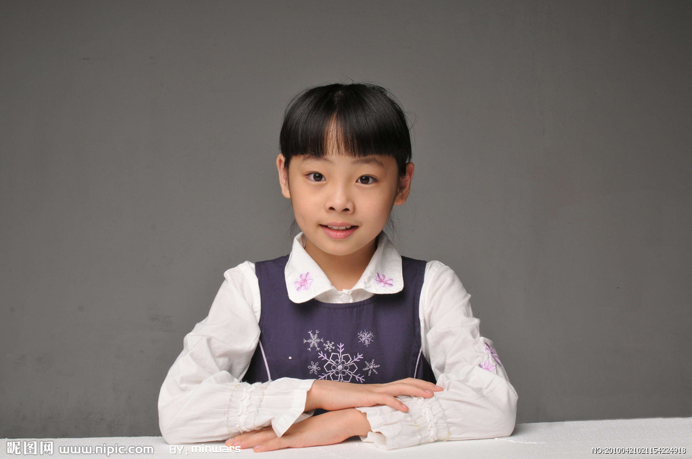
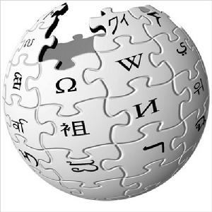

# ＜天璇＞我是怎样走出困惑的

**确立一个理想可能就在一念之间，但真的想赢得一些自己认可的东西可能需要很久，甚至一生的时间，这之间可能不断有亲人朋友姑娘抛弃你，亲人抛弃你，如果能解释就尽量的解释清楚，然后继续实现自己的理想，他们喜欢看结果，虽然当初阻碍你的可能有他们，但是你最终的结果如果是他们愿意看到的，他们也就放心了，虽然他们此时可能还是没有意识到当初的阻止和放弃是多么的愚蠢。**

 

# 我是怎样走出困惑的

## 文 / 王猛（北斗撰稿人）

 

#### **曾是集体里的一员**

离开义务教育已经5年半了，我已经记不清中国足球队又连续几年叉腰肌不好了，曾经暗恋的姑娘也在我的记忆中变模糊了，但有一件事情却非常难忘：高二因为上课指出老师的用词错误而被班主任和学生们投票，罪名是“接话茬”，全班70多个人，我以50多票胜出，更神奇的是第二名和第三名票加起来都没有我多。下课后几个和我平时不错的同学“安慰”我，算了，谁还没有过做错的事情……在回想这段往事的时候，我像那些官员开会一样总结了两点：第一，出来混，难免有踩到朋友大便的时候；第二，在某些学生的眼中，老师做的事情永远是正确的。

初中那会儿我还不曾怀疑一些东西，学校、教师、恋爱、语文、作文，英语等等，我和班上的孩子一样，是集体的一员，傻呵呵的听老师傻讲、傻呵呵地做看似有用的笔记、很用心在背诵老师说应该背诵的课文，却不曾问为什么一定要背过一篇课文、学校不让做的事情就一定有合理的地方、老师交代的事情一定要做好、被安排在座位的第一排是被老师重视，都是好好学习的孩子、被安排到最后一排的学生都是不学习的，很愉快的生活在这样的集体中，小学生守则到现在都背诵的很流利，热爱祖国、热爱人民、热爱中国共产党、好好学习、天天向上。后来才知道，原来热爱一个人或者事物是不需要背的，也不需要让别人说了算的，要热爱什么，不要热爱什么都是自己说了算，热爱或者不热爱，是个人的意愿，不能强加给任何人一定要喜欢什么，就像你热爱橘子，我热爱梨子，大家各有各的热爱，更不能说你热爱橘子比我热爱梨子要高尚。

高一以前，我一直都是一个“优秀”的三好学生优秀班干部以及团员，这个优秀的标准是：要么在班里的考试名次靠前、要么是班干部、要么会拍老师马屁、要么会帮老师做事儿、要么父母有在本校当老师的。或者干脆是主任或者校长。这个优秀无关你的人格，无关你的人品，也无关你有没有思想。我一直都认为自己一定能做集体里最好的那个，尽管成绩不怎么样，但我总是认为：只要能和老师，同学们处理好关系，我就很牛了。只要能认真做好老师安排的每一项任务，一步一步的走，没准到大学就能成为学生会主席，将来当个优秀的管理者，这样的目标一直伴随到我高一。

翻开初中写的日记，首页这样写道“新的学期新的打算，这一学期的学习，估计我要拼了，真的，该放下的始终要放下，这个阶段不是我谈恋爱，应该懂得怎么去奋斗，怎么去努力，这样别人才能让别人看得起我，才能有所作为。”后来我用王朔的话总结这段日记要阐述的观点，什么是成功？成功就是挣点钱，让傻逼们知道，并且热衷于让别人知道我是在努力，整段日记都透着钱的味道，这是我初中对“成功”的理解。

#### **独立意识的形成**

上高一的时候我问一个老师，为什么一定要热爱中国共产党呢？那个老师一脸的不耐烦“要是没有共产党，我们还吃不上饭呢，你也不会有学上，明白吗？”我当时并没有想别的，因为很多观念已经深入人心了，后来才开始思考，难道中国人都是傻子？连基本的种地养家糊口都不会？一定要让共产党人来指挥？

在没有严谨的启蒙书籍之前，我上过一年的广播电视编导课，这一年对我很重要，作为一个从农村出来的土鳖，本来只有老老实实学教科书考大学的命，但当我把学编导这件事告诉我父母的时候，他们竟然同意了，这在一个处处都不尊重孩子意愿的国度里已经算是奇迹了，与之对比，我经常能听到很多父母对孩子说出类似“学这个没前途”、“你一个小孩子懂什么？”原来，在这些“成熟”的大人眼里，一个人懂什么是用年龄来衡量，一些人之所以被称为“成熟”，只是因为年龄比别人大，而成熟和年龄大是否能划等号，还有待商榷，而他们眼中的前途，竟然和我初中写的日记中对“成功”的定义颇有几分相似，在他们眼中，有前途和是否成功都只有一个标准，那就是有钱。

高三那一年算是我被启蒙的开始，这一年的重要性就像一个从来不做身体检查并且得了早期肿瘤的人，一次偶然的机会检查出了肿瘤并顺利的做了手术。那一年的主要工作就是看电影，然后看影评，写影评……在胡乱看了几十部电影和一些影评后隐约感觉这个社会并不像老师和周围长辈说的那样，但这种感觉并不是很明显，将信将疑，要知道，独立意识的形成有很大的偶然性在里面，对那些思想已经僵化的，任何启蒙已经不再起作用了，因为这种人深信爱国主义是对的，是高尚的，深信“一个男人不抽烟，他就不像男人。”

独立意识的培养只对那些思想处在游离状态的人管用，因为思想没有被固定，还对这个世界充满了疑问，但一时又不清楚到底哪边是对的，这一点很重要，我高三思想就处在这种游离状态，这个时候绝对需要一些文字的东西帮忙解答一些疑问，但那个时候并没有意识到这一点，我是刚好碰上了，读了第一本书，韩寒的《通稿2003》，这本书给了我一些帮助，产生的那些无法总结的，半信半疑的疑问都解答了，高三，我毕竟不曾接触过太多事儿，又没有阅历，问题都是关乎我周围的，学校里的那些琐事，所以这本书可以解决我当时面临的一些问题。

在一个普遍“你这是叛逆期，很正常，过了这个时期就不这样了。”的环境中，我不得不开始怀疑自己到底怎么了，其实这是折磨精神的，因为当意识到自己可能和别人不一样，而这种不一样又无法自我判断是对是错，真是折磨的，于是开始问那些大人们，问那些长者，他们的回答惊人的一直，“你这是叛逆。”长期在没有理性可言的环境中成长导致的结果是，我到16岁脑子里还没有形成对错意识，更不要谈理性的看待一件事情，甚至对什么是“叛逆”，什么是“批判”都无法分辨。记得高三玩手机，外边下雪了，我在学校的贴吧发了一个帖子，写的是“今年第一场雪，你想起了谁？”，结果不到30分钟班主任就气哄哄的直冲我的座位，让我把手机交出来，我当然不承认自己带了手机，要知道高中是严禁带手机的，然后班主任把我叫到办公室，让我看贴吧，问这个有你头像的号是不是你？我有个“坏”习惯，填写很多网站资料都用真名和真头像，这个“坏”习惯到现在我都没有改掉。结果手机被没收，我被押送到年级主任那里接受教育改造。这样的经历迫使我想知道学校政教处是怎么知道我上贴吧和学校凭什么不让学生带手机的，其实说白了最初的独立意识是跟自己利益有关的，就这样查了几个小时的相关内容，其实这个时候独立思考已经形成了，当然，不是查了一次就形成的，而是对那些你发生在你身边并且认为对自己不公平的事情的不断自问和查阅。

高三下学期，我的主要任务就是逃课，上网，找自己想要的资料。现在每当有弟弟妹妹问我高三是怎么学习的时候，我都努力在这些逃课记录中搜索一些我认为在努力学习，并且他们也在认为我努力学习的桥段说给他们听。上学和学习有着本质的区别，在没有确定他们的确能分清楚它们的情况下只能这么做，第一是不掉面，第二总不能告诉他们我在逃课，上网，在高三这么一个“重要”的时期，这些词汇在他们眼里就跟“不务正业”“不学习”，甚至“坏孩子”挂钩，而当他们看到我写的一些文章的时候又会觉得你不可能是这样度过的，这会让他们更加矛盾，而父母经常又会在这么一个“重要”时期里不断的提醒他们，“你想多了，你现在的主要任务就是学习，别的都不要想。”实在不想让这个事情的弟弟妹妹夹在中间不知如何是好，我宁愿他们顺利结束了高中生活，再花时间告诉他们一些事情。

对我而言，高三下学期这段经历非常重要，因为这是一个独立意识的开始，这个意识的出现很重要，没有这个意识，也便没有独立思考能力，虽然那时我不清楚这是独立思考意识，更不清楚什么是批判性思维。这段时间主要就是看一些文章，我记得我上百度查的第一个词就是“叛逆”，什么是叛逆？然后把这个词的解释放到自己身上对比一下，看看自己是不是叛逆，发现有点像，但也有点不像，像的地方是都有反叛的思想和行为……但不同的地方是我并没有强烈的表现欲，也不想标新立异，我开始怀疑那些长辈们告诉我的那句“你是叛逆。”

#### **看到了不同的世界**

18周岁，来到北京，进入了所谓的大学，不断有长辈告诉我“大学是一个小社会，你要懂得适应，这样到了社会中你才不会吃亏。多和老师同学们搞好关系，他们都是你以后的关系网。”就在这几句话不断在我耳边环绕的时候，无意中在网上知道到了罗永浩，那是大一上学期，看了他的演讲视频，听他讲自己的经历，我就把他演讲过程中看过的书名都记下来，我记得他推荐过王怡老师的书单，于是也开始找那些书，却发现很难看懂，那些难以下咽的文字总让我犯困，干一件事情总是处在“硬着头皮”总不是好办法，其实这个时候对于文字里的东西热爱程度并不强烈，只是认为牛人都是多读书的结果，并幻想自己也要成为一个牛人，后来同样是在罗永浩的演讲视频里知道了牛博网，这个网站都是一些精短的文字，篇幅都不长，却很精髓，那些牛逼的作者，那种感觉会让我感觉非常过瘾，读起来就一发不可收拾。

我很庆幸自己在没有读过成功学，言情小说的前提下就读了那些优秀的文章，少走了很多冤枉路，这个时候我再反过来去看一些成功学大师写的成功学书籍已经很难下咽了，那些穿越小说，那些内容空洞的风花雪月，着实让我难受。越是看那些文章，越是容易对一些问题提出疑问，而有一些问题总不能让我顺利想通，并且不断有人在你坚持做一件事情的时候打击你，这些人多数是一些有一定阅历的长者，在理想破灭之后转而打击有理想的人，“中国的现状就这样，你改变不了的，你看国外就一定好吗？，一定要学会适应环境，要不然你会吃大亏的，像你这样愤世嫉俗的人，走到哪都不会成功的。”而胡平的《犬儒病》却是一个例外，这是为数不多的让我能突然就明白了一个团体的意识形态的，这种感觉，就好好像有人给了我一个耳光，而我又不想躲。

神奇的国度，总有这么多神奇的事情，而总有一些疑问困扰着自己，强制拆迁，城管施暴等等，梁文道的《常识》帮我解决了一些疑问，《常识》所集，卑之无甚高论，多为常识而已。若觉可怪，乃因此为一个常识稀缺的时代。一个优秀的时事评论员总会给我意外的收获，在看了众多的评论员写的时政评论后，然后由自己来分辨哪个是合乎理性的，这样默默的关注了一年多,这个时候再去翻阅一些系统的书籍就容易的多了，因为感觉到自己已经不是因为文字写的有却而喜欢，而是文字里的思想和那些对这个世界的思考和和最求，最先接触的就是王小波，最先读的就是《黄金时代》，在一个人性受压抑的时代里，处处受到不公平的待遇，但他却摆脱了传统文化人的悲愤心态，创造出一种反抗和超越的方式不断的盘问“性爱”的本质，一层一层的盘问下去，然后开始读王小波全集……

在不知不觉中，独立思考的能力其实已经形成了，已经不再是独立思考的意识有没有的问题了，只是这种能力非常小，独立思考能力多数是被我们的教育剥夺没了，或者就没想让你有这种能力，如果想用简单的方法判断自己有没有独立思考的能力，只要看看央视的新闻联播，有多少是你觉得很假的，就能基本判断自己有没有这种能力了。

后来，当我想了解美国的制度，美国的一些事情的时候，林达的《近距离看美国》系列和易中天的《艰难的一跃：美国宪法的诞生和我们的反思》又给了我新的启示，第一次知道了原来华盛顿打跑了英国殖民者又跑回了种植园，3年后才回来当了总统，这才是那句“不是我想当总统，是大家选我当总统。”真正的解释，了解一个国家的政治制度，一个国家法律体系的运行，一件刑事案件的诉讼和审判过程，然后又是刘瑜的《民主的细节》等一些介绍美国的书，和教科书里的说法截然不同，甚至是颠覆性的。

我俗称是文科毕业的，在充满谎言和广告的政治和历史教科书中，实在不敢称呼自己真是文科生，即便这样，学文的也应该都知道，高中历史教科书里关于孟德斯鸠的《论法精神》和卢梭的《社会契约论》是一笔带过的，只给出了两个人名，两个书名，殊不知，这两本书里的内容才是值得阅读和学习的，即便是国人翻译的，也是值得一看的，在阅读一些有关“主义”的书的时候，出现大量的关于“主义”的词汇，这个时候，维基百科就派上用场了，帮助我提前了解各种主义的基本定义和特征，我高中那会是用百度百科的，但在做了很多搜索后发现百度百科是给具有中国特色的地区使用的，维基百科才是世界性的百科。前面说了，我对于这种怀疑的意识已经形成了，只是并不知道有批判性思维，反正知道这不是“叛逆”，在查了大量有关“主义”的词汇后，逐步开始分辨他们的区别，这个过程同样很重要，不用担心，你在搜索维基百科有关“自由主义”这个词汇的时候，下面会有各种别的“主义”的链接，什么“保守主义”“无政府资本主义”“自由意志主义”“新自由主义”“社会主义”“民族主义”等等都是成串出现的，为了弄清楚这些东西，我曾经痛苦了很久，这个时候再去王怡老师推荐的书单就比较容易一些了。

因为一种神奇的力量，导致我身边的很多朋友对于类似“批判性”伴有生理上的反感，只要一提“批判”就自动跟“愤青”、“愤世嫉俗”联系起来，当我提到“批判”一词的时候，我能看到他们在皱眉头，足可以看出他们对“批判”一词的误解程度。这逼迫我不得不换了另外一个相通词性的词，我们也可以称这种思维方式为“明辨性思维”，或者叫“严谨的思考”，当对方真的理解并且看过了这本书后再回来使用“批判性思维”效果要好很多。很多父母经常给孩子说，“你要听话。”这里有个疑问，难道只要是父母说的话就一定要听？我们到底是要听父母的话，还是要听从父母口中说出的正确的话？《学会提问—批判性思维指南》这本书就是在培养这种分辨能力。而“要孝顺”这句话也就不攻自破了，孝怎么理解？顺又怎么理解？难道孝就一定要顺着父母？不顺着他们就一定是不孝吗？

虽然有时候父母总是不能理解我在做什么，或者想做什么，他们喜欢让你按照他们认为“幸福”的路走，回家考公务员，做一个为高墙填瓦和小人有关的人，我一直都在努力用通俗的济南方言让他们明白人们对“幸福”定义不同，路应该怎么走要问我，这是我的自由和权利，在努力做了很多次的努力之后，他们终于隐约明白，他们的儿子已经长大了，自己能做主了，虽然个人的自由和权利并不是由年龄说了算的，但总比他们整天逼迫我做他们认为对的事情要好一些。

确立一个理想可能就在一念之间，但真的想赢得一些自己认可的东西可能需要很久，甚至一生的时间，这之间可能不断有亲人朋友姑娘抛弃你，亲人抛弃你，如果能解释就尽量的解释清楚，然后继续实现自己的理想，他们喜欢看结果，虽然当初阻碍你的可能有他们，但是你最终的结果如果是他们愿意看到的，他们也就放心了，虽然他们此时可能还是没有意识到当初的阻止和放弃是多么的愚蠢。

不是为了让别人看才去做这样的事情，而是做成了，你爱看不看。

努力实现自己认为正确的理想，朋友抛弃你，可能他们本就不是有理想的人，也理解不了你在做的事情，但我相信总是会有有理想的人愿意跟你顺路，做你的朋友，一起去实现理想。

当我坚持不下一件事情了，就会看看上面的话，理性并且激情的为理想活着。

做不了陈光诚，但也不做为高墙添瓦的小人，这就是底线。

 

（采编：徐毅磊 责编：麦静）****

 
