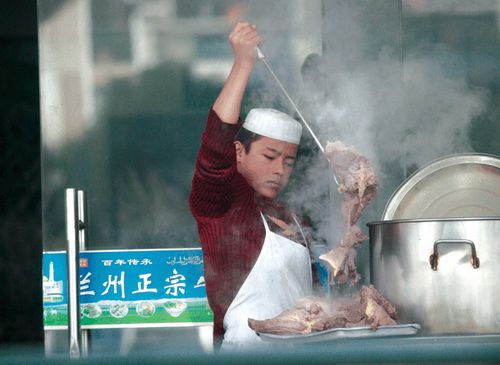

# ＜天璇＞我的那碗兰州拉面

**这就是为什么我担心我可能并不喜欢真正正宗的兰州拉面的原因。我总是觉得外地那些不正宗的兰州拉面里有一种特殊的情感。远离故乡的人，往往最希望吃到放心可口的食品。各地食品口味不同，面条恐怕是最有共性的，大多数地方的人都能吃得惯，而且制作简单，下锅几分钟就好。热乎乎地吃上一碗，然后匆匆再消失在旅途上。胃连着心，吃得好不好最能直接打动人的内心。无论是对开店的人来说，还是对来吃面的人来说，那一碗面条可能包含了共同的情感：漂泊中的孤独感。**  

# 我的那碗兰州拉面

## 文/马特（北京师范大学珠海分校）

 

越是熟悉的，越容易被忽略。我吃了那么多次兰州拉面，竟然从未写点什么，愧疚。

唐代的诗人宋之问在他的五言绝句《渡汉江》中有这么两句很有意思的诗句：近乡情更怯，不敢问来人。我一度以为应该是近乡情更“切”才对呀，越是要到达家乡，越应该感到急切不是吗？后来我自己成了离开家乡上学和工作的人，我才真正理解了“近乡情更怯”的心情。远离家乡，自然是带着期许的，当快回到家乡的时候，不知道家中发生过什么，也不知道家中对自己的期待会不会落空，看着年渐衰老的父母，再想想自己依然没有事业和恋情，不由得胆怯心虚。

对于兰州拉面，我一直也是抱着“近乡情更怯”的心情的。我曾有几次机会去甘肃旅行，但是我都主动放弃了。因为我担心这座城市和我想的不一样，同样我也担心真正正宗的兰州拉面和我平时吃到的不一样。经常有兰州人告诉我外地的兰州拉面根本不是真正的兰州拉面；还有的告诉我兰州牛肉面、兰州拉面、兰州牛肉拉面这些叫法都有什么不同。然而我在这篇文章里所要讲到的，也许就是那不正宗的外地兰州拉面——因为那种不正宗的外地兰州拉面却对我有着一层特殊的情感。

也许我永远都不会去尝试真正正宗的兰州拉面。因为我担心也许真正正宗的反而不合我的口味，或者少了那种外地兰州拉面给我的特殊情感之后，吃起来没感觉了。不过我却对兰州拉面以至于兰州都抱有着一种特殊的崇敬，我觉得这种崇敬也许还是带着距离会更美好一些。

犹如金庸小说中最传神的一个人物莫过于独孤求败。然而小说里对独孤求败却从来没有正面的描述，而只提到了学得他一招半式的令狐冲和杨过有多么的不得了。武侠小说里真正的绝世高手往往是不显于世人面前的，江湖上从没有人见过，但是江湖上却满是关于他的传说。

兰州拉面恐怕是我吃过的最养人的食物。无论是一天疲劳工作下班，还是病来如山倒，只要一碗拉面下肚，马上就能恢复状态。好的食物不仅仅是饱腹的功能，而是能给人带来生命力，带来精气神。

每次坐到我家小区楼下那家兰州拉面馆，叫上一碗拉面，不多时就会看到伙计把面端过来。武侠里形容高手到来，往往是众人感受到气场变得凝重压抑，空气似乎凝固了一样。那么在看到伙计把拉面端过来的那几秒钟，我也会感觉空气似乎凝固了，周围一切似乎都在放慢动作一般，香气飘来，环绕四周，越来越浓郁，最后伙计把碗落在我面前，和桌面轻轻地一碰，那空气就仿佛瞬间震裂开了，周围世界又恢复了正常的速度，我凝神定睛一看，一碗满满的拉面摆在面前，心中如释重负一般的轻松感。（这时的台词是：众人顿时放下兵刃，抱拳拱手行礼，口中纷纷说道：原来是拉面大师，久闻大名如雷贯耳，今日一见三生有幸，有失远迎，还望大师海涵。）

中国的饮食文化向来讲究食物的造型，也就是卖相。很多人会觉得一碗兰州拉面是没有卖相可言的，是很低级很廉价的街头小吃，是属于农民工和长途货运司机的食品，这实在是一种误解。一碗拉面，白色的素雅面条打底，中间铺上几片牛肉，撒上翠绿的香菜葱花，点缀一些辣椒，简直就是一幅留白得当的中国山水画。

当然还是有人觉得这样说太牵强了，兰州拉面就是很不好看很没卖相。北宋刘道醇《圣朝名画评》中认为“李成之笔，近视如千里之远；范宽之笔，远望不离座外”，范宽有一幅作品《雪山萧寺图》，其实画得很简单，而且构图很奇怪，本来是主要表现的雪山中的那座寺庙，却在崇山的隐藏中若隐若现，一眼看不仔细还会看不到，然而这恰恰是范宽的笔法功力，极力的表现出雪山的雄健高寒，配以天空的阴霾，却反衬出那幽幽山谷中寺庙的意境。

兰州拉面也是如此。这种在外人看来很粗犷、简单、随意、没什么章法的外在卖相，实质上就是为了衬托出品尝其味道的震撼，就如同《天龙八部》里的少林寺扫地僧一样，平凡的外在却以实力压倒众人。重剑无锋，大巧不工。足够雄浑的实力，根本不屑于外在的修饰。洪七公教郭靖降龙十八掌的时候说：黄蓉的武功虽然招式繁杂，却很多都是花把式，无论她出什么招数，你只用一记亢龙有悔打过去，就全破了她的章法。

兰州拉面的味道，按理说我是该重点说的，但是反而我现在什么都写不出来。我不知道怎么形容那种感觉，好像一提到兰州拉面的味道，就到了“手中无剑，心中也无剑”的空明境界。因为在我架起第一口面条开始，到喝下最后一口汤结束，时间和记忆仿佛被偷走了一样，我全然不知道这段时间发生了什么，也全然想不起自己是怎样的感觉，望着空空的碗，只能想起一句话：

天空不留痕迹，鸟儿却早已飞过。

兰州拉面似乎已经和回族这个民族形成了完全的必然联系。这个民族似乎自诞生起就四处散居，无论哪个城市都会有回族定居。而兰州拉面也随着这个民族走到了全国的各个角落，甚至在青藏铁路沿线也有商贩架着一口锅卖兰州拉面。这种食物似乎就是被选定成为了回族的象征，象征着这个民族孤独的命运。

兰州拉面馆大多是很小很破的，一般是一家人开的，整个集市或者整条街道也许就这么一家清真饭店。甚至周围也许就这么一家回族，孤零零地守在那里，挂着绿色或者蓝色的招牌，戴着小白帽的伙计坐在店门口看着锅，不知何时开始背井离乡，来到陌生的城市，听着陌生的口音，看不到熟悉的同族人也无法方便吃到清真食品。然而生活就是这样逼迫着人一步步地向前艰难地跋涉。

在澳门能够感受到一些残存的葡萄牙文化，比如“法多”音乐，那种带着忧郁的平静，犹如当年那些远离家乡到达澳门的葡萄牙人的心情。他们也许觉得那狭窄的水道和丘陵起伏的地势，简直太像葡萄牙故乡了。有一道很有名的葡菜叫“非洲鸡”，其实是地道的澳门菜，因为是在莫桑比克的葡国水手带到澳门的，不是葡萄牙本土菜。对于这个航海的民族来说，有太多远离家乡的故事；而这些远离家乡的故事，慢慢地形成了这个民族自己的文化，无论是远航的水手思念故乡，还是故乡的亲人担忧前往殖民地的航船，都如同“法多”音乐那透着平静忧伤的调子一样。

这就是为什么我担心我可能并不喜欢真正正宗的兰州拉面的原因。我总是觉得外地那些不正宗的兰州拉面里有一种特殊的情感。远离故乡的人，往往最希望吃到放心可口的食品。各地食品口味不同，面条恐怕是最有共性的，大多数地方的人都能吃得惯，而且制作简单，下锅几分钟就好。热乎乎地吃上一碗，然后匆匆再消失在旅途上。胃连着心，吃得好不好最能直接打动人的内心。无论是对开店的人来说，还是对来吃面的人来说，那一碗面条可能包含了共同的情感：漂泊中的孤独感。

 

（采编：黄美琳；责编：何凌昊）

 
