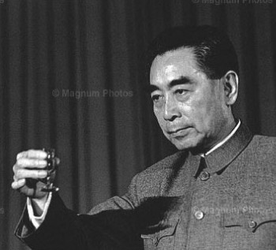

# ＜天璇＞我累了

**席间，一客人说自己肝硬化已经不能喝酒了，我举杯敬他早日康复，众人都叫好，在一个个毒辣目光的逼视下，他一饮而尽。肝硬化，差不多肝已经不行了，要么引发癌变，一个人能有几个肝啊，在去往西天的路上，我也送了他一程。我很难过，我也是一个刽子手。**  

# 我累了

## 文/寒蝉（浙江财经）

 

最近心里颇不宁静。

工作中苦点累点，被客户骂点，都没有关系。打扫卫生，洗厕所，倒垃圾，都OK。吃饭不准点，空气不流通，时常要憋尿，也就这样。唯一恨的就是应酬。

女生长得漂亮点，被拉去陪客的频率就比别人高点，风险系数就比别人大点，悲剧发生得也就多点。

一女生刚订了婚，怀孕一个多月不自知，被领导拉去喝酒，回来后大吐，过了几天大出血，孩子流掉了自己也在生死线上捡回一条命。没有人去追究责任，仅以为个人身体素质不好引发的悲剧。只有我心里泛滥难受。那天先叫的我陪客，我拒绝了，叫另一个，也拒绝了，最后叫的她。

我自以为聪明，席间耍尽手段，尽可能的避免了喝酒。其结果就是我的同伴遭了秧。每次都载着已经稀里糊涂软如面条的同伴收拾残局。席间，一客人说自己肝硬化已经不能喝酒了，我举杯敬他早日康复，众人都叫好，在一个个毒辣目光的逼视下，他一饮而尽。肝硬化，差不多肝已经不行了，要么引发癌变，一个人能有几个肝啊，在去往西天的路上，我也送了他一程。我很难过，我也是一个刽子手。

席间，有个客人是大家众所周知不能喝酒的，他在几年前喝酒后血管爆裂，昏迷了十五天，艰难复杂的脑血管手术后硬是把他从鬼门关拉了回来。是的，他是幸运的，酒后死掉的不在少数，他还活着，假如当时再厉害点，也就见不到他了，酒桌上，确实有人存在过，后来再也见不到了。难道都等到悲剧发生了，物竞生存，能够留下来的人才有资格喝白开水吗。

席间，有人指着一群女生说：书上说经期喝酒对身体没有影响的。领导皆赞成。当时我就想把酒瓶砸到他头上然后说：书上说酒瓶与头接触对身体没有影响。

我厌倦了。厌倦了在酒桌上斗智斗勇。厌倦了无聊的互夸吹捧。厌倦了把脸笑僵对着这群没有素质的畜牲。连马斯洛最底层的生理需求都达不到，更别说被尊重了。木有人权。

我累了。我还要在年终结算绞尽脑汁想着如何逃过这一劫。12月31。

哦上帝啊，救救我吧。

 

(采编：黄理罡；责编：黄理罡）

 
