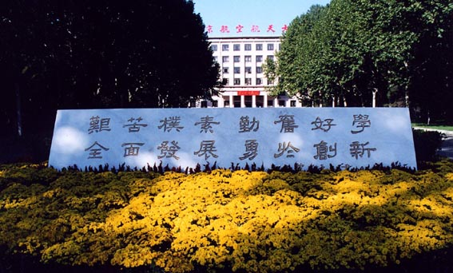
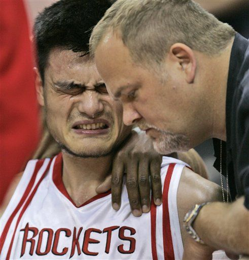
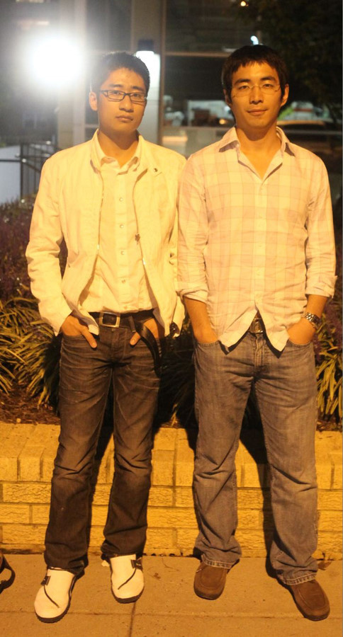

# ＜天璇＞我要跑路了

**此时，我是彻彻底底地感到作为一个支那人的悲哀，但是暂时真的又不能怎么样。只好打算好歹先毕业再说。君子报仇十年不晚，我当时的妥协也是暂时的，即便当时不能把他们怎么样我也不会放弃反抗，这也就是我妥协拿毕业证学位证的一个重要原因——为了跑路！**  

# 我要跑路了

## 文 / 张博（北京航天航空大学）

  说起跑路，还得从我高三开始。 那年，我第一次听说很多考上清华北大的学生可以留学美国，当时的感觉就是“挖槽，牛逼，我也要嘛～！”此时的我满脑子就是想考个名牌大学，就是想证明自己比别人强，可以说对人生对社会的认识就是优胜劣汰、弱肉强食、适者生存。因此，留学这种事对我来说不过是考名牌大学的加强版罢了，尤其是，当别人也这么说的时候—— “以后你们中优秀的保研，更优秀的直博，最优秀的出国！”这是在我终于被北斤韩空韩天大学上了后，大一入学学长给新生打的第一炮。然后，我们就像其他一届届脑袋空空的北航学子们一样，傻逼兮兮前仆后继地奔赴保研直博的阳光大道了。我也曾是其中之一。 不过，我也不是很清楚自己为什么越来越偏爱起法律这面挡箭牌而最终变成了个特立独行分子。也许是在北航这个洗脑大本营经历的一个个人和一件件事改变了我的想法，改变了我对社会对人生的认识，改变了所谓的三观。举两个例子吧： 第一个例子是大二或是大三时有次在北航南门外排队买早饭，当我排到第5、6个时有个貌似北航某青年教师的男子直接插到第一个买早点： 

 “要一个XXX”， 我很生气地上去拍了下他肩膀说： “喂后面排队去。” 他猛地转头对着我大叫： “你这人什么素质！北航的学生怎么这个素质！谁教给你的！？” 我一下就傻了，看了下周围排队的人各个对我一脸不屑的表情，估计是我已经激起了民愤，谁都懒得屌我了。后来插队男子潇洒地大步走进北航校门而我这没素质的买完早餐没有回教室上课，而是在楼道里一个人呆坐了很久。 第二个例子是后来大四快毕业的时候，有件事着实戳痛了我的菊花。 临毕业前我们学院组织了一个研究生、教职工男子篮球比赛，我们这些大四的也受到邀请，纷纷加入毕业设计所在教研室的篮球队。这样一共有几支以教研室分组的学生队伍和一支由博士生、教职工组成的教工队。 比赛单循环进行，我们队的最后一场对手是教工队，赛前当值裁判特地跟我们队交代了一下：“他们那边的犯规我们一般就不吹了啊，呵呵！”我们也“呵呵”地应了一下。开打后，上半场时教工队的博士生中锋动作十分粗鲁，裁判熟视无睹，于是好戏终于在下半场上演。先是在我方一个进攻回合中该博士中锋一掌打在正在持球突破的我方后卫脸上，后者应声倒在场外，紧接着在我方下一个进攻回合中我接被打脸后卫的传球直接三秒区内正面双脚起跳上篮，博士中锋补防，我先跳他后跳，结果他还是封不到我的球就一掌打在我脸上，我在空中向后倒去，左腿以有点拧着的姿态着地，此时我明显感到左脚踝中两块相邻但本不该接触的骨头紧紧顶在一起，紧接着，180斤体重的博士中锋压在我身上——“咔”一声，我抱着左脚踝倒地不起。 我被队友抬出场外，之后大概过了几分钟，我缓过来点，气呼呼凶巴巴一副报仇雪恨的架势站起来，围着我的一圈儿人都惊恐地看着我，我把这圈儿人翻过来倒过去的扫了两遍，咦呦我艹～博士中锋哪儿去了！再一看，丫在后面正跟女友聊天呢！一看这我肺都气炸了，走过去道： “你叫什么？” “XX” “你住哪儿儿？” “清河，你来找我来啊？” 我扬手就要打，结果马上被在旁边围观的院篮球队长拦住，这时又上来一个，两个人把我拉开。后来经过一系列混乱、去医院、照片子、打石膏后，我老实了——左腿腓骨骨折，就是脚踝那个球球一样的骨头斜着完全断了。当时我心想这下完了，但谁知道高潮才刚刚开始。 

 诸位跟兲朝混这么多年了，傻子都知道有权有势有地位在这里等于有法。不过我当时并不知道这些，至少知道得还不够，因此竟天真地想要拿法律当挡箭牌，现在想想，真他妈太天真了！这位博士中锋同学本来就是在读博士，据说导师还是我们学院的某位牛人，而我呢？本科生而已。因此院方给的意见就是大事化小小事化了，博士同学赔礼道歉完事。（我甚至怀疑赔礼道歉是不是也跟我家是北京的有关，要我是外地生呢？）而我则坚决要求赔偿——好歹哥好端端的就断了条腿啊！看我家这么坚决，有位主管学生工作的马导给我妈打了电话： “这件事咱们最好还是不要闹大，张博现在正在做毕业设计，如果过不了的话可毕不了业啊！” 赤裸裸的拿学位证毕业证威胁我！另外，起诉都是需要证人的，一个本答应替我出庭作证的当场重要证人也是我曾经的同学兼好友在我后来求他替我出庭作证时跟我说： “你让我给你出庭作证……问题是虽然我现在毕业了，但是如果以后想回学校找刘导办个事……我也跟家里商量了好久，所以……” 于是乎，我妥协了。腿折了，白折，医药费花了，白花，赔偿，想都别想——“都给你道歉了还怎着啊！”最后我想医药费学校总可以报销吧，我们大班的刘导告诉我： “学校报销医药费都是在每个月的X号前，现在这个月已经过了而你下个月就毕业了，所以没法报了。” 此时，我是彻彻底底地感到作为一个支那人的悲哀，但是暂时真的又不能怎么样。只好打算好歹先毕业再说。君子报仇十年不晚，我当时的妥协也是暂时的，即便当时不能把他们怎么样我也不会放弃反抗，这也就是我妥协拿毕业证学位证的一个重要原因——为了跑路！ 到这时，我那张无知的脸已经基本被党妈妈和祖国一巴掌一巴掌地抽醒了，当年我为了提高自身知识水平顺带做做高人一等的美梦再顺带回来报效个祖国而留学，现在我为了追求更加公平、公正、正义和民主的社会而跑路，为了自己的自由而跑路。每想到此，真是不得不泪眼婆娑地说声“感谢party”！而且，跑路美帝这等事情也不是像我这种天赋平平的人想跑就跑的，其中克服各种各样困难的动力更是来源我们“亲爱的党国母亲”！ 就比如说吧，我英语一向烂到掉渣，大概就是诸位大学班里最差的那个人的水平。记得大一第一次期中考试，成绩下来后老师在上课时发给了每个人考试卷子，我们班英语都挺牛逼的，80多90多比比皆是，70多就很罕见了，我一看自己——我去你妈59.5！还没等我缓过劲儿来，班里一同学走过我课桌扫了眼我卷子，立马头转到另一个方向说： “怎么咱们班除了90多就是50多的啊？” 你妈我当时那张黄脸变红的速度就好像交通灯黄灯跳红灯一样。当然，这也不过是兲朝生活中立志的一个小插曲。于是乎，在英语上我始终身残志坚地努力着，直到认识了我家领导，她终于把我领入了门，最后在研究生阶段搞定了那几门蛋疼的英语考试。 不过，党国妈妈的考验不会只是这么简单的。 大家都知道，留学美帝除了要过学校录取这一关外还有签证这另一关，后者难度并不亚于前者，尤其是对我这种背景的人来说，而且尤其当我还不知道其难度的情况下。 一开始准备面签的时候，几位在美帝的好友都告诉我F1签证灰常easy啊，一般都水过，不卡人！于是我真的有些掉以轻心，虽然事后发现不掉以轻心也没什么区别。真正意识到事情的严重性是在面签的头一天，我跟一个在美帝熟知签证的朋友通了电话，他直接告诉我： “我认为拒你的可能性到不大……不过很可能会check你，你看你们那学校基本就是军校了，你还学航空发动机，然后还读了硕士，这就是说跟CCP联系就更紧密了，然后呢，还有工作经验（技术间谍？），再然后呢，有了硕士文凭还去读硕士（我承认我吃饱了撑的），这太像共谍了！你就是他们check的重点目标，我觉得他们不会让你过去。” 结果正如这位大牛所言，签证官一听我的educational background就正眼不看我的开始要我的resume, advisor information and study plan，之后马上就告诉我3周check。后来，等我等到10天左右的时候，使馆发来邮件，告知需要我导师提供额外资料用来回答他们关于我的一共5点疑问。我跟大牛交流了一下事态进展，他说： “我觉得太难了，你早作其他打算吧。” 之前那几位签证乐观派好友也有发来唁电 “I feel so sad for you.” 到这时候，我真是也觉得没戏了，我跟党妈妈太亲，美帝怕我了啊！可实际呢？我又是个彻头彻尾的反party分子，这就叫猪八戒照镜子——里外不是人！ 不过我还是决定一试，联系导师三番五次的催他帮我交材料，最后使馆发来第二封邮件说5天之内不交就拒我了，我心急火燎的给导师打电话，说到“5天内不交要拒我”时那边哥们竟“嘎嘎嘎”笑起来了——老美的乐观精神真是欠爆啊！ 然后呢，我他妈竟然还真过签了。 大家都以为这下要跑路成功了吧，其实不然，不过这要从今年4月份说起。 话说由于ccp恩赐，我在兲朝是个特立独行的份子，于是免不了只能要在网上结交另一些特立独行的分子，这就造成了交友不慎——今年4月，有个叫推倒柏林墙的人来帝都访问，我跟这厮见了两面，临走的时候他要我向李硕转达问候，并递给我一张卡，我没细看倒底是什么东西，只看到卡上貌似有HIV三个字母，接着推倒兄说：“9月如果我不能去美帝，那你就帮我把这个（卡）带给李硕吧！” 

 这下，哥就跟大多数不明不白就变成HIV carrier的人一样变成了HIV carder。 你说，丫的推倒柏林墙没想过我出国还要体检吗，丫知道我翻开体检卡看HIV negtive这一行时手有多抖吗！后来我才知道，原来这两个HIV还不是一回事，妈的，还得再次感谢兲朝生理卫生疾病性教育啊！ 现在，这一切都已经过去了。终于，要跑路了。 不过我知道党国妈妈依然在watching over me, 因为，由于我要在伦敦转机，还得求发改委和不列颠革命小将们手下留情。 最后，诸位我的小学、中学、大学、硕士同学、家人、朋友、网友们，骂过我傻逼、2逼、装逼的各色老少爷们姑奶奶们，咱美帝见吧！ 我背井离乡，感谢Party!  

（采编/责编：黄理罡）

 
