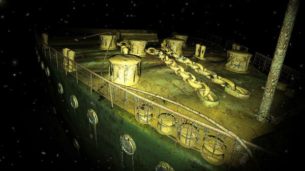

# ＜天璇＞所有旅途中的爱情都注定停留在旅途上

**在Rose之后84年的生命中，她或许遇到了无数的挫折和苦难，也许依旧承担着之前让她手足无措的压力和无奈，可是有那么一个人，曾经如此恰好地出现在她浪漫的风华时代，出现在她最为孤独无助的精神世界。有那么一个人，曾经让她许诺坚强地活着，曾经为了救她而选择安静地死去；有那么一个人，曾经带她走进一片安详宁静的世俗海洋，让她勇敢无畏地生活下去，让她记住那双澄澈的双眼，让她在84年后想起还怦然心动、泪水恣意。**  

# 所有旅途中的爱情都注定停留在旅途上

## 文/张畅（浙江大学）

 

泰坦尼克号开始下沉，漆黑的夜、苍茫无垠的海洋吞没了人们的尖叫声。救生艇顺着绳子放下，Rose抬头望着Jack的那一刻，烟火在夜空里升腾。我瞥一眼周围的人，大多面无表情。回过头，我突然想起了旅途中的爱情。旅游就如同在船上，等船靠了岸，各自道别、珍重，大多不会再见。而那种分别的感觉，同泰坦尼克的沉没别无二致，虽称不上生离死别，也让人感到戚戚然。

印度，新德里。一个帅气开朗的小伙子，操着浓重的印度英语，十几天来陪着我们，去泰姬陵、去红堡、去博物馆。帮我们提行李、找车、做导游。按照印度的种姓制度，他是刹帝利，是印度教徒。他坦称自己没有钱，在餐厅打工只是为了养家糊口。有一个姑娘喜欢他很久，可是他不爱她。当我们一起在印度的街头来来回回地走，他热情大方地和当地人介绍我们，总是能吸引很多印度本土人的注意。他教会我吃印度的香料、告诉我拍照的位置、让我躺在公园的草坪上晒太阳。

傍晚作别的时候，他会挽起我的手吻一下，然后站在旅社楼下仰望。他很少讲黄笑话，却因为我说话歧义笑不停。离开印度前两天，他当着我的面哭了。飞机起飞的前几个小时，他低落得像一只小猫。在机场候机的时候，他一句话不说就消失了，打电话过去，那边只有哽咽。

一年中，facebook，skype，gmail. 他的样子渐渐模糊。他有很多账号，骚扰成了常态。只留下厌烦和躲避。

我宁愿时间只停留在出发前的当晚，我们在新德里街头的公园里看天上的飞鸟，一句话都不说。他读书不好，不知道很多事情，包括泰戈尔的诗。可是他的眼睛是我见过最深邃的眼睛，他有一个男孩调皮的性格。只有在他的国度中，才显得如此可爱。

英国，爱丁堡。六十几岁却身体强壮的大叔挽着我，在晴好的一天走遍爱丁堡的大街小巷。他告诉我那座山的历史，告诉我天文台上钢球的起源，告诉我罗琳创作哈利波特时咖啡店的那扇窗。坐在安静的咖啡馆，我们聊起人生、旅行和爱情。他打开他的电脑，给我看他全世界旅行的照片，他两个漂亮的女儿。他请我吃最好的披萨，临走前买礼物给我。

前一晚，在青年旅社，我用一个晚上说服自己相信他，说服自己第二天让他充当我的导游。而当第二天我如约前来，他兴奋的像一个孩子。他送我到爱丁堡城堡，他等在门外的雕塑前。当我两个小时后走出来，他走过来和我拥抱，我想起儿时我放学后父亲来接我的样子。瞬间就湿了眼眶。

那种回忆，只有“绚烂”可以形容。那种情感，已非“爱”可以概括。当他送我到车站，当火车开动的时候，我知道自己不会再和他相见。

后来，发过几次email。再后来，发现发email也没有必要了。

因为，我们在恰好的时间遇到了一个对的人。因为那一天的行走和聊天已经让他印刻在我的记忆中。我总想起一句话，电影《怦然心动》中的，总有一天，你会在一个恰好的机会中，遇到一个如彩虹般绚烂的人；到那个时候，你会觉得之前所有的都是浮云。

我们都没有给谁承诺。我们都明白彼此的界线。我们都知道这样奇妙的情感只能存在在异国他乡、独自一人、无牵无挂的旅途中。就如同Jack为Rose作画，如同他们“越界”的攀谈和相恋。在Rose之后84年的生命中，她或许遇到了无数的挫折和苦难，也许依旧承担着之前让她手足无措的压力和无奈，可是有那么一个人，曾经如此恰好地出现在她浪漫的风华时代，出现在她最为孤独无助的精神世界。有那么一个人，曾经让她许诺坚强地活着，曾经为了救她而选择安静地死去；有那么一个人，曾经带她走进一片安详宁静的世俗海洋，让她勇敢无畏地生活下去，让她记住那双澄澈的双眼，让她在84年后想起还怦然心动、泪水恣意。

那艘船是她爱情的起航地，只是它沉没了。而那样一个美好的人曾经让她看见最广阔的海，让她近乎疯狂地迷恋和爱。那艘船是一次旅行，只是它没能到达目的地，没能创造预想的奇迹。而那样一段色彩斑斓的记忆，却灌注了她一生的活力。

只是，她明白，所有旅途中的爱情都注定停留在旅途上。

回过头，她需要面对的，是平淡的生活和丝丝缕缕的牵挂。

她最后说，女人的心都是一片无边的海洋。

我耳边，却响起了那夜，宁静得让人绝望的海面上，坚定而长久的哨声。

（采编：何凌昊；责编：尹桑）

 
