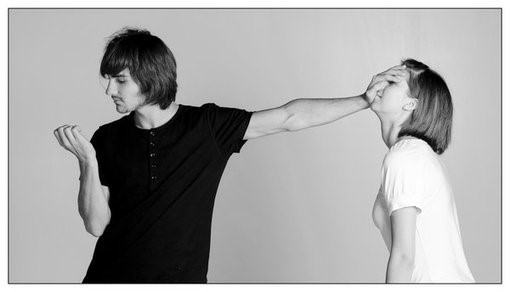
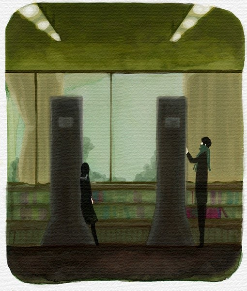
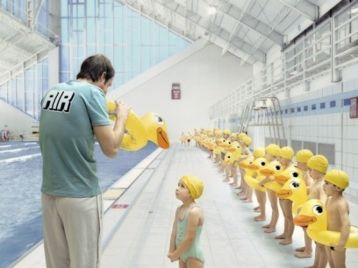
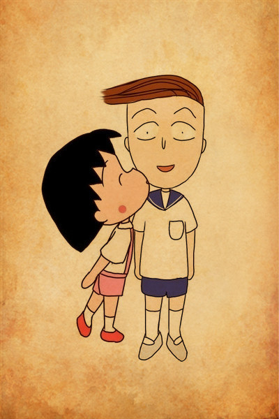

# ＜天璇＞把妹江湖

**在这个神奇国家大小书店的畅销书柜台上，挤满了教人如何恋爱、如何做爱的书，那些蜂拥而至的年轻男女们，宁肯看经验并不丰富多少的骗子们在书里忽悠吹嘘扯淡，也不肯走进这精彩而丰富的世界，去拉起一个姑娘的手，爱一场，做一次。**  

# 把妹江湖

### 

## 文 / 常远（厦门大学）

 

#### 1

“把妹”这个词，打出生时每一根毛发上就浸着混不吝的流氓范儿。 它何时兴盛于江湖已无从考证，在我的私人记忆里，它是跟荷尔蒙相伴相生的。至少在出现“一定要硬，一定要上”的姑娘之前，闻到姑娘发梢传出的洗发水味道会“一柱擎天”的初中时代，“把妹”作为江湖上一门神秘的武功仙术，已频繁出现在学校男厕所角落叼着一根烟对众多小弟“传道解惑”的大哥嘴边。 

 那时的所谓“把妹”带有某种集体狂欢的仪式感：一听说谁谁谁喜欢外班的某某某，大家的兴奋感就蹭蹭蹭往上涌，课间时一定要大呼小叫冲到姑娘班级门口“哪个？哪个？”“第六排！”，一群人鹅一样站在班门口伸长脖子往里瞅，非要羞得姑娘趴在课桌上或夺门而出不可。你要他走近前跟人家说一句话，那是断然不敢的——在集体行动中却勇气倍增，觉得自己特流氓特有范儿——其实很多事情都是这样的。放学后，如果当事人相约一起走，众人是一定要跟在后面的，或起哄，或指指点点小声议论。 及长，就有阅人无数的学长侃侃而谈，“想泡妞？送花会不会？玫瑰，红玫瑰。什么？送花都不会还想泡妞？”在那个阶段，把妹是单一跟勇气相连的，似乎只要你敢把玫瑰交到人家手上，姑娘就投怀送抱欲罢不能了。很多年后，把妹达人王少在三里屯嘈杂的音乐声中告诉我，其实所有的把妹理论只表达了一个核心思想——不要脸，我才明白，前人的经验是多么的质朴而可靠。 大学时代的烧烤摊、大排档上，把妹成了传说中斗智斗勇的心理游戏，我啃着鸡翅打着酒嗝跟兄弟们吹牛逼，“知道不，泡妞就八字箴言‘欲擒故纵，若即若离’，使好了，百战百胜。” 

#### 2

后来离开了校园，带着“欲擒故纵，若即若离”的原则行走江湖，发现很多事情渐渐看不清了。没人有耐心跟你玩“擒纵即离”的游戏了，异性相吸成为了成熟而残酷的流水线，姑娘用相亲阅人无数次历练出的火眼金睛扫描你一遍，吃一顿饭，就知道你是不是她的菜，有没有可能跟她共赴核心目标——婚姻。你一“离”，姑娘就不理你了，你一“纵”，姑娘就真跑了。于是我想起了那个曾让我不屑一顾的可怕咒语：临离开校园时，我的骨灰级损友魏总以深谙社会上男女之道的成熟口吻对我说，你这样的，到了社会上，在姑娘界不会再吃香了。由于我曾被她无数次损得一文不值灰头土脸，遂没放在心上，以为又是一次惯性的毒舌症发作。后来，我终于认识到魏总的真知灼见独到眼光了——姑娘对我说，你很吸引我，如果在大学里，我会跟你谈一场轰轰烈烈的恋爱，可我现在耗不起了。我不解其意，多方求教，遇高人好心指点：出了校园啊，姑娘们都喜欢老男人。 老男人！好家伙，这个万恶的天然带着拜金主义功利主义的词终于硬生生的跳出来了，就像儿时打仙剑，走迷宫绕啊绕，绕啊绕，突然一抬头，传说的终极大BOSS赫然而立——原来姑娘都被老男人们抢走了！“老男人”这三个字似乎先天缺少合法性气质，长期被媒体社会新闻包围的我们，几乎脑海中第一时间就会疯狂扫描“情妇”“小三”“宝马”“女大学生”“包养”“傍大款”等关键词。 如果我还是之前在反日横幅上大义凛然签名的愤青，一定会立即跳将起来：世风日下啊！人心不古啊！现在姑娘们都太庸俗拜金了，全去傍大款了，这个社会真现实。于是愤怒了，不平了，于是嫉妒了，羡慕了，于是心痒了，想像他们一样了，于是咬着牙恨恨的说，这个社会太现实了，我要出人头地，要像那些家伙一样玩女人。 这是很多伪理想主义青年变身犬儒的导火索之一。线性思维是有害的，愤怒可以遮蔽人的眼睛，进而扭曲对真实世界的认识。这世上只有一种理想主义，那就是认清生活真相后依然热爱生活。    幸运的是，自己生活圈还算广泛，有机会接触到形形色色的人。我发现，事情不是想象中那么简单。很多坚定声称喜欢老男人的姑娘，往往家境极为优越，车房不缺，阅历丰富，不像是那种很容易就被怪蜀黍骗走的脑残萝莉；再瞅瞅稍长萝莉一些的女人，她们很多都是传说中的“白骨精”，高学历，高薪，海外留学背景，精明能干，事业发展顺利得令人发指，开句玩笑，她们中的很多人已经具备了包养小白脸的实力。 我不解，问一个朋友，你们已经这么有钱了，为什么还那么喜欢有钱的老男人呢。她惊呼说，“我喜欢的可不是你想象中皮肤松弛阴茎下垂鼻涕眼泪一起流的糟老头子！我所谓的老男人，也可以说是成熟男人，年龄跨度在28-45岁不等。就比如我喜欢的那一只吧，33岁，外企的，长得不怎么好看，开的车还没我好呢，实话说，谈钱的话，他远不如我们家。但我就是喜欢他，有味道。他见过世面，知识面宽，对我温柔，聪明，跟他聊天不累，沟通成本低。跟他在一起就是舒服。而且他能理解我心里想什么，特别尊重我。再转过头去看同龄的那些小男孩，魅力实在差太远太远了。” 我有些明白了。席间酒后抓住机会就询问别人，搜集更多的样本。潜藏的冰山逐渐露出来了，印证了一个古老而朴素的道理：很多事情并不是看上去那样的。有些车房齐全，事业如日中天的精英女性，30岁左右，竟然在当情人，你相信吗？她们不缺钱，开的车比绝大多数同龄男性都要好，不担心个人职业，事业发展速度比绝大多数同龄男性都要快，也正因为此，她们在同龄男性的仰慕目光中感到孤独。她们的情人，也不是想象中的万贯家财，胡润榜榜上有名，而是30-40岁上下，有外企的，有创业的，也有普通的记者、医生。她们每个月不会从对方那里得到哪怕一分钱，更不可能收获车房等物，她们需要的，仅仅是理解，仅仅是跟在一起感觉很快乐的人，在一起。 

 这样的仍然是少数。大多数人口中的老男人，是那些28-到38岁上下仍在单身的男人，不是富豪，也没那么帅，靠个人奋斗达到普通中产，但是聪明、有趣，见过世面，兴趣广泛，知识面广，懂点古典音乐和艺术，懂生活品味，最重要的是性情温和，有一种岁月和阅历积淀下来的生活智慧，举手投足沉稳而淡定。他们能够沉静的听你倾诉，也能温和、理性的沟通和表达。他们工作努力，热爱生活，有自己的生活理想和职业目标，专注、热爱自己的事业和相关领域。他们发自内心的尊重女性，懂女人心，简单的一句话、一件事，就能击碎一个姑娘全部的心理防线。 一个姐姐跟我说，“我知道他给所有女性的感觉可能都是这样的：有涵养有礼貌，尊重人体贴人，聪明，善解人意，跟他在一起很舒服很开心，但我就是喜欢他。不管他是否可能同时有别人。” 这样的人，我称之为猎手。不管他们善解人意还是善解人衣，形容他们最高频率的词总是——魅力。《柔软》中说，在我们的一生中，遇到爱，遇到性，都不稀罕，难得的是遇到理解。遇到“猎手”的姑娘，大体都会有一种感觉，自己的灵魂里那一排沉寂已久的天线瞬间接通了信号，就是他，就是这个人。 反观小男孩们，愣愣傻傻，不知世事，有的还幼稚冲动，时不时跟女朋友发个火、赌个气，说几句难听的话，在妹子市场竞争中，高下立现，胜败已定。 正如王少所说，也许你不帅，你没钱，你不高，你身材臃肿，但一定不要让姑娘知道你对这个世界的理解有多么真切。叫姑娘如何不爱上你！ 所有人，都喜欢性情好玩儿的人吧。 颖哲姐聊起过之前的一个同事，30多岁，记者，不帅，但就是有气场，有范儿。一张嘴，你就感觉这个人很不一样。很多姑娘疯狂喜欢他。他自诩最懂女人。有一次，加班至深夜，他跟她一起站到走廊上抽根烟，沉默，突然，他开始喃喃吟博尔赫斯的诗，不紧不慢。那一刻，他光芒万丈。 这样的人，一定不会像很多小男孩一样，为了把妹特意去背一些博尔赫斯聂鲁达的诗，夹在玫瑰花里送给姑娘，表示自己是有文化有品味的人。他只是纯粹探究自我内心，努力寻求个体生长，不矫情，不刻意，举手投足间不经意的就被姑娘看到了他对生活、对这个世界的热爱和理解，正如廖一梅《悲观主义的花朵》里的陈天。 这样的人，生活中，捎带着就把妹把了。 

#### 3

王少曾在三里屯的嘈杂音乐中向我普及过传说中把妹达人团队的学术理论体系，我听完后，沉默不语，满腹狐疑。 事后回想，无论是训练一个男人的涵养、礼貌、品味，一步步的眼神、动作、语言表达，还是教会他像胡兰成一样尊重女性，从骨子里灵魂里去理解女人，或者培养他对古典音乐、艺术、建筑、诗歌的认识，岂不都是要把他们训练得像一个成熟、有故事有魅力的“老男人”那样吗？ 世界上最牛逼的把妹理论，听起来比中国的民主化都要复杂，也不过就是在反复重复着一句废话：有魅力的人，才能把到妹。 王少说，人类进化几千几万年以来，男人和女人对异性的本能变化都不大。在原始社会的部落里，女人们只会跟酋长上床。我心里不太同意，但自己古代史学的不好，也辩驳不了。如果非要谈远古部落，除了酋长之外，我想女人们还会心仪全部落最优秀的猎手。如果说酋长具备权势和资源，能够提供生存的一切安全感的话，那么猎手的勇敢、强壮、聪明则代表了女性对雄性魅力的本能渴求，以及人类自身极限的浪漫想象。 如果把妹达人“人类本能并无变化”的理论靠谱，那远古时代英武的猎手，分明是当今的“老男人”们吧。 我听很多苦逼的男性朋友抱怨过，现在的女孩子太现实了。于是开始讲述自己的悲情血泪情史。其中一个朋友，不高不帅不是富二代，而且我必须承认，他也确实无甚性格魅力内涵积淀，总之，平平庸庸的一个人。但他有一个优点，脸皮厚。他每一次都能勇敢的对心爱的姑娘说出那句话，而后默默领张好人卡。我把他的抱怨总结了一下，那就是：姑娘喜欢帅的，啊好肤浅；喜欢高个，啊脑残；喜欢有钱仔，啊太拜金太物质了；喜欢有本事有前途的，啊太现实了。甚至很多姑娘喜欢又高又帅又有才又有钱的，太令人发指了！ 我凌乱了。朋友，是不是只有姑娘既不爱才也不爱财，既不贪恋美貌也不谋求身材，哭天抢地跟闺蜜撕破脸跟父母绝交离家出走，要跟您在一起，才是理想主义女青年，性情中人，豪爽的女侠，才是灵魂高贵、品味高端脱俗、性格美好柔善啊？是这么个理儿吧？咱直说不就完了嘛。 这个国家最让人惊叹的就是总有一些人，明明是幼稚幻想症，却偏称自己是理想主义者；明明是认输的怂逼，却偏自诩为成熟沉稳、深谙世事。有时想想还挺感动的。 让我们做个梦：有天中国贫富差距彻底消失了，公平、正义成为人们普遍的信仰，社会价值观不再庸俗操蛋，男人不再唯貌是重，女人不再唯财是举，换句话说，我党所宣称的共产主义实现了。物质生活极大丰富，生产力达到无限值，一切生活资料实行配给制。那么，妹子的竞争市场就会平等吗？除非这是个操蛋的反人类制度，彻底物化女性，强行实施妹子配给制。否则，只要人心的沟壑、人性的幽微存在一天，那些最有魅力的人，无论男人还是女人，总是赢得更多异性青睐、拥有更多选择权利的。随你如何定义魅力——长相，金钱，才华还是性能力。 妹子市场，是的的确确的野蛮达尔文主义。恨也好，怒也罢。 

#### 4

记得小时候玩街机，所有的格斗游戏里都会有特点不同的人物角色供选择。有的身姿矫健，速度快，但是攻击能力较弱；有的伤害能力较强，但是笨重而缓慢，躲避攻击时不太灵活。初玩时，我喜欢问同去的朋友，哪个人最厉害？他们总是说，特点和招数不同，不分强弱。你喜欢哪个，就用哪个，哪个用的熟练，哪个就最强。 有的姑娘喜欢有钱的男人；有的男人喜欢漂亮的姑娘；有的姑娘欣赏才华横溢但身无分文的男人；有的男人喜欢温柔贤惠却相貌平平的姑娘。有人看重长相，有人看重物质生活，有人看重身高，有人看重车子票子房子，有人看重性格，有人看重才华，有人看重事业心，有人有人看重家世背景，有人看重性和谐，有人看重一夜高潮几次。有人喜欢年轻的，有人喜欢年老的，有人喜欢胖的，有人喜欢瘦的………… 多元、美好的世界。 千万不要说，这世上所有的姑娘都拜金，还真的有很多姑娘更欣赏才华横溢； 千万不要说，这世上所有男人都喜欢温柔贤惠，还真的有很多家伙就喜欢肤白眼美波大臀圆。 

 你看重、喜欢什么，都是你的自由。一个喜欢内涵的姑娘并不比喜欢更好物质生活的姑娘伟大，一个追逐美女的男人也不比一个欣赏性格的男人更庸俗。如果这种自由，从来不曾伤害到他人。 一个没有人想一夜之间拥有更好物质生活的社会不是健康的社会，一个所有美女都爱贫下中农贩夫走卒的社会也只能是病态的毛式红朝。 若你拥有，那么它就是美好的天赋、姑娘最应重视的价值；你所不具备，而异性竟然趋之若鹜的，就是庸俗，就是社会价值体系扭曲。这是理想主义还是臆想症？ 总想要用一种择偶价值取向压倒、批黑、搞臭其他取向的人，内心是自卑而可怜的。 你是胖子，就说喜欢瘦子的妹子现实；你丑，就说喜欢美女的男人庸俗；你有财无才，就说欣赏才华的女孩幼稚；你有才无财，就说找富二代官二代的女孩子都出卖灵魂。 或许，心仪的那个姑娘、男人不爱你，不是如你想象中因你丑、胖、不高不帅、不聪明、没有钱，恰恰是因你被残酷现实挤压得千疮百孔的卑微性情。 不自信的人，怎会是美的？ 或许，跟你心仪姑娘在一起的那个富家子弟，性格温柔体贴耐心，她爱上了他为自己默默撑伞打饭占座时的深情，而你只看到他有钱，心里暗骂姑娘“庸俗”；或许，跟你梦中情郎相守的那个漂亮姑娘，才华横溢琴棋书画，他爱上了她谈吐的优雅抚琴时的风情，而你只看到她美貌，心里暗骂情郎“肤浅”。 不自信的人，怎会真诚欣赏他人的美？ 还是那句话，世界往往不是我们想象的模样。 

#### 5

你追一个姑娘，她固执喜欢富家子弟，而你貌似潘安才超司马，恰恰没有钱。这时候，你除了在心里愤愤骂她两句“庸俗”，努力让自己变得有钱去符合她的标准或改变她的价值观之外，也没有什么更好办法赢得她青睐了吧？ 但一个人、十个人、一百个人的拒绝并不能否定你自身的价值，因为她们，只代表她们自己，而非全体姑娘界。每个人都会有喜欢的人，也有喜欢自己的人，世界就是这样，尽管有时候喜欢和被喜欢没有同时发生。你长得很帅，但是没读过几本书，脑子反应也不太快，没关系，总有姑娘喜欢那种长得好看到什么都可以被原谅的男纸；你满腹诗书气自华，纵论经纬气吞古今，但是长得确实很平庸，身材也不太高，没关系，总有姑娘欣赏胸中有山河浓缩精华的才纸。是这么个理儿吧？ 悲观的是，魅力是很难速成培养的，甚至很多是天生的；乐观的是，不同人对魅力的解释和价值取向是不同的。 道学家们喜欢说当今社会道德滑坡、伦理体系崩溃，在婚恋领域表现为家庭危机，一夜情泛滥等等。但我觉得这不是价值观最好的时代，但一定不最坏。至少每个人都能自由表达择偶的价值观，有宁肯坐在宝马车里哭的马诺，也有愿意跟心爱的人柴米油盐细水长流的刘诺李诺。不会再出现两情相悦但男方家庭成分不好不能结婚，再也没有一种社会化强制力量告诉你，什么是好的，什么是坏的。 

 可总有更多的宅男宅女，宁肯蜷缩在电脑前刷姚晨离婚的帖子，喊着“我再也不相信爱情了”，也不愿走下楼，去对街心花园时常遇到的姑娘说一声：你好；宁肯狂热的围观锋芝离婚，对着波多野结衣老师们的照片撸管，也不肯拿起手机给心仪的姑娘发一条短信：今晚一起吃饭吧？这并不诡异——在这个神奇国家大小书店的畅销书柜台上，挤满了教人如何恋爱、如何做爱的书，那些蜂拥而至的年轻男女们，宁肯看经验并不丰富多少的骗子们在书里忽悠吹嘘扯淡，也不肯走进这精彩而丰富的世界，去拉起一个姑娘的手，爱一场，做一次。 仍窝坐在散发着微光的显示屏前刷政治帖娱乐八卦帖的没妹子的死宅苦逼青年们呦，民主这桩子事儿、谢霆锋离不离婚、松岛枫的胸是C还是D，跟有没有妹子关系还真不太大。现在没妹子，民主了也很可能没有，姚晨跟老公复合了也还是没有，而不管怎样都要有妹子，因为，于你而言，内心横冲直撞的那头小怪兽，那个挺立的自我，比一切制度上光鲜的宏大叙事、比一切公众人物的离合悲欢都更重要。 快去吧，再不把妹就软了。 

（采编：管思聪 责编：管思聪）

 
