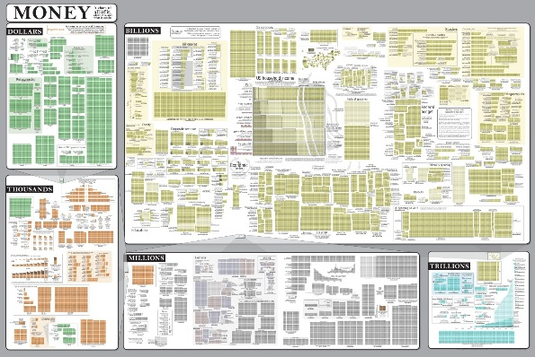

# ＜天璇＞新百伦的故事

**照这么说，我们都躺下等老死得了，还轻松一点，挣钱到底有什么用呢？我看也不必这么悲观。除了用来买吃的穿的维持生计，钱的其他作用，还可以让生活更精彩一些。就像一个赌场，大家都空着手进来玩，空着手出去，钱就像是你桌上的筹码，没了筹码这个游戏就对你不太好玩了，因此筹码看起来很重要。但是当你明白这个赌场的所有筹码，比你桌上的那一叠要多上万亿倍时，你就不会再执着于跟邻桌比较筹码的多少，而会开始专注于游戏的乐趣。**

 

# 新百伦故事

## 文/ 褚文韬（AUIA国际暑期学校）

 

小时候我有一个习惯，就是用完电脑从来不关。这件事情对于当时的我来说非常酷，因为不用再开机了。但是我妈每次都很不爽，因为我小时候家里穷，一台电脑在当时还是很牛逼的大件，要宝贝一些。后来我很开心找到了一本书叫做《瓦尔登湖》，给了我充足的理由继续不关电脑。按照此君的理论，人拥有的一切东西，都只是工具而已，房子的作用是遮风避雨，衣服的作用是保暖遮羞，于是我延伸了一下，电脑的作用是获取信息，总会有坏掉的那一天，到时候再买一台就可以了，不必太计较。我妈听完了我的理论之后，大受启发，然后揍了我一顿。

此事在我幼小的心中留下了重要影响，在此后一段时间里，我一直执着于找各种理由说服我妈。我试过老子的理论，也试过用现代物理学来强调宇宙之大，区区一台电脑确实没什么。我妈总是在辩论即将开始的时候说一句：“呵呵，吃饭。”我妈是当时为数不多的，发现“呵呵”可以用来结束对话的人。此事被“呵呵”之后就一直搁置着，直到最近在我教授的办公室里看到了一张海报，让我想起了这段趣事。

  

这张海报的作者雄心勃勃地想把这个世界上所有可以用钱衡量的东西呈现在一张图上（上图）。我小时候那台电脑，大概值左下角的一个小红点，一台顶配的法拉利California，大概也就值左下角那一小坨正方形的红点。这张图让我瞬间有些启发，我甚至认真地想过买一张这样的海报挂在宿舍里。因为这张图告诉我一个道理，这个世界上的钱是挣不完的，只是一个数字，不必太执着。不知道国内的朋友有没有听说小道消息，一位穿新百伦的老人最近被爆料挣了20亿，不过在这张图上，也就值右上角两个小黄点而已。

照这么说，我们都躺下等老死得了，还轻松一点，挣钱到底有什么用呢？我看也不必这么悲观。除了用来买吃的穿的维持生计，钱的其他作用，还可以让生活更精彩一些。就像一个赌场，大家都空着手进来玩，空着手出去，钱就像是你桌上的筹码，没了筹码这个游戏就对你不太好玩了，因此筹码看起来很重要。但是当你明白这个赌场的所有筹码，比你桌上的那一叠要多上万亿倍时，你就不会再执着于跟邻桌比较筹码的多少，而会开始专注于游戏的乐趣。

至于怎样让游戏更有乐趣一些，每个人有不同的解读，没有对或者错。有人觉得是挣大钱买游艇，有人觉得是研究各种奇形怪状的矿石，有人觉得是吸食大麻时的穿越感。崔健当年有一首很流行的歌，叫做《一无所有》。我们每个人其实都是一无所有的，没有什么东西可以死后带走，就连生时可以带着走的东西也十分有限。只有两样东西可以你可以比较长期地带着，一样是装在你大脑里的信息，这个功能是几百万年前祖先给的；另一样是云储存起来的信息，这个是天才们最近发明的。除此之外，都是暂时的，就连一瓶矿泉水，如果你不赶紧把它喝掉解渴，也只能在下次安检的时候，扔到自弃箱里去。

每样物件都有它的作用，房子可以遮风避雨，汽车可以让你更快地从一地到另一地。如果你撇开作用不谈，而去关注拥有这个物件本身，就像关注桌上有多少筹码一样愚蠢。比如在美国乡下买台车是很靠谱的，在北京城里买台车就有点二了。这个简单的道理，在现在却越来越难坚持，因为商家都是想要多挣些钱的，他们都会潜移默化地教你一些他们定的规矩。他们找专家告诉你说买套房子是项投资，但是如果你学过一点点会计知识的话也知道在中国这是扯淡；他们用广告告诉你如果买辆宝马，你也可以变成高富帅，其实你照照镜子就可以知道答案，买宝马还不如整形靠谱一点。当然我们生活在社会里，如果这个世界上有你在乎的人的话，你也不能奢求每个人都像你一样想。非常幸运我的老婆和丈母娘还不知道在哪里，但是未来的丈母娘如果对买房很关注的话，那房子的作用就多了一样：

1）遮风避雨

2）给丈母娘一点安全感

《庄子秋水》里面讲过这么一个故事，大概是说庄子路过梁国，当时梁国的宰相惠子很紧张，以为庄子要来谋权篡位，就派人去抓庄子。庄子听说之后说：传说中有一只大鸟，从南海飞到北海，除了有机鲜果，看到别的食都懒得去吃；除了清泉，看到别的水都不屑去喝；刚好有只鹞鹰抓到了一只腐鼠，看到大鸟飞过，就吼道：“臭屌丝，别想跟我抢食吃。”大鸟说：“呵呵。”虽然后人都把这个故事解读成大鸟逆袭的故事，但是我一直觉得，鹞鹰能找到他在乎的那只腐鼠，也未尝不是件开心事。

 

（采编：黄梅林；责编：姚昕毅）

 
