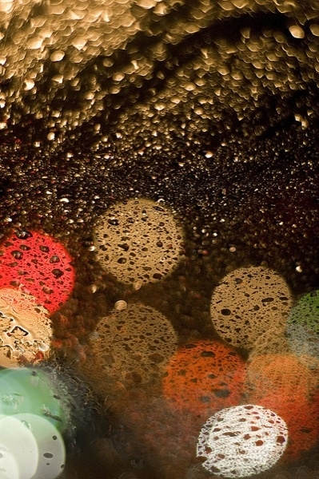

# ＜天璇＞旅行家的独白 I

**并非每个人都一定要有件事情让自己为之终其一生，何况倘若真的如此，恰恰又是看不穿。梦想是一体两面，一面是它的价值，一面是它的荒诞，价值在明处，当梦想成真时会照亮心扉，荒诞在暗处，随时随刻都可能浮现出来。正如有黑暗的地方，总有一天会照进阳光——有未来的地方，总有一天会照进荒诞。**  

# 旅行家的独白 I

## 文/白泽（北京大学）

 

这两天，和6只90后一起玩转北京、吃遍北京，虽然他们大多还都未满20岁，但都跟我有五六年的交情，其中一位姑娘跟我初次见面时才只有12岁。

那时候的我，也只有17岁，在现在的自己看来很不靠谱，却不知为什么对女孩子好像有一种特别的亲和力。那时的我说话不是很幽默，长得也不好看，但是生活得很真诚、很认真，甚至有点傻。

17岁的我怀着要做外交部长的野心进了北外，现在想来，只会觉得当时的自己傻得可笑。现在的自己似乎更加，用一个不太恰当的词来形容，乐天知命，没有什么欲求，没有什么野心，随波逐流，享受自己自然主义的人生观。

一直觉得现在的自己是一个没有上进心的上进的人。其实我一直在努力地生活，但并不是为了什么宏大的追求，只是为了让当下的自己活得更明白、更敞亮。

人到底应该不应该有野心呢？我觉得野心存在的价值，就是给未来的自己一个嘲笑过去的理由。即便在此刻实现了最初的梦想，谁又能说下一刻的自己不会突然发现自己为这梦想所付出的努力最终是落于荒诞呢？

已经看透生活的人，或许也会有野心。我想他们必然是为了生存，才不得不去有所追索。活着，就是采摘和囤积，把外面的变成内部的，把他者的变作自己的。只有我们有更多，我们才能活更久。在历史的每一个时点上，总是位高权重的人，（有更大的可能性）能够享受更长久、更高质量的生活，能够企望更长远、更可能把握的未来。可是，既然看透了生活，又为什么要活下去？

当我们回答“为什么活着”这样的问题时，会习惯性地沿用这问题所提出的“为了”“什么”这样一个“for what”式的句型，我们会说，为了家人，为了所爱的人，为了体验生活，为了享受和快乐，为了生儿育女，为了青史留名，为了世界和平，我的回答是“为了亲眼看到更长远的未来，以想象比这未来更加不可想象的未来”，也依此句式。

人的自我是逐渐显现的。17岁时的我，有美好的心性，但没有完整的自我。那时的我，无法把握自己的路，无法周详地考虑很多事情，不知道什么是得体，也不知道怎样才能指挥和控制他人，经常做一些可笑的事情，经常说一些自己都不知道怎么说出来的话。我时常会奇怪，为什么会有姑娘喜欢上那时候的我？或许是因为那时的我是个很认真的人，碰巧又知道一些有意思的事情、会做一些别人不做的事情？左思右想，我觉得或许跟那时自己所“为”的事物有关系吧。那时的我，可以做到去精心地设计与某个姑娘之间可能发生的对话，为了让她对自己产生好感，也喜欢写一些抒情的东西，认真地、下功夫地去写自己内心最细腻的感情，并与喜欢的姑娘交换。（那时的我似乎是一个愿意谈心的人？但我其实很少与人谈心，从小就不喜欢，总觉得会很不舒服。或许是因为我不喜欢别人侵入自己的内心？但是不喜欢别人侵入内心的人，不都一直渴望着别人入侵自己的心灵么？）可是现在，得到喜欢的姑娘的回应，似乎已经不是很能引发自己满足感的事情，似乎不是自己所“为”的事情了。

可是，我也不知道自己现在所“为”的事情是什么。我有很多想做的事情，但其中没有一件是要我“为”此而生活的。

并非每个人都一定要有件事情让自己为之终其一生，何况倘若真的如此，恰恰又是看不穿。梦想是一体两面，一面是它的价值，一面是它的荒诞，价值在明处，当梦想成真时会照亮心扉，荒诞在暗处，随时随刻都可能浮现出来。正如有黑暗的地方，总有一天会照进阳光——有未来的地方，总有一天会照进荒诞。

这是一个无限复杂的社会，你在康博斯吃一盘水饺，背后需要十亿人为此付出辛劳和智慧。为这个社会耕作的人，实在是太多了。我不愿意“为”这个社会，我不愿意。我愿意做一个旅行家，我生来这个世界，就是为了看看她，她古老，但唯美着，她年轻，又沉重着。今天早晨，我一直不愿意醒来，因为我梦见了一个很美的姑娘，所以这一辈子，我不愿意死去，因为我做这一场大梦，可以看到你，看到你们，看看这个世界，就像昨晚我梦见那姑娘，只是因为想要看看她。

 

（采编：佛冉 责编：黄理罡）

 
