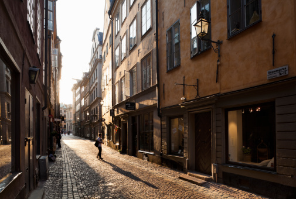
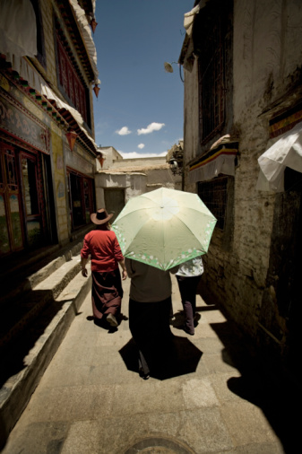
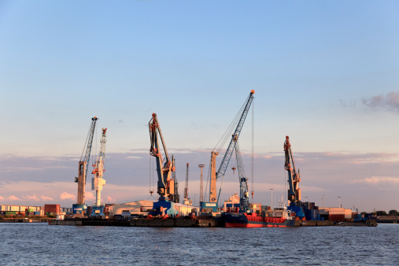
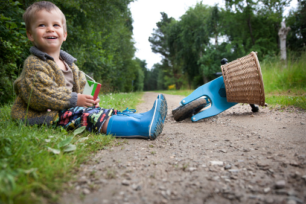

# ＜天璇＞旅行的时候我都在想些什么

**在维也纳，听着施特劳斯一家老小写的曲子，住着莫扎特曾经呆过的旅馆，瞻仰着贝多芬的墓碑……我不知道，来到这里，究竟是来试图亲身经历和体验一种历史的时空秩序，还是作为一个看客只是旁观与观摩这里的过去和现在。站在舒伯特这一个生于维也纳死于维也纳的哥们儿雕像前，我真的很想拍拍他的肩膀，告诉他他的小夜曲究竟有多难弹好，但这只是在维也纳，多年的练琴经历给了我这样的共鸣——而在哥本哈根，在斯德哥尔摩港，在桑耶寺，在青朴，在西安城墙，在雨花台，在婺源，在呼伦贝尔……我与那些人那些事那些景，又是个什么关系？或许真相是，我根本就不爱旅行，只是一颗不安分的心不停地想逃离原有的环境而已，充其量，那叫旅游，或者，度假。**  

# 旅行的时候我都在想些什么

## 文/王帝彼得（厦门大学）

 

一

慕尼黑的街头，看见夕阳下一个母亲牵着一个两岁左右的孩子正在蹒跚地走着。他正在瞪大着眼睛四处张望，长长的睫毛甚是漂亮。我照例上前问道，是否可以拍些孩子的照片。

“好的，不过你等我问问他同不同意。”

我很羡慕那个孩子，因为在他还不怎么会说话的时候，就已经被父母当成一个独立的人来看待了。

二

在罗腾堡，一个从中世纪开始原貌一直保存到今天的一个巴伐利亚古镇的那晚，我是一个人住在一大栋据说有六百年历史的老房子里面。家具很有古撒克逊风格，害羞粉的床单和青松绿的衣柜的搭配实在是很带感。

晚上回到旅馆，钥匙捅进锁孔，咔嚓拧动的声音；推开门，转轴吱吱呀呀的声音的回荡让翡翠衾寒谁与共的感觉更为空旷。

于是我洗完澡出来时并没有把流水关上。擦擦头发，躺在床上，打开一篇论文，边看边等着，好像她一会儿会身上裹着浴巾，头发往下滴水地出来一样。

三

几个朋友说过，发现我特别喜欢拍别人接吻。

“牵手，拥抱，接吻，OOXX，你最喜欢哪一样”，这是个我问过几只EXs的一个问题。得到的答案很相似，接吻都被排在了第一位；同样地，单纯的亲吻，比起OOXX，这种不带有肉体欢愉的纯精神交流也更得我心。而牵手、拥抱，则缺少了些爱人之间专属的意味。

想象下，在很多美丽而动人的场景下，周围的气氛开始氤氲起淡转浓的爱意；四目相对，继而视线下移，再轻轻地闭上眼睛，关闭一切其它的感观，只把全部的注意力集中在触觉上，双唇的对碰，舌尖的挑逗，津液的纠缠……

对于一些人来说，若是不爱一个人，可能会与对方在巴黎希尔顿翻云覆雨共赴巫山，但绝无可能在海德堡的夕阳下将她拥过来，亲下去。

幸好我不涂唇膏，酒店服务员发现不了浴室镜子上的唇印。

四

还是在海德堡，那个下午，躺在山坡上看着老城和内卡河，等着拍日落。太阳晒得太舒服，不知不觉竟差点睡了过去。

只是在恍惚中，隐隐约约听到了一个声音，“你自己走了这么多地方，我们以后在一起之后的旅行去看什么？”

回过神来之后，很后悔没有看清楚她的脸。因为我很想找到她告诉她说，就算是煎饼果子，一个人啃跟两个人抢的味道都是不一样的。

五

“你们都被洗脑了！”一个喝了点酒的德国青年略微有些激动地喊道，“你们，中国人，被中国政府给蒙蔽了！你们一直在戕害藏人！奴役他们！污蔑他们的信仰！”

我看着他，以及他周围一群的德国学生，没有继续说下去。转身从包里掏出了电脑，打开了去年夏天我在西藏的照片。

“这是布达拉宫。”

“这是大昭寺。”

“这是正在雅鲁藏布江旁边放牧的藏民。”

“这是西藏著名的几条羊肠公路之一，遍布西藏镇一级的公路全部是中国第二高等级公路的标准。高原上公路修筑难度特别大，而西藏现有的公路和铁路，总投资就是西藏十年的GDP，全部由中央政府投资建设，不收费。”

“这是青藏铁路，一条修筑于海拔五千米的天路。”……

“我希望你们有机会的话，能够抽出半个月左右的时间去一次西藏，去亲眼看一看那里人的生活，和当地的藏民面对面地交谈；同样，如果有机会，也希望你们去中国其它地方看一看，不只是北京和上海，故宫和外滩，包括二线城市、中西部贫困地区，更希望你们能够用自己的眼睛、耳朵、鼻子和双手，看到、听到、嗅到以及触到一个更真实、更立体的中国。”

一口气说完了这些，我狠狠地灌下了一大口啤酒。他们看了看我，又相互对视了一会儿。终于一个金发美女开了口，“留个联系方式或者Facebook吧，等我们到了中国好联系你。”

尼玛，天知道刚才我注意她注意了多久！

海德堡初春的晚上晚上，风还是有些凉。

六

到了柏林，一下火车，就被火车站的厕所给惊到了，收费一欧。就算是在中国，火车站这种公共场所内哪里还有收费的公厕了？

尿了一泡人民币九块钱的尿之后，在游客中心，之前在慕尼黑和海德堡都是随便拿的地图，也被要了一欧元。

出了火车站，更是吃了一惊：满大街壮观的烟头，和飘飘何所似天地一群沙鸥的纸屑。

我拖着拉杆箱，在傍晚的德国首都街头走着，百思不得其解。突然，意识到了什么，掏出地图，发现自己现在的位置距离当年的柏林墙只有500m了。

出国半年多，头一次距离社会主义这么近啊！遂对一切的“怪相”，恍然大悟。

七

意大利德比的那天晚上，我在柏林。

皮耶罗射门，球又进了。酒吧里一片欢腾的声音。

“妈了个逼的。”故作潇洒地扔下五欧，起身走人。其实那两杯啤酒一杯两欧四。

刚走到酒吧门口，被老板拦住，“内拉祖里？”

我点了点头。

他递过来一杯啤酒，“这杯算我请的，”他看了看那群尤文图斯的球迷，“我给他们的酒里都兑了水。你先喝着，等比赛结束了咱去打两杆台球。”

八

德累斯顿到维也纳的火车上，一群棒子照例聒噪得很，一路上不知道在High什么，途中泡了几盒辛拉面，满车飘得一股泡菜味儿。

正插着耳机对着屏幕上的论文发呆，突然来了一男一女两个便衣警察，给我看了下证件，然后说要查护照。拿过护照，翻来覆去地看，问了我那三个哲学问题，是谁，从哪儿来，到哪儿去；又几乎把上面每个签证都问遍了，想发飙，却只能强忍着，蹲局子尤其是蹲德国人的局子真是不好受。

在他们仔细研究过我的护照后，一边朝着车厢另一头走去，一边不拿正眼看我地把护照递给我，面无表情例行公事地说了句“Thank you.”

于是我摆出一副“谢谢您放过我”的堆笑，很有礼貌地说了句，“我操你妈逼的。”

发出“操”的音的时候，一个强壮而有力的爆破音，舌尖与牙齿和整个腮帮子配合，一股强烈的快感喷涌而出，都看见自己的吐沫飞溅出来。

那个男警察回头看了我一眼，一副“中国人真贱这还说谢谢”的表情。那群棒子也看着我，表情不一，有“你看我们棒子就不用被查护照”，有“真罕见啊居然有不是偷渡客和考察团的中国人”，有“是不是很羡慕我们有泡菜吃”……其实真的挺眼馋辛拉面的，那些表情也都是我的主观解读。

鉴于他们吵了我一路，多年以来对于韩国人公共场合不知收敛的积怨以及身为东北人对于二鬼子的反感瞬间爆发，摆出一副“你们好”的谄媚，嘴里说的是“傻逼棒子”，然后反身坐下。

长这么大会骂人以来骂得最爽也是最憋屈的一次。

善了个哉的。

九

旅途中总会遇到各种各样形形色色的人，各有各的过去，各有各的故事。

以前总是非常羡慕那种很多老外的自由和洒脱。Gap Year一年游历全世界没钱了就停在某个地方靠教英语赚旅费的， 踹了Google去读了一个绘画的硕士学位的，前四大的Senior Manager辞了高薪到鼓浪屿开了个旅馆的……总觉得人家的生活更单纯，也更能诠释生活的本质。

在布拉格的查尔斯桥上，跟一个卖照片的摄影师聊了很久。奥地利维也纳人，一个布满了皴裂血痕的手上握着同样伤痕累累的大马三和小白。

他说他喜欢摄影。然后就想起，在很久很久以前，我有过一些梦想，当一个体育评论的自由撰稿人，尤其是足球评论，不靠搏出位只靠文笔和视角就能混得比飞姐和陈驰更牛逼；一个杂志编辑，每期后面开个专栏那种，生活最大的乐事就是一到出刊那两天就到报刊亭等着看读者买到杂志就翻到我的专栏那页，站在街边就读起来；或者是一枚牛逼创意的广告文案，作个TVC就能把人看哭，写条Slogan就成了无数热血青年的座右铭——其实这个梦想一度很接近了，只不过“因为爱，这没有理由的爱”只成了同学间口口相传的笑柄。

可干这些的一个月几千块要TMD多少年能把大学四年加出国留学的几十万赚回来！要TMD多少年能给媳妇儿攒出一房子一辆车要不然“我要替你遮风避雨”就TMD是一句屁话！要TMD多少年能给娃儿们攒出哺乳期好几万的进口奶粉钱要不然就TMD得给他们喝蒙牛三鹿！都不提自己心底下的那几个作为男人的愿望，更不提什么时候能回头孝敬爹妈。

我没有资格怪谁，尽管早已对中国大部分行业目前还都处于低水平运作阶段导致入行门槛过低以及人才甄选和晋升机制的畸形的现状吐槽多年，但当初也是自己决定坚决不碰会计金融这些拿青春换金钱的行业。中国的环境如此，现实如此，作为一个屌丝，站起来，也绝不能仅为了撸。

梦想，责任，欲望，作为一个男人，生活与经历会教会我如何取舍。就像上面提到的那些纯粹而洒脱的人，他们或许也从未停止思考一个简单的问题，自己的人生价值在哪里。

于是我站起身，学着当年杰克和露丝的样子以表对这个曾经叫做“捷克斯洛伐克”的国家的敬意，狠狠地往河水中吐了口口水。

口水没能画出一道美妙的弧线落入水中，风太大了。

十

我发现，现在我的很多行为都看起来很装逼哄哄的样子：

以前叫学习，现在叫学术；

以前叫照相，现在叫摄影；

以前叫旅游，现在叫旅行……

在维也纳，听着施特劳斯一家老小写的曲子，住着莫扎特曾经呆过的旅馆，瞻仰着贝多芬的墓碑……我不知道，来到这里，究竟是来试图亲身经历和体验一种历史的时空秩序，还是作为一个看客只是旁观与观摩这里的过去和现在。站在舒伯特这一个生于维也纳死于维也纳的哥们儿雕像前，我真的很想拍拍他的肩膀，告诉他他的小夜曲究竟有多难弹好，但这只是在维也纳，多年的练琴经历给了我这样的共鸣——而在哥本哈根，在斯德哥尔摩港，在桑耶寺，在青朴，在西安城墙，在雨花台，在婺源，在呼伦贝尔……我与那些人那些事那些景，又是个什么关系？

或许真相是，我根本就不爱旅行，只是一颗不安分的心不停地想逃离原有的环境而已，充其量，那叫旅游，或者，度假。

十一

可这些终归是很宝贵的经历——真的很贵，花了很多钱，尤其是单身旅行。

于是我就总想着，什么时候有机会能够不再单独出游——有些时候找个伴的想法更强烈，比如：

一个人面对着巨型德国猪肘，或者看着菜单好几道菜都想吃的时候；

一个人买了两杯啤酒，喝的时候左手一杯右手一杯碰一下的时候；

一个人想拉撒，只能拖着所有行李进厕所的时候；

一个人若睡双人间，上半夜睡一张床，下半夜换到另一张床，或者大床房，一整夜只睡半边，好像另一边有个人，的时候……

总结起来，就是我只在吃喝拉撒睡的时候，想要一个旅伴，母的。

真TM没出息。

十二

记得有段时间有一条关于高考的状态很火，大意是说当年在考场上如果多错一道题或者多写一句话，今天我们就可能身处不同的地方，故而，高考最有魅力的地方不是如愿以偿，而是阴差阳错。

虽然我不太同意这句话，比方说，从一个普通985阴差阳错到了另一个，可能是种机缘巧合的魅力；万一错到了一个民办独立学院……虽然唯出身论不对，可怎么着也算不上魅力。

但是那天傍晚，当误了中午的从维也纳到慕尼黑的列车而只能拖着行李登上晚班车的时候，我并没有意识到，此生又一个绚烂的日落正在“阴差阳错”地跟我玩了个不期而遇。

空荡荡的列车没什么人。脱了鞋，把脚蹬在对面的座椅上；夕阳斜斜地铺下来，软得像当年妹子的那双手。蓝天，白云，绿色的田野，远处是雪山反射着金色的光芒，突然觉得这TM才是奥地利风光，之前开往维也纳的列车，则好像把我拉到了哈尔滨老道外。

十三

“你为什么出门都不住青年旅社多人间？这样可以省很多钱耶。”

“睡一半被晚归的酒鬼吵醒，被香港脚熏醒，或者被呼噜震醒，第二天萎靡不振的代价更大。”

“哦？”

“对嘛，深度游暴走族很要求体力的，要不然出门十八天天天大鱼大肉大乳酪的，怎么从155掉到134。”

“哦……我说你怎么不找个妞儿同行呢……”

“滚！”

十四

啪的一声，他把我的护照和登机牌扔在桌子上。

我抬头看了眼他，皱了皱眉。

“我们德国人是很讲礼貌的，你们中国人永远不懂，没有教养。”

我低头收好护照、水和找零，又抬头看了看他，转身走了。

事情的起因是，我在机场的超市买水，他朝我要护照和登机牌；我掏出护照后却一时摸不到登机牌，就把护照先扔在桌子上准备翻出登机牌后一起给他；没想他直接把手伸过桌子，就把护照给拿去扫描了。

不想跟他辩解什么，因为他把东西甩给我的方式和说话的语气及内容，说明他也根本不懂得教养和尊重的含义。

我只是在反省，有很多时候，我肯定也是像他那样，自以为是地做一些自我矛盾的事情，而事实往往与想象中的不一样。

十五

我真的已经长残了。

突然觉察到这一点，是我发现，即使在我能够不断散发着异域风情的欧洲，哪怕是游客行迹罕至的地方，当我走过时能够目不转睛地看着我然后一直转着头看过来的，除了别人怀里的婴儿，就是别人牵着的狗了。

不要问我婴儿和狗狗的性别……

十六

宝马，在中国几乎被“肇事逃逸”和马诺们毁掉了。

以前总有一个浅薄与偏执的想法：以名表、名车为代表的奢侈品大大偏离了其实际价值，而一个以宝马、江诗丹顿、爱马仕为尊的社会是可耻的。但是宝马博物馆向我展示了名车作为炫耀消费品与把妹消费品之外的另一面，也是更本质的一面：人类最高智慧的结晶。

但在宝马博物馆里，我突然想起伦敦Holborn百年徕卡店的老板的一句话，徕卡之所以是徕卡，是因为它更纯粹，也更融合；纯粹，是指徕卡更接近摄影的本质，而融合，是指其每一件产品都是技术、文化、人性洞察与艺术的综合体现。然后就觉得，喜欢徕卡、宝马之类的东西并不难，难得是如何去站在更高的角度上去欣赏这些被附着了太多其它意义的杰出作品。或者说，物欲的符号带来的影响并非简单地好或者不好，因为我们的个体是独立于这些东西之外的；而之于这些东西的态度和与其的关系，则折射了我们的内心世界和精神追求。

说到底，世界终究是美好的；若是她甩给我一副冷若冰霜的表情，那一定是我没有找到把她领上床看上眼放上心的方式。

尾：

又有点像跑火车的赶脚。不过没错，大多数的内容都是在火车上敲出来的。

题目是很久以前自己想给今后的文集的题目的改版：当我蹲在马桶上，我都在思考些什么。但无奈，爱玲同志的告诫就在眼前，出名没趁早的后果就是被村上春树抢了先。

于是又想了想，我他妈都二十四岁了，别说出名，连自己都养活不了。

十一点了，该去搬砖了。

 

（采编：何凌昊；责编：尹桑）

 
