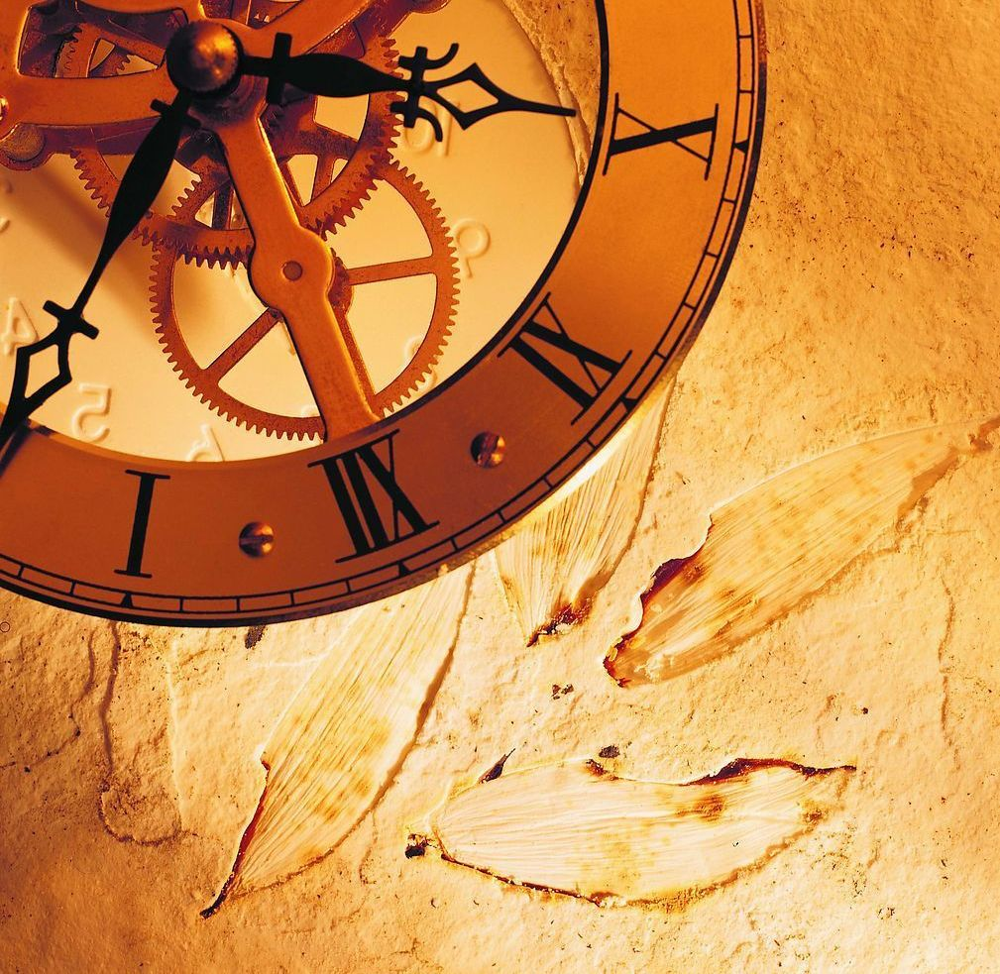
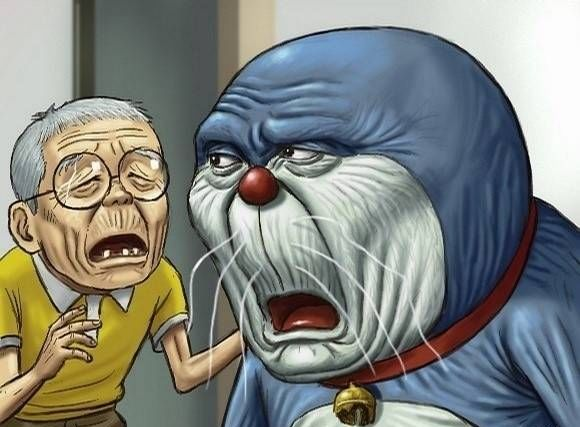
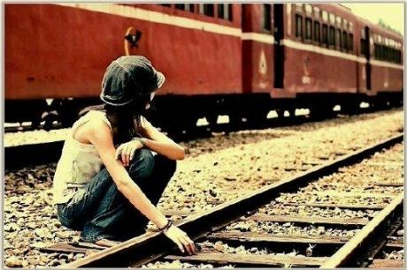

# ＜天璇＞时光。

**于是时光就这么波澜不惊的过去了。一晃十几年。**  **在那个年代，因为不成熟，所以单纯，痛苦和快乐是一样的纯粹。**  

# 时光。

## 文/ 黎龙（中国人民大学）

 

一年以前，我没想过，会身处一个名为新加坡的小国，继续宅并孤单着。

两年以前，我没想过，当我披荆斩棘，从考研的千军万马中杀出一条血路后却选择了放弃。

三年以前，我没想过，国服开CTM我却金盆洗手了。不想承认这个游戏终究有完结的一天，它承载了我大学生活的回忆和友情。

四年以前，我没想过，原来轰轰烈烈的爱情只存在于我们的幻想当中，磨灭感情的，不是大风大浪，只要生活中一些鸡毛蒜皮的小事。

人生就是由各种意想不到组成的。岁月把人的棱角磨平，时间捉弄我们每一个人，任你惊才绝艳，心高气傲。

小学，和一男一女两同学一起放学回家，遇上小混混勒索。口袋清白的我免于其难，另一个男同学却被敲诈了一毛钱外加一块口香糖。我气愤不过，讽刺了小混混两句，扑上去大打出手，回头打算招呼两人帮手。却看见两个绝尘而去的背影，停下来在远远观望。

后来不知道这两个人有没有走到一起。前些年见到了这个男生一次，体重突破了两百大关，在地方派出所上班。不过这个体型可能也就适合在路边的治安亭里坐着吹吹空调，如果要去追捕歹徒，恐怕是有点力不从心的。

还有一次，和同学去游戏室，玩得正开心，同学走过来一脸郁闷告诉我，被人抢了一块币。我怒火中烧，冲到那人机器面前把电源一拔。后来才得知此人为某中学大佬级人物。

此君当下就抄起屁股下的板凳照我脑袋抡了一下。我也不甘示弱，抄起门后装垃圾的簸箕也砸了回去。此君转身走了。在我以为大获全胜时，游戏室老板突然面色慌张地跟我说，快走，他抄家伙来了。我往门外一瞄，乖乖，此君提着根手臂粗细的木棍回来了。于是当机立断从后门夺路而逃，一直跑回家才发现脑袋上肿了个大包。

在家人的盘问下，为了隐瞒我去了游戏室的事实，我只得撒了一个谎：头上这个包是走在路上，被一个同学从后面推了一下，撞到电线杆上起的。家里人半信半疑地接受了这个无比荒诞的谎言。这名同学的妈妈跟我家是熟识。在一次打牌中，我爸无意中透露了这件事，结果他妈把他狠狠骂了一顿，买了瓶红花油送到我家道歉。该同学很是莫名其妙，到学校找我才知道来龙去脉，狠狠削了我一顿才算了事。

中学的时候，班上有一同学叫“莫沾”，记不清这是本名抑或是别人给起的外号了，身材壮硕，为人硬气，得罪了学校一位游手好闲的“老大”。所以放学之后，经常会有各种小混混前来找麻烦，带到学校后山拾掇一番。有好事之众闻风而至，围成一圈，脸上的表情说不出是兴奋还是麻木。看着人群里被小混混推来搡去，拳脚交加的“莫沾”，我却只能叹口气，转身离开。

这个时候古惑仔正风靡全中国。这个年纪的一些孩子们，无论男女，都沉浸在刀光剑影，满嘴兄弟义气，自以为牛气冲天不可自拔。以为成群结队，呼朋引伴便是威风八面。这类人大抵是在学校里成绩垫底，游手好闲的。因此每天下课总能看到一群人，阴阴地聚在一起，拿冷冷的眼光打量过往的人，仿佛自己真是电影里动不动就能拉出“一车人”的大佬。

帮派之间也是有火拼的。开始还你来我往，甚至动刀见血。到后来几方大佬熟络了，再有冲突，双方的人马便先对峙着，变戏法似地从身上各处地方掏出刀具、钢管、木棍。然后两边的大佬走出来寒暄十分钟，大约是利益分割妥当了，不一会大家都收起武器，勾肩搭背地走了。于是围观的人群便都散去，还发出意犹未尽“切”的一声，似乎没有真刀真枪打起来，群众们看得很不过瘾。

当时隔壁班有个人，瘦瘦黑黑的，大约在校园社团中也是个小头目级别的人物。一次在学校里碰见，他和我打了个招呼：“龙哥。”我当时一愣，我什么时候也成了“哥”，大约是因为有一次期末考试给他递过答案吧。于是打个哈哈过去了。后来听说一次火拼中，他被人砍了一刀，住进了医院。我想，这么多年过去了，不知道这个孩子再想起当年的一些事情，心里是会五味陈杂，还是会热血沸腾。我觉得多半会很不是滋味。

高中，去了长沙上学，回家得少了。一次寒假回家，路过一个游戏室，突发奇想又进去买了几块币坐下来开始玩，发现身边有个人一直在盯着我，我转过头看了看，也觉得似曾相识。他突然开口说，你还记得我吗？我猛然想起，这就是那个砸了我一凳子，我还了他一簸箕的“大佬”。我说，当时记得，当时那一凳子挺狠的啊。他也笑了笑：你当时也很冲啊。走出游戏室的时候不禁感慨命运的奇妙。

高中之后，离家越来越远，回家也越来越少。在长沙读高中大抵还能一学期回个一两次家，大学是一年回一次家，现在到了新加坡估计是一年也回不了一次家。所幸，我也不是个恋家的人。

很羡慕那些恋家，时刻都想着回家的孩子，他们的童年生活肯定充满幸福，有各种各种精美的玩具，有各种零食和零花钱，有通情达理幽默风趣的父母。所以小学初中，经常喜欢跑到同学家玩，可以毫无拘束，可以打红白机，还可以跟一群小伙伴到山上捉迷藏，偷地瓜，骑着几辆破三轮街上兜风。尽管回家之后等待我的通常是一顿暴打。有时候觉得大人的逻辑很不可理喻，就是觉得你不能出去玩，要待在家里。认真在家学习几个小时候然后出去玩一会，跟成天待在家里但却不学习，哪一样更合算？这么简单的道理我却发现他们始终无法理解。

所以我的童年基本就在出去玩=>挨打=>再出去玩=>再挨打...的循环往复当中。当然我的成绩一直还保持得不错，所以很幸运，这么多年下来还算肢体健全，茁壮成长。

那个时候电视里正流行《四驱小子》之类的动画，校门外的小贩们嗅觉敏锐，小摊上出现了各种四驱车模型，什么初代的，多栖的，价格不菲。于是每天放学路过时我都要看上几眼，只是看而已。每当小伙伴聚在一起炫耀自己新买的四驱车多牛，是电视里面哪一款哪一款呢，我就感到有点羞愧。因为如果我回去提出这种要求，大抵是不会得到满足的，甚至还会换来一顿皮肉之苦。

于是时光就这么波澜不惊的过去了。一晃十几年。

大家都散落在天涯，留在心间的，隐约只剩那抹之不去的旧时光。

十几年前，第一次看到怦然心动的女孩，起源于我跟她借了一本书。于是当晚回去激动得夜不能寐。我以为爱情都会轰轰烈烈，情节曲折，荡气回肠，后来才发现当时根本就不懂什么叫爱情。对了，现在我也不敢说自己就真懂。

不会再因为一句“还是做朋友吧”，回家之后黯然神伤，恰好隔壁还在放着周杰伦的龙卷风，于是凄然泪下。

不再幻想有一天能得到奇遇学成惊世武功，从此天下无人不识君。

不再因为电视里凄美的爱情故事感慨万千，管它金童玉女郎才女貌，那都是电影里的情节。我们就是普普通通的恋爱，平平淡淡的生活。

在偶尔看到某个同学结婚，或者晒甜蜜晒恋爱时间的时候，心里才会泛起涟漪。管你再摆出一副看破红尘不信爱情的嘴脸，嘴里叫着“信什么也别信爱情”，心底却还是存有一丝向往和期待。

现在很流行相亲。经常听人说，哎，家里人给我安排了相亲，真不想去。很多人都已久经沙场，到了相亲的地点，留了对方的手机QQ，还要加上一句“别误会，例行公事”。就算自由恋爱又何尝不是这样？很多时候，在一起也只是变成了一种“例行公事”而已。例行公事地逛街，看电影，例行公事地打电话，发短信，最后再例行公事地失恋，再恋爱，再失恋。但就算再不相爱，分开的时候也会像是心里被抽走了一块吧。

十几年前的今天，没准我正在踢着家里的门——为不不让我出去玩，家里的门经常是反锁的，我甚至还把门踢坏过一次，充分映证了“水滴石穿”这个真理，尽管后来受伤很重。

没准我正躺在凉席上，旁边的“桂花”牌风扇呼呼扇着，手里还捧着半拉西瓜，看着电视里暑期档万年不变的节目：《西游记》或者《还珠格格》，满耳都是旁边的奶奶唠叨着以前的事情。

那个时候总觉得奶奶整天唠唠叨叨实在是烦，过去的事情总是翻来覆去没完没了的重复。

现在我懂了，人都是这样，一旦回想起以往的旧时光，话匣子总是止不住的。

在那个年代，因为不成熟，所以单纯，痛苦和快乐是一样的纯粹。

聚散离合了，后来在一起或者不在一起的，成功的或失败的，还在联系的或者袅无音讯的人，却还总是停留在那段日子里。

运气好的一路走来依然很顺，家世显赫地大抵也都过得不赖，暂时失败不尽如人意的不用泄气，也要使劲让自己绽放出光彩。

我要感谢那些让我成长的人，感谢那段磨砺我的岁月。不管当时觉得有多么难熬多么不堪，我觉得都只是让我的心性更加坚韧的一个过程。有过自我感觉良好光彩照人的时刻，也品尝过泯然众人受尽冷嘲热讽的失落，最后都回归于平淡。要按照自己的节奏，过着自己的生活。

也许有一天，我们会忘记过去的旧时光，忘记曾经陪伴过我们的人和事。曾经的快乐烦恼忧愁都烟消云散，我们都只关注现在更多的烦恼忧愁。

只是累了的时候，停下脚步，偶尔再回首一下去过的感动和彷徨。

也许彷徨着彷徨着，就有了光亮和希望。

（采编：陈锴；责编：陈锴）

 
