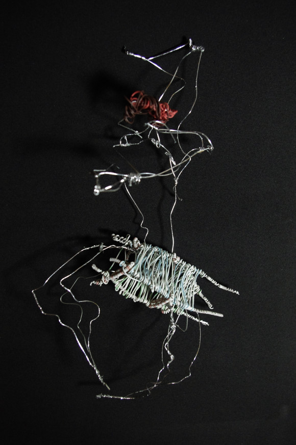

# ＜天璇＞星期四男友

**他声称自己是独身主义者，我想我也是的，起码这个生命阶段是的。只有无比崇尚自由的人才懂得，把自己系在一个人身上，拘囿于一段关系中是对自己天性的残忍扼杀。你说我们自私也好，滥情也罢，我们都只是寂寞的孩子，喜欢丰富的人生体验，害怕循规蹈矩渴望千变万化。**

# 星期四男友

## 文/王倩茹（上海外贸）

我从没想着让他成为我笔下的主角，本只想发条状态，却发现废话好多140字完全装不下，加上这神秘个性男从来不上校内这样“乌烟瘴气”的社交网络，于是我就可以心安理得毫不畏惧地在这里大吐特吐、大书特书。 周四，准时接到这男人短信：一个李庄倒下去，100个王倩茹站出来。 我笑，问：你咋知道我站出来了。 他答：因为“起来，不愿做奴隶的人们，中华民族到了最危险的时候。” 我回：其实不是我站出来的，是周围一部分人退下去了。 

 这是个有趣的人。第一次相见是公事，他戴着顶帽子（不是绿的），远远走过来，身材高大，面容清秀。让他等待了许久，我有些内疚，递给他一粒费列罗。他说谢谢，笑容让我好像微波炉里的爆米花。 他问了我几个问题，我进行了详细解释。我这种话唠，半个多小时的交流自然是栩栩如生、眉飞色舞。他只是用手扶住下颚，看我的个人秀，眼神静默温柔。 我问了他的住所，惊讶地发现离我的住地不过百余步，“华农的酸奶真好喝，我每天都喝呢。”我告诉他。我们的说话比例大约是1:5，末了，他问，能告诉我你的电话吗，有问题我好再请教。我欣然答应。 一月之后，周四，收到一个陌生男子的短信，问：今天怎么买不到XXXX的报纸？我回：不可能吧，你人在哪儿？ 两三句之后，我想起这个男子，“要不我给你带一份？免费的哦。” 后来我们就像事先约好了一样，每周四傍晚见面，他听我滔滔不绝地说各种稀奇古怪的事儿，我跟着他在偌大的校园里到处蹦跶。每次几乎都是他请吃饭，即便一开始说好了我付钱，他也会在用膳完毕后以迅雷不及掩耳盗铃之势结账。 他是我的御用导游，不但带我抄近路，还免费讲解校史。路上遇到卖华农酸奶，他总会买给我，然后看我吮吸一口，万分满足地说：嗯，真好喝啊真好喝！全天下的酸奶就属这个最好喝了！他笑：你以后要是离开广州了怎么办。 “你怎么不喝？姐给你买！”“别，除了三鹿我别的都不喝。”——怪不得你长成这样，哈哈。 他其实不是说笑，对一个在北方生活了二十年的男子来说，来到南方读大学几乎是头脑发热的表现。从气候到饮食，没一个习惯的。我喜欢他那一口纯正的京普，让已带有沪语腔调的我自惭形秽。 我们聊小波，聊各自的专业，他给我说上课怎么偷看美女不会被老师发现，我跟他屁颠屁颠跑去看理科院校的各种瓶瓶罐罐。 某一天傍晚，萧瑟秋风中，接到他的电话，想约我逛珠江新城。 “现在吗？”“嗯，现在！”“我只穿了薄薄一层……”“我有衣服，你别动我马上就到。”然后这个疯狂的男人就立马挂了电话一趟地铁坐到我身边，我们开始在夜色中暴走。 

 珠江新城林立的高楼中，我张大了嘴看他从包里拿出PENTAX的单反挂到我头上，鼓励我“试试看”。他给我解释各种建筑风格，从哥特说到后现代主义。小蛮腰脚下，他端起相机趴在地上旁若无人的开始狂拍。亚运体育馆旁，他带我翻栏杆，闯进正在布置的会场，无视工作人员充满疑惑的眼神，招摇过市。 我们一直往前走，不知目的不知方向地走，三四个小时的路程对两个都喜爱暴走的人完全不觉疲惫。 猎德大桥上，他突然停下，掏出一包烟。 “要么？”我摇头。“真的不抽？”我笑，摇头。虽然我很有冲动。 他点燃一根烟，开始望着一江春水发呆。 你寂寞吗？我问。他笑。 他身边从来不缺女孩，但他只跟她们保持很好的朋友关系，从不越雷池半步。他喜欢美，用他的话来说“每个女生都有不同寻常的气味，每一种对我都有吸引力。”他不愿意为一棵树而放弃森林，至少现在不会。 “女生一旦全力投入某段感情就会丧失最初的可爱，变得苛刻、折腾、矫情和做作，占有欲极强。”身为其中一员，我不得不承认这句话很多时候都是对的。 他害怕这种关系可能会带来的束缚，他说自己无法想象整天与同一个人缠在一起。 他最近的烦恼是，身边很多关系很好的女性朋友都恋爱了，一旦她们选择了把自己系在某个男人身上，他就会很知趣地远离她们，淡化与红颜知己们的关系。“你是不是也快了？”他问我。我笑，“我跟你是一样的人。” 他声称自己是独身主义者，我想我也是的，起码这个生命阶段是的。只有无比崇尚自由的人才懂得，把自己系在一个人身上，拘囿于一段关系中是对自己天性的残忍扼杀。 你说我们自私也好，滥情也罢，我们都只是寂寞的孩子，喜欢丰富的人生体验，害怕循规蹈矩渴望千变万化。 从来不曾以害人之心与人相处，享受与每一个他或她的交往故事，尊重并真心欣赏他们的灵魂，相处愉快，从不越界，更不会不负责任地鬼混。 这是纯洁的男女关系吗？我不知道，但是它一定不肮脏。 其实心底里，我们每一个人都缺乏安全感。漂泊在异乡，看着灯红酒绿车水马龙，会觉得世上没有一个人一个地方是真正属于我的，而我，也不属于任何人任何地方。 那之后的周四，我们的交流变得更加没有顾忌和牵绊。我跟他说儿时的玩伴和傻逼的初恋，他跟我分享他的设计idea和军队大院的成长故事。 去逛过静夜的植物园。几里之内，空无一人。我们站在石阶上看树影的变化，他说夏天这里会有很多萤火虫。 去过珠江边的码头。在漂浮的木桩旁分析各自的性格劣根，在桥下听各种车以不同的速率开过时的声音。 去过人来人往的邮局。陪他把一本建筑学的书寄给远方的女性朋友，偷偷看到上面写：要坚持做你自己。字体非常好看。 离开前一天，我们见过最后一次。一点都不感伤，更没有依依不舍的情节。就像每周四分别时那样，他甚至都不曾送我到楼下，只是在路口说再见，然后他继续往前。 我喜欢这样的距离，它让我觉得安全而坦然。我与他，萍水相逢，相知相识，君子之交，本淡如水。 回到上海后，他常给我短信，说段子逗我笑。偶然发现，日期几乎都是周四，于是索性叫他星期四男友，他欣然接受。 昨天，他从珠三角发来宣言：我要和全世界的姑娘谈场恋爱，自由和爱情我全都要，宁叫我负天下人，不叫天下人负我！我看着笑岔了气。 同为小波门下走狗，我们对自由的渴望超出了对爱情的向往。既然没有办法拥有天下所有的帅锅霉女，那只好退而次之，选七个一周轮着来。 对此我们一拍即合。可话还没说完，他已经不耐烦我了，说要找他的星期五女友，有废话只能下周四说。 我只好闭嘴。死男淫，我也要去找我其他天的男友！否则岂不是便宜了他？！ 

  **星期四男友的作品，对此我的评价是：什么破烂玩意儿** 

(采编: 黄理罡 责编：黄理罡)
