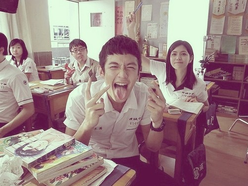

# ＜天璇＞昨日黄花——那些年，你们都没追的女孩

**但是那些年一起被追的女孩子是她们啊，多年后被江湖传说的女神是她们啊，更多的女孩子们，是默默的路过了她们的青春，扮演了合格的观众，然后在影片的结尾被抽象的鸣谢：友情出演的各位。没有出镜，没有发声，所以好像人们忘记了还有一种青春是沉默寡言的，还有一种暗恋是无声无息的，还有一种人生，是不会写进小说，不会拍进电影，却密密麻麻，真实存在的。这样的青春，是无关女神，无关世界，只被一个人真正珍视着的存在。她的漫长文字，她的电光火石，她的撕心裂肺，她的剧情谢幕，轰轰烈烈，安安静静。**  

# 昨日黄花——那些年，你们都没追的女孩

## 文/ 曹高君（中国政法大学）

看《那些年我们一起追的女孩》。感觉很奇怪，觉得整个电影恨不能每一分每一秒都打上沈佳宜的名字，但又好像90分钟的电影，都与沈佳宜无关。

说不好他更怀念的是沈佳宜，还是沈佳宜座前热血无比的自己。或者both.

也说不好他更遗憾的是错过了沈佳宜，还是渐失了那些与她有关的人生勇气。或者both。

在看电影前，先听了九把刀在北大的演讲。他是一个好的演说者，一个热血的鼓舞者。觉得他的演说，比他的电影更精彩。倒不是说这电影不好。该有的白衣少年翩翩的很到位，面如凝脂的少女酒窝浅的很恰当，白云苍狗也有了，碧海蓝天也有了，纯情也有了，煽情也有了，一切都很好，只是不能打动我。

看了豆瓣加人人上各种被此片感动的人仰马翻的文字，我还自我检讨来着。一般来说我体内的热血因子青春因子怀旧因子浓度从来都不低，时不时的在一些莫名时刻，还要比正常人高出百倍去。但是一部这么纯爱这么青涩的青春片，怎么就让我时时处在出离状态，是我的人生热血因子忽然间变的稀薄了么。。

但是细细想，觉得也不奇怪。

他用来动人的武器叫做青春，但是他的青春于我而言，长相那么陌生。

前几天生理期，肚疼疼的昏天黑地的时候第N次的发誓，下辈子是无论如何不能要当女人了。于是满目狰狞的问某人，换他下辈子当女人好不好。他老实巴交的面露难色：我不要。我逼问干嘛不要，他想了想说，当男生，长的丑点也不怎样啊，但是当女生，长相不出色就真的好难啊。。

我愣一愣，想一想，觉得这老实巴交的答案居然点破了《那些年》无法打动我的原因啊。天杀的，居然是种吃不着葡萄说葡萄酸的赶脚。。原来是木有体验过那样被人众星捧月奉为女神的青春啊！

我的青春，是鼻梁上六百度的塑料圆框眼镜好吗，是额头上死火山活火山一样不定期各种喷发的青春痘好吗，还是黝黑的皮肤加上硕大的腿脚好吗。马尾辫是神马东西，我只有屡次在女厕所吓得众女花容失色的假小子头啊。被人追是神马赶脚，我只悲催的帮暗恋的男生给他明恋的女神传过情书递过礼物啊。暧昧的美好在哪里，如果你只是心知肚明的等待着一个无望结局的话。

或许每个男孩的生命里有过那样一个酒窝浅浅的沈佳宜，她读书是正妹，她撒娇是正妹，她微笑是正妹，她哭泣就是正妹中的正妹。可是这么多年过去，谁会记得自己座前座后那个四眼妹牙套妹青春痘妹呢？她读书是怪胎，她撒娇是怪胎，她微笑是怪胎，她哭泣就是怪胎中的怪胎。。这么一想，觉得那些成天叫嚣自己是穷丑矮被女神和高富帅无尽涮嗒的男钓丝是多么道貌岸然，他们倒是听过女版的穷丑矮说过什么呢？（视具体情况而定，也可以是女版的穷丑高。。）

恩，过了过了，其实我的青春倒也不至于悲催至此了。但是《那些年》的青春如此生猛，让我生分。

在人生的某些阶段，一部分的人是注定的主角，一部分的人，是注定的看客。电影里的沈佳宜让我脑海中闪过了无数的影子。她的马尾像初中时美丽的女孩子S，她的酒窝像曾经要好的女孩子L，她的笑容很像H，那个走到哪里全校男生都要调焦距的女生，她垂着一线发丝做题的样子好像W，连认真都可以认真的那么动人。她们美丽的那么不可忽视，各种角落偷偷递来的目光与纸条，口哨或表白，连身为看客，都要结结实实的替她们这样叱咤的青春觉得激动。

但是那些年一起被追的女孩子是她们啊，多年后被江湖传说的女神是她们啊，更多的女孩子们，是默默的路过了她们的青春，扮演了合格的观众，然后在影片的结尾被抽象的鸣谢：友情出演的各位。没有出镜，没有发声，所以好像人们忘记了还有一种青春是沉默寡言的，还有一种暗恋是无声无息的，还有一种人生，是不会写进小说，不会拍进电影，却密密麻麻，真实存在的。这样的青春，是无关女神，无关世界，只被一个人真正珍视着的存在。她的漫长文字，她的电光火石，她的撕心裂肺，她的剧情谢幕，轰轰烈烈，安安静静。

她们在一个没有人看到的茧中完成了所有成长的蜕变。有人终于破茧成蝶，有人终生作茧自缚。现实就是，不是每个丑小鸭都能成为白天鹅的，前提还要熬过那个漫长的冬季。我喜欢那些在花朵一样站在所有人记忆里的沈佳宜。但是我好像更懂得那些树一样草一样，在大片的无视中默默长起的青春。那种青春里，听到泡沫碎裂的声音，要比看到泡沫升起的瞬间多。在浅浅而持久的失落里攫取的力量，居然也总是带着浅浅而持久的特性，反而能支撑一个人走的更远更久。这样的人生，大概从开始就没有被谁写好精彩的脚本，但是毫无期待的，居然有时也会被自己闯荡出一点跌宕起伏的情节。

因为看这个片，记忆又整整齐齐回去重走了一遍青春期。那些美好的女孩，搞笑的男孩，各种热血冲头的奋斗与表白，即使当年如现在一样只是充当看客，但忽然觉得 也是感谢他们，让默默无闻的青春里也有这样经典的情节在眼前上演。我不太想知道他们现在如何。也不太想说希望一切如初之类的梦话。沈佳宜之所以能让柯景腾惦记，因为她对于他，是一生无解的问号。我的记忆里那些男孩女孩，保持着一点的神秘给我好了，因为这问号，会让我更久的记得你们。

等到有一天，这青春期的封闭留在我身上的封印渐渐退尽，我再写漫长的文字，拍有趣的影像，告诉你一些故事，关于那些年，你们都没追的女孩.

 

（采编：楼杭丹；责编：陈锴）

 
