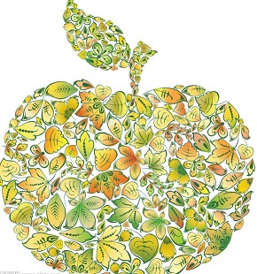

# ＜天璇＞昨日黄花——那年的苹果

**那些在俯仰之间绵密不绝地穿梭在生活中的所有或平淡或浓烈，或芬芳或爆烈的所有气息，好似无影无形的大地，托付着我们无影无形的生活。我常常觉得，是因为还能在这些气息间日复一日地流浪，让人默默而安心地意识到，这个世界还在，自己还在。**

 

# 昨日黄花——那年的苹果

## 文/曹高君（中国政法大学）

 

房屋后废弃的苹果园丰收了。某个早晨，房东太太放了满满的一袋子苹果和她做的蛋糕在我的门口。

因为无人打理地长大，苹果们自顾自长的很丑，丑的几乎像土豆。我横横竖竖看了半天，终于鼓起勇气拎起一个长的还算比较善良的苹果去洗了洗，不抱任何期待地送进嘴里。

居然就结结实实地惊艳到了。

矫情一点说，我居然在一个长的很像土豆的苹果身上认认真真地体会到，原来味道是真的可以分为前味中味和后味的。这道理，任是多少名贵的香水都没能把我教会。

忽然想起爷爷家的小花园。童年，夏末秋初的时候，在太阳下炙晒了一整天的院子，微热的空气里浮起一点泥土干燥的香。院子里那棵枝繁叶茂的青苹果从盛夏就开始钻出一个一个小毛头一样的果，到了秋初，迎着太阳的一面枝头，已经结结实实的被果们压弯了腰。傍晚，一家人会支愣着那个可以折叠的茶几，在苹果树下摆好杯碗茶碟，奶奶呼哧呼哧地抡圆了炒勺，几分钟的时间喷着香味的酸辣土豆丝和辣椒茄子都端上了桌。我是断然不肯乖乖坐在凳子上以寻常态吃一顿寻常饭的，吃到中间总是上蹿下跳的摘下一个长的极可爱的苹果，就着酸辣土豆丝辣椒茄子浆水咸菜稀里糊涂的就是一口，然后被酸到呲牙咧嘴言语不能。奶奶想要板起脸，但总是忍不住法令纹下一直暗抖的那一层笑。

忽然又想起六年级那年，家乡小城忽然跑来了一群叫做“红富士”的苹果，卖到死贵。每一次路过拉着满车满斗的苹果卖的大卡车，都看到白纸黑字写着红富士的牌子亮得非常骄傲。那些苹果也极其金贵地包在一个一个的塑料粘膜里，就是不肯屈尊露给人家看。小城的人们对着这透着鼓囊囊奢华味的苹果很是趋之若鹜，谁家买了去，交情一般的客人都轮不到吃的。我家的经济状况一向平平，于是某天发现阳台上居然出现了一箱传说中的红富士的时候，自己都觉得秋天过的奢侈。我是从那箱红富士开始爱上苹果的。和以往秋天那些绵软到差点就可以当做煮熟土豆一样的苹果是那么的不一样，那些个头小小的，红的粉粉嫩嫩的苹果，居然可以在每一口都给舌尖绽放开脆生生的一朵花。我一直坚信自己在那些红富士里尝到了些许的酒香，虽然除了我没有人这么在意那年的苹果。是从那年的红富士开始我对苹果有了自己的品鉴与钟爱。而察觉到我对红富士的偏爱，那一年的秋天，爸爸从未让阳台上的红富士断货。

可是像所有愚蠢、短视又无奈的小商业一样，那一年被人们交口称赞的高品质美好，在接下来的秋天自动泛滥成大堆大堆徒有其名而再也不符其实的“红富士”。它们一年比一年长相鲜艳，一年比一年身高体壮，一年比一年乏味、苍白、平庸。终于有一年我意识到，再也，再也没有一颗顶着红富士名字的苹果，还能寻找到那年秋天淡淡的酒香味。我无法证明它真的有酒香味，因为那种甚至算做高贵的味道，已经在功利而廉价的复制中灭绝了。

谁能想到呢，数年之后，一种源自真正的土地，浇灌过真正的水，被真正的太阳晒过，也被真正的风雨淋过，甚至或许在它深处藏着一只真正的小虫子的苹果，会成为一种难以企及的奢侈呢。

带着麦香的醋，带着豆香的酱油，带着胡麻花清甜的油，还有打开调料盒的盖子就能逼出我一个大喷嚏的花椒；姜的辣，椒的辣，蒜的辣，葱的辣，无数种的辣却没有谁的存在是种重复。那些在俯仰之间绵密不绝地穿梭在生活中的所有或平淡或浓烈，或芬芳或爆烈的所有气息，好似无影无形的大地，托付着我们无影无形的生活。我常常觉得，是因为还能在这些气息间日复一日地流浪，让人默默而安心地意识到，这个世界还在，自己还在。

只是，那些顶着同样名字，长着相似样子的红富士还是红富士吗？

那些顶着同样名字，长着相似样子的油盐酱醋还是油盐酱醋吗？

这个顶着同样名字，长着相似样子的世界，好像什么都一样，又好像，什么都不再一样了啊。

26岁，这样的怀旧听起来大概有点太不合时宜了。但是在心底的某个部分，我的确开始像个絮絮叨叨的老者，祥林嫂一样不住地回首，不住地对人讲述，那年秋天，我有吃到过一种苹果，它有点酒香味啊。

（采编：应鹏华；责编：麦静）

 
