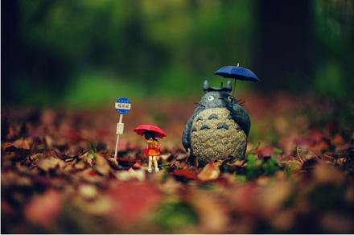
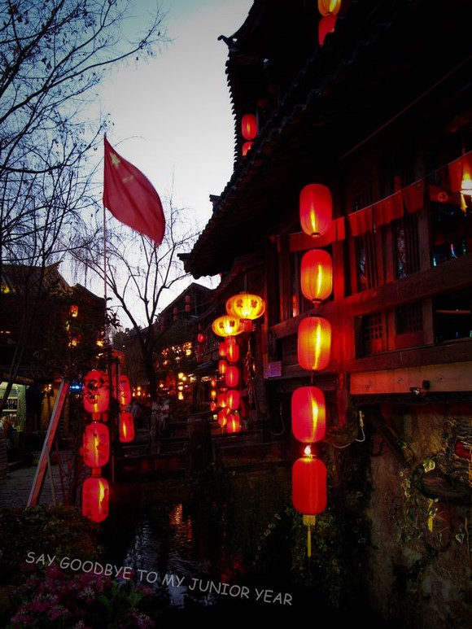

# ＜天璇＞梦想和欲望

**梦想从原点出发，越来越大，又越来越小，欲望却一直在原地痴痴的等她玩够了归来。终于，它们两碰到一起，合体了。这就是人生的微妙之处，现在的欲望，竟和梦想重合了。梦想本来就源于欲望，每个人的成功都有不同的人生诠释，前行的路上，理想是用优雅的姿态放目远眺，欲望则是略显笨拙的停下来看自己。**  

#  梦想和欲望

## 文/ 傅益东（东南大学）

 

小时候一直特喜欢城北小学门口的那家早餐店。一块钱，六毛钱买碗豆腐花，四毛钱买根油条。远远的看着老板揭开木桶盖，热气腾腾，香气四溢，用铜勺舀出一碗，撒上作料、虾米、芫荽、榨菜末，口水都流下来了….等到碗端到面前，把油条从中间撕开，细细的，蘸着豆腐花吃。美妙的滋味太激发人的想象力。吃豆腐花的时候曾多次幻想，如果有一天我做了皇帝，一定微服私访来吃豆腐花，正吃着御林军突然出现把街道重重包围，一个太监走上来说，皇上龙体要紧回宫用膳吧。这个时候，我头也不抬，很淡定的说，等朕把这碗豆腐花和这根油条吃完。 

这就是我小学时候的欲望，花一块钱，买一碗豆腐花，拿一根油条蘸着吃。这是比做皇帝还要过瘾的事情。现在的豆腐花都密封装在一次性的杯子里，配根粗的塑料吸管。没有了木桶和瓷碗，吃起来味道就大不如前了，油条也没有了发挥空间。你总不能指望着从把油条从吸管里插进去吧？ 

那时候有各种各样的理想：长大当厨师、捏糖人、卖爆米花、修自行车……当我谈起这些的时候，父母总要大骂没出息。这样一来唯一行得通的，就是当空军，大概每个男孩小时候都会有一个从军梦吧。（后来才知道男人在任何时候都有拔枪而战的欲望。）找两根皮带，一根束在腰间，一根从肩膀上斜拉下来。拿个塑料枪插在腰间，拿根绳系在扫把的两端，当步枪似的背在肩上。昂首挺胸的走来走去，装模作样。走到床边的时候，突然摸着胸口向后踉跄几步，喊：额啊……同志们，不要管我，为了胜利，冲啊！然后煞有其事的抽搐几下，一头倒在床上。 

这就是我小学时候的梦想，当兵，然后光荣的死掉，为人民群众献出宝贵的生命，墓碑上印着五个大字：为人民服务。现在想想小时候，觉得特崇高啊。没有自我，只有国家。 

后来上了中学，人生观渐渐改变，明白小学那些想法是行不通的，简直就是胡闹！。为人民服务….贴墙上的字能信么？红灯区的鸡店每家门上都贴着“美容美发”几个大字，她们几时美容美发了？新闻看多了，觉得当官的威风，就想着自己长大得做一个很大的官，被一群助手包围着，在满桌的资料上龙飞凤舞的画字。母校校庆的时候回来，浩浩荡荡一个车队，从一中门口排到五局大院，校长殷勤的走过来握手，点头哈腰，班主任猥琐的跟在队伍的最后，屁都不敢放一个，脸憋得通红。我心里暗喜，卵虫 ，特么让你躲窗帘后边偷窥，让你摔杯子骂人，让你安插间谍在班里。晚上校方设宴，我坐上座，然后环顾一圈，指指点点，然后对身边的校长耳语几句，校长一边赔笑一边站起来，叫班主任滚出去。然后把食堂做菜的师傅和叫上来，一起吃饭喝酒。 

这就是我中学时候的梦想，做很大的官，被一群人围着，找以前欺负过我的人，报仇雪恨。 

在我中学阶段，一直觉得自己骨子里应该是个诗人，除了不会写诗以外，各方面行为举止都达到了诗人的标准。不论是上课吃饭还是拉屎撒尿，经常陷入失去自我的美好幻想之中。百花盛开歌颂一番，落叶飘零感慨一阵。如果对那个时候的各种奇思幻想加以罗列，可以编一本书。那个时候，时间里沸腾着的，是激情、勇气还有希望……青春是怎样一种情怀？——于某个时刻遇上她，于某个时刻喜欢上她，于某个时刻决定放弃她。所有的瞬间在时间年轮里无法磨灭。这是人生最美好的纪念。欲望激发想象，呈现出这么一天：我和小师妹牵着手，走在路上。深秋时分，树叶红黄相间，天空明亮清澈，没有忧伤，阳光穿过天空，透过树叶缝隙，打在每个人的脸上。 

这就是我中学时候的欲望，找到喜欢的人，和她表白，然后快乐的在一起。 

等到上了大学，真的明事理了，知道这样做是不对的，简直是胡闹！是的，猥琐的偷窥、愤怒的咆哮、卑鄙的离间，这些构成了班主任的全部。但是，如风的情怀给了我如风的胸襟，什么不痛快的往事，付之一笑。我会写很多东西，出书，出名。名气大的很，见我得事先预约。亲友们纷纷打电话来套近乎，女孩们一天到晚给我打电话，对我崇拜的要死。我总是得匆忙的挂电话：好啦，哥还在创作呢，不同你多港啦。若干年以后，她们发来信件，信上只有一行字：我把整个青春，耗在暗恋里。 

这就是我大学时候的梦想，写书出书，拿奖出名，声誉鹊起。亲友们以认识我为荣。尽管说出这些会笑死人。但那个时候，我从来不觉得人的成长是为了证明之前的不切实际和幼稚，而是它会让自己知道，梦想是用来实现的，但是太容易实现的，那不叫梦想。 

大四下半学期住了一个单人宿舍，去旧货市场，花15块钱，买了张旧藤椅，窝在里面，看着远处烟囱管里飘着的烟，随风而去。点起烟喝着啤酒看着窗外，支起腿撅着屁股思索人生。人生如烟，一直在身边萦绕着，却始终摸不到。人生如酒，喝到嘴里是辣的苦的，仔细一品是香的。电脑里放83版的射雕，出去解手回来，藤椅被霸占，床上坐满一排人，人手一根烟，回头一看烟盒空空如也。夕阳西下的时候，打开门呼风唤雨般的大喊打球，一群人风驰电掣赶下楼，在食堂旁边那个球场打上两个小时，然后裸着身子去食堂小卖部买冰可乐，嗝着气的买份炒饭，带回去慢慢吃。 

这就是我大学时候的欲望，和兄弟们一起抽烟喝酒看影剧谈论美女，期待明天没课，睡到自然醒。玩魔兽打篮球看片子。我们的青春没有牛逼哄哄的经历，我们都是一群凡人，青春对于我们，只是些简单美好的回忆。 

工作了踏上社会，才发现有没完没了的操蛋事情。好不容易偷得浮生半日闲，惬意的睡到自然醒，起来，冲把脸，背心短裤人字拖，吊儿郎当的穿过几条街，去团氿看潮起潮落，然后莫名的忧伤，什么都不为。回来窝沙发，舒服的翻书看电影。感觉来了的时候打开电脑，打字。攒下些钱了，就一个人出去旅行。爱去哪去哪，谁也不带。 

现在的欲望就是像这样，平淡度过一天又一天。平淡充实，低调灿烂。 

我不能理解，为什么大家最不能接受的成功，就是平淡的度过一生。 

而梦想呢？ 

梦想从原点出发，越来越大，又越来越小，欲望却一直在原地痴痴的等她玩够了归来。终于，它们两碰到一起，合体了。这就是人生的微妙之处，现在的欲望，竟和梦想重合了。梦想本来就源于欲望，每个人的成功都有不同的人生诠释，前行的路上，理想是用优雅的姿态放目远眺，欲望则是略显笨拙的停下来看自己。 

真正的成功只有一个, 就是按照自己喜欢的方式, 去度过人生。  

（采编：陈锴；责编：陈锴）

 
