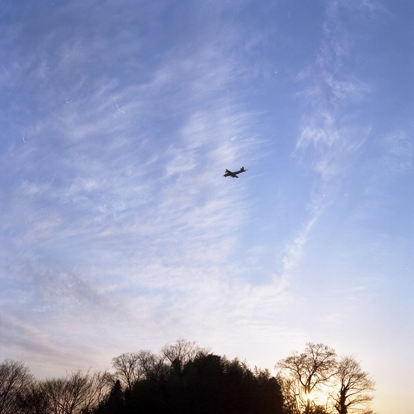

# ＜天璇＞残留的那些残留的回忆

**“有些人是一辈子也忘不掉的，因为他不在你的脑子里，不在你的心里，却在你的血液里。直到血液停止流动的那一刻，你可以对自己说那个人终于不用像影子一样的如影随形了。”**

### ** **

### 

### 

# 残留的那些残留的回忆

### 

## 文/戴春阳（沈阳音乐学院）

谢谢你看见我把头转向了一边，或许我比你伪装得更好，我装作无意一瞥地走出了那家店。看到你跟朋友在一起闲聊吃饭，你看到我的那一刻愣住了，嘴角的笑容突然僵硬了，我是看得到的，那一刻你选择逃避我也选择了回避。不想知道你对面坐的那是谁，也不想知道你现在过得好不好，你不应该出现在这个小城市，这里留给你的不过是一座未上完的学校和一些不入流的朋友。 其实我是可以在你看我的那一刻坚定地看着你，然后认出你，跟你攀谈，我没有。我还是在你面前装了，又一次的在你面前装了一回。这些年我不知道有多少次跟你讲述着我现在过得有多好，在你面前炫耀着我自己，我想让你后悔、让你自卑，但是我知道你是个从来不会后悔自己选择的人。就算我们换个时间相遇，你还是不会选择我，你还是不会爱我。 

### 

### 

或许这就是人生，人与人总在无数的平行、交叉、擦肩而过中渡过。我曾经是那样地迷恋你，就像猫儿迷恋着鱼儿，鱼儿迷恋着水，水迷恋着冰川一样。这是种骨子里与生俱来的，是命里轮回中冥冥注定的，是谁也改变不了的东西。突然想到了席慕容的《一棵开花的树》: 

如何让你遇见我

在这最美丽的时刻

为这

我已在佛前求了五百年

求佛让我们结一段尘缘

佛于是把我化做一棵树

长在你必经的路旁

阳光下

慎重地开满了花

朵朵都是我前世的盼望

当你走近

请你细听

那颤抖的叶

是我等待的热情

而当你终于无视地走过

在你身后落了一地的

朋友啊

那不是花瓣

是我凋零的心

在我的豆蔻年华与你相遇，从此便与你这个男人藤蔓纠缠。无论是在过去还是在今天，无论是在光明还是在黑暗。我们之间的故事就宛如张爱玲与胡兰成。 不管怎样我爱你就是要让全世界人知道，我爱你就算遭受到所有人的反对还依然爱，我爱你即使你不爱我我也爱你。佛语说“命里有时终须有，命里无时莫强求”，我曾经强求过，也哭过闹过恨过。回想起我想我还是给自己留了点尊严的。在你离开之前先你之前离开，让你看着我的信我的背影离开。这大概就是我那店卑微的可怜的在你面前的尊严了吧。 我曾那样地挚爱着你，你就像洛神惊鸿的一瞥从我身边擦身而过。我曾那样地对你生死相许，你却宛如顽石无论怎样都弃我而去。我曾那样地牺牲自己，你如应当的尽情的索取。我们的我们只有我们能理解。 或许是誓言吧，或许是承诺，或许是种冥冥的诅咒。我曾经给你写过“我不会先你找女朋友之前找男朋友。我不会先你结婚之前结婚。我不会先你死去之前先死”这样的话语。我一直单身，但一直打听你的消息。你身边的女人换了几个，你现在工作的怎样，你现在是否单身，这些问题我都一一知道。不为别的，就是想知道你开心就行了。 其实我想我早已经不爱你，不过心里的印记有时会像猫挠似的，不停的去想。就像“越搔越痒越搔，越痒越搔越痒”。 

### 

### 

有些人是一辈子也忘不掉的，因为他不在你的脑子里，不在你的心里，却在你的血液里。直到血液停止流动的那一刻，你可以对自己说那个人终于不用像影子一样的如影随形了。 残留的回忆一直若隐若现，无关于爱情，不可能是友情，暧昧早已远去。处在这种尴尬的境地，尴尬的我，尴尬的他。我想他不认出我是对的，我选择漠视是我们避免尴尬最好的结果。这样挺好，有些话不需要说的明明白白，有些事不需要懂得真真切切，隔着白纱看世界的样子最美。 如今的我早已不会像当年那样为了一个结果而不惜一切，如今的我也早已不会像当年那样为一个人而去做得那么真实，如今的我也早已习惯一个人的生活。不再相信男人的话语，不再对他们的话信以为真。因为这个世界上只有一个男人的话才是可靠的，那个人是我爸爸。 当然我也会幻想，我也会想象，我也会奢望。我会幻想和某人领到红本本幸福的样子；我会想象和某人在阳光西落45度照耀大地的时候，和他一起欣赏落日、一起读书、一起品味阳光；我会奢望某人能够在我一个人行走的时候牵起我的手不再放开的时刻。 这大概就是双鱼座女生的那些小思绪、小爱恋吧。 人生已经过去了四分之一，无关乎房子车子票子的爱情应该找不到了吧，那种小纯情小浪漫的爱情大概也找不到了吧。那就好好的独善其身吧！其实想想自己也是自作自受，可笑的是，我诅咒了我自己这辈子只爱那个男人。 

### 

### 

(责编：黄理罡)

### 

### 
