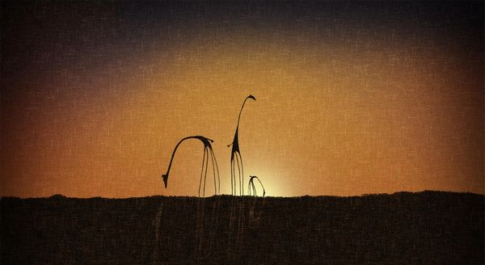
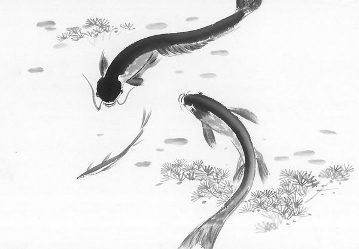

# ＜天璇＞母亲是侠客，父亲是条鱼

**看看镜子里的自己，因为长久的混乱作息留下了深重的黑眼圈，我想起父亲和母亲的结婚照，学着父亲的样子咧嘴，那笑里装不下一点甜。我梦见母亲砍下一棵青竹，刀光映着她的欢笑飘到江边；那水里有个少年，没心没肺地唤着母亲也下水游戏，突然就扎入水去，好久好久，才在远处的水面看见他翻跃出来，阳光洒在他的身上，把他变成一条金光闪闪的鱼，那是我的父亲。** 

# 母亲是侠客，父亲是条鱼

## 文/张苏樊（星联士官学院）

 

小的时候挑食，体质又不太好，到了男孩子长个子的年龄，常常会半夜腿骨疼痛不能入睡，那痛觉是成长撒在身体里的一粒种子，在我的脚踝、小腿和膝盖上死死缠绕。

母亲听到我半夜里喊痛唤她，便来照看，她经常把手伸给我看，说你瞧这些茧，哪里是一双女人的手啊。拿手在我年轻的脸上轻轻抚过去，脸上被割划得生疼。我到了约莫成人的时候，手臂的气力才勉强大过她，因为我年轻，可以在扳手腕的时候打持久战。

她就用她那双手给我按腿，然而手掌那般有力，却从来不使我疼痛，那是一个温柔的母亲照看孩子的自觉和天能吧。她确实是个温柔的女人，她挂着疲倦却没有厌倦地照看我因为不听她的话挑食而生疼的腿脚，我一时之间无法睡着，就缠着她讲故事，不讲那书上的小说或是世外的童话，只讲她自己。

母亲就讲她小时候和我的外公一起去买米，坐在一辆拖拉机的翻斗里，那时候鄂西那山里的路可不是现在这般漂亮的柏油，那车在土路上疯狂地颠簸，“差一点啊就跌下去了，要是那样可哪里还有你。”

她总觉得我的童年是没有多少乐趣的，她讲她小的时候爬树吃桑葚，满手都是甜又酸的浆汁；那时候她还是个少女，但大方又干脆的骨气透出来，就似孩子王，带着伙伴们一起练舞功——翻筋斗之类的，算不得什么舞蹈，她们给田间闲时的农人们就表演这些，“我可以翻很多，腰软得可以随便下”；大约初中的年纪，班上的男生调皮女生，女生从课桌间走过时一条腿伸过去就是不让，她过去二话不说一脚狠踹上去，那以后再大体格的男生看见她也低眉顺目，活像弟妹；外公那时一身的脾气和规矩，电影里宗教教徒们吃饭需得做祷告，田家一家人吃饭需得先上思想政治课，妈妈只怕外公：“你外公走到部队大院门口，离家还有百米多我就能感觉到！”若是家中有战友来访，必然是要喝酒的，外公不胜酒力，往往是她救场，每每说到这个地方，母亲的言语中都那么不自知地透露出一种忿忿，就仿佛在对外公说：难道不知你家红兵（母亲的名字）也是姑娘家么。

母亲的声音很好听，年轻时该也是一把土家姑娘的好嗓子，有次我的一位同学向我家打电话，母亲接了，同学后来问我家中怎还有一姐姐。很久以来，我一直觉得母亲的那种温柔，就像是我成长的那座小城怀抱的汉江水，平静、宛转又温情。

去年在家养病时候，母亲和父亲吵了一次，大概又不止一次吧。她很伤心的样子，也不知是不是挂着泪珠想了一宿，过了些日子和我闲聊，说她以前一直在期盼着我长大然后离家，“然后我就去尽情做我想实现的事情”，我两年多以前到武汉读书以后，她感到一种不能抑制的解脱感。

她拿出年轻时的照片给我看，神情好像在吟唱一首诗：“我在你这个年纪的时候，梦想成为一个侠客，挟一把剑浪迹天涯，路见不平拔刀相助。”那话语间的邪气和畅然，让我如见令狐冲一样的少年，甩着酒壶与剑，在竹林山石间鬼嚎痴笑。

那照片上短发轻笑的姑娘，大眼睛闪啊闪，像是桑树枝梢上爬过的土家野歌。心中容不下千军万骑，却有那单枪匹马。

我的父亲，我的爸爸，我的爹，用我娘亲的话讲，“性子就像个老太太”。

父亲在小时候就失去了双亲，我的爷爷年老后有一天午后坐在自家院子里晒太阳，就这样去了，我的奶奶在那之后似乎是精神上有了困苦或是疾病，最后绑了块石头走入到江中去了。这些是母亲讲与我听的。父亲与母亲是在鄂西北的这座城市相识相爱并结下婚姻，回去江苏访亲时，要当女侠的母亲被江南乡村里那纵横的水路吓着了——她是直到现在也不会水的，“哎呀你不知道那些桥有多可怕啊，又高又窄，还不平！我那时候要掉下去，现在就没有你啦！”爷爷奶奶离世后，父亲就由几个兄姊照顾。我的姑妈，也就是他的姐姐，是个很好心肠的人，收养了一个弃婴养大，我8岁那年去见过那个姐姐，前些年据说这女孩自己跑出去再也找不见了。

有这样的身世，父亲的童年少年自然是比较困苦和艰难的，他喜欢带着那种小孩子一样没心没肺的笑说他的水性多么多么好，母亲就在一旁附议：“你个鬼人还好意思说喔！扎到水里半天都不冒出来，吓死人！”父亲就更加没羞没臊地顺杆子爬：那可是，你爸爸游泳可是一把好手！母亲一个青眼扔过去：滚蛋！还好意思说！

但其实他是在做船工，江里翻浪里滚，大概也不太过分，那是我奶奶求生不能便向死去的地方，却也成了贫苦的父亲讨生的地方。

然而毕竟是在新社会，穷苦甚至孤苦人家的孩子也是可以读书认字的。这一段儿是从父亲口中听到，一脸得意说烂了的故事，无外乎他在初中辍学之前是多么学科优秀，以至于考试老师放过他让他去监考同学。他讲这些的时候，我在读着小学，母亲在一旁织毛衣听到了，就会“啧啧啧”地笑起来，父亲不打自招地叫着：怎么，难道我还说谎不成么？现在想来，母亲一直在照顾两个孩子，一个永远长不大，一个总不想长大。

那之后的故事又是破碎的了，我和父亲的交流本就不多，我喜欢和母亲聊天，在我看来，母亲是神女，父亲就像个粗鄙的野夫，无法沟通。我从母亲那里听到的是，父亲后来就跟着大他很多的我的大伯去上海，在转户口的时候，大伯使了心眼，没有给父亲转。

他是怎样辗转从江淮来到陌生无根的汉水，我不得而知，一个没有技术没有学历的男人，如何找到自己的立锥之地，我也难以想象。据说他还一度丢失了自己的身份证，以至于几乎成了黑户，结婚之后人口普查的时候还需要拿出一个叫暂住证的墨绿色小本。他总是在丢东西，今天遗失了这个，明天忘记了那个，像个老太太。我的百天照片的底片也被他拿出去跟朋友炫耀的时候弄坏掉了，母亲每次说起来，又是叹气又是撇嘴。

我看过父亲和母亲结婚那两三年的照片，短发及肩的姑娘脸庞圆润起来，没有那么多英气和硬朗了，身边则多了一个瞳仁如珍珠的男人，那男人很帅，很帅。父亲比母亲大了足足九岁，结婚照上他脸上那渐渐深下去的皱纹却还是藏不住他那不遮不拦的甜。他做事就如这脸庞一样，再老也洗不去孩子气。做生意，货款人家说没钱给，他就空着手回家，人家说借多少钱赊多少款，他就立个字据听凭别人的笑脸。母亲气得不做晚饭，他一脸内疚地去做了一桌被母亲数落了一晚上的饭菜，自己洗干净碗筷，拽着母亲就在客厅里跳他所谓的华尔兹，他不知道什么是华尔兹，母亲气没有消，一狠心踩他的脚，他哎呦一声就歪在沙发上说自己不行了，眼睛眯起来余光看着我等我去关爱。

喜欢丢东西的人，往往也总是在找东西。

我长大了一些后，他就带着我往家乡去。我在镇江乡下的石板桥头双腿发抖不敢过去，吼他让他牵我过去。他带我去给爷爷奶奶上坟，不喜欢乡下又晕车的我说了对祖宗不敬的话，他没有打我，只让我磕了三个头，就自己跪在坟前，说了好久好久，好像还为我的罪行求祖先原谅，“我们家笑笑小孩子不懂事，先人们你们不要怪他”。他牵着我走过好长一条土路，路两旁是好高好高的常青树，但也许实际上没有那么高，树干上趴着大声叫嚷的知了，叫声可怕又放肆。我见到了我的舅爷爷，给我起名字的老人，我记得他家一进门墙上有一幅福禄寿的画，他硬塞给我十块钱，他总是咳嗽。似乎很久以前去世了。

父亲带着我去过几次上海，告诉我大伯照顾过他，没有大伯他是活不过来的。我不喜欢我的大伯，那老人对我有距离，所以我也就不愿意像父亲说得那样对他友好。事实上父亲也在我面前说过大伯以前对他不好甚至是欺负他、压榨他、算计他的行为，但是用母亲的话说：你爸心软得跟水一样，他恨得起来谁啊。

这些日子我一次次质疑自己的所来与所往，寻找自己的归处，我推开窗户，碧玉一样的月亮飞在一片浪声中，想起了父亲。他在儿时丢失了自己的双亲，在少年时丢失了学堂，在青年时丢失了那一泽水乡，中年时却又丢失了自己的家庭只身去往上海，而人到老年是不是该要准备丢掉自己了？我不知道父亲是否也会想象自己的归处，他丢失了那么多，他一直在寻找。

看看镜子里的自己，因为长久的混乱作息留下了深重的黑眼圈，我想起父亲和母亲的结婚照，学着父亲的样子咧嘴，那笑里装不下一点甜。我梦见母亲砍下一棵青竹，刀光映着她的欢笑飘到江边；那水里有个少年，没心没肺地唤着母亲也下水游戏，突然就扎入水去，好久好久，才在远处的水面看见他翻跃出来，阳光洒在他的身上，把他变成一条金光闪闪的鱼，那是我的父亲。

张苏樊

二零一二年七月 归途中

 

（采编：佛冉 责编：佛冉）

 
