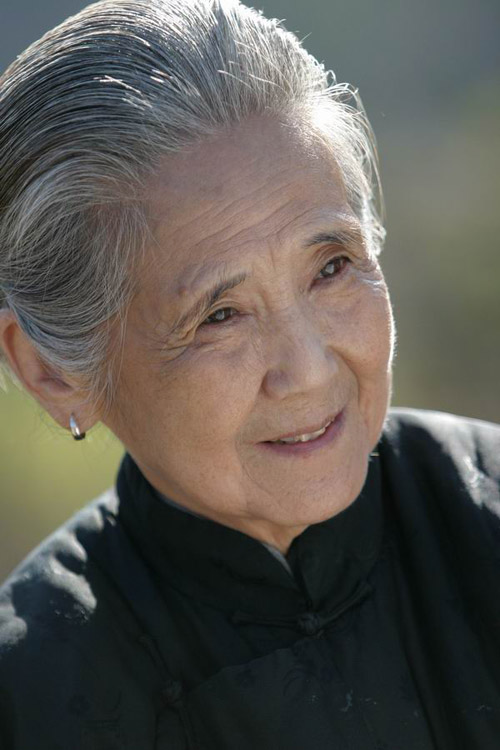
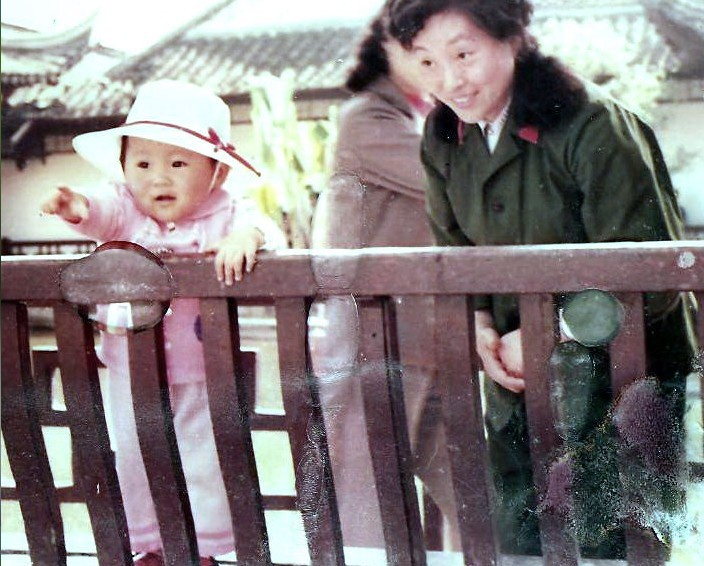

# ＜天璇＞母亲的毛衣

**清人陈序在《祭母文》里写：“清晨醒来，见母蒸饭。风箱哧哧，大锅熏熏，其心暖暖，其意懒懒。母喜于色，嗔声暖语，招于近身。伸取铁勺，放之于火，及至烧干，吹吹尘烟，些许油盐，二三鸡蛋，香味入鼻，喉舌涎涎，滋滋入口，心足意满。”大概道出了子欲养而亲不在的真谛，我亦多么怀念幼时清晨，伴着厨房炊具之声而醒，朦胧披衣，母亲已做好五更饭笑着催我和父亲上桌。** 

# 母亲的毛衣

## 文/终南俗人（清华大学）

 

近来寒风乍起，落叶知秋，翻箱倒柜，有一件红色毛衣，一时忘记何处得来，为何在此。及看到与父母合照，才记起乃是今年仲夏，母亲远道赴鲁探我时交与我，说是她从别人处质得细羊绒，以精细之工费数月织得。当时我竟不喜，嗔怪毛衣全是大红，埋怨“儿犹未到本命年云”。草草混于行囊，带回北京。

姑且一试，穿上身便不觉寒冷，轻薄柔软，抚之若无物，着身不觉缚赘，于是爱之不已。

一针一线，绵密精致，整整齐齐，上有细细的花纹路。毛衣是母亲手缝，母亲是人民教师，教书哺人已是非常繁忙。不知几何日夜，母亲在灯下，以白天写板书、批作业的糙手，做一针一针精细的活。不知有没有戳破过手，有没有缝到深夜老眼昏花，腰背酸疼？

这样想着，眼中似乎有点酸。 

母亲出生在农村家庭，是家中大姐，下有二弟一妹。小时便多操劳，辅助家中田耕杂事，还要帮扶弟妹。二十多岁嫁我父亲，两年后产我。彼时父亲供职南京，母亲带了我住外祖父家。外祖父母忙于农事，少有闲暇，母亲一个人照料我吃奶、洗尿布、做饭，其中辛苦自不必言。及长，我又顽劣异常，惹事生非，不得安宁，亦全仗母亲四处斡旋。

大概小时吃够苦的人，多有得失之心，遇事常计较。我虽非淡泊之人，但于小事上不喜计算。外出或与人生不快，母亲会大声争吵，不肯吃亏，我却最烦此事，有时竟反相助外人，气得母亲半天说不出话。至我入京求学，母亲常常在电话中絮叨日常琐事，我却总不耐烦，往往三言两语说完，挂了电话，却又后悔。母亲观念，“学而优则仕”，于是冀望我以科举而入官场，我又不喜欢，亦常以此事生龃龉。故到今日，我与母亲仍常有不和，然不出二日，或我软言相求，或母亲致电叨叨，总能和好如初。

三春之晖，何克以报，自古皆然。汉文八岁封代，天寒地冻，国偏地小，母子相依为命。汉文感母薄氏之恩，终身存孝。母病，汉文为之试药，天感其诚，经年乃瘳。少卿未报母恩而身陷匈奴，汉武大怒，诛其全家，少卿闻其母死，常自叹哀伤，以是终身愤愤，不归故国。母亲在堂，四壁萧然，也是温暖之家，母亲已去，虽金碧堂皇，何人居之？

年少轻狂，以为洒脱，欲立四海之志，侠事行于九州，声名闻于诸侯。刻意与母亲保持距离，久之不通书信，遇事独自决断，人前不言母亲，以为这才是大丈夫，这才是独立自主。人至中年，反耳变得依恋母亲，一日之间三问候焉，大小凡事与母亲商量。读中年鲁迅致母家书：“小包一个，昨天收到了。酱鸭、酱肉，昨起白花，蒸过之后，味仍不坏。只有鸡腰是全不能喫了……但其中的一种粉，无人认识，亦不知喫法，下次信中，乞示知。昨天发风，才冷了起来，但房中亦尚有五十余度。”字里行间，尽是琐事，我却无一丝嘲笑，只觉得意味隽永。

前几日，临考托福，母亲来电，叮嘱多吃肉，睡好觉，每天做保健操云云。听说近来失眠，又教以“安神入睡法”，曰睡前以指尖自额头向后至后脑，按摩五十，要心无杂念云云。又说考前一天买好食物，以防考试饥饿，不能专注云云。终于不耐，说道“儿岂是十岁孩童耶？吃饭穿衣不知耶？”耳边戛然，我亦无语。良久母亲乃说：“好好准备，不要紧张。”轻轻挂断。

今日考完托福，外祖母打来电话，关切寒暖，并问考得如何。我问外祖母如何知晓我今日考试。她说那日母亲在外祖母家时告知，且说：“你母亲昨日早晨上方岩，为你考试拜胡公。”胡公者，永康人信奉，香火供之也。方岩虽不高，百丈仍有余，母亲近天命之年，如何在清晨上山，为孩儿祈祷许愿然？我之不肖可见矣。

从未敢想，若果真的失其所怙，我将何以处之。近来网上友人失母者二，其一男，其一女，皆婉转哀伤，如鸟失其林，无所依附。我观其文，自亦愀愀然心惊，怅怅然肉跳，汗涔涔，而泪潸潸，深恐此等不幸事突然降临于我该如何是好。

清人陈序在《祭母文》里写：“清晨醒来，见母蒸饭。风箱哧哧，大锅熏熏，其心暖暖，其意懒懒。母喜于色，嗔声暖语，招于近身。伸取铁勺，放之于火，及至烧干，吹吹尘烟，些许油盐，二三鸡蛋，香味入鼻，喉舌涎涎，滋滋入口，心足意满。”大概道出了子欲养而亲不在的真谛，我亦多么怀念幼时清晨，伴着厨房炊具之声而醒，朦胧披衣，母亲已做好五更饭笑着催我和父亲上桌。

我常心怀天下，想上致君上，下安黎民。我是否为了让母亲看到孩儿锦衣而归故里，光耀门楣？母亲尽管因为考试为我拜胡公，但她最大愿望，大概只是我安礽续胤了，一如给我起的名字。

看到爱马仕一款毛衣售价三万，和母亲与我的毛衣款式、花纹皆似，初时讥笑不止。后来我想，爱马仕也知道，世间最珍贵的，是母爱。 

凯风自南，吹彼棘心。

棘心夭夭，母氏劬劳。

凯风自南，吹彼棘薪。

母氏圣善，我无令人。

爰有寒泉，在浚之下。

有子一人，母氏劳苦。

睍睆黄鸟，载好其音。

有子一人，莫慰母心。

 

（采编：应鹏华；责编：麦静）

 
