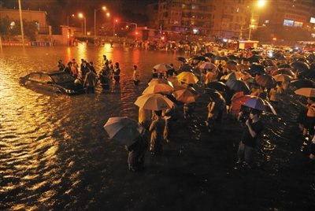
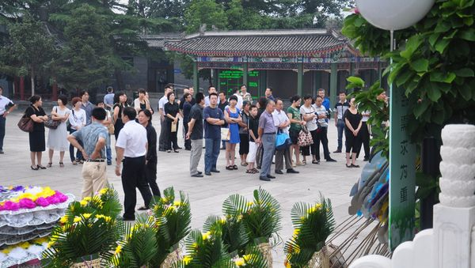

# ＜天璇＞每一个人都是丁志健

**除了等待救援，我别无他法。然而我为之奋斗的社会、我依法缴纳的所得税，没有给我带来生命的保障。我的最后希望，是给自己的亲人打一个电话，希望他们来救我，因为本来应该救我命的110，竟然在这个时候占线；而120告诉我不应该打这个电话。我的最后希望，是我娇弱的、拿着一把锤子的妻子，从暴雨中的通惠桥一路跑着过来，双膝下跪向救援人员求救。** **我最后的希望，是她微弱的声音在风雨中回响：“丁志健，我来救你了。” 直到手肘撞破、头骨撞碎，也无法逃出生天。**  

# 每一个人都是丁志健

## 王小心（北京大学）

 

我和丁志健都来自小城市，靠自己的奋斗在北京站稳了脚跟。我们毕业于一样的学校，在外企有一份不错的工作，开同一个牌子的车。我们买了房子，可能还在不错的地段，我们在北京组建了自己的家庭，我们有了可爱的孩子。我对这座奉献了青春的城市有了太多的感情，家般的依恋。我知道在一天的辛苦工作后，华灯初上时，我开车行驶在夜色阑珊的车水马龙中时，有一盏暖暖的灯光在这个城市的某个角落等我。

然而，这个家一般的城市却给了我当头一棒。

我不敢轻易对微博上的各种传闻发表评论，因为在这个每个人都是传播者的年代，我不能对无法确认真假的事情表示愤慨或随意转播。我希望以最大的善意去揣测人性，或起码仔细思考事件背后的可能性。但我写这篇文章的原因是，我把自己代入这个故事，却无法思索出一条可能的出路。车门被中控锁死；水压太大打不开车门；有限的力气无法踹开玻璃；没有任何可以借用的工具。除了等待救援，我别无他法。然而我为之奋斗的社会、我依法缴纳的所得税，没有给我带来生命的保障。我的最后希望，是给自己的亲人打一个电话，希望他们来救我，因为本来应该救我命的110，竟然在这个时候占线；而120告诉我不应该打这个电话。我的最后希望，是我娇弱的、拿着一把锤子的妻子，从暴雨中的通惠桥一路跑着过来，双膝下跪向救援人员求救。

我最后的希望，是她微弱的声音在风雨中回响：“丁志健，我来救你了。” 直到手肘撞破、头骨撞碎，也无法逃出生天。

我们并不怕天灾，我们怕的是明明有希望，最后却变成了绝望。

在美国，我也打过几次911。第一次是车的后窗玻璃被淘气的孩子打碎了，没有任何人员伤亡，十分钟后，警察开车过来询问情况。第二次小区停电了，有人拨了911，不到十分钟，尖锐的汽笛声响起，指挥车、警车同时过来抢修。公寓的火警在深夜响过一次——后来被证明是误报——半夜十二点，十几个全副武装的消防队员开着消防车过来，带着大斧、消防带、手电、头灯。检查完之后发现是误报，他们没有生气，而是微笑着对疏散的居民说：“欢迎回家。”任何一起车祸，一个911打过去，是警车、消防车、救护车一起出动，即使没有人员伤亡，也要确认事故情况；街边画着红线的消防通道从来没有车辆占用；警笛所响之处，所有车辆自动靠边停车。

我初来美国时，觉得警笛刺耳，半夜扰民。后来我知道，虽然有太多狼来了的故事，但一盏闪烁的警灯之后，可能就是一条人命。

如果说，一个人被困在暴雨中的车里还可以归因于坏运气，那么，消防、警察、急救等国家机器在面对一个并不复杂的情势时的无可奈何，则表明了制度的缺陷；而救援人员在面对丁志健妻子下跪的苦苦哀求时的无动于衷，反映的则是人性的缺失。人性的缺失与制度的缺陷如同蜡烛燃烧的两头，共同侵蚀着我们的社会。可怕的是，这两者并不是没有关联的。制度的缺陷导致了人性的缺失，而后者反过来也加速了前者。

我相信那些救援人员并非恶意，他们也知道水下可能有一条活生生的人命；但在这样的社会里，谁又能相信谁多少呢？他们可能觉得丁志健妻子的话不够真实，他们可能觉得下水风险太大，他们可能根本没有带够足够的工具。这是我从最善意的角度去揣度他们之后，所能猜测出的结论。但最重要的是，他们不用负责。他们不用对这片辖区负责，他们不用对这个社会负责，他们不用对纳税养活他们的人民负责。他们只用对他们的领导负责。当领导来了之后，丁志健的车终于被捞了上来，而活生生的一条人命，也消逝在一个举办过奥运会的国际都市的主干道上。

如果溺水的是他们的亲人朋友，我相信那些人不会无动于衷。我相信每个人都会对自己的亲人负责。但在一个非自给自足的现代社会、一个并非凭一己之力能完成所有事情的公共空间中，如果每个人都只对自己的亲人朋友负责，我们还能生存下去吗？丁志健的故事并非只在这样的突发事件中上演：我们的亲人生病了，只能靠自己的节蓄，一场大病下来，经济拮据的家庭往往负债累累；我们的父母老了，养老金发放迟迟不到位；我们的孩子上学，靠的不是分数而是赞助费和错综复杂的人事关系；这不再是一个靠个人奋斗可以获得安全、生存和自我价值的社会；我们的抱负被太多东西拖累了脚步，我们充满希望地步入这个社会，最终却变成沉入暴风雨中的车。

这不是丁志健一个人的故事。这是一个社会的故事，这是可能发生在每一个人身上的故事。那些对农民工或者贫困者的遭遇无动于衷的白领们，请恐慌吧，因为这样的故事已经发生在了我们的身上。丁志健是我素不相识的师兄；丁志健可能是我身边的同事；丁志健可能是我的妻子，我的丈夫。

丁志健可能就是我。

丁志健的命运在回家的路上沉入水下，永不浮起。

我们的命运在这个城市摩肩接踵的高楼后面沉入水下，永不浮起。

 **本文版权属于王小心 [http://www.wangxiaoxin.net](http://www.wangxiaoxin.net)，转载请注明。**  

（采编：黄理罡；责编：黄理罡）

 
