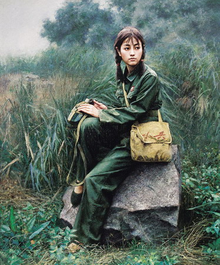

# ＜天璇＞每个人心里都住着一个红卫兵

**每个人心里都住着一个红卫兵，与群众站在一起时，多么严重的错误都觉得心安理得，因为错了也不用自己一个人担当，所以对他人的评价和处置就容易随意而鲁莽。**  

# 每个人心里都住着一个红卫兵

## 文/自由体（香港）

  高中的时候，8个人一个宿舍，枯燥的学习生活中，晚上边泡脚边互相开开玩笑就是最大的乐趣。有人觉得玩笑过火或者谣言成分太重时就会极力反驳表明自己的清白；有人天生温顺，即使被人说了过分的话也只是不好意思地笑笑。渐渐的，一个性情温顺的女生成了大家集体“攻击”的目标。我们学她跟男生说话的语气，嘲笑她弱不禁风的可怜样子，编些从没出现过的台词，非常投入地表演一番，然后哈哈笑作一团。后来玩笑变成捉弄，寝室长带头把胶水混进她的雪花膏里，我们几个脑袋凑得密不透风像观察一个伟大的实验。我们还做过什么缺德事我已经不记得了，只记得这个被我们欺负的女生从未跟我们翻过脸，从来都是笑脸相迎，像感觉不到这狭小空间里形成的7:1阵营。就是这笑脸让我们从未觉得自己做错了什么，背后一起议论她、制定捉弄计划的时候更加理直气壮。 

 大学三年级重新换宿舍，要按班级分配，我们几个人不在一个班级却想继续住在一起的女生一直跟老师僵持着，不肯填写自由组合的表格。最后胳膊没有拧过大腿，还是没能如愿，反倒把我和另一个同班的女生跟一个无人愿意与她同住的女生分在一起。这个女生刚进校时与其他人并无不同，甚至更为优秀，数学成绩尤其高。她积极地竞选班级干部，自愿担当数学课代表。我至今仍记得她一头直发，蓝色背带裙站在讲台上的样子。但是第一学期考试她就挂科了，这么大的反差究竟因为什么我到现在都不知道，也许是人常说的高中压力太大，上了大学一下子放松不适应新的学习方式。总之她就是失败了，从此开始自我放弃，等到重新分宿舍时她已经成了人人嫌弃的“讨厌鬼”。她迷上了游戏，天天抱着一台笔记本没日没夜地玩儿，甚至不吃饭不睡觉不洗漱，个人卫生差到极点，有时烂七八糟的东西堆得我们门都开不开。我们开始把她当作怪人，集体活动从来没有她的份儿。又一次我们甚至叫了其他宿舍的同学一起在屋里吃火锅，她就躺在床上被我们当作不存在。我们热火朝天的吃，大声的聊天欢笑，期间是不是也曾拿出一些她的糗事作为笑料我都记不清楚了。但有一幕我记得很清楚，有个女生笑得太激动，一下子没注意差点坐到了地上，幸好没有把临时搭建的桌子和火锅掀翻。她听到动静从床上一下子坐起来，说了句：“哎呦，小心啊~”我们当时没有任何人对她的话做过任何回应，仍然自顾自地吃和笑。后来她的行为越来越反常，在桌子上画些让人感到不寒而栗的铅笔涂鸦、半夜突然坐起来说要烧了学校，其他诸如不满意老师给的分数去和老师争吵、在课堂上往自己耳朵里灌可乐、大白天躺在路边等行为都是从别人那里听来的，几分真实几分夸张不得而知。但当时我们都信了，口耳相传，她在我们眼里已经成了疯子。我们自然不愿再和这样的人住同一间宿舍，于是集体去找老师请求调换宿舍，还把当时正成为焦点的马加爵搬出来。但我们又不愿意放弃那间面积最大又是朝南的屋子，执意要求学校把她调走。学校没有同意我们的要求，所以有一天我们自以为很有正义感地把她关在了门外，她敲了很久，我们都躲在阳台上当作没听见。我当时实在不知道这么做的用意究竟为何，只是没有勇气站出来打开那道门。她终于被逼得使用了暴力，抄起走廊尽头的拖把把门捅破，从洞里伸手进来扭开了门闩。我们像看着一个杀人犯一样，屏着呼吸从她身边溜了出去。她连看都没有看我们一眼，木然地做到自己的位子上。这次事件似乎让我们换宿舍的要求有了合理性，从那以后我们就借住在其他宿舍，直到她休学搬走。我们欢天喜地的回到自己的屋子，像抢回了失去的领土，曾一起吃火锅的同学也如愿以偿住了进来，那些她没有带走的东西被我们无情地占为己有。其中一个小板凳被我们从学校搬到出租屋，又从出租屋搬到我后来的房子，至今仍放在厨房里。板凳底下还刻着她的名字，这名字一直都在提醒我曾那么简单粗暴地对待过一个并不坏的人，虽然开始觉得自己做得不对，却没有勇气站出来为她维护，只是跟“群众”一起孤立她、激怒她。只知道把她比作马加爵却从未想过自己是不是就像马加爵那些同学一样让人憎恨。她只是一个不满意那种教育体制试图反抗却伤了自己的人，我们只是一群被奴役却不自知还主动适应环境的人。多年以后，再跟当时的同学吃饭，偶尔也会提起她，作为我们那无聊大学生活的一点阴暗回忆。但是如果今天我再次碰到她，我真想和她说一句对不起。 硕士的时候，我自以为是一个新的开始，新的学校、新的同学、新的自我认识。再没遇到那样极端的同学，我也不会刻意地伤害谁。可是遇到一些对系里的做法不满意，愿意在意见书上说不的人，我还是和其他人一起议论他们，说他们没有集体观念，太过张狂，就愿意出风头。后来有幸通过其他渠道跟其中的一个人有了更多交流，也在09年底到10年初的那段时间受到网络的巨大影响，对很多事情都有了新的看法，觉得自己又一次被启蒙。这时才明白在那样死气沉沉的环境里愿意站出来说不的人才是有自己原则的人，我们这些自认为低调安分守己的才是被虚假的民主蒙了双眼还要拍手叫好的人。 昨天无意间打开了一个认识的人的博客，竟因此打破了保持很久的12点之前睡觉的习惯。翻看他近几年的千百篇文章，才发现文字的力量，字里行间蕴含着的远比我们平日里看到的人更丰满、细腻。想起我们时常有意无意地嘲笑他的一些言行举动，连他甘愿不出声好像默认了大家的嘲笑都觉得是个值得继续嘲笑的事情，时不时还带着点讽刺的意味，真是无知到极点。那种默认只是看穿了不跟我们计较而已。 每个人心里都住着一个红卫兵，与群众站在一起时，多么严重的错误都觉得心安理得，因为错了也不用自己一个人担当，所以对他人的评价和处置就容易随意而鲁莽。我很感谢我身边一直有这样特立独行的、内心丰富的人，如果说我们都是不可避免地跳入一盆温水的青蛙，你们就是一直搅动一潭死水的力量，让我至少感受到水温的变化；我也很想对那些曾经被我伤害和怠慢过却没有反过来粗暴对我的温顺的人说声对不起，你们的温顺让我时常反省自己心中的恶是多么容易被人唤起却不自知。成熟的过程就是不断地抛弃偏见的过程，而每一次觉得自己成熟的时候，其实需要继续被抛弃的偏见远比已经抛弃的偏见多。 

 愿你曾经被这个世界温柔相待，也愿你曾温柔对待每一个人。  

**（采编：陈锴；责编：陈锴）**

