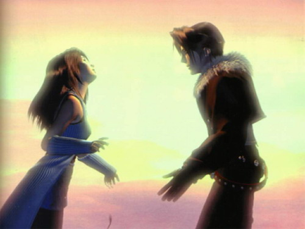
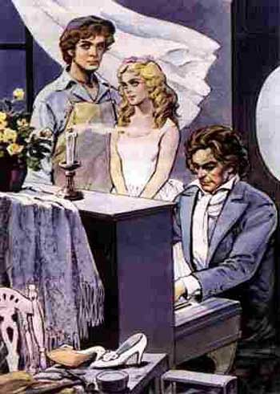

# ＜天璇＞每个少年心底，都有个嫁做他人妇的女神

**大多数的少年，爱上第一个姑娘时，都清澈透明，把她从美好的女人幻化成无瑕的女神，世界随之晶莹美丽。但随后，女神嫁给了——至少是从少年眼里看来——世俗的、市侩的、徒有表面的、油头粉面的、没有灵魂的男人。于是，一整个世界都碎了。**  

# 每个少年心底，都有个嫁做他人妇的女神

## 文/张佳玮（东华大学）

 

一男一女相恋，爱情明澈美丽如空山春雨、夏日木叶。正待成其好事，忽然飞来横祸，不可抗力像南风卷集沙土，遮天蔽日。尘埃落定后，男蓦然发现，该女已嫁做人妻。

这剧情，韩剧日漫寻常见，苦情歌里几度闻。虽然烂大街，但爱这玩意的非只下里巴人。大师们品位高，格外反感搬弄俗套。但最后，还是会颤抖着那些渴望不朽的笔尖，写下这狗血的剧情：

卡尔维诺《树上的男爵》，柯希莫在树上，目送薇莪拉嫁作了公爵夫人。

普希金《叶夫盖尼·奥涅金》，奥涅金再见到完美女神塔吉亚娜时，惊讶发觉人家已经嫁了。

大仲马《基督山伯爵》，以唐泰斯少年得志、预备结婚为开始，以被坑入狱、囚禁十四年、出狱后得知未婚妻改嫁了为真正开始。

马尔克斯《霍乱时期的爱情》，阿里萨看着费尔米纳嫁了乌尔比诺，遂开始了五十三年的“我就不信他死了你还不跟我”。

金庸《连城诀》，狄云入狱，耳闻得青梅竹马的戚芳嫁了万圭。《笑傲江湖》，令狐冲为情所困折磨了二十多回，终于还是没法挽回小师妹嫁给林平之的结局。

菲茨杰拉德《了不起的盖茨比》，盖茨比万里迢迢来到长岛，就是为了重新找回已经嫁了的黛西。

古龙《多情剑客无情剑》，从头至尾就是在说，李寻欢大爷如何边咳嗽边喝酒，边从“林诗音嫁给了龙啸云我受虐我快乐”的无底深渊里往外爬的过程。

如果排除掉“故意编这个剧情来讽刺大家”可能性的话，纳博科夫《洛丽塔》，亨伯特也遭遇了奎尔蒂拐走洛丽塔这事。哪怕亨伯特最后一次见洛丽塔时，她也是个怀孕妇人了。

《最终幻想8》，王菲《EYES ON ME》最初出典，就是朱丽叶和拉古纳一曲定情——当然，拉古纳九死一生回来时，正好看见朱丽叶嫁人。

苦情故事既已成型，怎么个收尾圆满，就可见各位的秉性了。

古龙大爷最是快意恩仇，根本不会承认主角不如情敌。所以呢，就设定李寻欢自己把林诗音让出去的。龙啸云从武功到为人都远不及李寻欢，因为自卑变态，恩将仇报，刻意要坑害李寻欢。而李寻欢自然是秉着人世罕有的宽容、慈祥、善良、包容，一次又一次挨打不还手的原谅龙啸云。这种模式，姑且可总结为：我让给你，我 一直让你，于是从道德到能力层面我都完胜。

金庸大爷比较委婉。公开把情敌批个一钱不值还自虐式的白送姑娘，他是不干的。他的法子是：首先，那姑娘一旦嫁了人，就立刻降格，成了第二女主角，必须多找一个圣母型女主角来配主角，而且一定要压前女主角一头，以示“没了你，我还有更好的！”（水 笙、任盈盈）；其次，该情敌会慢慢暴露出其实是绣花枕头一包草，日益不堪，渐次龌龊（万圭、林平之皆是，林平之还被阉了。慕容复也类似，结果是疯了）。最后，女主角终于悔悟真相，但已经晚了：她们都死了。这种模式，姑且可总结为：你不长眼，嫁了不该嫁的人；结果我找到了比你更好的，而你最后也发现真相，晚了，只好悲摧的死去了！

大仲马和金庸类似，但稍微宽容点儿。先是给基督山找了个海蒂配着，其实颇有点报复意味：“你梅西迪斯不要我，哼，看我娶个希腊小公主，不比你强！”然后呢，情敌费尔南是基督山三个仇人里，唯一被他逼死的；最后呢，他给基督山前未婚妻梅西迪斯留了条活路，让她自己悔悟，去当修女了——当然，富贵是彻底没了。

马尔克斯比较不卑不亢。阿里萨是等着熬着，终于把乌尔比诺耗到八十多岁耗死了，他自己和费尔米纳续上了夕阳恋。这模式：也不特意说情敌坏话，但他总有死的一天；所以，痴情可以战胜岁月，获得爱情。

普希金和卡尔维诺二位差不多可以算一种。柯希莫和奥涅金，都不是凡尘俗世之人。薇莪拉和塔吉亚娜，都是被迫嫁给了世俗的女神。这二位男主角最后也只剩下伤感。纳博科夫亦可算此类，但鉴于此人讲故事未必正经，所以不列。

菲茨杰拉德最为伤感。盖茨比完败情敌，勾回了黛西，但好景不长。一等他死掉，黛西立刻又回头和老公双宿双飞了。于是有了小说结尾，那著名的、空幻的、伤感的海滩独白。

如是：

大仲马、金庸、古龙三位的处理法是“你嫁吧！我娶个比你好的！你嫁了个烂人！你最后会后悔的！我最后一定比你幸福！”——也因为他们这是连载小说，大家看起来图个爽。

马尔克斯的处理法中庸一点。不那么爽，但还是绵长哀柔，熬到了最后，算有了个不是正果的正果。

普、卡二位比较内敛些。男主角就苦情结尾了。

菲茨杰拉德最赶上。

顺便补一句《最终幻想8》：拉古纳最后找了个更好的老婆，生了个好儿子，把朱丽叶的女儿骗到了手。所以也算个通俗结尾：我过得肯定比你幸福；我儿子还勾到了你女儿，完成了我未遂之愿！

所以呢，这些结尾不同的“女神嫁给了别人”故事，有一个美妙的核心。

每个失去女神的少年，令狐冲也罢，柯希莫也罢，奥涅金也罢，阿里萨也罢，唐泰斯也罢，狄云也罢，盖茨比也罢，都有一点天然的纯真。

恰好他们失去的女神，岳灵珊、薇莪拉、塔亚吉娜、费尔米纳、梅西迪斯、戚芳们，与他们相应，在婚前，都有那么一点通透清澈的纯真。青梅竹马啦、少年相恋啦、初恋啦，纯粹之极。

而她们嫁给的人，薇莪拉因为家庭压力嫁给了八十岁的老公爵，塔亚吉娜因为家庭压力嫁给了贵族，费尔米纳因为父亲的干预嫁给了贵族气十足的医生乌尔比诺，梅西 迪斯嫁给的费尔南也成了贵族，戚芳嫁给了世家子弟万圭，黛西嫁给了个运动全能富家男。这些男人们，虽然灵魂上都不如男主角那么纯真可爱，但都是世俗眼光中 的成功者：高富帅，潘驴邓，端的是万人羡慕的大官人。菲茨杰拉德的例子是最妙的。20年代后期，他自己受制于太太泽尔达，一如盖茨比受制于黛西。他那种近 于天真的性格，被海明威描述过了。

再来一个现实中的例子。

贝多芬31岁上爱上了朱丽埃塔·圭恰迪妮，也就是《月光奏鸣曲》题赠的 那位姑娘。结果这份爱情错投了主，这女人嫁了加伦贝格伯爵。更过分的是，她还利用贝多芬爱，要他帮助她的丈夫——类似于岳灵珊临死前要令狐冲保护林平之。 贝多芬答应了。但是他的心态发生了以下巨变。1821年他对申德勒说：

对情敌，“他是我的敌人，所以我更要尽力帮助他。”对圭恰迪妮，“她到维也纳来找我，一边哭着，但是我瞧不起她。”

所以说，大师们也逃不脱这个宿命：

大多数的少年，爱上第一个姑娘时，都清澈透明，把她从美好的女人幻化成无瑕的女神，世界随之晶莹美丽。但随后，女神嫁给了——至少是从少年眼里看来——世俗的、市侩的、徒有表面的、油头粉面的、没有灵魂的男人。于是，一整个世界都碎了。

无论少年最后怎么处理——杀掉情敌啦、自己苦情啦、漫长煎熬啦——只有一样是确定的：被夺走的不只是他们的爱人，还包括他们对爱情、命运、与这个世界天真纯 洁的想像。所以呢，他们会对女神爱恨交加。爱她以前的纯真烂漫，恨她嫁作人妇后的庸碌世俗。当然，这种心态里，不免搀杂着把女神物化，当作私有物件的想 法，以及奇妙的占有欲。所以到后期，中年化的女神们很容易被复仇的少年们以“你已经不纯真了”的理由而抛弃，然后挎着更年轻更漂亮的妹子招摇过市来报复旧 爱。这种割裂的扭曲的矛盾之情，无非说明，最初的女神们，曾被少年寄托过多么完全的爱。被珍爱的不只是她们，还有她们附带的那段少年岁月的纯真——那还没 有被世俗高富帅击碎的纯真。

 

（荐稿：陈蓉；采编：楼杭丹；责编：应鹏华）

 
