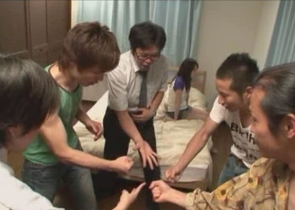

# ＜天璇＞比背叛更让人崩溃的事情

**我也不想要一个从不肯真心付出爱的男人，半死不活地活在我的身边，谈着比日子更无聊的恋爱。他冷漠，自私，以至于不会想任何其他的女人。他就那样把我当成一个可有可无的人，他没有找别人，因为他从不懂得爱和激情。他也不会渴望我。他只是不渴望生命。这样的人，是灵魂比身体先腐烂下去了。恐怕身体也想年代久远的钟摆，只是按照节奏那样摆动，不含有任何欣喜的成分。**  

# 比背叛更让人崩溃的事情

## 文/ 鲁雨洲（黑龙江大学）

 

在电影《两个女人》中，妻子和情人都是无辜的，性感的女人味十足的妻子亲手撕破了生活的谎言的面具；单纯的坚强的情人不敢真实地面对有妇之夫。直到最后，真相大白，这个男人怀着对妻子的愧疚与对情人的不舍，死在了海边。

这是一个不好的结局，一点都不美，也不感人。这只是一个最俗套的关于背叛的故事。但是它让很多人赤裸裸地面对了自己的内心。

一个男人，是可以爱上两个女人的。正如青蛇和白蛇、红玫瑰和白玫瑰一样。他背负着良心的审判，但是无法拒绝情爱的呼唤；他不想伤害任何一个人，却恰恰忘记了女人需要忠诚的爱情。

人不是完全理性的。所以，人在理性时选择了那个合适的人，却在情感泛滥的某个时刻，纵容了自己。

纵容自己的理由很简单，比如说，老婆对自己不够好，比如说，自己的很多想法不能被理解，比如说，生活压力大，生活太无聊枯燥。

其实何必给自己找那么多理由呢？维系一份忠贞不渝的爱情，比一辈子都不发脾气更难。我们会不经意之间质疑生命的意义，质疑生活的模式，质疑自己曾经的一系列选择，然后，便开始质疑枕边人。这种质疑像雪团一样扩大，直到有一天，遇到了可以搁置质疑的那个人，那个让自己忽略了此时烦恼的那个人。其实，一切第三者之类的人物，都是我们自己制造出来的。不想的时候，身边可以溜走很多不错的人；想的时候，千山万水也要找到那个可以供我们出轨的人。

男人可以爱上两个女人，其实，女人也可以爱上两个男人。只不过，女人的爱是需要生根发芽的。有了性，女人自然会想到爱，然后会想到婚姻，会想到孩子，会想到做一个母亲。如此下来，女人需要想的太多，也就错过了此时可以浪漫一次的机会。女人比男人更忍受不了良心的煎熬。所以，宁愿和一个人厮打光阴，也不太愿意在两个人之间周旋。毕竟笑容有限，分给两个人就格外的少了。

背叛不一定是爱情的结束。被背叛了之后，也许更懂得珍惜这个人。也许，是你不经意之间的一次次的伤害，让她走到了这条不归路。背叛之后，两个人也许又重新发现了彼此的好。

背叛也不一定是爱情里最严重的伤害。我宁愿要一个男人，爱我的时候全心全意、炽烈而真挚，直到有一天误入歧途，被别的女人短暂吸引。然后又想到了我，回到我的怀抱，再也不肯离去。这时候，我会接受他。

我也不想要一个从不肯真心付出爱的男人，半死不活地活在我的身边，谈着比日子更无聊的恋爱。他冷漠，自私，以至于不会想任何其他的女人。他就那样把我当成一个可有可无的人，他没有找别人，因为他从不懂得爱和激情。他也不会渴望我。他只是不渴望生命。这样的人，是灵魂比身体先腐烂下去了。恐怕身体也想年代久远的钟摆，只是按照节奏那样摆动，不含有任何欣喜的成分。

比背叛更让人难过的事情，就是明明可以好好说的话，好好过的日子，有一方非要往坏的地方赶。日积月累，谁都丧失了好好过下去的心。这样的人，却往往会自鸣得意：我没背叛你，我没对不起你，我还哪里对不起你？

对不起的地方太多了。当你的伴侣需要精神的支持，需要语言的交流，需要温存的抚摸，需要一个关注的眼神，需要和你一起做一些有意义的事情，需要和你一起把生活过的有滋有味的时候，你却粗暴而冷漠地拒绝了。你沉浸在自己更为荒芜的世界里，不肯发自内心地打量两个人的世界，哪里需要摘花、哪里需要剪草，哪里需要注入一道彩虹。你把爱情当做一件买完了就可以安放的古董，不再去让它释放活力。其实，爱情如同生命一样，是流动的，而且必须流动。两个人的感情，不进则退。如果以为确定了恋爱关系，或者结了婚，就万事大吉不管不问，那么，岁月的流失会让爱情变得十分可怕，让人开始隐忍，最后，甚至需要你的出轨，来成全他的选择。

背叛不是衡量爱情成败的唯一标志。两个人之间的事情，本质上和外人无关。没有无缘无故的爱，也没有无缘无故的背叛。虽然背叛一经发生，就成了无法改变的事实。但这个事实，大多数是针对过去的。针对过去两个人的感情岁月。只不过大多数人，都觉得这是改变未来的。背叛之后，必须要做一个选择。选择旧爱还是新欢。

大部分新欢未必比旧爱好，甚至有很多旧爱的影子。只是虚浮的生活让我们没有动力去坚守所谓的信仰，所谓的忠贞，所谓的一生的挚爱，而后我们便喜欢服从于短暂的欲望。

人都有无法告人的秘密，这些秘密有可能是做法，也可能只是个念头。但是，不管是念头也好，还是实际行动也好，之所以是无法告人，因为它们暴露了我们真实的情感和人性的弱点。我们可以珍视这些秘密。

是这些秘密让我们活的更加沉甸甸，明白了生而为人的意义。

也是这些秘密，让我们穿越了肤浅而表面化的爱怜，直达灵魂深处，看到那荆棘丛生乌云密布的爱河，而总会有一个人，是这条河上的华丽的一条船，承载了我们从年少到老去的全部爱恋。

 

（采编：陈锴；责编：陈锴）

 
