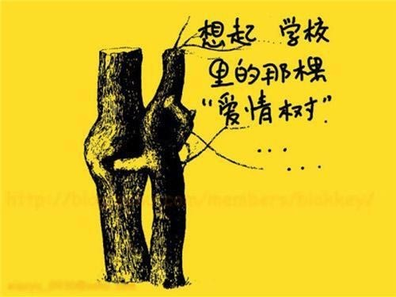
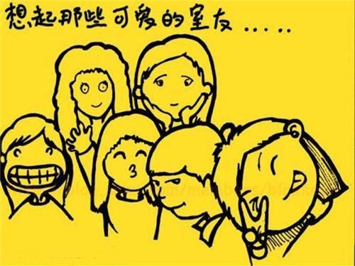
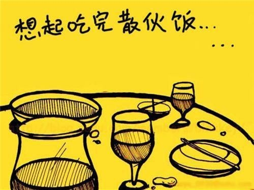

# ＜天璇＞毕业了

**有人订婚了，打算毕业后就结婚，这事一刻也不能等了，十万火急。有人在忙着报考家乡的公招，整天泡在自习室，这事也不能等了。有人签约了大城市的学校教师，等到拿到教师证后立马跑到灯红酒绿的城市中开始三尺讲台。有人背上背包开始了去往西藏的路途，却并不是为了什么时尚或者小清新。有人依旧在寝室中游戏人生，趁着仅剩几天的快乐时光升级打怪兽。**

# 毕业了

## 文/ 卞海鹏（重庆三峡学院）

  天气渐渐热了起来，太阳肆无忌惮的放射出光芒，映照在校园中大大小小的林荫道上，稀疏处散落明亮的斑斓,像是黑暗中的明灭灯火。 一年一度的毕业季又开始了。 

大四同学都在忙着为各自的生活寻找着出路，憧憬着，迷茫着。大家都在忙，忙的不可开交，焦头烂额。 毕业实习报告是用的野鸡打印店的红章。毕业论文，尽管多是抄自网络，还是不会排版，错别字更是连篇。论文答辩，老师一再的放点要求，却也是一问三不知。毕业设计，随便抄袭一个交上就可以忽悠下低年级的同学，换来学弟学妹崇拜的微笑。那个论文防作弊器更是形同虚设的玩意儿。等干完这些形式化的东西，在迷茫空闲中等待四年用一麻袋钱换回的毕业证，拿到后便立马滚蛋。 形式大于内容。内容不管是金子还是狗杂碎，都是一样他妈的不重要。重要的是形式，有了形式，便可以在新的一年招生中穿上了扰乱视听的新装，挂上了花里胡哨的大广告 新装总会一年又一年的换的，要不大家都看烦了，招生就成了一个大问题。至今国内还没有哪个牛校，可以不换新装来招生。今年清华百年校庆，在《我要回家——庆祝清华大学百年校庆创作歌曲》MV中国学四大导师并不是在前面，而成为在众多CEO身影后面一张小小的照片。在一切向钱看齐的社会中，国学也仅仅是赚钱的工具，仅仅是用来出名的工具，更是一些所谓的大老板用来展现身份的盾牌。 扰乱视听已是后学的事情，与我们再无半毛钱关系。我们早已拿起月票从低矮的出租屋中走出奔入拥挤的地下铁，在左右摇晃中到达尔虞我诈的办公室，进行着一天又一天的杜拉拉升职梦。 但是有些事情还是无论如何都要做的。借此纪念一下自己的学生时代。这段时间里，校园中随处可以看到疯狂酒醉后的凌乱物——翻到的酒瓶和呕吐物。酒醉中胡乱着喊出某人的名字，随便骂着谁谁的名字，说上那句几年都没有勇气说的表白，聊上几句推心置腹的话，在酒未醒时，从填充着垃圾污垢的象牙塔中快速逃离，告别自己的学生时代，进入鱼龙混杂，一锅热腾腾随意翻滚的社会八宝粥中，品尝生活的五味杂陈，奋斗着，挣扎着。 还未毕业，和相处几年的同学寒暄，总是那几句话，”打算去哪”，“工作找好了吗”。谈点与找工作无关的事情，大家都不怎么感兴趣，毕竟生活最重要。要是说点别的或者多说几句就成了无言的结局。 有人考上研究生了，不用焦头烂额的为工作而奔波；有人凭关系进了机关单位，整天学习着怎么应酬；有人分手了，有人喝醉了，在女生楼下大声的喊叫；有人肩挎LV，脚踩艳红的高跟鞋，在街道上闲逛，电话铃声却在这时慌忙的响起。 有人订婚了，打算毕业后就结婚，这事一刻也不能等了，十万火急。有人在忙着报考家乡的公招，整天泡在自习室，这事也不能等了。有人签约了大城市的学校教师，等到拿到教师证后立马跑到灯红酒绿的城市中开始三尺讲台。有人背上背包开始了去往西藏的路途，却并不是为了什么时尚或者小清新。有人依旧在寝室中游戏人生，趁着仅剩几天的快乐时光升级打怪兽。 工作的事情很重要。不工作，嫁人是个问题，结婚是个问题，房子是个问题，车子也是个问题。工作后就没有那么多空闲，用来小清新，用来小纠结和小郁闷了。你连一车都没有还旅游？你连一房都没有，还敢嫁给你？总不能还像以前那样整天压马路吧。 

对啊，手牵手压马路的时光，已经过去，成为一个个冰封的场景存在记忆的某个角落。一个个都老大不小了，还整天想着小清新？整天想着小青涩？整天想着所谓的小文艺？ 还是快点找个人娶了，快点找个人嫁了，马上找个人结了吧。 结婚的事情很重要，也很严峻。没房没车，这些都是老调重弹。韩寒在其《独唱团第一辑》中说：如果再能写点小诗，弹点小吉他，摘些小花，女生们都被迷倒了。你看看现在，女生们再也不中意这些人了，她们中意的是……。对啊，她们中意的是，车子房子和票子，而不是什么小文章啊，什么小吉他啊。如果能唱点小歌，画点小画，长发飘飘，白色连衣裙，男生都被迷倒了。你看看现在，男生们再也不中意这些人，他们中意的是······他们中意的前凸后翘，浓妆艳抹，中意的干完那事后没有后患，而不是什么小歌，什么小画。 无论是中意车子房子还是前凸后翘，都中意的是，不劳而获的钱和肆意无患的放纵。放纵中若是还能把钱赚了，岂不更好，岂不快哉？ 害怕自己年华老去，魅力锐减，风光不再的女人，大有人在。想在年华老去前找个如意郎君嫁了的人更是多得无法数。要是能找到个钻石王老五马上嫁了，那就是多年的灰姑娘终于得以实现穿上水晶鞋的美好愿望了。若是找不到如意郎君，找个凑合的看着顺眼的还算中意的也要立马把自己嫁了，也省的在红妆卸落，看到自己微小鱼尾纹后唏嘘惆怅。 回头看看，当年来到陌生的学校，那份清新单纯；再看看镜子中的自己，是否在外表繁华的大学中磨练出了一丝沧桑。 单纯时光，在一次次的恋爱分手；一次次的评优评先；一次次的喝酒寒暄；一次次的转换工作中，不知道何时已经跑得无影无踪，连一根毛都没有留下，倒在脸上留下了青青的胡茬和掩饰皱纹的粉底。要是某天照片中看到自己青涩的模样，和朋友的聊天中，想起当年的傻事，会感到当年的自己真的挺二，挺傻。 

你也二过，我也疯过。在这里欢笑，在这里哭泣，在这里寻找，也在这失去。 其实岁月的走过，总会带走青涩的情感和毫无顾忌的欢笑，总会带来点头哈腰、低眉顺眼、溜须拍马。在这个笑贫不笑娼的时代里，在这个连宪法都是橡皮图章的国度里，在整天吹嘘带血GDP如何增长的新闻中，我们除了整天在房子车子，孩子，票子、杯子中喘息着，迷茫着，挣扎着，还能做些什么？ 还未高考，就把书籍如雪片散落在校园中，洋洋洒洒蔚为壮观。美其名曰：释放压力？是应试高考压的喘不过起来还是被读书无用论所迷惑？好不容易考上大学，不断自我纠结自我无聊中熬到毕业，换取一纸没什么用的文凭，打包滚蛋。那些精美包装的四书五经是逢迎上司的佳品，而不是什么修身明理的先贤经典。 那些当年的单纯和二，也只能想想了，也只能在照片中想想。整天在拥挤的公交车上被晃来摇去，整天在房东的电费涨了水费涨了的高叫声中点头哈腰，整天在热闹的酒桌上被推来灌去，也只能在照片中回想一下二过的时光了。 谁谁老公真有钱，谁谁老婆真漂亮，谁谁又换了一个富二代的新男友·····谁谁又升官了，谁谁又···· 身边的哥们，身边闺蜜，总是在这‘谁谁又，又谁谁’的欢笑叹息声中，喝完了一杯又一杯····· 

（采编自投稿邮箱；责编：陈锴）

    
