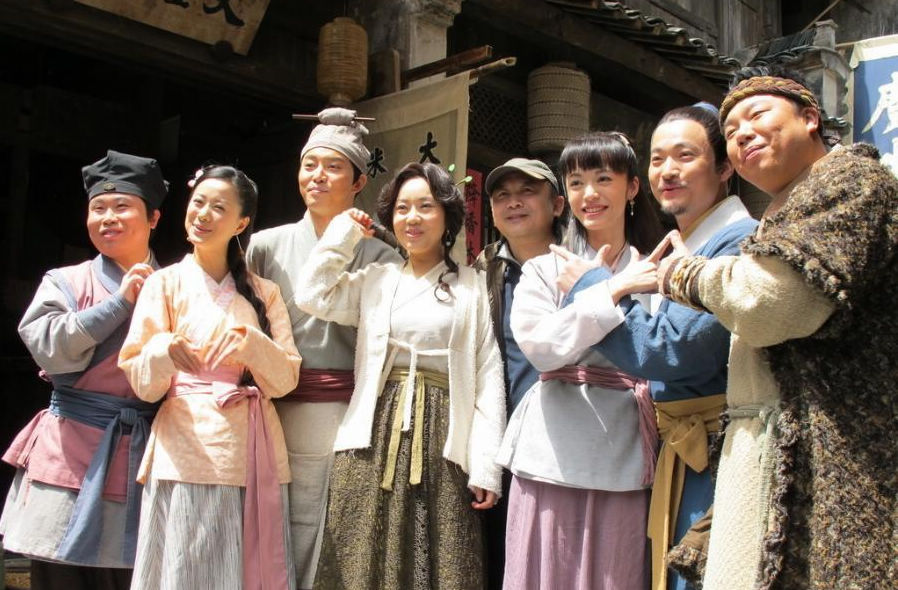

# ＜天璇＞江湖深，岁月浅

**最终，学会了给现实一点宽容，平然地接受实然世界与应然世界的误差。人，没有飞上天去，但是幸福降落了，成为垂手可得的满足。杨过于郭襄，不过是三根金针和一场烟花，就像张无忌于殷离，不过是蝴蝶谷留在手背的齿痕——但谁说这不可以是圆满的幸福？**

 

# 江湖深，岁月浅

## 文/子衿（北京大学）

 

从第一门设计课开始，每次做图建模都听着《武林外传》，八十集，翻来覆去听得滚瓜烂熟。佟掌柜的关中口音像我专用的镇痛剂，屡试不爽地缓解数小时熬图的抓狂。

周四，午夜，我在小白残余的70%电量支持下顽强地Sketchup中，突然听到吕秀才的话：“郭芙蓉，我喜欢你，比孔子孟子老子庄子这些子加在一起都喜欢。”

我的手指在左键上倏然一动，屏幕上的线条又一次没有闭合。

只停顿半秒，然后Ctrl+Z重新描线，在半个秒钟里，我的感动不及细品就被囫囵吞下。

在2010年11月11日这个寻常的光棍节里，北京寒冷而干燥，我在这一天最后半小时里，意外捡到这样一句温暖的话。

打心眼里钦羡同福客栈一家子人的生活，简单、充实、精彩。江湖凶险，人世喧嚣，所谓的幸福其实因为所求甚少——秀才有了郭芙蓉，哪怕跟着子曰了多年曰不出功名，日子也圆满如画；佟掌柜有了老白和小贝，愿疏千金换一个清贫安稳；老白只求不被追捕，指如疾风、势如闪电不如当垆卖酒、安身立命……

红尘百丈，我只要一瓢清浅流年；现世无边，我只要一隅安身窠巢； 前路迢遥，我只要一程风雨相携。

想起某个初冬的夜，透过3401漏风的窗看红色的尾灯和黄色的头灯在成府路流淌成不息的河流，数不清这个偌大的帝都盛着多少人疲惫的奔走。现世的规则像一组无解的方程，相比之下，武侠则是成年人的童话——傻小子自会遇见名师变成大侠；坏人自会练错神功走火入魔；独步武林不足挂齿，只要佳人顾盼，大侠自愿隐于山林，不问江湖。

然而事实是，以世人的心，武侠世界的幸福也是缺憾的——侠之大者，即使是萧峰，亦心盛失去阿朱的荒芜孤独；笑傲江湖，以令狐冲的落拓，尚不堪岳灵珊一声福建山歌；青驴黄衫，名山踏遍，小东邪之疏豪，尚解不开邂逅杨过的心结……

其实最后的圆满，不是得到，而是看破。

像那段写郭襄的句子：“我走过山的时候山不说话，我路过海的时候海不说话；我坐着的毛驴一步一步滴滴答答，我带着的倚天喑哑；大家说我因为爱着杨过大侠，找不到所以在峨嵋安家；其实我只是喜欢峨嵋的雾，像十六岁那年绽放的烟花。”

像程英一样，既见君子，云胡不喜。

最终，学会了给现实一点宽容，平然地接受实然世界与应然世界的误差。人，没有飞上天去，但是幸福降落了，成为垂手可得的满足。杨过于郭襄，不过是三根金针和一场烟花，就像张无忌于殷离，不过是蝴蝶谷留在手背的齿痕——但谁说这不可以是圆满的幸福？

最糊涂的人最了悟，就像周伯通。一阕《四张机》，点化郭靖和黄蓉鸳鸯双飞，却点不透老顽童。“春波碧草，晓寒深处，相对浴红衣。”世人求不得之福、解不开之结，反是他不堪承受之重，因为无欲无求，所以无忧无愁。

执念太重，无法自渡，我们都困在莫大的执著之中，所以辛苦，所以不满足。

倘若，三千弱水，一瓢足饮，那么幸福不在深远的江湖，只在脚下清浅的年华。

我们，已然很幸福。

 

(采编：周佩玲；责编：黄理罡)

 
